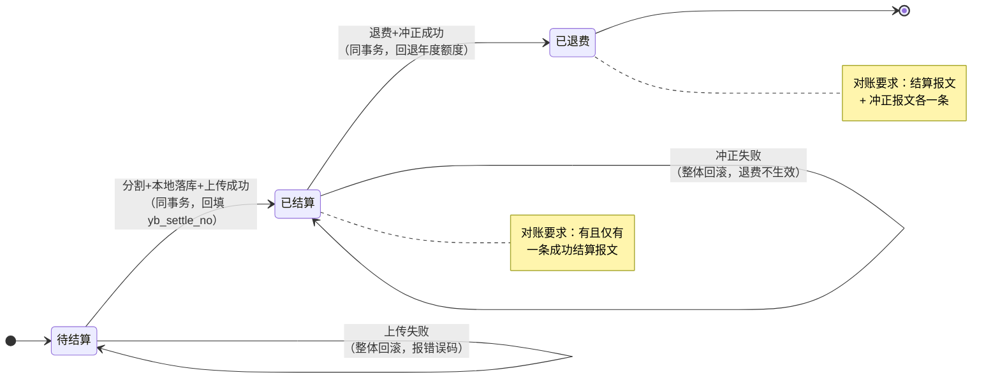
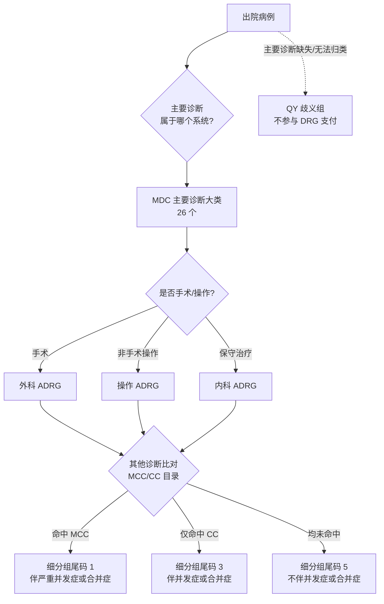

# 第 10 章 医保接口与 DRG

> 本章属第三篇「业务篇」。医保是医院收入的最大来源，也是医院信息系统中"算错一分钱都不行"的领域。
> 本章从医保业务模型讲起，依次展开费用分割、结算与冲正、智能审核、对账、DRG 入组与支付模拟，
> 最后讨论省级 SDK 适配的实施工艺。全章以 HIP 平台的医保模块为贯穿案例，包括一个真实的返工教训。

## 学习目标

学完本章，你应当能够：

1. 说出医保三大目录的构成，解释甲/乙/丙类费用的报销差异，理解目录对照为什么是实施工作的重头；
2. 独立设计一个支持起付线、封顶线、分比例待遇模型的费用分割引擎，并说明金额舍入与并发累计的处理要点；
3. 画出"结算—上传—冲正—对账"的完整状态流转图，解释医保结算号为什么必须持久化；
4. 理解事前提醒式智能审核的规则建模方法，以及从 WARN 到 BLOCK 的演进路径;
5. 设计业务账与通道账的对账方案，解释"留痕即对账依据"的工程含义；
6. 描述 CHS-DRG 的分组层次（MDC→ADRG→DRG），手工完成一个病例的入组推演，解释 CMI、费用消耗指数、时间消耗指数的计算与含义；
7. 说出医保适配器 SPI 的接口契约要素，理解"假适配器验证法"在实施验收中的作用。

---

## 10.1 医保业务模型：三大目录与目录对照

### 10.1.1 基本医疗保险的支付框架

我国基本医疗保险（下称"医保"）覆盖职工医保与城乡居民医保两大制度。从医院信息系统的视角看，医保决定了两件事：**患者结算时个人付多少、统筹基金付多少**（费用分割），以及**医保经办机构事后如何与医院结算**（基金支付，如今主要按 DRG/DIP 付费）。前者发生在收费窗口的每一笔交易里，后者发生在月度、年度的机构清算里。这两个层面对应本章的前后两半。

医保能否支付、支付多少，首先取决于费用项目是否在**医保目录**内。医保目录由三部分构成，业内合称"三大目录"：

| 目录 | 内容 | 对应医院数据 |
|---|---|---|
| 药品目录 | 可报销的西药、中成药、中药饮片 | 药品字典 |
| 诊疗项目目录 | 可报销的检查、检验、治疗、手术项目 | 收费项目字典 |
| 医疗服务设施目录 | 床位费等服务设施标准 | 收费项目字典（床位类） |

目录内项目按报销规则分为两类：**甲类**项目全额纳入报销范围，按待遇比例报销；**乙类**项目需个人先行自付一定比例（各省、各项目不同，常见 5%–30%），剩余部分再纳入报销范围。目录外项目全部自费，业内习惯称为**丙类**（注意"丙类"并非国家目录的正式分类，而是行业沿用的口径——目录里只有甲、乙两类，"丙类"就是"不在目录里"）。

### 10.1.2 目录对照：实施工作的第一座山

医院有自己的药品字典和收费项目字典，医保局有自己的目录编码（国家医保局自 2019 年起推行"贯标"，统一了医保药品、诊疗项目等 15 项编码）。两套编码体系必须建立映射，患者结算时系统才知道每一行费用是甲类、乙类还是自费——这项工作叫**目录对照**。

目录对照的工程要点：

1. **数据量决定工具形态**。一家县级医院的药品目录常有三五千条，收费项目上千条。逐条手工维护不可实施，必须提供**批量导入工具**（CSV 模板 + 校验 + 对照率统计）。对照率（已对照条数 / 全部条数）是实施进度的核心指标，也是上线门槛——对照率不足就上线，意味着大量项目按自费口径结算，患者窗口投诉会立刻教育你。
2. **对照是持续工作，不是一次性工作**。医保目录每年调整，医院新进药品也要随时补对照。系统要留出"未对照"状态的处理策略。
3. **未对照项目的保守口径**。结算时遇到未对照项目怎么办？两种选择：拒绝结算（业务卡死，不可取），或按自费处理（患者可能多付，但基金不多付）。行业通行做法是后者——**宁可让患者事后退差价，不可让基金多支付**，因为向患者退钱是院内流程，向基金退钱是违规使用基金的稽核问题。

> **案例框 10-1：HIP 的目录对照表设计**
>
> HIP 用一张 `yb_catalog_map` 表承载对照关系，关键列：`item_type`（DRUG 走药品目录 / ITEM 走诊疗目录）、`item_code`（院内编码）、`charge_class`（A/B/C）、`self_ratio`（乙类先行自付比例）。配套三件东西：
> - CSV 批量导入接口（并入医院初始化工具 `init-hospital.py` 的字典模板家族）；
> - 对照率统计（医保管理页展示，实施验收指标）；
> - 分割引擎的保守兜底：查不到对照记录时按 `C` 类（自费）处理，`self_ratio` 取 0。
>
> 值得注意的是"按 item_type 分列"这个设计：药品和诊疗项目在医保侧是两个目录、两套编码规则，混在一张映射表里用类型字段区分，比拆两张表更利于统一的导入工具和对照率口径。

### 10.1.3 患者的医保身份

分割计算的另一个输入是患者的**参保类型**：职工医保、居民医保待遇不同（比例、起付线、封顶线都不同），自费患者则完全不走分割。参保类型属于患者主索引（EMPI）的属性，但要注意它的时效性——患者可能断保、可能身份变化，真实环境下应在挂号或结算时通过医保接口做**参保信息查询**（人员待遇核查），而不是只信本地档案。HIP 在 Mock 阶段将参保类型存于 `empi_patient.insurance_type`，接口就绪后此处即是替换点。

---

## 10.2 费用分割引擎

### 10.2.1 什么是费用分割

**费用分割**（也称费用分解）是把一张结算单的总金额，按医保规则拆成若干部分的计算过程。最核心的输出是两个数：**统筹基金支付**（医保付）与**个人支付**（患者付）。展开来，一张分割结果单通常包含：

- 甲类金额、乙类金额、自费（丙类）金额——按目录分类的汇总；
- 乙类先行自付金额——乙类项目中患者必须先掏的部分；
- 起付线金额——进入统筹之前患者自付的门槛部分；
- 统筹基金支付——医保基金实付；
- 个人支付——以上各项自付的合计（真实环境还会再分个人账户支付与现金支付）。

在展开计算之前，先补全"个人支付"的内部结构。患者最终自付的钱可能来自两个池子：**个人账户**（职工医保按月划入的账户余额，可用于支付自付部分）与**现金**（含移动支付）。此外，统筹之上还有两层保障：**大病保险**对高额自付部分二次报销，**医疗救助**对困难人群兜底。完整的支付构成因此是一个四层瀑布：统筹基金 → 大病保险 → 医疗救助 → 个人（个账/现金）。对医院端系统，大病与救助通常在医保侧结算接口内一并算好返回，医院只需正确展示与入账；但**分割结果表的字段设计要预留这些层次**，否则接真实接口时会发现返回报文里的金额没地方放——这与 10.3 的"结算号没地方放"是同一类教训。

分割的计算顺序是理解一切医保待遇的钥匙，值得用一个完整例子走一遍。

**例**：某职工医保患者门诊结算 1000 元，其中甲类 600 元、乙类 300 元（先行自付比例 10%）、自费 100 元。统筹比例 70%，年度起付线 200 元（尚未使用），封顶线未触及。

1. 可报销基数 = 甲类全额 + 乙类扣除先行自付后的部分 = 600 + 300×(1−10%) = 870 元；
2. 扣起付线：870 − 200 = 670 元进入统筹计算；
3. 统筹支付 = 670 × 70% = 469 元；
4. 个人支付 = 总额 − 统筹 = 1000 − 469 = 531 元（其中自费 100、乙类先行自付 30、起付线 200、共付段个人比例 201）。

这个例子隐含了几个真实系统必须处理、教科书却常略过的问题：舍入、年度累计、并发。下面逐一展开。

### 10.2.2 金额舍入：逐行还是账单级

医保金额按"分"结算，计算中出现的比例乘法必然产生舍入。舍入发生在哪一层，结果不同：**逐行舍入求和**与**账单级一次舍入**可能相差几分钱。几分钱在会计上不是小事——分割结果要与医保上传报文一致、与对账结果一致，口径不统一就会出现永远对不平的"幽灵差异"。

工程结论是：**选定一种口径并在全链路保持一致**，且在待遇模型变化时保证向后兼容。

> **案例框 10-2：HIP 分割引擎的双口径兼容**
>
> HIP 的分割引擎（`InsuranceSplitService`，[InsuranceSplitService.java](../../modules/insurance/src/main/java/cn/hip/insurance/service/InsuranceSplitService.java)）经历过一次待遇模型升级：早期版本没有起付线/封顶线，统筹金额按**逐行**"可报销金额×比例"舍入后求和；升级引入年度待遇后，统筹改为**账单级**"（可报销基数−起付线扣除）×比例，封顶截断"。
>
> 升级时的兼容处理很有代表性：待遇参数（起付线、封顶线）全部走 `sys_config`，且约定 **0 = 不启用**。当两个参数都为 0 时，引擎显式走老算法分支（逐行舍入求和），保证与历史版本逐分一致——已上线医院不配置新参数，行为完全不变；配置了参数的医院才启用新模型。这是"配置优先"原则（第 14 章）在算法演进上的应用：**新算法以配置开关的形式并存，而不是替换**。
>
> ```java
> if (deductible.signum() == 0 && cap.signum() == 0) {
>     fund = lineFundSum;   // 待遇模型未启用：与既有逐行舍入算法逐分一致
> } else {
>     BigDecimal dedRemain = deductible.subtract(annualUsed).max(ZERO);
>     dedTake = eligibleTotal.min(dedRemain);
>     fund = eligibleTotal.subtract(dedTake).max(ZERO).multiply(ratio).setScale(2, HALF_UP);
>     if (cap.signum() > 0) fund = fund.min(capRemain);   // 封顶截断
> }
> ```

### 10.2.3 年度待遇累计与并发控制

起付线和封顶线都是**年度累计**概念：患者本年已累计自付满起付线后，后续结算直接进统筹；统筹累计达到封顶线后，超出部分基金不再支付。这要求系统维护一张**患者年度累计表**（HIP 中为 `yb_patient_annual`，按 `patient_id + year` 唯一），每次结算读取并更新"已用起付线额度""已用统筹额度"。

累计表带来一个容易被忽略的并发问题：同一患者的两笔结算并发进行（家属在自助机缴费、本人在窗口缴费），如果两个事务都读到"起付线还剩 200 元"，就会重复扣减，导致基金多付。这是典型的"读—改—写"竞态。

解法是数据库行级锁：在事务内以 `SELECT ... FOR UPDATE` 锁定该患者的年度累计行，第二个事务会等待第一个提交后才能读到最新累计值。HIP 的实现还有一个细节——累计行用 `INSERT ... ON CONFLICT DO NOTHING` 惰性创建，保证首笔结算也能锁到行。这一整套（惰性建行 + 行锁 + 事务内更新）是有状态额度类业务的通用模式，第 7 章的号源占用、第 8 章的床位占用是同一模式的变体。

同样成对出现的是**退费时的额度回退**：结算占用了起付线和统筹额度，退费就必须归还，否则患者年度待遇被"吃掉"。HIP 的 `reverse()` 方法按分割留痕回退年度累计（用 `GREATEST(x − ?, 0)` 防止负数），而分割明细记录本身保留不删——留痕永远只增不减，汇总口径通过单据状态过滤（10.3.4 将再次遇到这个原则）。

### 10.2.4 行级分割：门诊与住院的统一

门诊结算按处方/订单行分割，住院结算历史上不少系统按"总额"粗分——出院时把住院总费用一把算。粗分的问题在 DRG 时代被放大：医保结算清单要求费用**行级**归类明细，总额口径无法生成合规清单，智能审核也无从下手。

正确方向是**门诊与住院共用同一个行级分割引擎**。这在工程上是一次典型的"泛化下沉"：分割逻辑最初长在门诊模块里，住院需要时不是复制一份，而是把它抽到独立的医保模块，入参泛化为 `bizType（OUTP/INP）+ 单号 + 订单行列表`。住院的"订单行"来自记账式医嘱（每条医嘱执行记账都带项目编码与金额，见第 8 章），天然满足行级输入的要求——**上游模型设计对了，下游归并就是水到渠成**；反过来，如果住院记账只存总额，行级分割就要伤筋动骨地补数据。

HIP 的 `YbLine` 记录类型（`orderType/itemCode/itemName/amount/qty`）就是这个统一入参：门诊收费和住院出院结算各自把自己的费用行装配成 `YbLine` 列表调用同一个 `splitAndAudit`。分割比例按 `bizType` 取不同配置键（`yb_ratio_staff` 与 `yb_ratio_staff_inp`），支持门诊/住院分比例——这也是各地待遇政策的普遍形态。

---

## 10.3 结算流程：上传、冲正与一个真实教训

### 10.3.1 医保结算的完整链路

一笔医保患者的门诊结算，在系统内部的完整链路是：

```
收费确认（事务开始）
  ├─ 1. 费用分割（splitAndAudit：算统筹/自付，写分割留痕，跑审核规则）
  ├─ 2. 本地结算落库（outp_charge 置 PAID，pay_method='YB'）
  ├─ 3. 医保上传（InsuranceAdapter.uploadSettlement → 医保侧入账）
  │       └─ 成功：回填医保结算号；失败：抛错回滚整个事务
  └─ 4. 出站留痕（int_message_log：channel='YB'，报文与结果落库）
（事务提交）
```

链路失败时的**错误码设计**值得单独一提。医保上传失败对收费员是高频可见的异常，提示语义必须精确：HIP 为医保通道定义了专用错误码段（如 5006 结算上传失败、5007 冲正失败、9013 通道不可用），前端据码给出差异化指引——"医保拒绝：{医保侧原因}，请核实参保状态"与"医保通道超时，请稍后重试"的处置动作完全不同。把适配器返回的 message 原样透传到窗口，是排障效率与窗口体验的双重保障；吞掉原因只报"结算失败"，收费员只能打电话给信息科，信息科只能翻日志。

关键设计决策是**第 3 步在收费事务内同步执行**。同步的代价是医保接口的延迟直接叠加在窗口收费的响应时间上（所以适配器必须设置合理超时）；同步的收益是强一致——医保上传失败，本地结算一起回滚，不会出现"本地已收费、医保未入账"的悬挂状态。对中小医院，一致性的价值远大于那几百毫秒的延迟；日结量大到同步扛不住的大型医院，才需要考虑异步补偿方案，而那要配套一整套悬挂单据的对账与冲销机制，复杂度完全不在一个量级。**先选简单且正确的方案，把复杂方案留给被数据证明的瓶颈**——这是贯穿本书的架构态度（第 4 章）。

### 10.3.2 冲正：结算的逆操作

患者退费时，本地退费必须伴随医保**冲正**（撤销医保侧的入账），否则医保基金为一笔已退掉的费用买了单——这在基金监管口径下是要被追回甚至处罚的。冲正链路与结算对称：本地退费 + `uploadRefund` 冲正 + 年度额度回退（10.2.3）+ 出站留痕。

冲正失败怎么办？与结算同理：**与本地退费同事务、失败同回滚**。宁可告诉窗口"退费暂时办不了，稍后重试"，也不能让本地退了、医保没冲。

把结算与冲正合起来，一张医保单据的完整生命周期如下（图 10-1）：



图中两条"自环"（失败回滚回原状态）正是强一致设计的可视化：任何状态下，本地账与医保账要么一起前进，要么一起停在原地——**不存在中间状态**，这也是 10.5 对账规则能写得干净的前提。

### 10.3.3 教训案例：被丢弃的返回值

> **案例框 10-3：两个真实的正确性缺陷（HIP 医保完善专项，2026-08）**
>
> HIP 医保模块在一次代码级审阅中发现两处正确性问题，都属于"演示能跑、真实环境必翻车"的类型，值得逐字读：
>
> **缺陷一：退费冲正的结果未校验。**`ChargeService` 调用 `uploadRefund` 后**丢弃了返回值**——冲正失败时本地退费照样提交。演示环境的 Mock 适配器永远成功，问题被完美掩盖；真实环境下医保接口有网络抖动、有业务拒绝，一旦失败，唯一的发现渠道是日后对账，而那时钱已经退给患者了。修复：冲正失败与结算失败同语义——抛出专用错误码回滚本地事务。
>
> **缺陷二：医保结算号未持久化。**`uploadSettlement` 返回的 `settleNo`（医保侧结算流水号）被拿到后**只随报文留痕存进了 payload**，没有回填业务表。而真实省级 SDK 的冲正、线下对账，都要求**按医保结算号发起**——不是按医院单号。等到要接真 SDK 时才发现：冲正接口的必填参数，系统里根本没有结构化存储。修复：新增迁移为 `outp_charge` / `inp_settlement` 增加 `yb_settle_no` 列，结算成功即回填。
>
> 两个缺陷指向同一条教训：**Mock 适配器的"永远成功"会系统性掩盖失败路径与回传数据的处理缺陷**。对策有二：一是代码纪律——凡外部调用，返回值必须消费，失败语义必须显式处理，"丢弃返回值"应当在代码评审清单上；二是测试设计——Mock 必须能模拟失败（HIP 后续在 E2E 中加入了冲正失败注入的断言）。第 10.7 节的"假适配器验证法"是这条教训的制度化产物。

### 10.3.4 留痕与汇总口径

医保链路的每一次出站调用都落 `int_message_log`（集成留痕表，第 6 章）：渠道、方向、关联单号、完整报文、成功与否。留痕有三重身份：排障依据、对账数据源（10.5）、监管检查时的原始凭证。

留痕之外还有**汇总口径**问题——同一批数据，不同页面统计出不同数字，是医保模块最伤信任的 bug 类型。HIP 曾有一例：医保管理页的"今日分割"汇总把已退费单据也计入统筹合计，导致统筹/自付合计高估。根因是分割留痕设计为"只增不减"（退费不删分割记录，见 10.2.3），而汇总 SQL 忘了按单据状态过滤。教训成了一条设计规则：**留痕表永不物理删除，一切汇总必须显式声明状态过滤条件**——把"哪些状态计入"写进口径注释，而不是留给每个写 SQL 的人现场发挥。

---

## 10.4 智能审核

### 10.4.1 事前、事中、事后

医保基金监管有"事前提醒、事中审核、事后稽核"三道防线。对医院端系统而言：

- **事前**：开单/结算时实时提示可疑项（超量开药、重复收费、自费占比过高），医生或收费员当场处理；
- **事中**：结算上传时医保侧规则引擎拦截（两定接口返回拒绝）；
- **事后**：医保局大数据筛查、飞行检查，问题资金追回并处罚。

医院端能主动建设的是事前审核——**在费用发生的源头拦住问题，远好于事后被追回**。事后被动应对的成本（资金追回、协议处理、信用评价扣分）是事前建设成本的数量级倍数。

### 10.4.2 规则建模：从 WARN 起步

事前审核规则库的建设常见误区是一步到位追求"强拦截"。强拦截（BLOCK：违规即禁止提交）需要规则精度非常高，误拦一次门诊高峰期的正常处方，临床的反弹会让整个规则库被要求关闭。稳妥的演进路径是：

1. **WARN 阶段**：规则命中只记录、只提示，不阻断业务。积累命中数据，人工复盘误报率；
2. **调参阶段**：阈值参数化（走系统配置而非硬编码），按院、按规则调整到误报可接受；
3. **BLOCK 升级**：精度达标的规则逐条升级为拦截，保留 WARN 通道给新规则试运行。

动手建规则前，先建立规则的**类型学**——绝大多数医保审核规则落在以下几类，每类的数据需求与实现难度差异很大：

| 规则类型 | 示例 | 数据需求 | 实现难度 |
|---|---|---|---|
| 数量/剂量限制 | 单品种单次数量上限、日剂量上限 | 当前单据 | 低 |
| 频次限制 | 同项目 30 天内限做 1 次 | 患者历史单据 | 中 |
| 重复/互斥 | 同单重复项目、互斥项目并开 | 当前单据 + 互斥对照表 | 低–中 |
| 适应症限定 | 某药限某诊断使用（"限二线用药"） | 单据 + 诊断 + 限定条件库 | 高 |
| 人群限定 | 性别、年龄与项目不符 | 单据 + 患者属性 | 低 |
| 费用结构 | 自费占比、次均费用异常 | 单据汇总 | 低 |
| 行为模式 | 分解处方、分解住院 | 跨单据、跨就诊的时序分析 | 高 |

前两列低难度规则用院内数据即可自建，是 WARN 阶段的合理起点；适应症限定类依赖大规模临床知识库（药品说明书、医保限定支付条件的结构化），这正是商用规则库的价值所在；行为模式类则更多出现在监管侧的事后筛查（10.8）。**自建规则的选型标准：数据在手、语义明确、误报可控。**

> **案例框 10-4：HIP 的三条雏形规则**
>
> HIP 的审核雏形内置三条规则，阈值全部走 `sys_config`：
> - **R001 单品种数量超限**：药品行数量 > `yb_audit_qty_limit`，提示核实是否超量开药；
> - **R002 同单重复项目**：同一结算单内同名项目出现多次，提示核实重复收费；
> - **R003 自费占比过高**：丙类金额占比 > `yb_audit_self_ratio_limit`（默认 50%），提示与参保人确认——这条对应医保协议中"自费项目须参保人知情同意"的普遍要求。
>
> 命中统一落 `yb_audit_log`（单号、规则码、级别 WARN、消息），医保管理页可查。设计上预留了两个演进点：规则**表化**（从代码枚举改为规则表驱动）是 BLOCK 升级的前提；接入**商用审核规则库**（数万条临床规则，属外部条件）时，`yb_audit_log` 同表承接，级别字段天然支持 WARN/BLOCK 分流。三条雏形规则的真正价值不在拦截能力，而在**把审核的管道铺通**——落痕表、配置键、页面、演进路径都就位，规则内容随时可换可扩。

这个"雏形规则 + 商用规则库接入点"的组合，是中小医院务实的路径：自研数万条临床审核规则不现实，但管道自建、内容外采，两头的成本都可控。

---

## 10.5 对账体系

### 10.5.1 为什么必须对账

即使结算与冲正都做了同事务强一致（10.3），对账仍然不可省略。因为一致性只覆盖了"系统按设计运行"的情形，而对账防的是设计之外的世界：适配器实现的缺陷、医保侧的单边账（医院认为失败已回滚、医保侧实际入账成功）、人工干预留下的数据、程序缺陷造成的漏传。**对账是医保资金安全的最后一道系统性防线**——它不阻止错误发生，但保证错误在一天内被发现，而不是在年度稽核时被医保局发现。

### 10.5.2 业务账与通道账

对账的本质是拿两本独立记录的账逐单核对：

- **业务账**：本地业务表中的医保结算单（门诊 `outp_charge` 中 `pay_method='YB'` 的单据、住院 `inp_settlement` 同口径）；
- **通道账**：集成留痕表 `int_message_log` 中医保渠道的成功报文——它是"我确实向医保发过这笔、且医保确认成功"的证据。

核对规则按单据状态展开：正常结算单应有且仅有一条成功的结算报文；已退费单应同时有结算报文与冲正报文。任一侧缺失即为差异。

> **案例框 10-5：HIP 的对账实现与匹配约定**
>
> HIP 的 `InsuranceReconService` 按日对账：取当日业务账逐单点查通道账，匹配条件为 `channel='YB' AND status='OK' AND ref_no=单号 AND payload LIKE '%api关键字%'`（门诊结算 `outpatient.settle`、冲正 `outpatient.refund`、住院含 `settle`）。核对结果落 `yb_recon_batch` 批次表（总数/一致数/差异数/差异单号清单）。
>
> 这里有一个微妙但重要的工程决策：对账匹配依赖**报文 payload 中的 api 关键字**，这实际上给适配器实现方立了一条约定——真实 SDK 实现的留痕报文必须保持关键字进 payload，否则对账会把正常单据全部判为差异。这条约定被明文写进了 ADR-0002（10.7）：**当一个模块的正确性建立在另一个模块的实现细节上时，这个细节就不再是细节，必须升格为书面契约。**
>
> 对账的运营形态同样关键：`InsuranceAutoReconJob` 每日 01:30 自动核对前一日，**差异数 > 0 自动开运维故障工单**（联动第 13 章的 ops 工单体系）。对账做成"每天自动跑、有差异有人管"的闭环，才算落地；做成"页面上有个按钮"的对账，三个月后就没人点了。

### 10.5.3 对账差异的处置

差异单据的处置是运营流程而非纯技术问题，常见类型与处置：

| 差异形态 | 常见原因 | 处置 |
|---|---|---|
| 本地有、通道无结算报文 | 漏传、留痕缺陷 | 补传或人工核实医保侧，确认后补留痕 |
| 已退费但无冲正报文 | 冲正失败未回滚（10.3 教训一） | 人工发起冲正，追查代码缺陷 |
| 通道有、本地无单据 | 单边账（本地回滚、医保入账） | 按医保结算号发起冲正——此时 10.3 教训二的 `yb_settle_no` 就是救命字段 |

注意第三类处置对"医保结算号持久化"的依赖——三个知识点在这里闭合成环：结算号回填（10.3）、留痕约定（10.5.2）、差异处置，共同构成资金安全闭环。

---

## 10.6 CHS-DRG 入组与支付分析

### 10.6.1 从按项目付费到按病组付费

传统医保按项目付费（做多少项目付多少钱）内生激励过度医疗。DRG（Diagnosis Related Groups，疾病诊断相关分组）改变游戏规则：把住院病例按"临床相似、资源消耗相近"分入若干病组，每组一个**支付标准**——同病组付同价，医院治疗成本低于标准则结余留用，高于标准则自担亏损。激励方向由"多做项目"翻转为"控制成本、提高效率"。

我国的国家版方案为 **CHS-DRG**（国家医保局 2019 年发布分组方案并持续修订），与之并行的还有 DIP（按病种分值付费），各统筹区选择其一。本节以 CHS-DRG 为例；DIP 的信息化需求（病案首页质量、费用明细上传）与 DRG 高度同构。

对医院信息系统，DRG 带来三类新需求：**入组**（每个出院病例分到哪个组）、**支付模拟**（按病组标准算医保将付多少、与实际成本比结余几何）、**运营分析**（科室与病组维度的效率指标）。

### 10.6.2 分组层次：MDC → ADRG → DRG

CHS-DRG 的分组是三层漏斗（图 10-2）：



三层依次是：

1. **MDC**（主要诊断大类，26 个）：按主要诊断的系统分类，如"神经系统疾病及功能障碍"；
2. **ADRG**(核心疾病诊断相关分组，数百个)：在 MDC 内按**主要诊断 + 是否手术/操作**细分——同样的诊断，手术治疗与保守治疗资源消耗迥异，必须分列（外科组/操作组/内科组）；
3. **DRG 细分组**：在 ADRG 内按病例个体因素（年龄、并发症严重程度）再分。国家规范的尾码约定：**1 = 伴严重并发症或合并症（MCC），3 = 伴并发症或合并症（CC），5 = 不伴，9 = 未做细分**。

其中 MCC/CC 的判定依据是病例的**其他诊断**（次要诊断）：逐一比对 MCC 目录与 CC 目录，命中 MCC 目录则为"伴 MCC"，仅命中 CC 目录则为"伴 CC"。这就是为什么 DRG 时代病案首页的其他诊断填写质量直接决定医院收入——漏填一个 MCC 诊断，病例从尾码 1 掉到尾码 5，权重差可达 30% 以上。

每个 DRG 组有一个**权重**（该组平均资源消耗相对全部病例平均消耗的倍数），统筹区再定一个**费率**（每权重值多少钱），于是：

```
病例支付标准 = 该 DRG 组权重 × 统筹区费率
```

无法入组的病例（主要诊断缺失、编码无法归类）称**歧义病例**（QY 组），不参与 DRG 支付，通常按项目付费兜底并纳入质控通报。费用极端的病例设**高倍率/低倍率**豁免通道：实际费用超过支付标准若干倍（如 3 倍）或不足一定比例（如 0.3 倍）的病例，可申请退出 DRG 打包、单议结算——这是给危重疑难病例留的安全阀，防止医院推诿重病人。

> **案例框 10-6：HIP 的简化分组器**
>
> 官方分组方案（数百 ADRG、完整 MCC/CC 目录）是付费依据，属外部条件（须从医保局获取）。HIP 在官方目录到位前实现了一个**结构完整、目录简化**的分组器（`DrgController`，[DrgController.java](../../modules/qualitycare/src/main/java/cn/hip/qualitycare/web/DrgController.java)），分组逻辑与国家规范同构：
>
> - **ADRG 命中**：`drg_group_def` 表存 ICD 前缀清单 + 是否手术标记 + 基础权重；病例按主要诊断前缀匹配，**手术标记精确匹配优先、内科组兜底**（有手术的病例优先进外科组，匹配不到时落内科组）；
> - **严重程度**：遍历病例其他诊断比对 `drg_cc_list`（前缀 + MCC/CC 级别），MCC > CC > 无；
> - **细分与权重**：尾码按 1/3/5 拼接，终权重 = 基础权重 ×（MCC 1.30 / CC 1.15 / 无 1.00）；
> - **兜底**：匹配失败入 QY 歧义组，权重 0，单列统计。
>
> 简化的是**目录内容**（示例规则集），不简化的是**结构**：分组层次、尾码约定、严重程度判定、歧义兜底、高低倍率标记全部按国家规范建模。官方目录到位后，换 `drg_group_def` / `drg_cc_list` 两张表的数据即可，代码不动——这是"外部条件接入点先行"方法（10.7.3）在算法域的应用。另一个值得注意的运营设计：分组器提供 `regroup-all` 全量重算入口，因为规则表更新、病案诊断修正后，历史病例的入组结果必须可重现。
>
> 顺带一提入组的数据依赖链：入组读取出院病例的主要诊断（ICD）、其他诊断表、手术记录、住院结算金额、住院天数——分别来自住院模块（第 8 章）与病案管理（第 12 章）。DRG 是典型的"下游消费者"，它的数据质量问题几乎全部要回溯到上游录入环节治理。

### 10.6.3 运营指标：CMI 与消耗指数

DRG 权重体系派生出一组横向可比的效率指标，是医院运营分析的通用语言：

- **CMI**（病例组合指数）= 总权重 ÷ 总例数。反映收治病例的平均技术难度，CMI 高说明疑难重症占比高。科室间比较绝对费用不公平（ICU 当然比普通内科贵），比较 CMI 校正后的指标才有意义；
- **费用消耗指数** = 某组平均费用 ÷（组权重 × 全院每权重平均费用）。等于 1 表示与全院平均效率持平，大于 1 表示治同样难度的病花钱更多；
- **时间消耗指数**：同理，把费用换成住院天数。

两个消耗指数把"难度"从"花费"中剥离，回答的是管理者真正关心的问题：**这个科室/病组贵，是因为病人难，还是因为效率低？**

**支付模拟**则把入组结果变成财务预演：逐病例算标杆支付（权重×费率）与实际费用之差（结余/亏损），按病组、按科室汇总，标记高低倍率病例。在统筹区正式按 DRG 结算前，医院先用自己的数据模拟运行，找出亏损集中的病组提前干预（成本结构、路径管理、编码质量），这正是 DRG 分析模块的核心价值——HIP 的 `analysis` / `dept-analysis` / `cases` 三个接口分别对应病组、科室、病例三个分析层级，费率走 `sys_config` 的 `drg_rate` 键以便按统筹区配置。

### 10.6.4 DIP 与医保结算清单

与 CHS-DRG 并行的另一条技术路线是 **DIP**（按病种分值付费）。两者的分组哲学不同：DRG 自上而下——先设计分组框架（MDC/ADRG），再把病例装进去，全国分组框架统一；DIP 自下而上——直接以"主要诊断 + 手术操作"的真实组合穷举成目录（动辄上万个病种组合），按各组合的历史均费折算**分值**，年终按区域总额与总分值算出**每分值单价**再清算。粗略地说，DRG 是"几百个粗组、前瞻定价"，DIP 是"上万个细组、回顾清算"。

对医院信息系统，两者的需求高度同构：入组（DIP 按诊断+操作组合直接查目录，实现比 DRG 分组器更简单）、模拟、病案质量治理。**病案首页与费用明细的质量是两条路线共同的生命线**——这也是为什么无论统筹区选哪条路线，系统建设的重心是一样的。

数据通道方面，DRG/DIP 付费的官方数据载体是**医保结算清单**——国家统一格式的出院结算文书，涵盖病案首页核心项 + 行级费用明细 + 医保结算信息，经质控校验后上传医保侧作为入组与付费依据。结算清单对系统的要求把本章前后两半连了起来：行级费用（10.2.4 的行级分割）、诊断与手术编码（第 12 章病案管理）、医保结算信息（10.3 的结算号与分割结果），缺一项都生成不出合规清单。实施中常见的返工——"上 DRG 才发现住院费用没有行级归类"——根源都在上游模型，而不在清单模块本身。

---

## 10.7 省级 SDK 适配与实施工艺

### 10.7.1 差异收敛：适配器 SPI

医保接口国家有统一规范，但落到各省是不同的 SDK 包、不同的部署形态（动态库、独立服务、报文网关）、不同的细节约定。平台产品不可能为每省维护一个分支——差异必须收敛到一个接口后面。这就是 SPI（Service Provider Interface）模式：平台定义接口与契约，按省做实现包，装配哪个实现由配置决定（第 6 章已介绍该模式，本节看它在医保域的完整应用）。

HIP 的 `InsuranceAdapter` 只有两个方法，这个"小"是刻意的：

```java
public interface InsuranceAdapter {
    InsuranceResult uploadSettlement(String chargeNo, BigDecimal amount); // 结算上传
    InsuranceResult uploadRefund(String chargeNo);                        // 退费冲正
    // InsuranceResult(ok, settleNo, message)
}
```

接口面越小，实现方负担越轻、平台被实现细节反向绑架的风险越小。签到、目录下载、批量对账等 SDK 周边能力，约定放在实现包内部自理，不进平台接口——平台只关心结算链路的强一致语义。

### 10.7.2 契约的书面化：ADR-0002

案例框 10-3 与 10-5 已经展示了两个"实现细节决定平台正确性"的场景。HIP 把这类约定固化为一份架构决策记录（ADR-0002 医保适配器实现约定），要求实现方遵守四条：

1. **结算号回传**：`uploadSettlement` 成功必须返回医保结算号，平台回填业务表（冲正与对账依赖）；
2. **留痕约定**：每次出站调用须落集成留痕，`channel='YB'`、`ref_no`=本地单号、payload 含 api 关键字——这是对账的通道账来源，改关键字须同步改对账匹配；
3. **失败语义**：不可用/被拒返回 `ok=false` 并带 message，不得抛异常吞掉信息；平台据此回滚本地事务。实现内部的重试必须幂等（同单重复上传医保侧不可重复入账）；
4. **同步阻塞边界**：调用在收费事务内同步执行，实现须设合理超时；长耗时操作走实现自身的异步通道，不占结算路径。

这份文档的价值在实施阶段兑现：省 SDK 适配开发往往由实施团队甚至第三方完成，没有书面契约,平台团队的隐含假设（"留痕当然要带关键字"）就会在别人的实现里被无声打破，而故障要到对账全红时才暴露。**SPI 的接口签名只是契约的一半，行为约定是另一半，且必须落成文字。**

### 10.7.3 假适配器验证法与替换步骤

省 SDK 属外部条件——资质、专线、SDK 包都要等医保局流程。等待期间如何证明"接口一到就能接"？HIP 的做法是**假适配器验证**：在虚拟医院全量彩排（第 14 章）中，编写一个模拟真实形态的假医保适配器实现类（独立实现包、按 ADR-0002 履行全部契约），完成 Bean 替换装配，并让全部医保 E2E 在该实现下通过。这验证的不是医保业务本身（Mock 早已覆盖），而是**替换工艺**：装配机制、契约遵守、E2E 的实现无关性。真实 SDK 到位时，工艺已被彩排过一遍，剩下的只是把假逻辑换成真调用。

ADR-0002 同时给出实施期的替换步骤，实为一份可操作的验收清单：

1. 新建实现类（放地区实现包，如 `cn.hip.impl.<region>.insurance`），实现全部契约；
2. Spring 装配替换 Mock（`@Primary` 或条件装配 `hip.insurance.adapter=<region>-sdk`）；
3. 跑医保 E2E 全套（结算/分割/退费/对账断言均不依赖实现细节，实现无关）；
4. 真实环境首日：人工触发一次对账核对，确认无差异后交给每日自动对账。

第 4 步值得体会：再充分的测试也替代不了**首日人工核对**——它核对的是测试环境无法复现的那部分：真实医保侧的行为。

### 10.7.4 接入前的调研清单

SDK 适配的返工大户不是编码，而是**前期没问清楚**。实施进场时应完成一份医保接口现状调研表，至少覆盖：

- **形态**：SDK 是动态库、独立服务还是报文网关？部署在院内还是医保前置机？操作系统与位数要求（不少省 SDK 只有 Windows 32 位版本，直接决定前置机选型）；
- **网络**：医保专线还是 VPN？前置机 IP 白名单如何申请？超时与带宽实测值；
- **接口清单**：结算/冲正之外，签到签退是否必须？参保查询、目录下载、对账文件下载的调用方式与频率限制；
- **测试环境**：医保局是否提供联调环境与测试参保人？（没有测试环境的省份，首笔真实结算就是联调，风险策略完全不同）；
- **凭证**：机构编码、操作员编码、密钥/证书的申请周期——这些行政流程常常比开发周期更长，必须最早启动。

这份调研表属于实施工艺包（第 14 章）的一部分；医保只是其中一页，LIS 设备、PACS、CA 各有对应页。**外部条件的管理原则是把"等待"变成"排队"：技术侧接入点先行完成，行政侧申请最早启动，两条线在日历上可视化对齐。**

---

## 10.8 延伸：基金监管侧视角

本章始终站在医院端。视角换到医保局端，同样的数据链路服务于完全不同的目标：**基金监管**。医保局的大数据筛查基于医院上传的结算明细运行监管规则（住院天数异常、费用结构异常、分解住院、挂床住院模式识别），筛出线索后进入飞行检查与案件查办流程——调取病历与费用明细取证、按《医疗保障基金使用监督管理条例》定性、追回资金并作出处理。

医院端系统的建设质量与监管侧直接相关：行级费用明细（10.2.4）、完整留痕（10.3.4）、病案编码质量（10.6）既是医院自我管理的工具，也是接受检查时的原始证据。反过来，理解监管规则有助于医院把审核规则库（10.4）对齐监管口径——监管侧查什么，事前就拦什么。

监管侧业务本身（线索管理、案件流程、法定时限与文书）是另一个独立的产品域，其业务模型、与医院端数据的关系在 HIP 体系中以独立产品（医保案件查办系统）承载，本书不展开，有兴趣的读者可参考其架构决策记录（ADR-0003）。

---

## 本章小结

- 医保支付的两个层面：患者结算时的**费用分割**（甲/乙/丙分类、待遇模型）与机构层面的**基金支付**（DRG/DIP）。目录对照是一切的前提，对照率是实施上线的硬指标；未对照项目按自费的保守口径处理。
- 分割引擎的三个工程要点：**舍入口径全链路一致**（新旧算法以配置开关并存兼容）；**年度待遇累计的并发控制**（惰性建行 + SELECT FOR UPDATE 行锁）；**行级分割门诊住院统一**（泛化下沉，上游记账模型决定下游能力）。
- 结算与冲正**在收费事务内同步执行、失败同回滚**，用一致性换延迟。两个真实教训——冲正返回值被丢弃、医保结算号未持久化——共同指向：Mock 的"永远成功"会掩盖失败路径缺陷，外部调用的返回值必须消费，失败语义必须显式。
- 智能审核走 **WARN → 调参 → BLOCK** 的演进路径，阈值参数化，管道自建、规则内容可外采。
- 对账是资金安全的最后防线：**业务账 ↔ 通道账**逐单核对，每日自动运行，差异自动开工单。对账匹配所依赖的留痕细节必须升格为书面契约。
- CHS-DRG 三层分组（MDC→ADRG→细分组），尾码 1/3/5 由其他诊断比对 MCC/CC 目录判定；CMI 与费用/时间消耗指数把"难度"从"花费"中剥离；支付模拟让医院在正式结算前预演盈亏。简化分组器"结构完整、目录可换"，官方目录到位即插即用。
- DRG 与 DIP 分组哲学相反（前瞻粗组定价 vs 回顾细组清算），但对系统的要求同构：病案首页与行级费用质量是共同生命线，医保结算清单是官方数据载体。
- 省 SDK 差异用 SPI 收敛，接口面刻意做小；行为契约（结算号回传、留痕约定、失败语义、超时边界）书面化为 ADR；用假适配器彩排替换工艺，真实上线首日人工对账。

## 思考与练习

1. **概念**：解释甲类、乙类、丙类费用在分割计算中的不同处理；说明"未对照项目按丙类"为什么是保守口径，保守的代价由谁承担、如何补救。
2. **计算**：某居民医保患者住院总费用 8000 元，甲类 5000 元、乙类 2000 元（先行自付 15%）、自费 1000 元；统筹比例 60%，年度起付线 500 元（已用 300 元），封顶线 15 万元（已用 14.85 万元）。计算统筹支付与个人支付，并说明封顶线截断发生在哪一步。
3. **设计**：10.2.3 用 `SELECT ... FOR UPDATE` 解决年度累计的并发竞态。如果改用"乐观锁 + 失败重试"方案，写出累计表需要增加的字段、更新 SQL 与重试逻辑，比较两种方案在窗口收费场景下的优劣。
4. **排障**：某医院上线真实医保 SDK 后，每日对账差异数突然从 0 涨到接近全量，但患者结算一切正常。按本章知识列出最可能的原因与排查步骤。（提示：案例框 10-5 的匹配约定。）
5. **推演**：病例主要诊断 I21.0（急性心肌梗死），行 PCI 手术，其他诊断含 J96.0（急性呼吸衰竭，设其在 MCC 目录）。设 ADRG 表中"急性心肌梗死伴介入治疗"组基础权重 2.8，费率 9000 元。给出该病例的细分组尾码、终权重、支付标准；若病案漏填 J96.0，支付标准损失多少？
6. **论述**：10.3.1 选择医保上传与收费同事务同步执行。论述在日门诊量 8000 人次的三甲医院，这一决策是否仍然成立；若改异步，需要补齐哪些机制（悬挂状态、补偿、对账口径）才能保证资金安全。
7. **实践**（配套实训环境）：为 HIP 的审核规则库新增规则 R004"目录外项目连续出现"（同一患者 7 天内自费占比超阈值的结算单达 N 张时提示），阈值走 sys_config，命中落 yb_audit_log。写出表结构改动（如需）、规则 SQL 与测试用例。
