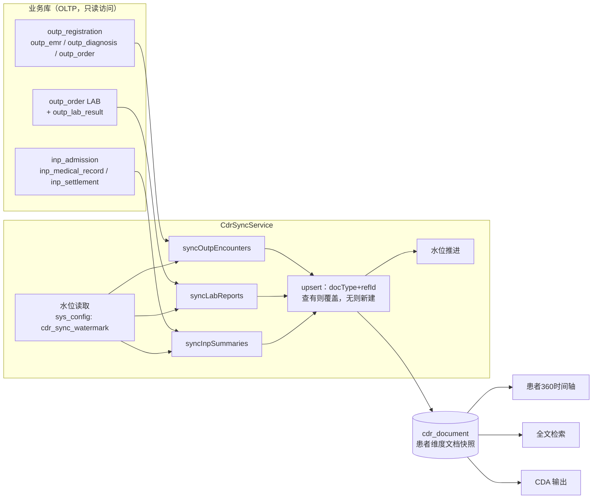
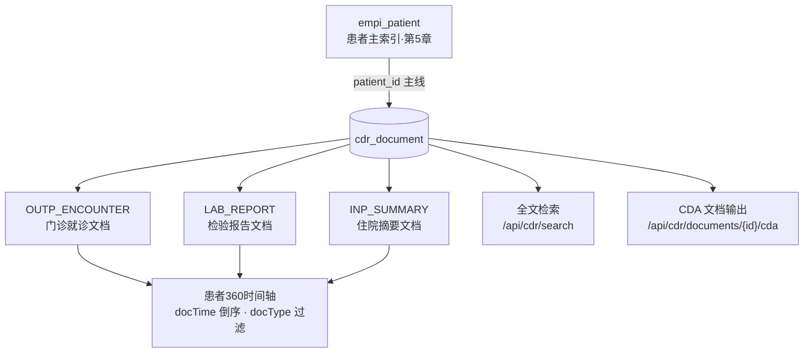
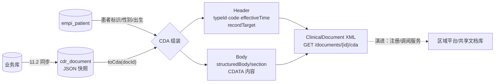

# 第 11 章 临床数据中心与患者 360

> 本章开启第四篇「数据篇」。前三篇建起来的门诊、住院、医技系统每天生产大量临床数据，但这些数据躺在各自的业务表里，服务的是"把这一单业务办完"；医生调阅患者历史、医院向区域平台上报、科研人员检索病历，需要的是"把一个患者、一类问题的数据聚起来看"。承接这两类诉求的架构部件就是临床数据中心（CDR）。
> 本章从 CDR 与业务库分离的论证讲起，依次展开文档模型、增量同步、患者 360 视图、全文检索、CDA 文档生成与数据订阅推送，贯穿案例为 HIP 的 datacenter/cdr 模块——一个刻意做小、但结构完整的 CDR 起步实现。

## 学习目标

学完本章，你应当能够：

1. 说出 CDR 与业务库（OLTP）分离的两条核心理由，区分 CDR 与 ODR 的职责边界；
2. 解释"患者维度文档快照"模型的设计要点，说明 `docType + refId` 唯一键如何支撑幂等覆盖式同步；
3. 列举数据同步的技术谱系（双写、触发器、日志 CDC、定时增量、事件驱动），按侵入性、时延、运维成本完成一次选型论证；
4. 设计基于水位线的增量同步，并识别水位字段选择、水位推进时机两处正确性陷阱；
5. 描述患者 360 视图的聚合边界如何划定，说明脱敏策略如何与 EMPI 层联动（第 5 章）；
6. 比较病历全文检索的三条实现路径（LIKE / PostgreSQL tsvector / Elasticsearch），说出各自的适用区间；
7. 说出 CDA 文档的头体结构与三级结构化水平，解释"骨架先行"的实施策略；
8. 设计一个面向区域平台的数据订阅推送服务的契约要素（事件类型、留痕、重试与幂等）。

---

## 11.1 CDR 的定位：与业务库分离的理由

### 11.1.1 两类负载的天然冲突

业务库是为**联机事务处理**（OLTP，Online Transaction Processing）设计的：挂号写一行、收费改一行状态、发药扣一次库存——单笔数据量小、并发高、响应时间以百毫秒计，索引围绕"按单号点查"优化。而临床数据的第二类消费者完全是另一种画像：

- **调阅**：医生接诊时要看患者近三年的全部就诊、检验、住院记录——跨表、跨域、按患者聚合；
- **检索**：质控与科研要按关键词捞病历——全文扫描，命中范围不可预知；
- **上报与共享**：区域平台要文档、医保要清单、卫健要报表——批量导出，高峰在夜间但补数时不挑时间。

这两类负载放在同一个库里，轻则互相抢资源，重则一条科研检索 SQL 的全表扫描把收费窗口拖到超时——**查询分析不能拖垮 OLTP**，这是数据架构的第一铁律。解法是物理或逻辑上分出一个专供读取分析的数据存储，临床域的这个存储就叫**临床数据中心**（CDR，Clinical Data Repository）。与之并列的还有**运营数据中心**（ODR，Operational Data Repository），面向管理运营指标（门诊量、收入、在院数）；两者消费口径不同，但"与业务库分离、单向同步"的架构地位相同。HIP 的分层架构（第 4 章）在数据层明确并列了业务库、CDR、ODR 三个部件，其架构决策表第 3 条写的正是本节标题：**"CDR 与业务库分离，通过 CDC/事件同步——查询分析不拖垮 OLTP；对齐互联互通文档注册要求"**。

第二条理由"互联互通"值得展开。医院信息互联互通标准化成熟度测评（第 1 章）要求医院建设标准化的**电子病历共享文档库**，提供文档注册、文档检索、文档调阅等交互服务【成稿核对：互联互通测评方案中文档注册/调阅服务的条目编号与分级要求】。这些服务的语义单位是"文档"（一次门诊的病历文档、一份检验报告文档），而业务库的语义单位是"表行"。从表行到文档的组装如果发生在每次调阅时，既慢又把负载压回业务库；提前组装好存进 CDR，注册、检索、调阅就都是对 CDR 的读操作。**CDR 既是性能隔离层，也是"行→文档"的语义转换层**——后者常被忽略，却是它区别于简单只读副本（read replica）的本质：只读副本分担的是负载，不改变数据形态；CDR 改变数据形态。

### 11.1.2 分离的物理形态

"分离"有强弱几档：独立数据库实例（隔离最彻底，运维成本最高）、同实例独立库或 schema、同库独立表。中小医院的现实约束（2–4 台服务器、无专职 DBA，第 4 章）下，HIP 选择最弱的一档：**CDR 表与业务表同库共存，靠"单向抽取 + 独立表 + 独立索引"实现逻辑分离**。这不是妥协掉了架构，而是分阶段兑现——分离的价值大头在数据形态与查询路径的隔离（跨域查询不再 JOIN 七八张业务表），物理隔离留到数据量证明需要时再做，届时 CDR 表整体迁走，读它的患者 360、检索、CDA 接口一行不改。**先把边界画对，物理部署可以后补；边界画错，部署再豪华也是一体的泥球。**

### 11.1.3 文档模型：三类起步

CDR 用什么模型存数据？两条路线：**明细模型**（把业务表按主题域重建为规范化明细，利于统计）与**文档模型**（把一次临床事件的相关数据组装为一份自包含文档，利于调阅与共享）。互联互通的共享文档库走文档路线；统计分析则偏爱明细。HIP 的 CDR 取文档路线（统计诉求由 ODR 汇总接口与第 12 章的报表引擎承接），全部文档落在一张表里。

> **案例框 11-1：一张表的 CDR——cdr_document 的设计**
>
> HIP 的 CDR 实体（[CdrDocument.java](../../datacenter/cdr/src/main/java/cn/hip/cdr/entity/CdrDocument.java)，建表见 [V11__cdr.sql](../../server/src/main/resources/db/migration/V11__cdr.sql)）只有八列，每列都有明确职责：
>
> ```sql
> create table cdr_document (
>     id         bigserial primary key,
>     patient_id bigint        not null references empi_patient (id),
>     doc_type   varchar(24)   not null,   -- OUTP_ENCOUNTER / LAB_REPORT / INP_SUMMARY
>     ref_id     bigint        not null,   -- 源业务主键：挂号 id / 医嘱 id / 住院 id
>     title      varchar(128)  not null,
>     doc_time   timestamptz   not null,   -- 文档发生时间（就诊日/报告日/入院日）
>     content    varchar(8000) not null,   -- 结构化内容 JSON
>     synced_at  timestamptz   not null default now(),
>     unique (doc_type, ref_id)
> );
> create index idx_cdr_patient on cdr_document (patient_id, doc_time desc);
> ```
>
> 三个设计点：**其一**，`unique (doc_type, ref_id)` 把文档锚定到源业务记录，同一笔业务重复同步永远是覆盖更新而非追加——幂等性建立在数据模型上，而不是同步代码的小心翼翼上（11.2 展开）。**其二**，`(patient_id, doc_time desc)` 复合索引精确服务患者 360 的唯一查询形态"某患者的文档按时间倒序"，一次索引扫描出结果。**其三**，`content` 存 JSON 快照而非外键引用——文档是自包含的，调阅不回查业务库，这正是 11.1.1 隔离论证的落点；代价是快照可能过时（同步时滞）与 8000 字符截断（超长病程被截，当前实现直接 `substring`，属于已知妥协）。
>
> 三类 `doc_type` 对应三条抽取链：门诊就诊文档（挂号 + 病历 + 诊断 + 医嘱）、检验报告文档（医嘱 + 结果明细）、住院摘要文档（住院 + 病历记录 + 结算）。对照总体规划中"按 WS/T 500 的 53 类 CDA 文档组织"的蓝图【成稿核对：WS/T 500 系列共享文档的类目数】，落地是 3 类——这不是缩水，而是排序：先用最高频的三类文档把"抽取—存储—调阅—输出"的全链路打通，文档类型此后是在稳定管道上做加法。

---

## 11.2 数据同步：增量、CDC 与事件驱动的取舍

### 11.2.1 同步技术谱系

把数据从业务库搬进 CDR，业界方案按"变更如何被感知"分五族：

| 方案 | 感知机制 | 时延 | 对业务侵入 | 运维成本 | 典型陷阱 |
|---|---|---|---|---|---|
| 双写 | 业务代码写两处 | 无 | 高（每处写点改代码） | 低 | 两处写的原子性无保障，漏写即不一致 |
| 数据库触发器 | 表上 trigger 捕获 DML | 无 | 中（DDL 侵入） | 中 | 隐藏在库里难审计，拖慢业务事务 |
| 日志 CDC | 解析 WAL/binlog（如 Debezium、PG 逻辑复制） | 秒级 | 零 | 高（Kafka/Connect 一套基础设施） | 运维复杂度对中小医院常是压垮项 |
| 定时增量拉取 | 按水位字段轮询 | 分钟级 | 零（只读查询） | 低 | 水位字段选错则漏数据（11.2.3） |
| 应用事件驱动 | 业务代码发布事件，监听者入 CDR | 近实时 | 中（发事件点改代码） | 低–中 | 事件丢失需发件箱兜底（第 6 章） |

**CDC**（Change Data Capture，变更数据捕获）狭义指日志族——它是理论上最优雅的方案：零侵入、低时延、连删除都能捕获。但 Debezium 一套（Kafka + Connect + 连接器）的运维面，对没有专职中间件工程师的县市级医院是奢侈品；这与第 6 章"不引入消息中间件"的论证是同一笔账。HIP 的现实选择是**定时增量拉取为主、全量同步兜底**，源码注释写得直白：`"MVP 为全量拉取（幂等覆盖）；数据量大后改为按更新时间增量 + CDC"`——方案是台阶，不是终点。

### 11.2.2 HIP 的实现：水位线 + 幂等覆盖

图 11-1 是 HIP 同步链路的全景：



**图 11-1 业务库到 CDR 的同步链路**

> **案例框 11-2：水位线存在 sys_config 里**
>
> HIP 的同步服务（[CdrSyncService.java](../../datacenter/cdr/src/main/java/cn/hip/cdr/service/CdrSyncService.java)）暴露两个入口：`syncAll()` 全量（水位取 `Instant.EPOCH`，即抽全部）与 `syncIncremental()` 增量。增量的水位线复用了系统参数中心（第 5 章）：
>
> ```java
> @Transactional
> public Map<String, Integer> syncIncremental() {
>     var rows = jdbc.queryForList(
>         "select cfg_value from sys_config where cfg_key = 'cdr_sync_watermark'");
>     Instant since = rows.isEmpty() ? Instant.EPOCH
>                                    : Instant.parse((String) rows.get(0).get("cfg_value"));
>     var result = doSync(since);
>     jdbc.update("""
>         insert into sys_config(cfg_key, cfg_value, remark)
>         values ('cdr_sync_watermark', ?, 'CDR 增量水位')
>         on conflict (cfg_key) do update set cfg_value = excluded.cfg_value, updated_at = now()
>         """, Instant.now().toString());
>     return result;
> }
> ```
>
> 抽取全部走 `JdbcTemplate` 原生 SQL **只读**业务表（CDR 模块对业务模块零 Java 依赖，边界靠"只 SELECT"守住）；写入统一收口到 `upsert()`：按 `docType + refId` 查旧文档，有则改、无则建。于是全量与增量共用同一段写入逻辑，**全量重跑永远安全**——这就是"幂等覆盖"的含义：任何一次同步失败、水位错乱、数据可疑，管理员在患者 360 页点一次"立即同步"就恢复到正确状态。配置手册将 `cdr_sync_watermark` 列入"系统内部（勿手改）"段，由同步任务独占维护。
>
> 值得指出的诚实口径：当前增量同步是**接口触发**（`POST /api/cdr/sync-incremental`，ADMIN 权限），尚未任务化为定时作业——对照第 10 章对账"每天自动跑、有差异有人管"的标准，这里还差最后一步调度接入。

### 11.2.3 水位线的两个正确性陷阱

定时增量看似谱系中最朴素的方案，但它的正确性完全押在水位设计上。HIP 的实现恰好提供了两个真实的反面教材，比任何虚构例子都锋利。

**陷阱一：水位字段选错，更新会漏。**HIP 业务表（如 `outp_registration`、`inp_admission`）只有 `created_at`/`admit_at`，没有 `updated_at`，增量抽取只能按**创建时间**过滤。后果是：凡"创建在水位前、变更在水位后"的记录，增量永远抓不到。最典型的是检验链——医嘱开单时 `created_at` 已定，几小时后标本上机、结果发布、状态变为 `EXECUTED`，而增量条件是 `order_type = 'LAB' and status = 'EXECUTED' and created_at > 水位`：报告发布时开单时间早已沉到水位之下，**这份新鲜出炉的报告增量同步捞不到**。住院同理：入院在水位前、出院在水位后，CDR 里的住院摘要停留在"在院"状态。当前实现靠全量同步兜底修正，而 `CdrController` 上"增量同步（updated_at 水位）"的注释与代码实况（created_at 过滤）不符——教材如实指出：**修这个问题的正道不在同步代码，在上游模型**：业务表补 `updated_at` 列（触发器或 ORM 统一维护），水位字段换过去。水位字段的选择，决定了增量的正确性边界。

**陷阱二：水位推进过头，窗口期会漏。**同步完成后，HIP 把水位推进到 `Instant.now()`——注意不是"本次抽到数据的最大 `created_at`"。在"执行查询"与"记录 now"之间的几秒里新落库的业务数据，`created_at` 小于新水位却没被本次抽走，下次增量也不会再看它：**永久漏失**。标准解法有二：水位取本批数据的 `max(created_at)`；或保留 now 水位但每次回看一个重叠窗（如水位减 5 分钟）。重叠会重复抽取——而这正是幂等覆盖模型的回报：**重复无害，所以水位宁可保守回退，不可激进冒进**。增量正确性的三根支柱——可靠的水位字段、保守的水位推进、幂等的写入——HIP 立起了第三根，前两根留作演进（也是本章习题 2、3 的素材）。

还有一处细节：门诊抽取用 `status <> 'CANCELLED'` 排除退号，但**已同步后才退号**的挂号，其 CDR 文档不会被任何一次同步触碰（源记录被过滤，覆盖不发生），成为残留的"幽灵文档"。删除语义是拉取式同步的天然盲区（日志 CDC 恰恰擅长此处），工程上以软删标记或对账清理弥补——习题 4 请你设计。

---

## 11.3 患者 360 视图：跨域聚合与时间轴

### 11.3.1 聚合边界怎么划

**患者 360** 指以患者为中心聚合其全部临床数据的调阅视图。"全部"是理想，工程上必须回答：哪些域进视图？判据有三：**临床调阅价值**（接诊场景最常翻什么）、**数据成熟度**（源头数据是否完整可信——垃圾聚合进来是负价值）、**权限与隐私**（精神科、感染科记录的展示需要额外管控）。业界成熟产品的 360 视图通常覆盖就诊、诊断、医嘱用药、检验检查、手术、护理、过敏史等十余域；起步实现则应从"高频 + 数据干净"的域切入。

HIP 的聚合边界即 11.1 的三类文档：门诊就诊、检验报告、住院摘要。边界之外同样值得明说：检查报告（RIS）、手术麻醉、护理记录未进 CDR；检验文档只覆盖门诊医嘱链，住院检验未进标本流转链路（第 9 章已披露该简化）——这些是文档类型清单上的下一批条目，管道不需要为它们改动。

### 11.3.2 时间轴呈现与脱敏联动

> **案例框 11-3：患者 360 页面——聚合的消费端**
>
> 患者 360 页（[Patient360View.vue](../../frontend/shell/src/views/cdr/Patient360View.vue)，菜单权限 `cdr:view360`）是典型的"左检索右时间轴"布局：左栏按姓名/患者号/证件/手机检索患者，右栏将 `GET /api/cdr/patients/{id}/documents` 返回的文档渲染为时间轴（Element Plus 的 `el-timeline`），三类文档以颜色区分，单选钮按 `docType` 过滤（全部/门诊/检验/住院），点"查看"弹出格式化后的 JSON 内容。页头一枚"立即同步"按钮直连全量同步——把 11.2 的兜底能力交到使用者手里。
>
> 值得端详的是**左栏检索走的是 EMPI 的患者接口**（[PatientController.java](../../platform/empi/src/main/java/cn/hip/platform/empi/web/PatientController.java)），而非 CDR 自建患者查询。这带来两个免费的正确性：一是患者身份口径与全院一致（EMPI 是唯一主索引，第 5 章）；二是**脱敏策略自动继承**——该接口对非 ADMIN 角色返回的手机号（前 3 后 4）与证件号（前 4 后 3）已打码，360 视图零代码获得等保要求的列表脱敏。复用底座能力而不是各页自造，是脱敏这类横切策略不出豁口的唯一办法。
>
> 但豁口仍有一处：`GET /api/cdr/documents/{id}/cda` 输出的 CDA 文档带**明文证件号**，且该端点未加角色限制——文档内容路径绕开了列表路径的脱敏。这不是疏忽的辩护而是教学的样本：**脱敏必须按"数据项"定义策略，而不是按"页面"逐处实现**，否则每新增一个数据出口（导出、打印、接口、文档）都是一次重新发明。修复方向见习题 8。

聚合结构全景如图 11-2：



**图 11-2 患者 360 的聚合结构：EMPI 定身份，CDR 供文档，三个消费出口共用一份快照**

图中的要点是箭头方向：EMPI 与 CDR 之间以 `patient_id` 为唯一主线（总体规划的数据主线原则），三个消费出口（时间轴、检索、CDA）全部只读 `cdr_document`——**业务库在这张图上根本不出现**，这就是 11.1 隔离论证兑现后的样子。

---

## 11.4 全文检索：病历检索的实现路径

### 11.4.1 三条路径的谱系

"按关键词找病历"的实现路径按数据量与查询复杂度分三档：

1. **LIKE/ILIKE 子串匹配**：零依赖、零同步，任何量级的开发成本都最低；代价是无法走普通索引（前置通配符），每次查询顺序扫描。对中文友好是它被低估的优点——中文子串匹配不需要分词。
2. **PostgreSQL 全文检索**（`tsvector` + GIN 索引）：库内解决，无需新组件；但 PG 内置解析器不支持中文分词，需装 zhparser/pg_jieba 之类扩展（信创库上未必可得），且检索语义从"子串"变为"词元"，"心肌梗死"能否命中取决于词典切分。
3. **Elasticsearch/OpenSearch**：专业检索能力（中文分词、相关度排序、高亮、聚合）最完整；代价是引入一整套需要喂内存、管集群、做数据同步的基础设施——CDR 到 ES 的同步管道本身又是一个 11.2 的问题。

选型判据与第 6 章消息中间件之辩同构：**用数据量说话**。几十万份文档、秒级可接受的场景，LIKE 扫描完全够用；到了千万级文档或需要相关度排序、检索报表时，再上专业引擎。

### 11.4.2 HIP 的起步版与演进位

> **案例框 11-4：先把检索入口立住**
>
> HIP 的检索实现（[CdrDocumentRepository.java](../../datacenter/cdr/src/main/java/cn/hip/cdr/repository/CdrDocumentRepository.java)）是一条 JPQL：
>
> ```java
> /** 全文检索起步版：ILIKE 匹配标题与内容（中文子串可用；数据量大后迁 OpenSearch） */
> @Query("""
>         from CdrDocument d where d.title like concat('%', :kw, '%')
>           or d.content like concat('%', :kw, '%')
>         order by d.docTime desc
>         """)
> List<CdrDocument> search(@Param("kw") String keyword, Pageable pageable);
> ```
>
> 对外即 `GET /api/cdr/search?keyword=`，限 50 条。两点剖析：**其一**，这次全表扫描扫的是 `cdr_document` 而不是业务库——检索再慢也慢在 CDR 自己身上，收费窗口毫发无损。11.1 的分离论证在此第二次兑现：**把数据先聚到一处，低效的查询才有资格存在**。**其二**，检索方案的升级被架构"定了位"：入口（API）、语料（cdr_document 的 title+content）、同步（11.2 管道）都已就位，未来迁 tsvector 是加一列生成列与 GIN 索引，迁 OpenSearch 是给同步管道加一个下游——调用方不感知。注释里"数据量大后迁 OpenSearch"不是一句敷衍，而是有承接点的演进声明；总体规划的技术栈也早为 ES/OpenSearch 留了位（病历检索、EMPI 模糊匹配两个消费方）。

顺带一个诚实订正：注释自称 ILIKE（不区分大小写），JPQL 实际生成的是 `LIKE`——对中文检索两者无差别，对夹杂的英文药名（"Amoxicillin" vs "amoxicillin"）则有；这类注释与实现的毫米级偏差，正是代码评审该盯住的东西。

---

## 11.5 CDA 文档生成：从业务数据到标准骨架

### 11.5.1 CDA 的层次模型

院内调阅用 JSON 快照足矣，跨机构共享则需要标准格式。**CDA**（Clinical Document Architecture，临床文档架构）是 HL7 的临床文档标准（第 3 章），一份 CDA 文档分两半：**文档头**（Header）——文档类型、患者、作者、机构、时间等元数据，高度结构化，支撑文档注册与检索；**文档体**（Body）——若干章节（section），每节可以是叙述文本，也可以是机器可读的条目（entry）。按文档体的结构化程度，业内分三级：Level 1 整体非结构化（如嵌入 PDF）、Level 2 章节化叙述文本、Level 3 条目级结构化（可直接抽数据）。我国的电子病历共享文档规范（WS/T 500 系列)在 CDA R2 基础上定义了病历概要、门急诊病历、检验报告等数十类文档模板【成稿核对：WS/T 500 系列的准确名称、文档类目数及现行有效版本】，互联互通测评考察的共享文档即以此为准。

理解三级结构的意义在于成本曲线：Header 结构化是文档注册的底线，成本低收益大；Body 到 Level 3 则要求每个观察值映射标准术语（诊断到 ICD、检验到 LOINC——第 12 章术语映射的用武之地），成本陡增。**实施策略因此是"骨架先行"：先让每份文档有合规的头和成形的体，条目级结构化按文档类型分批深化。**

### 11.5.2 HIP 的骨架实现

> **案例框 11-5：一个 text block 生成的 ClinicalDocument**
>
> HIP 的 CDA 输出（`CdrSyncService.toCda()`）按文档 id 取出 CDR 快照，回查 EMPI 患者信息，用 Java text block 模板拼出 CDA 样式 XML：
>
> ```java
> return """
>     <?xml version="1.0" encoding="UTF-8"?>
>     <ClinicalDocument xmlns="urn:hl7-org:v3">
>       <typeId root="2.16.840.1.113883.1.3" extension="POCD_MT000040"/>
>       <code displayName="%s"/>
>       <title>%s</title>
>       <effectiveTime value="%s"/>
>       <recordTarget><patientRole>
>         <id extension="%s"/>
>         <patient><name>%s</name><administrativeGenderCode code="%s"/>
>                  <birthTime value="%s"/></patient>
>       </patientRole></recordTarget>
>       <component><structuredBody><component><section>
>         <text><![CDATA[%s]]></text>
>       </section></component></structuredBody></component>
>     </ClinicalDocument>
>     """.formatted(doc.getDocType(), doc.getTitle(), doc.getDocTime(), ...);
> ```
>
> 按 11.5.1 的坐标系给它定位：Header 有典型骨架（typeId、code、effectiveTime、recordTarget 患者信息），Body 是单 section、内容整体装进 CDATA——**介于 Level 1 与 2 之间的骨架版**。与合规文档的差距同样要列清楚：文档 code 用 docType 字符串而非标准文档类型编码及 OID 体系；机构、作者（author/custodian）节缺失；无 entry 级条目。接口注释"WS/T 500 结构骨架，字段映射简化版"就是这个口径的自我声明。
>
> 还有一个纯工程的教训藏在生成方式里：**用字符串拼接生成 XML 没有做转义**——患者姓名若含 `&` 或 `<`（数据污染、测试数据都可能），输出即非法 XML。玩具阶段无妨，接入区域平台前必须换成 DOM/JAXB 类生成器或至少补转义。"能跑"与"能对外"之间隔着的往往正是这类边角。

从业务数据到标准文档的完整通路如图 11-3——注意 CDA 生成消费的是 CDR 快照，而非现场回查业务库，这使文档输出天然获得同步链路的全部隔离收益：



**图 11-3 CDA 文档生成流程：快照进、标准骨架出**

---

## 11.6 数据订阅与推送：向外供数的服务化

### 11.6.1 拉与推

区域平台、随访系统、商保理赔等第三方要医院的数据，模式无非两种：**拉**——对方按需调医院的查询/调阅服务（11.5 的文档调阅即属此类）；**推**——医院在数据事件发生时主动通知订阅方（患者建档、报告发布、出院……）。推模式的标准形态是**订阅注册 + Webhook 回调**：订阅方登记"我关心什么事件、回调到哪个地址"，医院侧在事件发生时向目标地址 POST 事件负载。工程上要立三根柱子：**留痕**（每次推送落流水，成功失败可查——与第 10 章"留痕即对账依据"同源）；**重试与幂等**（对方接口会抖，重推必然发生，事件负载须带唯一事件 id 供对方去重）；**安全**（目标地址白名单、签名鉴权、负载按订阅方权限脱敏——向第三方推明文证件号是数据合规事故）。

### 11.6.2 HIP 的管道先行

> **案例框 11-6：Mock 推送——又一次"把管道铺通"**
>
> HIP 的订阅推送落在数据治理模块（[DataStdController.java](../../modules/datagov/src/main/java/cn/hip/datagov/web/DataStdController.java)，建表见 [V23__phase26_datastd.sql](../../server/src/main/resources/db/migration/V23__phase26_datastd.sql)）：`dg_subscription` 存订阅（`event_type` 如 PATIENT_CREATED/LAB_PUBLISHED/DISCHARGE、`subscriber`、`target_url`、`enabled` 启停），`dg_push_log` 存推送流水（负载、结果 SUCCESS/FAILED/MOCK）。管理接口齐备：登记、列表（带累计推送数）、启停切换、按订阅查流水。而"推"本身是这样的：
>
> ```java
> /** 测试推送（Mock：不出网，落推送流水验证链路） */
> @PostMapping("/subscriptions/{id}/test-push")
> public R<Map<String, Object>> testPush(@PathVariable Long id) {
>     var subs = jdbc.queryForList(
>         "select * from dg_subscription where id = ? and enabled", id);
>     if (subs.isEmpty()) return R.fail(4633, "订阅不存在或已停用");
>     String payload = "{\"event\":\"" + subs.get(0).get("event_type") + "\",\"test\":true}";
>     jdbc.update("insert into dg_push_log(subscription_id, payload, result) values (?,?,'MOCK')",
>             id, payload);
>     return R.ok(Map.of("pushed", true, "target", subs.get(0).get("target_url")));
> }
> ```
>
> 规划与落地的口径要说满：**落地的是管道**——订阅模型、启停控制、推送留痕、链路验证；**未落地的是真实推送**——没有业务事件触发（第 6 章的应用事件如检验发布事件是现成的挂接点），没有出网 HTTP 调用，没有重试。这是第 10 章审核雏形"管道自建、内容可换"方法论的重演：区域平台的接入协议、地址、证书是典型外部条件，条件到位前把院内侧的每一块板都钉好，到位后要写的只剩一个真实的推送执行器。习题 7 请你把这块板补上。

顺带指出订阅推送与 CDR 的关系：推送的**事件**来自业务动作（发布、出院），推送的**数据体**则宜取 CDR 文档（如 LAB_PUBLISHED 推送该检验的 CDR 快照或 CDA）——事件流与文档库各司其职，这也是把订阅推送放进本章而不是集成章的原因。

---

## 本章小结

- CDR 与业务库分离的两条理由：**查询分析不拖垮 OLTP**（负载画像冲突），以及互联互通要求的**"行→文档"语义转换**。分离先分逻辑边界（独立表/独立查询路径），物理部署按数据量分期兑现。
- HIP 的文档模型是一张 `cdr_document`：`docType + refId` 唯一键把幂等建在数据模型上，`(patient_id, doc_time desc)` 索引精确服务时间轴；三类文档（门诊/检验/住院）是 53 类蓝图的管道验证版。
- 同步技术谱系五族（双写/触发器/日志 CDC/定时增量/事件驱动），中小医院务实解是**定时增量 + 全量幂等兜底**。增量正确性三支柱：可靠水位字段（created_at 会漏更新——检验报告发布、住院出院都是"创建在前、变更在后"）、保守水位推进（取 max(created_at) 或回看重叠窗，勿取 now）、幂等写入（重复无害是前两者可以保守的前提）。删除语义是拉取式同步的盲区。
- 患者 360 的聚合边界按"调阅价值 + 数据成熟度 + 权限"划定；患者检索复用 EMPI 接口使脱敏策略自动继承（第 5 章），而 CDA 出口的明文证件号提醒：**脱敏要按数据项定义策略，不能按页面逐处实现**。
- 全文检索三档路径（LIKE / PG tsvector / ES），按数据量选档。CDR 让低效检索有资格存在（扫描不伤 OLTP），也让检索方案可原位升级（入口、语料、同步管道不变）。
- CDA 分 Header/Body，结构化分三级；实施走"骨架先行"，Header 合规支撑文档注册，条目级结构化按文档类型分批深化。HIP 的 text block 骨架介于 Level 1–2，未做 XML 转义是"能跑"到"能对外"之间的典型欠账。
- 订阅推送三根柱子：留痕、重试与幂等、安全（白名单/签名/按订阅方脱敏）。HIP 落地了订阅模型与 Mock 链路，真实推送等外部条件——又一次"管道先行"。

## 思考与练习

1. **概念**：分别用一个具体查询例子说明 CDR 与 ODR 的职责差异；解释"只读副本"为什么不能替代 CDR（提示：负载隔离与语义转换两个维度）。
2. **设计**：为 HIP 的 `outp_registration`、`outp_order`、`inp_admission` 补充 `updated_at` 列，给出 DDL 与维护机制（数据库触发器或 ORM 回调，二选一并论证），改写 `syncLabReports` 的增量条件，使"开单在水位前、报告发布在水位后"的检验能被增量捕获。
3. **排障**：某医院 CDR 增量同步每 10 分钟一次运行正常，但护士反映"偶尔有患者的门诊记录始终不出现在 360 视图，手工点全量同步就有了"。结合 11.2.3 的水位推进陷阱，给出根因假设、验证方法与两种修复方案的对比。
4. **推演**：已同步进 CDR 的挂号随后被退号，产生"幽灵文档"。设计一个清理方案：比较"同步时额外抽取 CANCELLED 记录并打软删标记"与"每日对账扫描 CDR 反查源记录状态"两条路线的成本与时效，说明你的选择。
5. **设计**：将 HIP 的检索升级为 PostgreSQL 全文检索：给出 `cdr_document` 增加 tsvector 生成列与 GIN 索引的 DDL、查询 SQL，说明中文分词扩展缺失时该方案的退化行为，并给出"何时应当放弃库内方案迁 OpenSearch"的量化判据。
6. **论述**：CDA Level 3（条目级结构化）要求诊断、检验结果映射标准术语。结合第 12 章的 `dg_term` 术语映射表，论述把 HIP 的检验报告文档做到 Level 3 需要打通哪些环节（术语覆盖率、缺失映射的兜底、文档模板），成本集中在哪里。
7. **实践**（配套实训环境）：为订阅推送补上真实执行器——监听检验发布事件（第 6 章 `LabResultReceivedEvent`），查询 `dg_subscription` 中 `LAB_PUBLISHED` 的启用订阅，向 `target_url` 发起 HTTP POST（负载含唯一事件 id 与 CDR 文档快照），成功/失败落 `dg_push_log`，失败进入至多 3 次的间隔重试。写出事件监听器骨架与幂等约定，并说明推送失败不得影响检验发布主流程的事务边界怎么画。
8. **安全设计**：11.3.2 指出 CDA 端点输出明文证件号且未做角色控制。设计一个"按数据项集中定义"的脱敏方案：敏感字段清单与打码规则收口到平台层（参考 `PatientController.mask` 的规则），列表、详情、CDA、订阅推送四类出口统一调用；说明 ADMIN 例外与"对外推送永远脱敏"两条策略如何共存。
