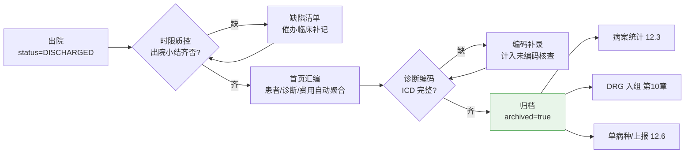
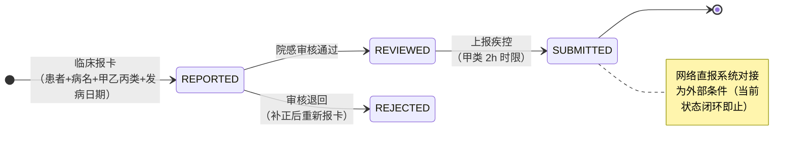
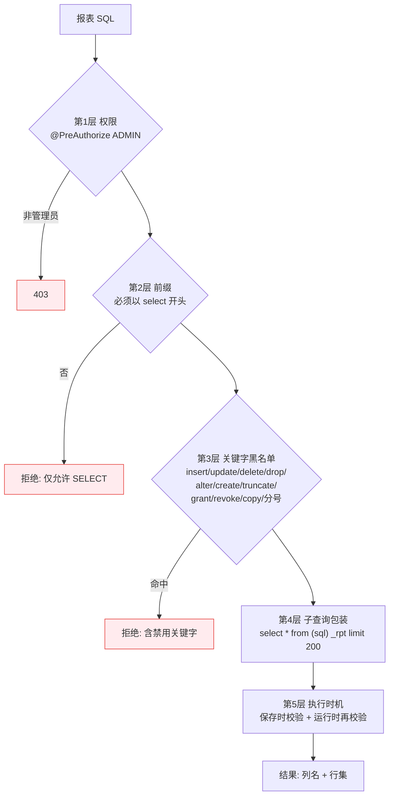

# 第 12 章 数据治理、质控与统计上报

> 本章属第四篇「数据篇」。如果说第 11 章的 CDR 解决"数据放在哪、如何看"，本章解决的是"数据对不对、如何管、如何报"。
> 数据治理、病案管理、医疗质控、院感监测、统计上报，在组织架构上分属信息科、病案室、质控科、院感科、统计室，
> 在系统里却共享同一批上游数据——它们是同一件事的五个切面：**让业务系统沉淀的数据经得起核对、汇总与上报**。
> 全章以 HIP 平台的数据中心 11 个功能页为贯穿案例，并深挖一个最有工程张力的设计：自定义报表引擎的 SELECT 白名单。

## 学习目标

学完本章，你应当能够：

1. 说出数据治理三件套（数据标准、术语映射、质量核查）各自解决的问题，理解卫生信息数据元标准在其中的地位；
2. 解释病案首页在 DRG 支付时代的价值重估，画出"出院—首页汇编—编码—归档"的病案流程，说明编码质量如何逐级传导为医院收入；
3. 设计一组"可归零"的数据质量核查规则，理解反查式 SQL（not exists）在时限质控中的用法；
4. 写出三管千日感染率（VAP/CLABSI/CAUTI）的分子分母定义，说明为什么用"千日率"而不是百分比，并指出数据从哪些护理与医嘱环节来；
5. 画出传染病报卡"报告—审核—上报"的闭环状态机，说出甲乙丙类传染病的报告时限差异；
6. 剖析自助报表引擎的安全模型：说出 SELECT 白名单校验的每一层防线、它挡住了什么、没挡住什么、还能怎样加固；
7. 解释 DDD/AUD 的 WHO 方法学与计算口径，说明日结报表与交款核对在财务内控中的作用。

---

## 12.1 数据治理框架

### 12.1.1 从"有数据"到"数据可信"

医院业务系统每天产生海量数据，但"有数据"与"数据可信"之间隔着三个问题：**同一个字段各系统叫法、格式、值域不一致**（性别是"男/女"还是"1/2"？）；**同一个概念各系统编码不一致**（本院药品字典的"阿莫西林胶囊"对应哪个标准编码？）；**该有的数据没有**（出院了没写出院小结、诊断没有编码）。数据治理（Data Governance）就是针对这三个问题的三件套：

| 治理手段 | 解决的问题 | 依据 |
|---|---|---|
| 数据标准（数据元） | 字段的名称、格式、值域统一 | 卫生信息数据元目录（WS 363 系列）与数据元标准化规则（WS/T 303)【成稿核对：标准号与年份】 |
| 术语映射 | 本地编码与标准编码的对照 | ICD-10、ICD-9-CM-3、LOINC、ATC 等分类编码体系（第 3 章） |
| 质量核查 | 完整性、及时性、一致性缺陷的发现与归零 | 各类上报与评审的数据质量要求 |

治理不是一次性的"数据清洗项目"，而是嵌在日常运行里的机制：标准在建库时内建（第 3 章"标准内建"策略），映射随字典维护持续更新，核查每天跑、缺陷有人管。

### 12.1.2 数据元与术语映射

**数据元**（Data Element）是数据的最小语义单元。国家卫生信息数据元目录给每个数据元一个全局标识（如 DE02.01.039.00 本人姓名）、数据类型（字符/数值/日期/编码）、表示格式（如 `A..50` 表示最长 50 位字符、`YYYYMMDD` 表示日期格式）与允许值域。医院把自己的库表字段登记到数据元目录上，互联互通测评（第 1 章）核查的正是这种对齐程度。

**术语映射**解决"本地叫法 → 标准编码"：诊断映射 ICD-10、检验项目映射 LOINC（Logical Observation Identifiers Names and Codes）、药品映射 ATC（Anatomical Therapeutic Chemical，解剖学治疗学化学分类），映射结果供 CDA 文档生成（第 11 章）、区域平台上传与统计归并使用。

> **案例框 12-1：HIP 的数据元与术语表**
>
> HIP 的数据治理落在 datagov 模块（[DataStdController.java](../../modules/datagov/src/main/java/cn/hip/datagov/web/DataStdController.java)），两张核心表（[V23__phase26_datastd.sql](../../server/src/main/resources/db/migration/V23__phase26_datastd.sql)）：
>
> ```sql
> create table dg_data_element (
>     code      varchar(32)  not null unique,  -- 数据元标识（如 DE02.01.039.00）
>     datatype  varchar(16)  not null,         -- S 字符/N 数值/D 日期/B 布尔/C 编码
>     format    varchar(64),                   -- 表示格式（如 AN..18 / YYYYMMDD）
>     value_set varchar(255),                  -- 允许值/值域说明
>     std_ref   varchar(128), ...              -- 引用标准（WS 363.2、WS/T 303…）
> );
> create table dg_term (
>     category   varchar(32)  not null,        -- DIAG/DRUG/LAB/EXAM/PROC
>     local_name varchar(128) not null,
>     std_code   varchar(64)  not null,        -- ICD-10 / LOINC / ATC…
>     std_system varchar(32)  not null,
>     constraint uq_dg_term unique (category, local_name, std_system)
> );
> ```
>
> 两个设计点：一是 `dg_term` 的唯一约束落在（类别 + 本地名称 + 标准体系）——同一个本地术语可以同时映射 ICD-10 和另一套体系，但同一体系内不允许二义映射；二是数据元种子直接引用国标标识（DE02.01.039.00 本人姓名、DE02.01.040.00 性别代码引 GB/T 2261.1 值域），实施时以国标目录为底、按医院实际扩展。注意这只是**登记与对照层**：真正的价值在第 5 章的字典体系与第 11 章的 CDA 生成消费这份映射时兑现——治理表如果没有消费者，三个月后就是一张死表。

### 12.1.3 数据质量规则：核查而非报表

数据质量核查与统计报表的区别在于**目标值**：报表回答"是多少"，核查回答"有多少不该有的"——它的目标永远是零。HIP 内置六条完整性规则（[DataGovController.java](../../modules/datagov/src/main/java/cn/hip/datagov/web/DataGovController.java)）：患者缺证件号、患者缺手机号、门诊病历未签名、出院未归档病案、入院诊断未编码、在途未审处方。每条规则是一句 count SQL，返回缺陷数与是否通过（count == 0）。

规则内容朴素，但三条设计原则值得记取：

1. **规则必须"可归零"**。"平均住院日 9.2 天"不是质量规则（没有明确的对错），"出院超 3 天未归档 17 份"才是——每一条缺陷都能落到具体单据、具体责任人；
2. **规则挂在治理页，缺陷处理挂在业务页**。核查页发现"入院诊断未编码 12 例"，处理动作在住院医生站补录——治理系统是探照灯，不是手术刀；
3. **规则集应随上报要求生长**。本章后半的每一类上报（病案、院感、单病种）都会反向催生新的核查规则，12.2 的编码率、12.6 的漏报候选都是这个逻辑。

### 12.1.4 数据订阅与推送

治理的最后一环是**对外供数**：区域平台、监管系统、第三方应用订阅医院的数据变更（患者建档、检验发布、出院……）。HIP 用 `dg_subscription`（事件类型 + 订阅方 + 目标 URL + 启停）与 `dg_push_log`（推送流水）承载订阅关系，测试推送在 Mock 阶段不出网、只落流水验证链路——这是第 6 章"外部条件接入点先行"方法的又一次应用。与第 11 章 CDR 的关系可以一句话概括：**CDR 管"来取"（查询服务），订阅推送管"送去"（事件驱动）**，两者共同构成医院数据服务的出口。

---

## 12.2 病案管理

### 12.2.1 病案首页：被 DRG 重估的一页纸

病案首页是每份住院病案卷首的结构化摘要：患者标识、入出院时间与科室、**主要诊断与其他诊断（ICD-10 编码）、手术及操作（ICD-9-CM-3 编码）**、费用汇总、离院方式。在按项目付费时代，首页主要服务于病案检索与卫生统计，填错了顶多统计失真；DRG/DIP 时代它变成了**结算凭据**——第 10 章已经展示了因果链的下游：入组读取首页的主要诊断确定 ADRG，读取其他诊断比对 MCC/CC 目录确定细分组尾码，漏填一个重要合并症，病例从"伴严重并发症"掉到"不伴"，权重损失可达 30%。**上游在此、下游在第 10 章**：病案室的编码质量管理，从"业务考核指标"升格为"直接决定医院收入的生产环节"。

由此，首页数据的产生方式也在演进：手工誊写 → 系统辅助汇编 → 结构化自动生成。汇编的原则是**能从业务数据取的绝不重录**——患者信息取自 EMPI、诊断取自医生站、费用取自结算表，病案人员的工作聚焦在核对与编码，而不是抄写。

### 12.2.2 归档流程

病案从出院到可供利用，要走一条质控链（图 12-1）：



图中三个消费者（统计、DRG、上报）都以"已归档"为口径起点——归档不是把纸放进库房，而是**宣告这份病案的数据从此冻结、可被引用**。因此归档必须有前置校验（未出院不得归档），归档后修改要走解档流程并留痕（HIP 当前未实现解档，见案例框 12-2 的披露）。

> **案例框 12-2：HIP 的首页汇编与编码率口径**
>
> HIP 的病案功能在 [NursingQualityController.java](../../modules/qualitycare/src/main/java/cn/hip/qualitycare/web/NursingQualityController.java)：`front-page` 接口把 `inp_admission`（住院）、`empi_patient`（患者）、`inp_settlement`（结算）三表联查汇编首页数据集，药费从医嘱表按 `order_type='DRUG' and status='EXECUTED'` 汇总；归档接口用一条条件更新收口：
>
> ```java
> int n = jdbc.update(
>     "update inp_admission set archived = true where id = ? and status = 'DISCHARGED'", id);
> return n == 0 ? R.fail(9803, "仅出院病历可归档") : R.ok();
> ```
>
> 编码率在病案统计模块（[MedRecordStatsController.java](../../server/src/main/java/cn/hip/server/web/MedRecordStatsController.java)）的 overview 中计算：出院病例中 `admit_diag_icd is not null` 的占比。这里要诚实披露 HIP 的简化：**它以入院诊断的 ICD 填充率代表编码率，且没有独立的出院诊断表与手术操作（ICD-9-CM-3）编码字段**。真实病案室的编码率以出院主要诊断/其他诊断/手术操作的编码完整率为准，编码工位在归档流程中是独立环节（专职编码员 + 编码质控抽查）。HIP 的结构留了演进位——第 10 章 DRG 入组消费的正是同一诊断字段，补全出院诊断与手术编码表后，编码率口径、DRG 入组、单病种匹配同步受益，这再次印证"上游模型决定下游能力"。
>
> 与之配套的是 12.1.3 的核查规则"出院未归档病案"与"入院诊断未编码"——病案管理的日常运营就是盯着这两个数字归零。另有一张死亡登记卡（`mr_death_card`，直接死因 + 死因链 B/C/D 项），对应死因监测上报的数据集，属病案室的法定报表之一。

### 12.2.3 编码率管理的运营含义

编码率管理的抓手不是"月底通报一个百分比"，而是**把未编码病例做成待办清单**：谁的病例、出院几天了、缺什么。指标只帮管理者看趋势，清单才驱动工作。这也是本章反复出现的模式——12.1.3 的核查规则、12.6 的入组候选、13 章的故障工单，都是"指标 + 清单"双层结构：**指标示警，清单派活**。

---

## 12.3 病案统计

病案统计是医院最古老的统计业务：以归档病案为数据源，回答"医院收治了什么病人、做了什么、效率如何"。HIP 的病案统计（[MedRecordStatsController.java](../../server/src/main/java/cn/hip/server/web/MedRecordStatsController.java)）覆盖四张经典报表，每张背后有一个统计学口径值得点破：

- **疾病谱 TOP20**：出院主要诊断按 **ICD 前 3 位归并**（`substring(admit_diag_icd, 1, 3)`）。ICD-10 的前 3 位是"类目"层级（如 J06 急性上呼吸道感染），归并到类目才能把 J06.8、J06.9 等亚目合成有管理意义的"病种"；逐条亚目统计会碎成长尾。
- **ICD 章节构成**：按首字母归并到 ICD-10 的 22 个章节（如 I 循环系统、J 呼吸系统），用于看学科结构的宏观盘子。
- **科室出院构成**：出院人次、构成比、平均住院日。平均住院日按 `discharged_at - admit_at` 的日历日均值计算——注意它与第 10 章时间消耗指数的关系：前者是绝对效率，后者是难度校正后的相对效率，管理上应成对看。
- **手术统计**：按术式汇总例数、近 30 日例数与完成数。

工程上这四张表都是聚合 SQL 直查业务库。对县市级医院的数据量（年出院数千至数万），这完全够用；数据量再大时的演进方向是把聚合切到 12.7 的指标快照或独立统计库——**先用最简单的直查，把复杂度留给被数据证明的瓶颈**（第 4 章的架构态度）。

---

## 12.4 医疗质控

### 12.4.1 时限质控：用反查抓缺陷

病历书写有法定时限：入院记录须在入院后 24 小时内完成，出院小结在出院后规定时限内完成，门诊病历当次完成并签名【成稿核对：《病历书写基本规范》具体时限条款，与第 8 章共用】。时限质控的实现要点是**反查**——不是查"谁写了"，而是查"到点了还没写的"：

```sql
select ... from inp_admission a
where a.admit_at < now() - interval '24 hours'
  and not exists (select 1 from inp_medical_record r
                  where r.admission_id = a.id and r.record_type = 'ADMISSION')
```

HIP 的时限质控接口（[NursingQualityController.java](../../modules/qualitycare/src/main/java/cn/hip/qualitycare/web/NursingQualityController.java) 的 `emr-timeliness`）返回三类缺陷：入院超 24h 无入院记录（含超时小时数，便于分级催办）、出院无出院小结、门诊病历未签名，合计为缺陷总数。`not exists` 反查是一切"该做未做"类质控的通用句式，12.6 的单病种漏报候选是同一句式的变体。

### 12.4.2 抽检评分：把检查变成曲线

病历内涵质控（写得对不对、逻辑通不通）无法用 SQL 判定，靠**抽检评分**：质控科按标准抽查病历、护理文书、科室管理项目并打分。系统的价值不在打分本身，而在**让同一计划下的多次评分连成时间曲线**——单次 85 分没有意义，"从 78 爬到 91"或"骤降到 70"才是管理信号。HIP 用 `qc_check_plan`（计划 + 质控标准 + 是否临时表单）与 `qc_check_score`（对象 + 0–100 分 + 时间）两张表实现（[NursingPlusController.java](../../modules/qualitycare/src/main/java/cn/hip/qualitycare/web/NursingPlusController.java)），评分按 `checked_at` 排序即得曲线。这是 PDCA（Plan-Do-Check-Act）循环的最小系统化：计划即 Plan，评分即 Check，曲线拐点触发 Act。

### 12.4.3 不良事件：匿名上报的制度设计

医疗不良事件（用药错误、跌倒、压疮、非计划再手术……）管理的第一难题不是技术而是**报告文化**：如果上报等于自认差错，就没人报。国际通行的对策是非惩罚性上报制度，落到系统上是一个具体的设计决策——**支持匿名**。HIP 的 `qc_adverse_event` 表在匿名上报时把 `reporter_id` 置空（而不是记录后隐藏——数据库里根本没有，才谈得上匿名可信），事件按 1–4 级分级【成稿核对：不良事件分级对应中国医院协会 I–IV 级定义】、按"未处理优先、级别升序"排序呈现，处理走 `NEW → HANDLED` 状态并记录处理意见。分级排序的细节有深意：1 级（最严重）排最前，质控科打开页面看到的永远是最该先管的事。

---

## 12.5 医院感染监测

### 12.5.1 两种时间视角

医院感染（Healthcare-Associated Infection, HAI）监测有两种流行病学视角：**发病率监测**——连续跟踪一段时间内的新发感染（本节的三管监测）；**现患率调查**——某个时点横断面清点在院患者中的感染现患（12.5.3）。前者反映过程、可归因到具体环节，后者成本低、适合全院普查与横向比较，两者互补而不可互代。

### 12.5.2 三管千日率：分子、分母与数据来源

三种侵入性导管相关感染是院感监测的核心专项：**VAP**（Ventilator-Associated Pneumonia，呼吸机相关肺炎）、**CLABSI**（Central Line-Associated Bloodstream Infection，中央导管相关血流感染）、**CAUTI**（Catheter-Associated Urinary Tract Infection，导尿管相关尿路感染）。它们的标准指标都是**千导管日感染率**：

```
千日率 = 感染例次数 / 导管留置总日数 × 1000
```

为什么分母是"导管日"而不是"置管人数"？因为感染风险与**暴露时间**成正比：留置 30 天与留置 2 天的风险完全不同，按人数算百分比会让长置管科室（ICU）与短置管科室不可比。以导管日为分母是流行病学的**人时（person-time）发病密度**方法——把暴露时间标准化后，不同科室、不同医院的率才可横向比较。分子分母的口径要点：

| 要素 | 标准口径 | HIP 实现口径 |
|---|---|---|
| 分子 | 监测期内判定的该类感染**例次** | `inf_catheter` 中 `status='INFECTED'` 的导管数（每根导管至多计 1 例次） |
| 分母 | 每日清点带管人数累加（导管日） | 按置管起止时间折算天数，**不足 1 日按 1 日计**（`greatest(days, 1)`，符合按日历日登记惯例） |
| 分类 | 按导管类型分别计算 | `line_type` 三值：VENT/CVC/URINARY，分组统计 |

> **案例框 12-3：HIP 的三管监测闭环与数据来源剖析**
>
> HIP 的院感专项（[InfectionPlusController.java](../../modules/qualitycare/src/main/java/cn/hip/qualitycare/web/InfectionPlusController.java)）把三管监测做成一个小状态机：**置管登记**（校验在院、同类型不得重复监测）→ **日评估**（每日一次，`on conflict (catheter_id, assess_date) do update` 幂等，评估结论是"是否继续留置"）→ **拔管** 或 **判定感染**。判定感染是一个事务内的双写：导管置 `INFECTED` 并记感染日期，同时按导管类型自动生成对应部位的院感病例登记（`qc_infection_case`）——三管监测与院感病例库由此保持一致，不需要两头录。
>
> 千日率一条 SQL 出结果：
>
> ```sql
> select line_type, count(*) filter (where status = 'INFECTED') as infections,
>        round(count(*) filter (where status = 'INFECTED') * 1000
>              / sum(greatest(extract(epoch from (coalesce(end_at, now()) - start_at))
>                    / 86400, 1))::numeric, 2) as per_1000_days
> from inf_catheter group by line_type
> ```
>
> **数据从哪里来**，是这个专项最值得追问的问题。HIP 当前的置管与日评估由院感专职/护士**手工登记**——这是可运行的最小闭环，但存在漏登风险（没登记的置管，分母偏小、千日率虚高）。数据其实早已存在于上游：呼吸机使用是医嘱（第 8 章 `inp_order`）、导管护理是护理记录、体温是护理体征（`inp_vital_sign`）。演进方向是**从医嘱自动开启监测**（呼吸机/置管类医嘱下达即建 `inf_catheter`，停嘱即触发拔管确认），让手工登记退化为例外补录。同一控制器里的术后发热监测已经示范了这种"从既有数据推质控信号"的路子：`inp_surgery` 关联 `inp_vital_sign`，抓术后 72 小时内体温 ≥38℃ 的在院患者，护理体征一次录入、多处消费（体温单在第 8 章，这里是院感线索）。

### 12.5.3 现患率调查

现患率调查（Point Prevalence Survey）在调查日清点全部在院患者，统计正在发生的院感例数：现患率 = 感染人数 / 在院人数 × 100%。全国医院感染监测网每年组织横断面调查，医院按统一调查日执行【成稿核对：全国现患率调查的组织方式与目标值】。HIP 的 `prevalence` 接口实时生成调查表快照：逐患者列出科室、诊断、是否感染（exists 子查询关联院感病例）与感染部位聚合，汇总出在院数、感染数与现患率。注意 HIP 的口径是"任意时刻实时快照"，正式调查要求固定调查日的统一时点口径——使用时应在调查日当天生成并留存。

### 12.5.4 传染病报卡闭环

法定传染病报告是《中华人民共和国传染病防治法》规定的强制义务：甲类传染病（及按甲类管理的）城镇须在 2 小时内网络直报，乙类 24 小时内【成稿核对：甲/乙/丙类报告时限的现行条款】。院内流程是三步闭环（图 12-2）：临床医生发现即**报卡**，院感/防保科**审核**（退回补正或通过），审核通过后**上报**疾控网络直报系统。



HIP 的实现（[NursingPlusController.java](../../modules/qualitycare/src/main/java/cn/hip/qualitycare/web/NursingPlusController.java)，表 `idc_report_card`）用状态机严格约束流转：审核只接受 `REPORTED` 状态，上报只接受 `REVIEWED` 状态（条件更新 + 判定受影响行数的并发定式，与第 7/8/10 章同款），报卡类别用 CHECK 约束限定 A/B/C。两处诚实披露：甲类 2 小时时限当前靠前端提示而非系统倒计时预警（习题 5 让你补上）；**与国家网络直报系统的接口是外部条件**，当前闭环止步于院内 SUBMITTED 状态——接入点已留（状态机与时间戳齐备），对接形态届时按第 6 章的适配器方法处理。

---

## 12.6 单病种上报与评审指标

**单病种质控**是国家针对重点病种（急性心肌梗死、脑梗死、心力衰竭、肺炎等）的过程质控制度：每收治一例目标病种，医院须按统一数据集上报诊疗过程关键节点【成稿核对：国家单病种质控平台的病种清单与数据集版本】。上报的第一难题是**漏报**——临床没意识到某病例属于目标病种。对策与 12.4.1 的反查同源：让系统找人，而不是人找系统。

> **案例框 12-4：ICD 前缀自动入组**
>
> HIP 的单病种模块（[SingleDiseaseController.java](../../modules/qualitycare/src/main/java/cn/hip/qualitycare/web/SingleDiseaseController.java)）用一张病种定义表 `sd_disease_def(code, name, icd_prefix)`（种子：AMI→I21、STROKE→I63、CAP→J15、HF→I50），入组候选一条 SQL 扫出来：
>
> ```sql
> select ... from inp_admission a
> join sd_disease_def d on a.admit_diag_icd like d.icd_prefix || '%'
> where not exists (select 1 from sd_case_report c
>                   where c.admission_id = a.id and c.disease_code = d.code)
> ```
>
> 诊断 ICD 前缀命中病种、且尚未建卡的住院，全部进入候选清单——这是"指标 + 清单"模式的又一实例，也再次踩在病案编码质量的因果链上：**诊断没编码，自动入组就是瞎子**（12.2 的编码率在此兑现价值）。上报卡走 `DRAFT → REPORTED` 状态，上报校验数据集非空；当前 `dataset` 为自由文本，结构化数据集定义与国家平台接口属演进项。

**评审指标**是另一条上报线：公立医院绩效考核与等级评审要求的运营指标集。HIP 在指标引擎（12.7.2）上内置 9 项：当日门诊人次、药占比、床位使用率、门诊均次费用、在院患者数、平均住院日、抗菌药处方占比、门诊病历签名率、检查报告审核率（`dg_metric_def` 种子 M001–M009，部分带目标值如药占比 30%、平均住院日 9 天）。指标的技术载体见下节——它们正是指标快照机制的第一批用户。

---

## 12.7 自定义报表引擎：SELECT 白名单的安全设计

### 12.7.1 自助查询的需求与风险

统计需求有一条长尾：医务科今天要"按科室的抗菌药占比"，明天要"周四下午的挂号构成"。每个需求都走开发排期，信息科会被报表淹没；于是"自助报表"成为刚需——让管理员直接写 SQL 存成报表。但直接执行用户提交的 SQL，等于**把注入攻击的完全体拱手奉上**：与第 7 章讲的参数化查询防注入不同（那是防"数据被当成代码"），这里用户提交的**本来就是代码**。风险具体有三类：**写操作破坏数据**（update/delete/drop）、**越权读取**（查 `sys_user` 的口令散列、查患者隐私）、**资源耗尽**（笛卡尔积联表、pg_sleep 拖死数据库）。

安全模型因此不能靠"过滤坏东西"的心态，而要靠**分层收窄**：每一层各挡一类风险，任何单层被绕过仍有下一层兜底（defense in depth）。

### 12.7.2 五层防线的实现与剖析

HIP 报表引擎（[DataStdController.java](../../modules/datagov/src/main/java/cn/hip/datagov/web/DataStdController.java)）的校验流程如图 12-3：



> **案例框 12-5：validateSql 逐层细读——挡住了什么，没挡住什么**
>
> ```java
> private static final Set<String> FORBIDDEN = Set.of(
>     "insert", "update", "delete", "drop", "alter", "create",
>     "truncate", "grant", "revoke", "copy", ";");
>
> private String validateSql(String sql) {
>     if (!sql.toLowerCase().trim().startsWith("select")) return "仅允许 SELECT 查询";
>     for (String kw : FORBIDDEN)
>         if (lower.contains(kw)) return "包含禁用关键字：" + kw;
>     return null;
> }
> // 执行：jdbc.queryForList("select * from (" + sql + ") _rpt limit 200")
> ```
>
> 逐层评估这个设计的攻防账：
>
> - **前缀 select + 禁分号**合起来封死了"追加第二条语句"的经典注入路径（`select 1; drop table ...`）；禁 `copy` 封死 PostgreSQL 的文件读写通道；
> - **子查询包装**是精巧的一笔：把用户 SQL 塞进 `from (...)` 里，语法上强制它必须是一个可作为子查询的查询表达式——`select ... into` 建表这类"以 select 开头的写操作"会在此处语法报错；同时 `limit 200` 硬性截断结果集；
> - **保存时 + 运行时双重校验**防的是 TOCTOU（校验与使用分离）：有人绕过接口直改 `dg_report_def` 表里的 SQL，运行时的第二道校验仍会拦截；
> - **黑名单用子串匹配，是保守方向的误伤**：查询列 `updated_at` 会因含 "update" 被拒。误伤的代价是可用性（换列别名可绕开），换来的是实现只有十行、无解析器依赖——在"仅管理员可用"的场景下，这笔账是划算的；
> - **没挡住的**：其一，ADMIN 仍可 SELECT 读全库，包括 `sys_user` 的口令散列与患者隐私字段——当前模型信任管理员，防的是破坏而非越权读；其二，`limit 200` 只限返回行数不限计算量，恶意或笨拙的笛卡尔积、`pg_sleep()` 仍可拖慢数据库。
>
> 由此得出加固路线图（按收益排序）：**为报表引擎单独建只读数据库账号**（连接层硬隔离，黑名单从"防线"降格为"提示"，这是最该做的一步）；会话级 `statement_timeout` 限死执行时长；表级白名单（只允许查视图层，敏感列在视图中脱敏——与第 13 章按角色脱敏同一思想）。**黑名单是启发式，账号权限才是边界**：把安全性押在字符串过滤上的系统，迟早在某个没想到的关键字上翻车；把过滤当成第一道减速带、把数据库权限当成真正的墙，才是这个设计的正确读法。

### 12.7.3 指标快照：口径冻结与趋势留存

报表引擎解决"临时问"，**指标快照**解决"天天看"。HIP 的指标引擎三件套：`dg_metric_def`（指标定义：编码、名称、目标值、`builtin_key`）、代码内的 `BUILTIN` 映射（builtin_key → 计算 SQL）、`dg_metric_snapshot`（按日快照，`unique(code, snap_date)`，写入用 `on conflict do update` 幂等覆盖——当日重跑取最新值）。为什么不每次实时算？三个理由：**趋势**——昨天的药占比实时算不出来，历史值必须当天存下；**口径冻结**——业务数据会被退费、补录修改，快照留下"当日所见"；**性能**——运营驾驶舱（ODR 汇总接口把各域今日概况与最新指标快照拼成一页）高频刷新，不应反复全表聚合。计算 SQL 放代码而非配置表，与报表引擎恰成对照：**内置指标要口径稳定、随版本受控变更，自助报表要灵活、随需求即时变化**——同是"SQL 产出数字"，治理策略因变更频率而分野。

---

## 12.8 运营分析

### 12.8.1 药事分析：DDD 的方法学

比较抗菌药使用强度，不能比金额（价格干扰）也不能比盒数（规格干扰），WHO 的解法是 **DDD**（Defined Daily Dose，限定日剂量）：ATC 分类下为每个药物设定一个标准日剂量，任何消耗量都可折算为"用了多少个标准日"——**DDDs = 消耗总量 / 该药 DDD 值**。在此之上，住院抗菌药使用强度 **AUD**（Antibacterial Use Density）= 抗菌药 DDDs × 100 / 同期收治患者床日数，即"每百人天消耗多少个标准日剂量"，专项整治的通行目标值为不超过 40【成稿核对：AUD 目标值出处】。分母用床日数与 12.5 的千日率同理——按暴露时间标准化。

HIP 的药事分析（[DrugAnalysisController.java](../../server/src/main/java/cn/hip/server/web/DrugAnalysisController.java)）给出用药 TOP30、中西药构成、月度经费与 AUD 雏形：药品字典 `md_drug` 带 `ddd_per_unit`（每最小单位折 DDD 数），`sum(qty × ddd_per_unit)` 得 DDDs。代码注释自己披露了口径缺陷："雏形口径：门诊消耗 + 住院床日"——分子取门诊已收费药量、分母取出院床日，**分子分母的人群不一致**，算出的数只能看趋势不能对标 40 的目标值。规范口径要求分子分母同取住院：这是"指标先通管道、口径随数据补齐"的过渡形态，教材把它留作习题 3。

### 12.8.2 日结与交款核对

日结是收费业务的每日闭账：当日全部结算按支付方式、状态汇总，收款员据此与手中现金、支付平台账单核对后交款。HIP 的日结（[PrintReportController.java](../../server/src/main/java/cn/hip/server/web/PrintReportController.java)）输出按支付方式 × 状态的分组汇总与实收/退费/笔数总计，并提供 CSV 导出——导出串首的 ``（UTF-8 BOM）是个小而典型的工程细节：没有它，Excel 打开中文 CSV 就是乱码。

交款核对（[FinanceController.java](../../server/src/main/java/cn/hip/server/web/FinanceController.java)）再往前一步，做成**按收款员的稽核视图**：每人当日收款/退款笔数与金额（来自 `outp_charge.cashier_id`——第 7 章收费落库时记录经手人，此处兑现价值），外加异常明细清单（当日退费单 + 作废支付单 union 呈现）。财务内控的原理是**钱与账分离、账与账互核**：收款员自报的交款额，要与系统按经手人汇总的净额相符；退费与作废是差错和舞弊的高发区，单列出来供逐笔核对。把这一节与第 10 章的医保对账、第 13 章的审计日志连起来看，医院的资金安全是三层同构的闭环：**业务账对通道账（医保/支付对账）、人对账（交款核对）、操作对留痕（审计）**。

---

## 本章小结

- 数据治理三件套：**数据元标准**（字段级统一，对齐 WS 363 系列目录）、**术语映射**（本地编码 → ICD/LOINC/ATC，唯一约束防二义）、**质量核查**（规则必须"可归零"，指标示警、清单派活）；对外供数走订阅推送，与 CDR 构成"来取 + 送去"两个出口。
- 病案首页被 DRG 重估为**结算凭据**：出院 → 时限质控 → 首页汇编（能取不录）→ 编码 → 归档，归档即数据冻结；编码质量沿"首页 → 入组 → 权重 → 收入"因果链传导（上游在此、下游在第 10 章）。
- 病案统计的口径要点：疾病谱按 ICD 前 3 位类目归并、章节构成按首字母；平均住院日与消耗指数成对看。
- 医疗质控三式：时限质控用 **not exists 反查**抓"该做未做"；抽检评分连成**时间曲线**才有管理信号；不良事件**匿名上报**（reporter_id 置空而非隐藏）支撑非惩罚性报告文化。
- 三管千日率 = 感染例次 / 导管日 × 1000，分母用暴露时间（人时法）才可横向比较；HIP 以"置管登记—日评估—拔管/判感染"状态机承载，判感染同事务生成院感病例；数据来源当前手工登记，演进方向是从医嘱/护理体征自动触发。传染病报卡走"报告—审核—上报"闭环状态机，网络直报为外部条件。
- 单病种上报用 **ICD 前缀自动入组**解决漏报——系统找人，而非人找系统；其前提又是病案编码质量。
- 报表引擎的安全模型是**分层收窄**：权限 → select 前缀 → 关键字黑名单 → 子查询包装限行 → 保存/运行双校验；黑名单是启发式，**只读数据库账号才是边界**。指标快照解决趋势、口径冻结与性能，内置指标与自助报表因变更频率不同而治理策略分野。
- DDD/AUD 把药量折算为标准日剂量、按百人天标准化；日结与交款核对的内控原理是钱账分离、按经手人互核，与医保对账、审计日志三层同构。

## 思考与练习

1. **概念**：说明数据质量核查规则与统计报表的本质区别；用"可归零"标准判断以下哪些适合做核查规则：药占比、出院 3 日未归档病案数、平均住院日、术前讨论缺失数。
2. **计算**：某 ICU 本月呼吸机置管 18 例，合计呼吸机日 126 天（其中 1 例仅 10 小时），判定 VAP 2 例次。按 HIP 口径（不足 1 日按 1 日）计算 VAP 千日率；若改按"每日 0 点清点带管人数累加"口径，说明两种分母的差异来源与适用场景。
3. **设计**：12.8.1 指出 HIP 的 AUD 雏形口径分子分母人群不一致。基于第 8 章的住院医嘱执行模型（`inp_order` 执行记账），写出规范住院 AUD 的分子 SQL 口径（提示：抗菌药 + 已执行 + 按 `ddd_per_unit` 折算），并说明分母"收治患者床日数"与"出院患者床日数"的取舍。
4. **攻防**：针对案例框 12-5 的 validateSql，构造两个测试用例：一个会被**误伤**的合法查询、一个能**通过校验但仍造成危害**的查询，并分别给出对应的加固措施；论述为什么"只读数据库账号"比扩充黑名单更根本。
5. **设计**：为传染病报卡增加甲类 2 小时时限预警：报卡后未在时限内完成上报的卡片须进入督办清单并升级提醒。给出所需的字段/SQL 与调度方式（参考第 13 章定时任务与 12.4.1 的反查句式）。
6. **排障**：某院上线 DRG 分析后发现歧义组（QY）病例占比高达 20%。沿本章的因果链（编码率 → 首页 → 入组）列出排查顺序与每步使用的系统功能页。
7. **实践**（配套实训环境）：为 HIP 的数据质量核查新增规则"出院超 3 日未归档"（当前规则只查未归档，不查超时），修改 [DataGovController.java](../../modules/datagov/src/main/java/cn/hip/datagov/web/DataGovController.java) 的 qualityChecks，并为该规则补一个单元测试。
