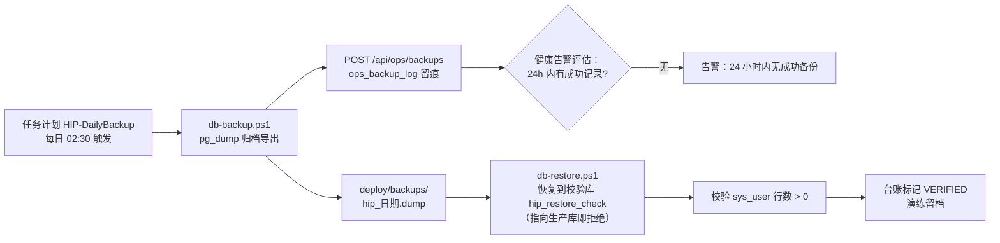
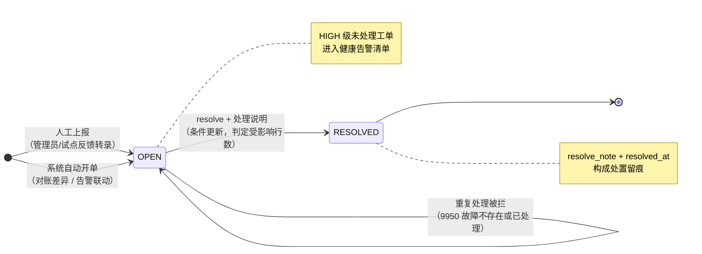
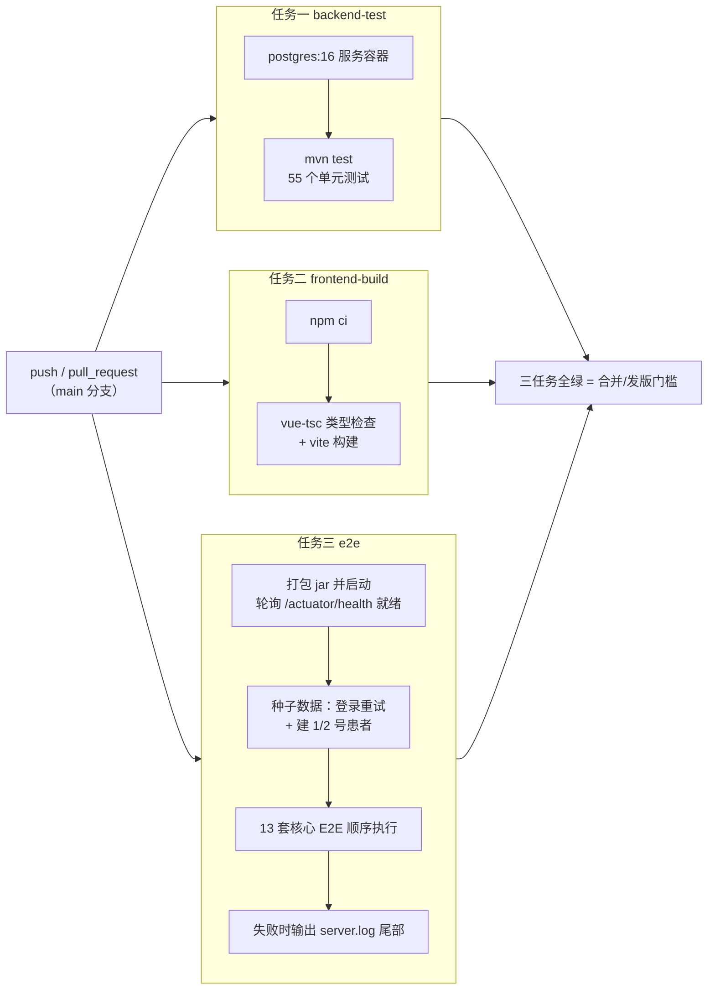

# 第 13 章 安全、合规与运维

> 本章属第五篇「工程篇」。前面各章讲的是"把功能做出来"，本章讲"让系统配得上上线"——
> 安全合规是医院信息系统的准入资格，运维能力决定它上线后能活多久。
> 本章依次展开等保落地、数据脱敏、备份恢复、运维中心、性能工程与测试体系，
> 贯穿案例是 HIP 平台从演示系统走向试点上线时的一次真实生产化硬化（v15-B 安全基线专项）。

## 学习目标

学完本章，你应当能够：

1. 说出网络安全等级保护制度的基本框架，理解"从抽象条款到可验证清单"的落地方法，解释密钥外置、默认口令治理、HTTPS 反代为什么是上线前的最小硬化集；
2. 描述数据脱敏的层次模型（传输加密、存储控制、应用层动态脱敏、对外匿名化），说明脱敏为什么必须发生在服务端出口；
3. 定义 RPO 与 RTO，解释"备份不等于可恢复"，设计一套包含自动备份、时效监控、恢复演练留档的备份制度；
4. 说出可观测性三支柱（指标、日志、链路追踪），论证中小医院轻量化观测方案的合理边界，画出故障工单的流转闭环；
5. 掌握以执行计划为依据的索引审计方法，理解"只加不删、注明依据"的索引管理纪律与大表治理策略；
6. 解释测试金字塔在业务信息系统中的变形，论证"Python 脚本打真实 API"的 E2E 策略对中小团队的性价比；
7. 描述 CI 三任务（后端测试、前端构建、端到端回归）的组织方式，理解 CI 全绿、安全基线、备份演练如何共同构成上线门槛。

---

## 13.1 等保三级工程落地：从条款到清单

### 13.1.1 制度框架与医院的定级现实

我国网络安全等级保护制度（下称"等保"）依据《网络安全法》建立，将信息系统按重要程度定为一至五级，级别越高要求越严。现行技术标准体系以《信息安全技术 网络安全等级保护基本要求》（GB/T 22239—2019，业内称"等保 2.0"）为核心，技术要求覆盖安全物理环境、安全通信网络、安全区域边界、安全计算环境、安全管理中心五个层面，另有安全管理制度、机构、人员、建设与运维五类管理要求【成稿核对：等保 2.0 技术/管理要求的分类表述与三级具体控制项条款号】。

医院的核心业务系统（HIS/EMR）承载大量患者诊疗数据且服务不可中断，行业通行做法是按**第三级**定级备案并定期测评【成稿核对：卫健部门对医院核心系统定级的文件依据】。第 1 章已从政策环境角度介绍过等保与《数据安全法》《个人信息保护法》的关系，本章只回答一个工程问题：**拿到一份几百个控制项的等保要求，开发团队从哪里下手？**

### 13.1.2 条款为什么落不了地

等保条款是面向测评的抽象描述，如"应对登录的用户进行身份标识和鉴别，身份标识具有唯一性，身份鉴别信息具有复杂度要求并定期更换"。这类语句无法直接变成任务：复杂度是什么规则？定期是多少天？在哪个系统的哪一层实现？工程团队常见的两种失败方式恰好相反——一种是把等保当成"测评前突击整改"的文档工作，系统本身不动；另一种是照条款逐条堆功能，做出一堆没人用的安全模块。

正确的方法是**翻译**：把条款翻译成"可执行、可验证"的工程清单，每一项写清实现位置、验证方式、责任环节。判断翻译质量的标准很简单——一个没参加过讨论的实施工程师，拿着清单能否独立完成检查。HIP 的[部署手册](../部署手册.md)"安全基线"一节与[多医院部署操作指南](../多医院部署操作指南.md)的上线检查单（`- [ ] HIP_JWT_SECRET 已设置（非开发占位值）`）就是这种翻译的产物：条款留在测评报告里，清单进入部署流程里。

### 13.1.3 上线门槛：安全基线的工程化

一个演示环境里安全无虞的系统，拿到真实网络里可能满身是洞——不是代码变了，而是**威胁模型变了**。演示环境的隐含假设是"访问者都是自己人"；试点上线的那一刻，这个假设失效。因此从演示走向试点，存在一组"不做就不许上线"的最小硬化项，HIP 在 v15 规划中把它命名为**安全基线**，并明确标注"试点前必做"。这组硬化项的选取标准值得学习：不是等保条款里最难的，而是**攻击者最先尝试、修复成本又最低**的三件事——秘钥、口令、明文传输。

> **案例框 13-1：v15-B 安全基线三件事（HIP 试点前硬化专项）**
>
> HIP 的[下一步开发规划](../下一步开发规划.md) v15-B 将安全基线列为试点准备的第一项，半天级编码，内容三件：
>
> **其一，JWT 密钥外置。**签发登录令牌的密钥原先是 `application.yml` 里的占位字符串——对演示无害，对生产致命：拿到密钥即可伪造任意用户的令牌，而配置文件随代码仓库流转，等于把万能钥匙印在说明书上。硬化后的配置（[application.yml](../../server/src/main/resources/application.yml)）：
>
> ```yaml
> # 安全基线：生产/试点通过环境变量 HIP_JWT_SECRET 注入（≥32 字符随机串）
> jwt-secret: ${HIP_JWT_SECRET:dev-only-secret-change-me-hip-platform-0123456789}
> ```
>
> 注意这个设计的取舍：环境变量未设置时**回落**到一眼可识别的开发占位值（`dev-only-secret-change-me`），而不是拒绝启动。回落保住了开发与 CI 的零配置便利，风险则转移给部署清单硬卡——检查单里"非开发占位值"一项就是为它设的。这是"密钥不进代码库"原则（十二要素应用方法论中的配置外置）的最小实现；更重的方案（秘钥管理服务、定期轮换）留给规模证明其必要时。
>
> **其二，默认口令治理。**系统初始化自带 `admin/admin123`，演示数据脚本再造 7 个 `Demo1234` 演示账号——默认口令是真实入侵事件中最常见的突破口。治理分两路：生产初始化工具 [init-hospital.py](../../tools/init-hospital.py) 把换口令做成**断言**，配置里不提供新口令直接拒绝执行（`assert new_pwd and new_pwd != 'admin123'`），执行末尾强制更换 admin 口令并回验；演示数据脚本 `bootstrap-demo.py` 则被部署手册明令**禁止在生产库运行**。把"上线要改密码"从叮嘱变成工具里的断言，是清单化思想的又一次体现——人会忘，断言不会。
>
> **其三，HTTPS 反代。**院内网不等于可信网（等保三级对通信保密性有明确要求），登录口令与患者数据不允许明文过线。HIP 的做法是 nginx 反代终止 TLS：仓库内的 [nginx.conf](../../frontend/shell/nginx.conf) 提供 80 端口的基础配置（静态资源 + `/api` 反代），部署时在其上增加 443 server 块与院方证书——证书是逐院资产，不进代码库。
>
> 三件事没有一件是新功能，用户完全无感，却构成从"演示"到"生产"的分水岭。它们被排为"试点前必做"的深层理由是：**安全欠账的偿还成本随时间递增**——上线前改密钥是改一行配置，上线后改密钥是让全院重新登录；上线前禁演示账号是删一行种子，上线后是排查这些账号三个月里干过什么。

### 13.1.4 认证域的纵深：口令策略、防爆破与审计

密钥与默认口令之外，认证域还需要纵深防御。HIP 在平台底座（第 5 章）中实现了三层，本章从合规视角复核其对应关系：

- **口令复杂度**：新建与修改口令要求不少于 8 位且同时含字母和数字，弱口令在服务端被 1102 错误码拒绝【成稿核对：等保三级对口令复杂度与更换周期的具体表述】；
- **登录防爆破**：连续 5 次失败锁定账号 15 分钟（错误码 1002），成功登录清零失败计数——这三条行为都有单元测试钉住（[SecurityHardeningTest.java](../../server/src/test/java/cn/hip/server/SecurityHardeningTest.java)），安全规则是最值得用测试固化的规则，因为它的破坏往往悄无声息；
- **口令时效**：登录响应携带 `passwordAgeDays` 与 `passwordExpireWarning`（超 90 天提示更换），把"定期更换"从制度落到交互。

审计日志（`sys_audit_log`，写操作全量留痕，机制见第 5 章）在合规语境下的身份是**证据**：等保要求留存网络日志不少于六个月【成稿核对：《网络安全法》第二十一条留存期限表述】，测评会抽查"某敏感操作能否追溯到人"。工程上要注意两点：审计表只增不删（删除审计记录本身就是需要审计的事件），以及审计数据要纳入备份范围——丢了业务数据是事故，丢了审计数据是事故之后还说不清的事故。

---

## 13.2 数据脱敏与隐私

### 13.2.1 法律基线与最小必要原则

《个人信息保护法》将医疗健康信息列为**敏感个人信息**，处理需具备特定目的和充分必要性；《数据安全法》要求数据分类分级管理（政策脉络见第 1 章）。落到系统设计上，核心是**最小必要原则**的两个投影：每个角色只看到履职所需的最小数据集（横向），每个场景只输出该场景所需的最小字段集（纵向）。前者靠权限体系（第 5 章 RBAC），后者靠**脱敏**。

### 13.2.2 脱敏的层次模型

"脱敏"一词常被笼统使用，工程上应按数据所处环节分层：

| 层次 | 手段 | 防的是谁 |
|---|---|---|
| 传输层 | TLS（13.1 反代终止） | 网络窃听者 |
| 存储层 | 库表权限、磁盘/备份加密 | 越权接触数据库的人 |
| 应用层（动态脱敏） | 按角色/场景在服务端出口遮蔽字段 | 合法用户的过度浏览 |
| 对外发布（静态脱敏/匿名化） | 去标识、泛化、限时限量 | 数据离开系统后的一切人 |

动态与静态的区别在于数据是否离开系统边界：动态脱敏是"看的时候遮住"，原始数据仍在库中完好；静态脱敏是"给出去之前改掉"，常用于对外分享、测试数据、科研数据集。层次模型的价值在于**逐层追问**：讨论"我们做了脱敏"时，先问做在哪一层、防的是谁——只做了传输加密的系统，挡不住一个合法登录的收费员翻遍全院患者手机号。

> **案例框 13-2：HIP 的三个脱敏场景**
>
> **场景一：列表按角色动态脱敏。**患者检索列表是"过度浏览"风险最高的入口——关键词一搜就是成页的姓名、手机号、证件号。HIP 在服务端出口按角色处理（[PatientController.java](../../platform/empi/src/main/java/cn/hip/platform/empi/web/PatientController.java)）：
>
> ```java
> // 等保：列表场景手机号/证件号脱敏，仅 ADMIN 角色见明文
> .map(x -> admin ? toDto(x) : maskSensitive(toDto(x)))
> // 手机号保留前3后4，证件号保留前4后3
> dto.computeIfPresent("phone", (k, v) -> mask(String.valueOf(v), 3, 4));
> dto.computeIfPresent("idNo",  (k, v) -> mask(String.valueOf(v), 4, 3));
> ```
>
> 保留首尾、遮蔽中段的格式（`138****5678`）兼顾了核对需求与隐私——窗口人员足以向患者口头确认"尾号 5678 对吗"，却无法抄走完整号码。
>
> **场景二：对外分享的匿名化 + 限时。**检查报告分享短链（[ReportShareController.java](../../modules/medtech/src/main/java/cn/hip/medtech/web/ReportShareController.java)）让患者把已审核发布的报告转给外院医生或家属：生成 32 位随机 token 短链，**匿名可访问**但默认 72 小时过期（4662 失效），姓名静态脱敏为首字 + `**`，每次访问计数留痕。这里叠加了三种控制——不可枚举的随机标识、限时失效、最小字段集（只出报告所见与结论，不出证件号与费用）——因为数据一旦出了系统边界，就再没有第二次控制机会。
>
> **场景三：危急值不外显。**患者端（互联网 + 患者服务）能查检验报告，但 HH/LL 危急值结果在患者端被遮蔽为"结果异常，请尽快回院复诊"（[PortalController.java](../../modules/portal/src/main/java/cn/hip/portal/web/PortalController.java)，异常标志置为 `CRIT`）。严格说这不是隐私脱敏，而是**告知伦理**：危急值意味着病情可能危及生命，应由医生结合病情当面告知并启动处置（危急值院内闭环见第 6 章），而不是让患者深夜独自面对一个吓人的数字。同一份数据、不同受众、不同呈现——这提醒我们：脱敏规则的主语不是数据，而是"数据 × 场景"。

### 13.2.3 工程讨论：位置、粒度与张力

三个场景共同的实现位置是**服务端出口**。前端脱敏（拿到明文再遮蔽显示）在浏览器开发者工具面前形同虚设，任何在响应报文里出现过的明文都视同已经泄露——这是脱敏实现的第一铁律。

粒度上，HIP 当前用"是否 ADMIN"一刀切，是**保守起步**的策略：宁可让少数合法需求多走一步（找管理员查明文），不可默认放开。真实演进方向是把"查看明文"独立成权限点授给确需角色（如收费窗口核对证件），并对明文查看行为落审计——**授权与留痕必须同时到位**，只授权不留痕，等于给过度浏览发了通行证。脱敏与业务便利永远存在张力，处理张力的原则是：放开一个口子时，问清楚谁需要、看什么、留什么痕。

---

## 13.3 备份与恢复

### 13.3.1 RPO 与 RTO：先给灾难定价

备份方案的两个基本指标：**RPO**（Recovery Point Objective，恢复点目标）——灾难发生时最多允许丢失多长时间的数据；**RTO**（Recovery Time Objective，恢复时间目标）——从灾难到恢复服务最多允许多久。两者都是**业务决策**而非技术决策：医院丢一天的收费与病历记录意味着什么？门诊停摆四小时意味着什么？答完这两个问题，技术方案只是推论——每日全量备份给出"最坏丢一天"的 RPO；要把 RPO 压到分钟级，就要在全量之上加 WAL 归档（PostgreSQL 的预写日志连续归档，可恢复到任意时间点）；RTO 则取决于恢复流程的熟练度，而熟练度只能靠演练获得。

经典的 **3-2-1 原则**（至少 3 份副本、2 种介质、1 份异地）是防"备份与生产一起毁"的底线。HIP 试点形态的备份落在应用服务器本地目录，满足的是日常误操作与单库故障场景；机房级灾难的防护（异地副本）属于按院实施时的基础设施议题，方案上应明确交代而不是含糊带过——**说清楚现在防到哪一级，比声称什么都防更专业**。

### 13.3.2 备份不等于可恢复

备份领域流传一句反复被事故验证的话：**没有经过恢复演练的备份，等于没有备份**。三种经典的死法：备份任务某天起静默失败，无人知晓，直到需要时才发现最后一份可用备份是三个月前的；备份文件按时生成但损坏或不完整（磁盘满、导出中断），文件列表看起来一切正常；备份完好，但会做恢复操作的人已离职，文档过期，在最需要冷静的时刻现场摸索。三种死法对应三种制度设计：**时效监控**盯"是否还在成功备份"，**恢复演练**盯"备份是否真能恢复"，**演练留档**盯"恢复的手艺是否还在组织里"。

> **案例框 13-3：HIP 的备份-恢复演练闭环**
>
> HIP 的备份制度由三个脚本加一张台账构成，全部在仓库内可查：
>
> - [schedule-backup.ps1](../../tools/schedule-backup.ps1)：向 Windows 任务计划注册 `HIP-DailyBackup`（每日 02:30），把备份从"有人记得跑"变成"系统按时跑"——v15 规划将其列为"备份制度落地"，v17 又要求挂载实操留档，任务化本身也要留下证据；
> - [db-backup.ps1](../../tools/db-backup.ps1)：`pg_dump` 归档格式导出到 `deploy/backups/`，随后调用平台接口 `POST /api/ops/backups` 把文件名、大小、状态写入 `ops_backup_log` 台账——备份行为在业务系统里留痕，而不是只散落在文件系统里；
> - [db-restore.ps1](../../tools/db-restore.ps1)：恢复演练脚本。三个细节体现了制度思考：**默认恢复到独立校验库** `hip_restore_check`；目标库参数若指向生产库 `hip` **直接拒绝执行**（防呆——演练工具在设计上就不允许碰生产）；恢复后自动校验关键表行数（`sys_user` > 0）给出通过判定。演练通过后，对应备份记录状态可标为 `VERIFIED`，台账即演练档案。
>
> 闭环的最后一块是**时效监控**：运维中心健康告警（13.4）中有一条——
>
> ```sql
> select count(*) from ops_backup_log
>  where status in ('SUCCESS','VERIFIED') and created_at > now() - interval '24 hours'
> -- 计数为 0 则告警："24 小时内无成功备份"
> ```
>
> 注意告警的**方向**：不是"备份失败时告警"——失败的任务可能连告警都发不出（脚本没跑、机器关机、任务被禁用），而是"24 小时内**没有成功记录**就告警"。监控存在性而非监控失败事件，是所有周期性任务监控的正确姿势：它把"没消息"从默认的好消息变成坏消息。



**图 13-1 备份-恢复演练闭环：自动备份、台账留痕、时效告警、演练验证四环相扣**

把图 13-1 与部署手册的回滚策略连起来看：应用回滚靠保留上一版 jar（Flyway 迁移向前兼容、不自动降级，所以**发版前必先备份库**——第 14 章的升级演练正是拿备份库做 N-1→N 前滚），数据回滚靠每日全量 + WAL 归档。备份在这里显出它的第二身份：不仅是灾难保险，也是**每一次发版的后悔药**。

---

## 13.4 运维中心

### 13.4.1 可观测性三支柱与轻量化取舍

可观测性（Observability）领域的通用框架是三支柱：**指标**（Metrics，聚合数值的时序）、**日志**（Logs，离散事件明细）、**链路追踪**（Traces，一次请求跨组件的路径）。互联网行业的标准配置——Prometheus + Grafana 采指标、ELK 聚日志、OpenTelemetry 做追踪——对县市级医院的单体部署形态（第 4 章）往往是负资产：三套系统本身就是三个要运维的对象，而院内信息科的运维人手常常只有一两人。

HIP 的取舍是**把观测数据落进业务数据库、用业务页面呈现**：慢接口写 `ops_slow_api` 表，健康状态一个接口聚合，日志走本地滚动文件（pilot profile 配置 50MB × 30 个，见 [application-pilot.yml](../../server/src/main/resources/application-pilot.yml)），不引入任何观测中间件。这不是"简陋"，而是与部署形态匹配的**架构一致性**：模块化单体的观测就该是单体的。边界同样要说清——多实例部署、需要跨服务追踪、或指标量大到拖累业务库时，就是升级到专业观测栈的时机；届时 `ops_slow_api` 的数据口径可以平移成 Prometheus 指标，页面平移成 Grafana 面板，**先轻后重的路径是通的**。

### 13.4.2 健康告警与慢接口观测

运维中心（[OpsController.java](../../server/src/main/java/cn/hip/server/web/OpsController.java)，V19 迁移建表）的健康概览接口一次聚合四类基础信号：数据库连通性、运行时长与堆内存、磁盘剩余、告警清单。告警清单按规则现算：数据库不可用、存在未处理的 HIGH 级故障工单、24 小时内无成功备份（13.3）、今日慢接口超过 50 次。这是**拉式评估**——管理员打开页面即得实时结论，实现零依赖；它的局限也直白：没人打开页面就没有告警。演进方向是把同一套评估逻辑挂到定时任务并对接外发通道（短信/企业微信），评估规则不变，只是多了一个触发时机——这正是"规则与通道分离"带来的演进便利。

慢接口观测的实现是一个 Servlet 过滤器（[SlowApiFilter.java](../../server/src/main/java/cn/hip/server/web/SlowApiFilter.java)）：每个 `/api/` 请求计时，超过阈值（`hip.ops.slow-ms`，开发默认 500ms，试点 profile 收紧到 300ms）落一行 `ops_slow_api`。两个细节是观测代码的通用纪律：**落库失败静默吞掉**（`catch (Exception ignored)`）——观测永远不许伤害业务，宁可丢观测数据；**阈值走配置**——不同环境的"慢"标准不同，试点收紧阈值是主动放大观测灵敏度，让问题在数据量小时就露头。运维中心页面按 7 天窗口聚合（次数、最大/平均耗时），排序即优化工单的候选清单——13.5 的索引审计正是消费这份清单的下游。

### 13.4.3 故障工单与巡检

故障管理的重量级方案是 ITIL 流程与专业 ITSM 工具，轻量级的底线则是**一张有状态的台账**：何时报的、什么级别、谁在管、怎么了结。HIP 的 `ops_fault_ticket` 就是这条底线：标题、级别（LOW/MEDIUM/HIGH）、状态（OPEN/RESOLVED）、上报人、处理说明、时间戳。工单的价值不在表结构，在**入口的汇聚**——HIP 的工单有三个来源（图 13-2）：管理员人工上报；系统自动开单（医保每日对账差异 > 0 时，[InsuranceAutoReconJob.java](../../modules/insurance/src/main/java/cn/hip/insurance/service/InsuranceAutoReconJob.java) 以 `system` 名义插入 MEDIUM 工单，第 10 章已从对账视角讲过这条联动）；试点运行期的用户反馈（v15-C 规划明确"问题一律进 ops_fault_ticket 台账 → 分级 → 按需开小版本"，工单台账成为试点反馈闭环的载体，见第 14 章）。



**图 13-2 故障工单流转：多来源汇聚一张台账，闭环状态机 + 处置留痕**

结单接口值得看一眼实现：`update ... set status='RESOLVED' where id=? and status='OPEN'`，受影响行数为 0 则返回 9950"故障不存在或已处理"。这是全书反复出现的"条件更新 + 判定受影响行数"并发定式（第 7、8、10 章的占号、占床、结算是同一模式）在运维域的应用——两个管理员同时结同一单，只有一人成功，台账不会出现覆盖。

巡检台账 `ops_inspection`（项目、PASS/FAIL、说明、巡检人）看似只是个记录本，制度含义却与恢复演练留档同构：**周期性人工检查必须留下可核查的痕迹**，等保测评对运维管理的检查（巡检记录、故障处置记录）落到系统里就是这两张表。运维体系的全貌至此闭合：观测发现问题（健康告警、慢接口）→ 工单承接问题 → 巡检与演练证明制度在运转。

---

## 13.5 性能工程

### 13.5.1 测量先于优化

性能工程的第一原则是**测量先于优化**：没有测量数据支撑的优化，多半优化错了地方。医院系统的性能需求也不均匀——窗口业务（挂号、收费、发药）是排队场景，P95 响应时间直接决定队伍长度，敏感度最高；报表统计类允许慢一些，但不允许慢到拖垮别人（一条全表扫描的报表 SQL 可以让收费窗口一起卡住，这是共享数据库的连带代价）。因此测量体系要能回答两个问题：**哪些接口在变慢**（13.4 的慢接口台账），以及**慢在哪里**（数据库执行计划）。

### 13.5.2 索引审计：以执行计划为依据

索引缺失是业务系统性能问题的第一大户，但"多建索引"不是答案——每个索引都有写入代价与维护成本，凭感觉建的索引常常既没命中查询又拖慢插入。正确的方法是**审计**：拿真实查询清单逐条看执行计划（PostgreSQL 的 `EXPLAIN ANALYZE`），确认走了全表扫描且数据量将增长的，才补索引。

> **案例框 13-4：V39 索引审计（HIP 技术债清偿专项）**
>
> HIP 在 v14 技术债专项中对 38 个迁移版本积累的大表查询做了一次系统审计，产出迁移 [V39__indexes.sql](../../server/src/main/resources/db/migration/V39__indexes.sql)。这份 27 行的 SQL 是索引管理纪律的样板，值得整体读：
>
> ```sql
> -- 技术债二：索引审计补缺（只加不删）
> -- 依据：EXPLAIN ANALYZE 实测 E2E 常用查询，补高频点查/时序查询缺失索引。
> -- 医保对账 msgExists 逐单点查（channel+status+ref_no）
> create index if not exists idx_int_log_ref_no on int_message_log (ref_no);
> -- 体温单/生命体征趋势按入院时序拉取
> create index if not exists idx_inp_vital_adm_time on inp_vital_sign (admission_id, measured_at);
> -- 审计按用户查最近操作（order by id desc limit 200）
> create index if not exists idx_audit_user_id on sys_audit_log (username, id desc);
> ```
>
> 三条纪律：**其一，只加不删**——删索引的风险评估远重于加，单独立项处理；**其二，每条索引注明它服务的查询**——索引与查询的对应关系写进注释，后人才能判断"这个索引还有没有存在的理由"，没有出处的索引会永远无人敢动；**其三，审计的依据是实测**——用 E2E 套件（13.6）跑出的真实查询路径做 `EXPLAIN ANALYZE`，而不是对着表结构想象。
>
> 这次审计还留下一个诚实的**不作为**记录：`outp_charge` 日结查询按 `created_at::date` 过滤，`timestamptz` 转 `date` 不是 immutable 函数，无法直接建函数索引；正规解法是把查询改写为范围条件（`>= 当日零点 and < 次日零点`），但改写涉及多处 SQL，而日结是小结果集日报，试点量级实测可接受——于是记入技术债交接单待议区，**数据量触发才动**。性能工程的成熟不在于消灭所有慢查询，而在于知道哪些慢是当下值得付钱修的。

### 13.5.3 大表治理

医院系统的表按增长速度分两类：主档表（患者、字典、账号）增长缓慢，**流水表**（订单行、留痕、审计、观测）随业务线性增长。HIP 里增长最快的几张——`outp_order`（每诊次数行）、`int_message_log`（每次集成调用一行、含完整报文）、`sys_audit_log`（每次写操作一行）、`ops_slow_api`、`inp_vital_sign`——年数据量在百万到千万行级。治理手段按代价升序：

1. **索引 + 时间窗口**：一切流水查询强制带时间范围（慢接口页面查 7 天、工单查最近 200 条），配合时序索引，查询代价与表总量解耦——这是 HIP 当前的主力手段；
2. **归档**：超过在线保留期的数据移入归档表/归档库。注意与合规的交叉：审计日志、医保留痕有法定/协议留存期（13.1），**归档可以，删除不行**——第 10 章"留痕只增不减"的原则在容量维度的对偶命题是"移走但不销毁"；
3. **分区**：PostgreSQL 原生分区按月切流水表，归档变成挂摘分区的秒级操作——量级到达前不必预支这份复杂度。

### 13.5.4 压测的双重目的

压力测试的常规目的是验证吞吐与响应时间。HIP 的[压测报告](../验收/压测报告.md)（`bench-registration.py`，10 并发 × 100 请求打并发挂号，号源容量 50）给出：成功 50、满号拦截 50、错误 0，吞吐 128 req/s，挂号 P95 84ms。这组数字里最有信息量的不是吞吐，而是 **50/50/0**——号源容量 50 的排班在 100 个并发请求下恰好成功 50 笔、拦截 50 笔、无一超卖：压测在这里同时是**并发正确性测试**，验证第 7 章原子占号的防超挂语义在真实并发下成立。对含额度类资源（号源、床位、库存、医保额度）的系统，压测脚本都应该带这类守恒断言——吞吐达标但多卖了一个号的系统，性能再好也不能上线。

---

## 13.6 测试体系

### 13.6.1 测试金字塔与业务系统的现实

经典**测试金字塔**主张：底层大量单元测试（快、稳、定位准），中层适量集成测试，顶层少量端到端测试（慢、脆、维护贵）。这个模型诞生于算法与组件逻辑密集的软件；医院信息系统的价值分布却不同——大量业务规则长在**跨模块流程与 SQL**里（挂号→开单→收费→发药是四个模块的接力），纯内存可测的算法单元占比不高。对这样的系统，机械追求单测覆盖率会产出大量"mock 了所有依赖、只测了转发"的低价值测试。

HIP 的测试形态是对现实的适配：**55 个单元测试**集中在算法与规则密度最高的域——医保分割与待遇模型、CDSS 与合理用药规则、密码策略与防爆破（13.1）、HL7 报文解析、模块开关——这些域输入输出清晰、错一处就错一片，单测性价比最高；**19 套 E2E 脚本**（`tools/e2e-*.py`）承担业务流程的正确性，每套脚本走通一条真实业务链。两层之间没有传统的"集成测试层"，因为 E2E 直接打真实 API、连真实数据库，已经覆盖了装配与 SQL 的集成风险。

### 13.6.2 E2E：用 Python 脚本打真实 API

HIP 的 E2E 不用浏览器自动化（Selenium/Playwright），而是 Python 脚本直接调用后端 API。这个选择对中小团队的性价比值得展开：

- **稳定**：UI 测试脆在选择器——改个按钮布局就红一片；API 契约的变更频率远低于界面，测试跟着契约走；
- **快且零依赖**：只用标准库 `urllib`，无浏览器、无驱动、无 npm 依赖树，CI 里裸 Python 就能跑，本地复现一条命令；
- **失败信息直白**：断言失败直接打印接口响应（错误码 + 消息），而不是一张"元素未找到"的截图；
- **脚本即文档**：一套 E2E 就是一条业务流程的可执行描述——`e2e-outpatient.py` 从挂号写到发药，新人读它比读操作手册更接近系统真相。

代价也要诚实交代：API 级 E2E 测不到前端本身。HIP 用 CI 的前端构建任务（`vue-tsc` 类型检查 + vite 构建）兜住前端的静态正确性，交互层面依赖人工与试点反馈——对表单增删改查为主的业务前端，这是经过计算的风险接受，而非疏忽。

> **案例框 13-5：e2elib 公共库与 E2E 的数据纪律**
>
> 19 套脚本曾各自复制登录、调用、断言代码，v14 技术债专项把公共逻辑抽成 [e2elib.py](../../tools/e2elib.py)——不到 70 行，却浓缩了 E2E 工程的几条经验：
>
> ```python
> def ok(r, step):
>     assert r['code'] == 0, f'{step} 失败: {r}'   # 失败即打印完整响应
>
> def new_patient(token, name, sex='F', **extra):
>     """建 E2E 专用患者（同患者同排班重复挂号会被 3002 拦截，各期造数据须新建专用患者）"""
>
> def find_free_bed(token, ward_type='NURSING'):
>     """遍历护理单元找空床；找不到说明有 E2E 在院患者未收尾出院"""
>
> def discharge_cleanup(token, admission_id, pay_method=None):
>     """收尾出院释放床位，防止 E2E 在院患者耗尽病区空床"""
> ```
>
> 注释里全是踩坑记录：E2E 打的是**真实业务规则**，业务防重复挂号，测试就必须每次新建专用患者；测试占了床位不出院，跑几轮后全院无空床，后续套件全部误报——所以"收尾出院"成为公共库函数。**E2E 的测试数据必须自管理**（自己造、自己清、幂等可重跑），这是它与单元测试（事务回滚即净）最大的工程差异。
>
> 这套脚本还有一重身份：**实施验收工具**。第 14 章的虚拟医院全量彩排要求"19 套 E2E 在新装实例复跑"，医保适配器替换验收要求"医保 E2E 全套在新实现下通过"（第 10 章），部署手册的上线验证一步就是改 `BASE` 地址跑 `e2e-outpatient.py`。同一套断言，在开发期是回归，在实施期是验收，在生产演练期是冒烟——测试资产被复用了三次，这是 API 级 E2E 额外的红利。

### 13.6.3 CI 三任务

HIP 的持续集成（[ci.yml](../../.github/workflows/ci.yml)）在每次 push 与 PR 上并行跑三个任务（图 13-3）：



**图 13-3 CI 三任务流水线：单测、前端构建、完整后端端到端回归并行把关**

e2e 任务最接近真实部署：起 postgres 容器、打包 jar、像生产一样启动、轮询健康端点就绪后，先做种子数据（全新库需要 1、2 号患者），再顺序跑 13 套核心 E2E 套件，失败时自动输出服务端日志尾部辅助定位。两个工程细节有普遍参考价值：**登录带重试**——服务刚就绪时连接池预热等瞬时因素曾造成误报，重试 5 次消除了这类"狼来了"（CI 的假失败比真失败更危险，它教会团队忽略红灯）；**这条容器化任务本身就是部署形态的持续验证**——部署手册明确写道，CI 的 postgres 容器工作流即容器路径的日常演练，每次提交都在证明 compose 部署形态仍然成立。

### 13.6.4 质量门槛的合成

把本章的线索收拢：一次真正的"可以上线"，是多个门槛的合取——**CI 三任务全绿**（功能没退化）、**安全基线清单逐项勾掉**（13.1，威胁模型切换完成）、**备份任务挂载且恢复演练留档**（13.3，后悔药已备）、**健康告警阈值按试点值核对**（13.4，观测已就位）。HIP 的 v15 规划把这四件事排进"试点上线准备"同一个方向，不是巧合：安全、备份、观测、测试在日常里是四个话题，在上线决策这一刻是同一张检查单。而这张检查单本身如何演化成可复制的实施工艺，是第 14 章的主题。

---

## 本章小结

- 等保落地的方法是**翻译**：把抽象条款译成写明实现位置与验证方式的工程清单，清单进入部署流程。从演示到试点的最小硬化集（安全基线）抓的是攻击者最先尝试、修复成本最低的三件事：**密钥外置**（环境变量注入 + 部署清单硬卡占位值）、**默认口令治理**（初始化工具断言强制改密、演示数据禁入生产）、**HTTPS 反代**（nginx 终止 TLS）；安全欠账的偿还成本随时间递增，故为"试点前必做"。
- 认证纵深：口令复杂度服务端拒绝、5 次失败锁定 15 分钟、90 天更换提醒，全部有单元测试钉住；审计日志在合规语境下是证据，只增不删且纳入备份。
- 脱敏按层次讨论：传输、存储、应用层动态脱敏、对外匿名化，防的对象各不相同。脱敏必须发生在**服务端出口**；HIP 三场景——列表按角色遮蔽（保留首尾）、分享短链（随机 token + 限时 + 最小字段）、危急值不外显（告知伦理）——说明脱敏规则的主语是"数据 × 场景"。
- 备份先定 RPO/RTO 再选方案；**备份不等于可恢复**，制度设计三件套：时效监控（监控"无成功记录"而非"失败事件"）、恢复演练（默认打校验库、拒绝生产库的防呆脚本）、演练留档（台账 VERIFIED 状态）。备份同时是发版回滚的前提。
- 运维观测的轻量化路径：观测数据落业务库、页面呈现、不引入观测中间件，与单体部署形态保持架构一致；慢接口过滤器"观测不伤业务、阈值走配置"；故障工单一张台账汇聚人工、系统自动（对账差异）、试点反馈三类来源，条件更新防并发覆盖。
- 性能工程测量先于优化：慢接口台账指出"哪里慢"，`EXPLAIN ANALYZE` 回答"慢在哪"；索引审计三纪律——只加不删、注明服务的查询、依据实测；大表治理按代价升序（时间窗口 + 索引 → 归档不删除 → 分区）；压测对额度类资源要带守恒断言，它同时是并发正确性测试。
- 测试形态适配业务系统现实：单测集中在算法与安全规则域，业务流程交给 **Python 脚本打真实 API** 的 E2E——稳定、零依赖、失败信息直白、脚本即文档，且同一套资产复用为回归、实施验收与生产冒烟；E2E 测试数据必须自管理。CI 三任务（单测/前端构建/完整后端 E2E）全绿与安全基线、备份演练、告警核对合成上线门槛。

## 思考与练习

1. **概念**：任选等保三级的三条抽象要求（如"身份鉴别信息具有复杂度要求并定期更换"），按 13.1.2 的方法各写出一条"可执行、可验证"的清单项（实现位置 + 验证方式），并说明什么样的清单项算不合格。
2. **设计**：HIP 的 JWT 密钥在环境变量未设置时回落开发占位值（案例框 13-1）。请设计另一种策略——pilot profile 下未设置 `HIP_JWT_SECRET` 即拒绝启动：写出实现思路（提示：`@Value` 校验或 `ApplicationRunner` 断言 + profile 条件），并比较两种策略在开发便利、CI、误配置风险三个维度的优劣。
3. **排障**：某日健康页出现"24 小时内无成功备份"告警，但 `deploy/backups/` 目录里明明有当天凌晨的备份文件。按图 13-1 的闭环列出至少三种可能原因与对应排查步骤。（提示：留痕接口调用条件、台账 status 字段取值、服务器时钟。）
4. **设计**：收费窗口角色确有核对证件号明文的业务需求。为其设计一个"查看明文"方案：权限点如何定义、接口如何改造、审计如何配套；并从最小必要原则论证为什么"直接把收费角色加入 ADMIN 明文白名单"是错误做法。
5. **计算与论述**：HIP 每日 02:30 全量备份。给出最坏情形下的 RPO（灾难发生在什么时刻最坏）；若叠加 WAL 归档（归档延迟按分钟级计），RPO 变为多少；RTO 由哪些环节构成，说明为什么 RTO 只能靠恢复演练测得而无法纸面推算。
6. **排障**：慢接口台账显示某报表接口 7 天内出现 40 次、平均耗时 2100ms。写出完整排查步骤：如何取到它执行的 SQL、如何用 `EXPLAIN ANALYZE` 判断是否缺索引、什么情况下应选择"改写查询"或"接受现状记入待议区"而不是加索引（参考案例框 13-4 的 `created_at::date` 案例）。
7. **实践**（配套实训环境）：用 `e2elib` 编写一套 `e2e-ops.py`，覆盖故障工单闭环：创建 HIGH 工单 → 健康概览出现对应告警 → resolve 结单 → 再次 resolve 断言返回 9950 → 健康概览告警消失。要求测试数据自管理、脚本幂等可重跑。
8. **论述**：13.6.1 称机械追求单测覆盖率对业务信息系统性价比不高，13.6.2 又承认 API 级 E2E 测不到前端交互。结合测试金字塔，论述 HIP 当前"55 单测 + 19 套 E2E + 前端只做构建检查"的形态中，最值得增加投入的下一层测试是什么（候选：Service 层集成测试、前端组件测试、契约测试），并给出判断依据。
