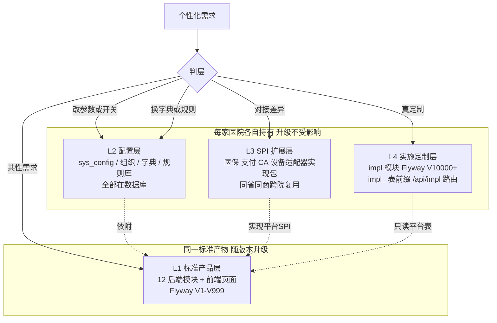
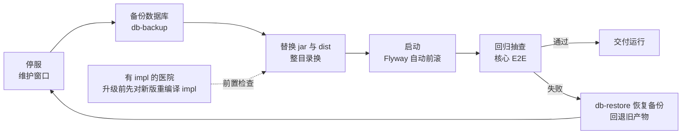
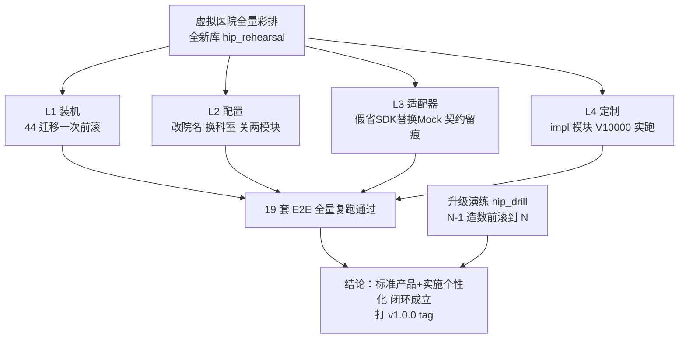

# 第 14 章 产品化与实施方法论

> 本章属第五篇「工程篇」，也是全书的收束。前十三章讲的是"把一套医院信息系统做出来"，
> 本章讲"把它变成可以装进第二家、第三家医院的标准产品"——这是两件难度不同的事。
> 全章依次展开产品化总原则、四层标准化模型、部署形态论证、种子数据与初始化工程、
> 模块开关、实施定制层规约、发布工艺、实施全流程、偏离管理、试点反馈闭环，
> 最后以"虚拟医院全量彩排"作为验收方法论收尾。本章的案例素材大多来自 HIP 从 v14 到 v17
> 四轮规划的真实决策记录——包括"什么时候停止开发功能"这类教科书很少讨论的判断。

## 学习目标

学完本章，你应当能够：

1. 解释单院系统与标准产品的本质差异，说出"配置优先、扩展次之、禁止分叉"的含义与理由；
2. 用四层标准化模型（标准产品层/配置层/SPI 扩展层/实施定制层）为一个具体的个性化需求判层，并说明每层的变更主体与升级影响；
3. 论证县市级医院场景下单院独立部署与多租户 SaaS 的取舍，理解"标准化收益来自同一产物而非共库"这一判断；
4. 设计种子数据的三类分层（平台必需/行业基线/演示数据）与新医院初始化路径，说明为什么历史迁移不能改；
5. 说出实施定制层的隔离要素（代码包名、Flyway 版本段、表前缀、路由前缀、错误码段）及升级兼容底线；
6. 描述语义化版本约定与"停服—备份—换产物—前滚—回归—回滚"的升级工艺，解释 N-1→N 升级演练验证的是什么；
7. 理解需求矩阵逐条应答的工程化方法（自动评审、证据包、偏离表冻结），以及"功能开发边际判断"的依据；
8. 说明虚拟医院全量彩排作为产品化验收手段的设计逻辑：它证明的是路径，而不是功能。

---

## 14.1 从单院系统到标准产品

### 14.1.1 定制化泥潭：行业的老病

医院信息行业有一个流传很广的说法：HIS 厂商"卖一家医院，养一个分支"。每进一家医院，实施团队在标准版上改代码满足院方个性化需求，改完的代码留在该院的"专属版本"里。三五年后，厂商手里有几十个互不兼容的代码分支：新功能要在每个分支重复开发，缺陷要在每个分支重复修复，升级成本高到大多数医院常年停留在多年前的老版本上。这就是**定制化泥潭**——每一次"为客户改代码"在当时都是合理的商业决策，累积起来却摧毁了产品。

软件工程对这个问题的一般解法早有共识：**把变化点从代码里外置出去**。变化点可以外置为配置（参数、开关）、数据（字典、规则库）、接口实现（插件/适配器），实在外置不了的，隔离到边界清晰的扩展区。核心代码对所有客户保持同一份，这是"产品"与"项目集合"的分水岭。

### 14.1.2 总原则：配置优先，扩展次之，禁止分叉

把上述共识落成可执行的纪律，是一条个性化需求的处理优先级：

**改配置 ＞ 换数据 ＞ 实现 SPI ＞ 实施层扩展模块；任何情况下不 fork 平台核心代码。**

这条阶梯的排序依据是**变更成本与升级摩擦**：改配置当场生效、升级零影响；换数据（字典、规则）同样不碰代码；SPI 实现（第 6 章的适配器模式）按省/按供应商做实现包，可跨院复用；实施层扩展要写代码，但被规约限制在隔离区内（14.7）。每往下走一级，交付慢一分、升级摩擦大一分，所以必须自上而下逐级排除——只有上面三级都装不下的"真定制"，才允许落到第四级。

> **案例框 14-1：HIP 的产品化立项决策**
>
> HIP 最初是"面向峨眉山市人民医院的单院系统"。在功能开发接近尾声（v14–v15，见 14.11）后，
> [产品化方案](../产品化方案.md)（v16 立项）把目标改写为：升级为**同级别同类医院（县市级综合医院）可复用的标准产品**，
> 并给出一个等式作为总纲：
>
> **每家医院 = 标准产品（同一构建产物）+ 该院的配置与数据 + 少量实施层扩展。**
>
> 注意措辞的两个细节：一是"同一构建产物"而不是"同一套源码"——所有医院运行的是同一个 jar 与前端 dist，
> 差异不允许在编译期出现；二是"少量实施层扩展"——扩展被预期为少量，多了就说明前三层的机制有缺口，
> 应该反哺产品（把共性需求做进标准层），而不是在扩展层膨胀。
> 已有的第一家医院被重新定位为"产品的第一个实施案例"：它的配置与定制沉淀反过来校准了分层清单。
> 这个"从第 N 个客户反推产品边界"的动作，正是单院系统产品化的标准起手式。

## 14.2 四层标准化模型

### 14.2.1 按变更主体分层

产品化的核心工程问题是：**系统里的每一样东西，归谁改、随什么节奏改？**答案不同的东西必须物理分层，否则变更会互相纠缠。HIP 的四层模型如下（图 14-1）：

| 层 | 内容 | 变更主体 | 变更节奏 |
|---|---|---|---|
| L1 标准产品层 | 12 后端模块 + 前端 65+ 页 + Flyway V1–V999 + 必需种子 | 产品团队 | 随版本发布 |
| L2 配置层 | sys_config（院名/比例/开关）、组织结构、角色菜单、字典、规则库、报表定义 | 实施工程师 | 纯数据，随时改 |
| L3 SPI 扩展层 | InsuranceAdapter / PayAdapter / SignatureAdapter / int_adapter 路由 / ai-service | 地区/供应商实现包 | 按对接项目，跨院复用 |
| L4 实施定制层 | 该院独有的页面/接口/报表，独立 Maven 模块 | 实施项目组 | 随该院需求 |



这个模型不是 HIP 独创——它与 ERP 行业的"标准包 + 客户化配置 + 用户出口（User Exit）"、SaaS 行业的"core + config + extension"是同一思想的不同表述。真正有产品性质差别的是配套纪律：**L2/L3/L4 全部活在数据库和独立模块里，标准产物的替换动不到它们**——这是升级敢做、敢频繁做的结构性前提（14.8）。

### 14.2.2 运行期的判层铁律

分层模型不只约束开发，更约束运行期的问题处置。[多医院部署操作指南](../多医院部署操作指南.md)把它写成一条"每个反馈先判层再动手"的铁律：

**改配置（当场生效）→ 换数据/规则（当场生效）→ 适配器缺陷（改实现包，同省同修）→ 平台缺陷（提产品需求进版本，所有医院受益）→ 真定制（进该院 impl 模块）。禁止为单院改平台核心。**

这条链的价值在最后一句。实施现场最常见的诱惑是"就改两行代码，比走流程快"——而每一次屈服都是向定制化泥潭迈一步。判层铁律把"快"从选项里拿掉，逼所有人回答同一个问题：这个诉求本质上属于哪一层？

## 14.3 单院独立部署 vs 多租户 SaaS

标准产品要服务多家医院，部署形态有两条路线。**多租户 SaaS**：所有医院共用一套运行实例与数据库（按租户隔离数据），厂商集中运维，升级一次全体生效。**单院独立部署**：每家医院一个实例一个库，产物相同、实例独立。互联网行业的直觉偏向前者——运维集中、成本摊薄、版本永远最新。但把县市级公立医院的现实约束逐条摆出来，结论会反转：

1. **数据边界是合规问题而非技术问题**。医院是独立法人，患者诊疗数据的等保定级、审计追责都以院为边界（第 13 章）；共库多租户下"逻辑隔离"在等保测评与院方安全评估面前说服力有限；
2. **部署位置**：医院核心业务系统普遍要求部署在院内网，与医保专线、检验设备、PACS 同网段——"云端集中部署"在很多地市根本不具备网络条件；
3. **故障半径**：HIS 停机是全院性事故，多租户把 N 家医院绑上同一个故障半径；
4. **定制隔离**：L4 定制按院加载，单实例天然隔离；多租户下需要复杂得多的租户级插件机制。

于是 HIP 的形态铁律是：**一院一实例一库，全部医院使用同一个标准发布产物**。关键在认清一点——**标准化的收益来自"同一产物 + 分层配置"，不来自共库**。多院并行管理因此变成一种"车队管理"：实施资料库维护装机登记表（院名｜版本｜配置 JSON｜适配器实现及版本｜impl 模块｜联系人），新版本发布后逐院滚动升级，先升试点院观察再推其余。

独立部署的真正代价不是运维工作量，而是**版本漂移**：各院升级窗口不同步，车队里会同时存在多个版本。管理手段有三：装机登记表让"谁在哪个版本"随时可查；语义化版本（14.8）让"落后多少"可度量；滚动升级策略给漂移设上限——原则上不允许任何医院落后超过一个次版本，否则跨版本升级的迁移前滚与 impl 兼容验证的风险都会叠加。这套做法放弃了 SaaS 的集中运维红利，换来的是每家医院合规自洽、故障独立、升级窗口可各自协商——对县市级公立医院市场，这笔账是划算的。【成稿核对：不同地区对公立医院核心系统上云的政策口径存在差异，成稿时按最新监管文件校订本节表述】

## 14.4 种子数据分层

### 14.4.1 问题：迁移脚本里的"演示患者"

数据库迁移（第 5 章的 Flyway 纪律）管结构，但系统可运行还依赖**种子数据**：菜单、角色、默认参数、基础字典。单院开发期常见的做法是把种子连同演示数据一股脑写进迁移——反正只装这一家。产品化时这就成了雷：新医院装机，库里冒出"张三"测试患者和演示账号；更隐蔽的是行业字典（ICD 简表、示例药品）与平台骨架（菜单树）混在一起，实施工程师分不清哪些能换、哪些不能动。

通用解法是按**数据的归属与生命周期**分类。HIP 的[种子数据分层清单](../种子数据分层清单.md)分三类：

- **A 平台必需**：菜单树与角色绑定、默认参数键、数据元/术语框架——平台骨架，随产品版本演进，留在 Flyway；
- **B 行业基线**：药品/收费项目/ICD 简表、医保对照种子、DRG 简化目录、CDSS 示例规则——让系统"默认可用"，实施时可被院方目录**整表替换**；
- **C 演示数据**：演示患者、演示账号、体检套餐——只进演示环境脚本（`bootstrap-demo.py`），**生产库禁止出现**。

### 14.4.2 历史迁移不改：用路径实现分层

分层清单确定后，一个诱人的做法是回头把 43 个历史迁移里的 B/C 类数据清理出去。HIP 明确不这样做——**历史迁移不改**是 Flyway 纪律的底线（改了校验和，已装机的库会前滚失败）。分层通过**新库初始化路径**实现：

```
Flyway 自动跑（A + B 默认）→ init-hospital.py（院方数据覆盖 B + 组织/账号/开关）→ 不跑 bootstrap-demo（C）
```

> **案例框 14-2：一次种子数据审计**
>
> 产品化一期对全部迁移做了逐个审计，结论写进分层清单：**43 个迁移中不存在 C 类数据**——演示数据从第一天起就走脚本不走迁移，这次审计是确认而非清理；A/B 混排存在但无害，因为 B 类每张表都有明确的覆盖途径（字典走 init 工具 CSV upsert、医保对照走导入接口、DRG 目录官方数据整表替换后 `regroup-all` 重算）。审计还标注了一个边界案例：迁移里种的"内科门诊 + 内科病区 6 床"属于"最小可运行样例"，实施按院方结构补建后，样例保留无害。
> 这个案例框的方法论价值大于结论本身：**产品化改造前先审计存量，把"要改的"与"只需确认的"分开**——很多预想中的重构，审计后发现只需要一条路径约定。审计的另一个产出是把「生产库未运行过 bootstrap-demo（无演示账号）」写进了上线前检查清单（14.9），让纪律变成可勾选的检查项。

## 14.5 医院初始化工程

### 14.5.1 从"点页面"到"跑工具"

新医院开荒的传统方式是实施工程师照着手册在管理页面逐项点击：建科室、建账号、改参数、导字典——两三天的机械劳动，且无法复核"到底配了什么"。工程化的目标是把开荒变成**一份配置文件 + 一次工具执行**：配置文件即实施档案，可评审、可版本管理、可重放。

HIP 的 [init-hospital.py](../../tools/init-hospital.py) 是这个思路的落地：读取一份院配置 JSON（模板 [hospital.example.json](../../tools/init-templates/hospital.example.json)），经平台开放的实施 API 依次完成七步——登录 → 院名与品牌（`hospital_name` 及 `extraConfig` 任意配置键）→ 模块开关 → 科室与病区床位（`type: NURSING` 带 `beds` 数自动建床）→ 业务账号与角色 → 字典 CSV 导入（药品/收费项目/医保对照三个模板）→ **强制更换 admin 口令并用新口令回验**。

三个设计点值得展开：

1. **幂等**：科室/账号按名跳过、字典按编码 upsert、配置覆盖——工具可重复执行，中途失败重跑即可，不需要"断点续传"逻辑。幂等是一切实施工具的第一美德，因为现场执行环境永远比实验室脏；
2. **安全基线内置**：脚本开头即断言 `adminNewPassword` 必填且不等于默认口令——"生产初始化必须更换默认口令"不靠手册提醒，靠工具拒绝执行（第 13 章的口令治理在实施工艺中的落点）；
3. **配置即档案**：执行完的院配置 JSON 存入实施资料库，每院一份——它同时是重装依据、审计依据和 14.3 装机登记表的内容来源。

字典导入接口的**容错与回执**是另一个容易被低估的细节。院方提供的目录 CSV 几乎必然有脏行（缺列、格式错、编码重复），导入接口的正确行为是**逐行校验、坏行拦截、好行入库**，并返回结构化回执（入库数、错误数、错误示例）——init 工具把回执直接打印在执行日志里。产品化 E2E 甚至为此专门造了一条坏行断言"1 入库 1 拦截"：如果一条坏行让整批导入失败，实施工程师将陷入"改一行、重传全量、再撞下一行"的循环；如果坏行被静默吞掉，账实不符要到对照率核查时才暴露。**批量工具的验收标准不是"数据全对时能跑"，而是"数据半对时行为可预期"。**

### 14.5.2 配置手册：让每个键都有出处

工具解决"怎么配"，还需要一册文档回答"有哪些可配、各是什么含义"。HIP 的[配置手册](../配置手册.md)把配置分成两层：**部署配置**（application.yml / 环境变量，起服务前定，如 `HIP_JWT_SECRET`、MLLP 开关、慢接口阈值）与**运行配置**（sys_config 表，管理页随时改、即时生效，24 键分机构品牌/模块开关/医保待遇/业务参数四组）。手册末尾一行纪律比正文更重要：**新增配置键必须随迁移插入默认值、remark 必填、手册同步补一行**——配置项失控的系统里，没人敢改任何参数。

## 14.6 模块开关与品牌配置化

### 14.6.1 功能开关的一般分类

功能开关（Feature Toggle）在业界按用途分为发布开关（灰度新功能）、实验开关（A/B 测试）、运维开关（降级保护）与**授权开关**（按客户购买范围启停功能）。产品化场景的模块开关属最后一类，它有两个特殊要求：粒度是"业务域"而非单个功能点；关闭必须**彻底**——医院没采购 DRG 模块，不能只是菜单上看不见，接口还留在那里可被直接调用（授权边界、等保测评都不允许）。

> **案例框 14-3：ModuleGate 的双路关闭**
>
> HIP 的模块开关以一张集中注册表实现（[ModuleGate.java](../../platform/core/src/main/java/cn/hip/platform/core/config/ModuleGate.java)）：六个可开关域（drg/cdss/insurance/blood/hr/surgery），每个域登记菜单路径与 API 前缀：
>
> ```java
> public static final Map<String, ModuleDef> MODULES = Map.of(
>         "drg",       new ModuleDef("/drg",             List.of("/api/drg")),
>         "insurance", new ModuleDef("/insurance",       List.of("/api/insurance")),
>         "blood",     new ModuleDef("/inpatient/blood", List.of("/api/inpatient/blood")),
>         "surgery",   new ModuleDef("/surgery",         List.of("/api/inpatient/surgeries", "/api/anes")), ...);
> ```
>
> 开关值存 sys_config（`module.<key>.enabled`，缺省视为启用），**双路生效**：登录接口组装菜单树时过滤被停用域的菜单路径（入口消失）；`ModuleGateFilter` 拦截命中前缀的 API 请求直接返回 404——过滤器源码注释里的一句话就是本节论点：「只藏菜单不拦接口是伪关闭」。注意 surgery 域登记了两个 API 前缀（手术 + 麻醉）——注册表模式的好处正在于此：域与路由的对应关系集中在一处声明，而不是散在各控制器的条件注解里。
> 配套的 E2E（[e2e-product1.py](../../tools/e2e-product1.py)）断言了完整闭环：停用后菜单消失且 API 实测 404，恢复后立即回归——"关闭要彻底，恢复要即时"，两头都要验。

### 14.6.2 品牌配置化

比模块开关朴素但同样必要的是品牌参数化：院名、简称、票据抬头、咨询电话全部走 sys_config，登录页、单据打印、患者端联动取值。检验是否配置彻底的方法很简单：初始化工具改一次院名，全端走查一遍看有没有地方还写着老名字——HIP 的彩排（14.12）正是这么验的。

## 14.7 实施定制层规约

### 14.7.1 扩展机制的设计要素

允许实施团队写代码，又要保证升级不被拖住，扩展机制必须在每个可能冲突的维度上划出**命名空间**。通用清单是：代码位置、数据库变更、数据表、对外路由、错误码——每个维度都要回答"扩展用哪段、平台用哪段、越界怎么发现"。

HIP 的 [ADR-0003 实施定制层规约](../adr/ADR-0003-实施定制层规约.md)（ADR 方法见第 4 章）给出全套答案：

| 维度 | 平台段 | 实施段 | 越界防线 |
|---|---|---|---|
| 代码 | 平台模块 | `impl/<hospital>` Maven 模块，包名 `cn.hip.impl.<hospital>.*` | 启动器 `scanBasePackages=cn.hip` 自动装配，无需改平台代码 |
| Flyway | V1–V999 | **V10000+** | 同库合并执行，版本段互不冲突 |
| 表 | 平台表 | 只建 `impl_` 前缀自有表 | **禁止修改平台表结构**（升级兼容底线）；要平台数据就读平台表、写自己的表 |
| 路由 | /api/** | `/api/impl/<hospital>/**`；前端 `/impl/*` 懒加载 | 不改平台页面源码 |
| 错误码 | 平台段 | 20000+ | 避开平台码段 |

两条配套纪律使规约闭环：**标准仓库的根 pom 永远不含任何 impl 模块**——启用 impl 是实施仓库的改动，标准构建产物里没有一行定制代码；**平台升级后先对新版重编译 impl 模块，编译失败即兼容性破裂信号**，先修 impl 再上线——把"升级会不会弄坏定制"从上线后的惊吓变成上线前的编译检查。

### 14.7.2 模板先行

规约要配模板才可执行。`impl/template-hospital` 是一个可编译的最小样例：示例控制器（`/api/impl/template/ping` 与 notes 写读，带权限注解与 20000 段错误码）、V10000 示例迁移（建 `impl_template_note` 表）。实施新院的定制从复制模板开始，改 artifactId 与包名即可——**模板是规约的可执行版本**，没有模板的规约会被每个项目组各自诠释一遍。

## 14.8 发布工艺

### 14.8.1 语义化版本与发布物

多院并行后，"给医院装的是哪个版本"必须有严格答案。业界通行**语义化版本**（Semantic Versioning）约定：`主版本.次版本.修订号`，主版本表破坏性变更、次版本表向后兼容的功能增加、修订号表缺陷修复。HIP 在产品化二期定下 1.0.0 起点，此后试点反馈的小版本走修订号（如 1.0.1，见 14.10）。

发布物的完整性同样是工艺问题。[release.py](../../tools/release.py) 打包的发布目录不止 jar：server jar + 前端 dist + deploy 编排 + CHANGELOG + 八份实施文档（功能清单/部署指南/配置手册/操作手册/培训脚本/两份 ADR 等）+ 六件实施工具（init-hospital/import-patients/备份恢复脚本等）+ CSV 模板目录 + 自动生成的升级说明。逻辑很直接：**实施工程师到现场只应该带一个 zip**——文档与工具跟产物走同一个版本，才不会出现"拿着 1.0 的手册装 1.1 的包"。

发布物里两份小文档值得单独说。**CHANGELOG** 不是流水账：HIP 的 1.0.0 条目除功能范围外，还写明版本纪律（迁移段划分、升级流程指引）与**已知边界**——外部条件项接入点就绪待资质、配套产品项见偏离表。把"这个版本不含什么"写进变更日志，验收与商务沟通就有了统一口径。**升级说明**由打包脚本按版本自动生成，内容是六步操作（停服→备份→换产物→启动前滚→回归抽查→失败恢复回滚）外加一行针对性提醒（有 impl 定制的医院先重编译）——它是升级流水线（14.8.2）的"随箱说明书"，保证任何一个没参与过开发的工程师拿到包就能执行。

### 14.8.2 升级：15 分钟的流水线

四层模型在升级时兑现红利：配置、字典、规则库、impl 段迁移全在数据库里，**产物替换动不到它们**。单院升级因此收敛为一条约 15 分钟的流水线（图 14-2）：



### 14.8.3 升级演练：把"应该没问题"变成"演过一遍"

升级流程写在纸上不算数。HIP 在定版前做了一次脚本化的 **N-1→N 升级演练**：建一个演练库跑上一版（V42）全量迁移并造入业务数据 → 备份 → 换新版产物启动 → Flyway 自动前滚 V43 → 验证旧数据完好、新配置就位、接口正常。演练验证的不是新功能（E2E 早已覆盖），而是**升级工艺本身**：前滚会不会撞上存量数据、备份恢复链路是否真的可用。这与第 10 章的"假适配器验证法"是同一方法论：**对"路径"的验证必须真的走一遍路径，不能用对"点"的验证代替。**

## 14.9 实施全流程

把前述工件串起来，就是单院实施的完整流程。[多医院部署操作指南](../多医院部署操作指南.md)把它定为七步，每家医院重复执行：

1. **装机**：设置 `HIP_JWT_SECRET` 环境变量（必做）→ 建空库启动，Flyway 自动建全部结构与 A/B 种子 → nginx 挂 dist、反代、TLS；
2. **初始化**：填写院配置 JSON → 跑 init-hospital → 配置 JSON 归档；
3. **字典与数据迁移**：药品/收费项目/医保对照 CSV 导入（对照率达标是上线门槛，第 10 章）、存量患者导入（同证件号幂等）、DRG 官方目录整表替换；
4. **接口适配**：先填接口现状调研表（医保/LIS 设备/PACS/CA/支付商与联系人），再按 SPI 逐项对接；未到位的适配器保持 Mock——业务闭环完整可用，条件到位无缝切换（第 6 章的外部条件工程化）；
5. **真定制**（如有）：按 ADR-0003 复制模板开工；
6. **制度化运行**：备份任务计划注册 + 一次恢复演练留档、健康告警阈值核对、医保每日自动对账确认开启（第 13 章）;
7. **培训与试运行**：8 角色真人培训，试运行问题一律进故障工单台账。

流程之外有两个工程细节。其一是**环境分离**：试点/生产用独立的 `pilot` profile（连接串走环境变量、慢接口阈值从 500ms 收紧到 300ms、MLLP 按院启停、日志滚动归档）——开发环境的宽松默认值不允许带进生产。其二是**上线前检查清单**，逐项打勾且多数条目是"实测"而非"确认"：admin 旧口令登录须返回错误码、未采购模块直连 API 实测 404、生产库无演示账号、备份完成过一次恢复演练。**检查清单的每一项都应当是一次可执行的验证动作，而不是一句"已完成"的自我声明。**

实施文档的收尾是一张常见问题速查表，它的组织方式本身就体现分层思想——每个现象的处置都指回对应的层与规约：

| 现象 | 处置指向 | 所属层/规约 |
|---|---|---|
| 启动即失败 | 查 Flyway 日志，确认库空或版本连续；实施段仅允许 V10000+ | L1 迁移纪律 / ADR-0003 |
| 某模块整页消失 | 检查 `module.*.enabled`——可能实施时按未采购关闭 | L2 配置 |
| 医保对账出现差异 | 核对适配器留痕是否符合 ADR-0002 关键字约定 | L3 适配器契约 |
| 升级后 impl 接口报错 | 实施仓库对新版重编译 impl 模块，修兼容后再上线 | L4 定制规约 |

支持工程师照表处置的同时，也在被表训练成按层思考——**好的运维文档是组织结构的教材**。

## 14.10 需求响应与偏离管理

### 14.10.1 矩阵：4062 行的应答义务

政府采购的医院信息化项目，技术需求书动辄数千条参数，投标与验收都要求**逐条应答**：满足/部分满足/不满足（偏离）。这份"参数矩阵"贯穿项目全生命周期——投标时是响应承诺，验收时是核对底稿，扯皮时是仲裁依据。HIP 面对的是 107 个模块、**4062 条参数**的矩阵，其收官过程是一套可复用的方法：

1. **机器初评**：`matrix-autoreview.py` 用规则库对全量条目自动归类初评，人工只抽审存疑主题——4062 条逐条纯人工评审在成本上不成立；
2. **多轮滚动重评**：每完成一批开发就把新能力喂给评审器重跑（初评符合率 74%→78%→80%→81%→83%），矩阵同时反向充当开发排期的输入——待评条目的主题聚类直接生成了后续各期的功能清单；
3. **证据包收口**：终审剩 241 条待人工签认，逐条生成"证据包"再交人工；
4. **偏离表定稿**：`export-deviation.py` 导出四栏响应底稿，冻结为技术偏离表定稿——**冻结**意味着此后的响应口径不再随开发漂移，验收谈判有了稳定文本。

最终口径：模块口径 107 项中软件可推进部分全覆盖（✓≈99、外部条件≈6、服务项 2）；参数口径正偏离/无偏离 3388（83%），其余明确归入部分响应 152、配套产品 210、外部条件 28、非参数 43。注意这个结构：**"不满足"不是一个筐**——属配套产品的（CA、影像后处理、商用知识库）写明"平台接入点已留，参数由所购产品响应"；属外部条件的写明接入点与触发条件。把偏离分类到"谁、在什么条件下补齐"，偏离表才从扣分项清单变成实施路线图。

> **案例框 14-4：证据包——AI 辅助签认的形态**
>
> 241 条待签认逐条人工从零判断仍然太贵。HIP 的做法是先机器生成证据包（[matrix-evidence.py](../../tools/matrix-evidence.py)）：一组带优先级的规则，每条规则是**三元组（正则模式，建议结论，证据/理由）**，例如：
>
> ```python
> (r'折旧', '功能等效', '资产直线折旧/净值/价值调整/折旧明细（/hrp/assets，as_value_adjust）'),
> (r'耐药|ESBL|MDR|…', '部分响应', '院感专项已备：三管千日率/现患率一键调查/报卡闭环；
>    耐药谱与手卫生依从率需检验微生物数据源，属专业院感监测软件深化'),
> ```
>
> 输出是每条参数的「建议结论 + 指向具体功能页/表/错误码的证据指认」，规则命中不了的保持"真待议"交人工裁决。这个设计的要点有三：**结论必须带证据**（指认到 `/hrp/assets` 页和 `as_value_adjust` 表，签认者可当场核验，而不是信一句"已支持"）；**机器只建议、人只签认**——签字责任不可自动化，自动化的是把 241 条的判断成本压成几十条真待议 + 两百条核验；**规则库即口径档案**——为什么某类参数归配套产品，理由就写在规则里，半年后复盘有据可查。
>
> 与之配套的是 152 条部分响应的**成本筛选**（[部分响应筛选](../验收/部分响应筛选.md)）：逐条评估补全成本，挑出 8 条"一句话缺口"（如排班加上/下周快捷切换、审方队列上限键）排入定版后的第一个小版本 1.0.1，其余 144 条按成本因由归类维持部分响应——**不硬刷条目数**。且这 8 条快赢明确不进 1.0 冻结窗，保证彩排与打 tag 时产物稳定：响应率的每一个百分点都要用交付质量去换，换不起就诚实写偏离。

## 14.11 试点运行与反馈闭环

### 14.11.1 功能开发的边际判断

产品开发最难的决定之一是**停下来**。需求矩阵永远填不满，判断依据不应是"还有多少条没做"，而是**新增开发对真实覆盖的边际贡献**。HIP 在 v14 的决策记录是一个可引用的范本：当时剩余 532 条待评参数，团队没有直接排期，而是先做了主题聚类与抽样审读，发现其中 515 条是"既有模块的一句话变体"（如「输入床号换床」≈已有的转科换床）、平台型产品参数或外部能力，遂写下结论：**"继续新增功能已无法有效提升真实覆盖，刷条目数只会稀释质量。"** 此后 v15–v17 三轮规划的主要产出不再是功能，而是"签认结论、可上线的部署、运行中的反馈闭环"。

边际判断的信号可以一般化：新需求大多是既有能力的措辞变体；剩余条目集中在配套产品与外部条件；继续开发挤占的恰恰是硬化（安全基线、备份、演练）与工艺（初始化、发布）的工时——而后者才是上线真正缺的东西。

### 14.11.2 小版本模式与外部条件排队

试点期的开发形态随之切换为**小版本模式**：问题一律进运维故障工单台账（第 13 章）→ 分级 → 按需开小版本修复——**不预设功能期**，让真实运行反馈驱动排期，而不是让排期去猜。同时维护一张**外部条件排队表**：与采购方逐项确认省医保 SDK、CHS-DRG 官方目录、商用知识库、CA、微信资质等的可获得性，技术侧接入点全部先行就绪（第 6、10 章），行政侧申请最早启动——"到位即接"。定版后的开发被明确收敛为两种形态：**版本迭代**（进标准产品，所有医院受益）与 **impl 定制**（进单院隔离区），除此之外没有第三种写代码的理由——这正是 14.2 判层铁律在时间维度上的延伸。

## 14.12 验收方法论：虚拟医院全量彩排

### 14.12.1 为什么需要一次"假实施"

产品化的各项机制——种子分层、初始化工具、模块开关、impl 规约、适配器替换——每项都有各自的测试。但"能装进第二家医院"是这些机制**组合作用**的结论，组合的缝隙恰恰是单项测试照不到的地方：init 工具在 impl 迁移段存在时还幂等吗？关掉的模块会不会被某个 E2E 隐式依赖？替换了医保适配器，对账还认得留痕吗？回答组合问题的通用方法只有一个：**端到端彩排**——完整执行一次真实流程的全部步骤，只是对象是假的。飞行员用模拟机、灾备用演练，产品化用虚拟医院。

> **案例框 14-5：HIP 1.0.0 定版前的全量彩排**
>
> 彩排在一个全新库（hip_rehearsal）上执行完整实施流程，逐项对应产品化机制（提交 5f51a80，2026-08-07）：
>
> - **装机**：44 个迁移（V1–V43 平台段 + V10000 实施段）一次前滚成功——验证平台段与实施段在同库合并执行互不冲突；
> - **初始化**：init-hospital 改院名为「彩排第二医院」、建不同的科室结构——验证品牌与组织的全联动；
> - **模块开关**：关闭 blood/surgery 两域，逐一实测 API 404 后恢复——验证授权边界真实生效；
> - **实施定制**：impl 模板模块挂载实跑（ping 接口 + notes 表写读）——验证 V10000 段迁移与 `/api/impl/*` 路由的完整链路；
> - **适配器替换**：假省 SDK 医保适配器（[FakeSdkInsuranceAdapter.java](../../impl/template-hospital/src/main/java/cn/hip/impl/template/insurance/FakeSdkInsuranceAdapter.java)）以 `@Primary` 替换 Mock，严格履行 ADR-0002 契约——彩排产生 20 条 fake-sdk 留痕、YBSDK 前缀结算号正确回填业务表，**医保业务与对账对实现替换零感知**（第 10 章假适配器验证法的实施侧闭环）；
> - **全量回归**：**19 套 E2E 在彩排实例上全部通过**——这是彩排的判定条件：标准测试资产不加修改地在"另一家医院"上通过。
>
> 彩排通过后打 v1.0.0 tag。两个收尾细节体现纪律：彩排为挂载 impl 临时改过的根 pom **已还原**——标准仓库保持不含任何 impl 模块（ADR-0003 底线）；彩排中发现两个 E2E 脚本隐式依赖默认院名/取列表首行，当场改为参数化语义与唯一名回查——**彩排修的往往不是产品，而是测试资产里潜伏的"单院假设"**，这类假设不彩排永远发现不了。

### 14.12.2 彩排证明了什么

图 14-3 概括彩排的验证矩阵——它的对象是四层模型的每一层机制及其组合：



要点在于分清彩排证明与不证明的东西：它**不证明**功能正确——那是 55 个单元测试与 19 套 E2E 平时的职责；它证明的是**路径**——"标准产物 + 分层配置 + 隔离定制"这条实施路径端到端走得通，且走完之后标准测试资产原样可用。对产品化而言这恰是最该验收的命题：功能是资产，**可复制的实施路径才是产品**。定版由此获得含义：1.0.0 不是"功能做完了"的里程碑，而是"复制路径被证明了"的里程碑。

---

## 本章小结

- 单院系统产品化的总原则是**配置优先、扩展次之、禁止分叉**：个性化需求按"改配置＞换数据＞实现 SPI＞实施层扩展"逐级排除，任何情况下不 fork 核心；每家医院 = 同一构建产物 + 该院配置数据 + 少量隔离定制。
- **四层标准化模型**按变更主体分层：标准产品层随版本发布，配置层/SPI 层/定制层全部活在数据库与独立模块里——产物替换动不到它们，是升级敢做的结构性前提。运行期配套"先判层再动手"的处置铁律。
- 县市级医院场景选择**单院独立部署**而非多租户 SaaS：法人数据边界、院内网形态、故障半径都指向单实例；标准化收益来自同一产物，不来自共库。多院并行是"车队管理"：装机登记表 + 逐院滚动升级。
- 种子数据分**平台必需/行业基线/演示数据**三类；历史迁移不改，分层靠"新库初始化路径"实现：Flyway 照跑、init 工具覆盖行业基线、演示脚本生产禁跑。
- 初始化工程的三美德：**幂等**（现场可重跑）、**安全基线内置**（工具拒绝默认口令）、**配置即档案**（院配置 JSON 归档）。模块开关必须**双路关闭**——只藏菜单不拦接口是伪关闭。
- 实施定制层靠全维度命名空间隔离（impl 模块/V10000+ 段/impl_ 表前缀//api/impl 路由/20000+ 错误码），底线是禁改平台表结构；"升级后 impl 编译失败即兼容性破裂信号"把兼容检查前移到编译期。
- 发布工艺 = 语义化版本 + 完整发布物（文档工具随产物同版）+ 15 分钟升级流水线（停服→备份→换产物→前滚→回归→失败回滚）；升级工艺本身要用 **N-1→N 演练**验证。
- 需求矩阵的收官方法：机器初评滚动重评 → **证据包**辅助签认（结论必须带证据，机器建议、人签认）→ 偏离分类到"谁在什么条件下补齐" → 定稿冻结。部分响应按补全成本筛选，快赢进小版本，不硬刷响应率。
- 功能开发要做**边际判断**：当新需求多为既有能力的措辞变体时果断收束，转入"小版本 + 外部条件排队"的试点节奏；定版后只剩版本迭代与 impl 定制两种开发形态。
- **虚拟医院全量彩排**是产品化的验收方法：在全新实例上完整执行实施路径（装机/初始化/关模块/换字典/impl 实跑/适配器替换），以"全量 E2E 原样通过"为判定条件——它验收的是可复制的路径，而非功能本身。

## 思考与练习

1. **概念**：解释"配置优先、扩展次之、禁止分叉"中每一级的含义，并说明为什么排序依据是升级摩擦而不是开发工作量。举一个看似该改代码、实际应落在配置层的医院个性化需求。
2. **判层**：某医院提出四个需求：① 门诊统筹比例按当地政策调整；② 检验结果对接本院已有的 X 品牌生化仪；③ 增加一张该院独有的"院领导每日晨会报表"；④ 住院押金不足时希望系统允许"欠费医嘱"继续执行（平台当前拦截）。用四层模型逐个判层，说明理由；其中哪个应当反哺标准产品层、走什么流程？
3. **设计**：为一个规划中的区域检验集中化系统论证部署形态：多家乡镇卫生院 + 一家县医院共用检验中心。单实例与多租户的论证条件与本章 14.3 有何不同？给出你的结论与关键假设。
4. **排障**：某医院升级到新版本后，实施工程师报告"定制的报表接口全部 500"。按 ADR-0003 的规约与升级流程，列出排查顺序，并指出最可能被跳过的那个升级前置步骤。
5. **设计**：参照 14.5，为"病区搬迁"（某病区整体迁往新楼，科室代码不变、床位重新编号）设计一个幂等的实施工具：写出输入配置结构、执行步骤与幂等策略，并说明哪些动作必须拒绝自动化、留给人工确认。
6. **论述**：14.10 的证据包方法把机器放在"建议"位、人放在"签认"位。论述在验收场景下这样分工的必要性；如果直接让模型输出最终结论并自动填表，会在工程与责任两个层面引入什么风险？
7. **论述**：14.11 引用的边际判断依据是"新增开发无法有效提升真实覆盖"。有观点认为投标场景下响应率每高一个百分点都有商务价值，应当继续刷条目。结合偏离表的分类口径（部分响应/配套产品/外部条件）与 1.0.1 快赢包的取舍，评析这两种立场，给出你的裁决标准。
8. **实践**（配套实训环境）：完成一次微型彩排：建全新库，用 init-hospital 初始化一家"实验医院"（不同院名、关闭 hr 模块），复制 impl 模板为 impl/lab-hospital（改包名与路由前缀），执行 V10000 段迁移并实测定制接口；随后跑 e2e-product1 与 e2e-outpatient 两套回归。记录全过程发现的"单院假设"（如有），并按 14.12 的口径写一段彩排结论。
