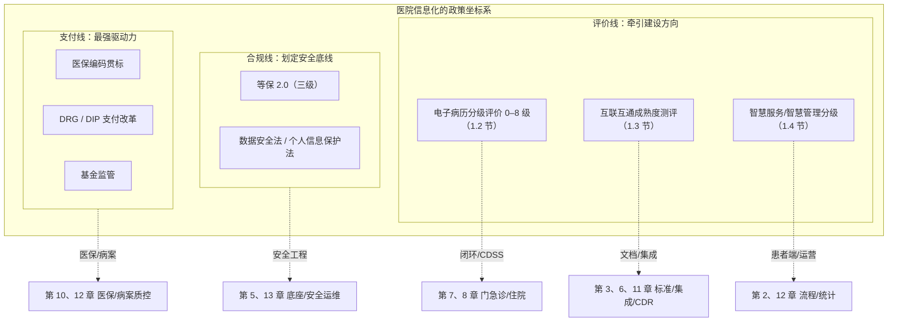
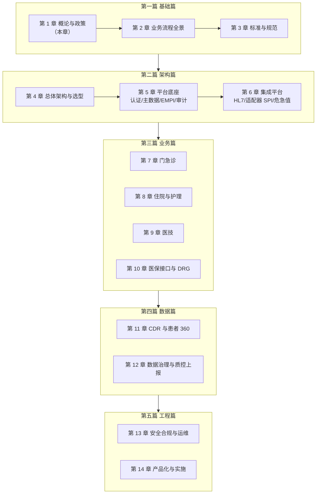

# 第 1 章 医院信息化概论与政策环境

> 本章属第一篇「基础篇」，是全书的起点。医院信息化是一个被政策深度塑造的工程领域——不理解评价体系与合规要求，就无法理解医院信息系统为什么长成今天这个样子，也无法理解一份采购需求里为什么会出现那些条目。
> 本章先梳理三十余年演进的内在逻辑，再逐一拆解三大评价体系（电子病历分级评价、互联互通测评、智慧服务与智慧管理评估）与两条硬约束线（安全合规、医保支付），
> 最后引出贯穿全书的案例平台 HIP，给出全书的阅读地图。后续各章会反复引用本章建立的政策坐标系。

## 学习目标

学完本章，你应当能够：

1. 概述医院信息化三次浪潮的内容与各自的驱动力，解释"叠加而非替代"的演进特征；
2. 说出电子病历系统应用水平分级评价的框架（0–8 级）与 4 级的标志性要求，理解"评级要求如何变成系统需求清单"；
3. 区分互联互通标准化成熟度测评与分级评价的定位差异，说出测评考察的主要板块与四级甲等的技术要点；
4. 描述"三位一体"智慧医院的评价格局（电子病历 / 智慧服务 / 智慧管理）；
5. 列出医院信息系统面临的核心合规要求（等保三级、数据安全法、个人信息保护法）及其在系统设计上的落点；
6. 解释医保支付改革（贯标、DRG/DIP、基金监管）为什么是当前医院信息化最强的驱动力；
7. 比较自研、外购、混合三种建设模式的适用条件，说出信创趋势对技术选型的影响；
8. 描绘 HIP 案例平台的整体结构（十域 55 功能页），知道全书各章与平台各部分的对应关系。

---

## 1.1 医院信息化的演进：三次浪潮

### 1.1.1 为什么从收费开始

医院是业务流、资金流、物流耦合最紧密的组织之一：一张处方同时是医疗行为记录（业务流）、收费依据（资金流）和药品出库指令（物流）。信息化从哪一端切入，取决于哪一端的痛最急、账最清楚。

答案在所有国家几乎一致：**从钱开始**。二十世纪九十年代，我国医院信息化的第一批系统是财务电算化与"划价收费"系统——挂号、划价、收费、发药、药库进销存。这一代系统被后人称为"以收费为中心的 HIS"，其原始驱动力是**财务管理**：手工划价慢且错漏多、日结对账靠算盘、药品跑冒滴漏无从追查。信息系统首先解决的是"钱和药算得清"的问题。原卫生部在这一时期组织的信息化推进工程与《医院信息系统基本功能规范》为第一代 HIS 提供了官方框架【成稿核对：工程名称（"金卫工程"）与《医院信息系统基本功能规范》发布年份（2002 年版）】。

不要轻视这一代系统。它完成了两件影响深远的事：其一，把医院最核心的主数据（药品目录、收费项目、科室人员）第一次数字化；其二，确立了"收费主线"这条至今仍是一切 HIS 骨架的业务链——挂号→开单→收费→执行→发药。本书第 2 章讲医院业务流程、第 7 章讲门急诊系统时，你会看到这条主线仍然是系统设计的中轴。

### 1.1.2 第二次浪潮：临床信息化

进入二十一世纪，矛盾转移了。收费系统里只有"项目和金额"，没有"病情和过程"——医生开了什么药系统知道，为什么开、患者对什么过敏、检验结果是多少，系统一无所知。**医疗质量与安全**成为第二次浪潮的驱动力，信息化的口号从"以收费为中心"转向"以患者（临床）为中心"。

这一时期建设的主角是临床系统家族：电子病历（EMR）、检验信息系统（LIS）、医学影像存档与传输系统（PACS/RIS）、医生工作站与护士工作站、移动护理、手术麻醉、重症监护。与第一代系统"一套软件包打天下"不同，临床系统天然多源——检验、影像、病理各有专业厂商，设备各有接口协议，"系统孤岛"问题由此埋下（第 6 章集成平台所要解决的问题域，正是这一时期形成的）。

临床信息化的制度化标志是**电子病历系统应用水平分级评价**的建立（1.2 节详述）：政府第一次用一把统一的尺子度量医院临床信息化的深度，并将其与医院等级评审挂钩。评价指挥棒使临床信息化从"先进医院的自选动作"变成"所有医院的规定动作"。

### 1.1.3 第三次浪潮：平台化与数据驱动

第三次浪潮大约始于 2010 年代中后期，至今仍在进行。它有三个相互交织的主题：

**平台化整合**。孤岛系统的代价在这一阶段集中爆发：一个患者的数据散落在十几个系统里，调阅要开十几个窗口，上报要人工汇总。解法是集成平台 + 临床数据中心（CDR）：用标准化的消息与文档把各系统连起来，把临床数据汇聚到独立的数据中心供调阅、质控、上报与科研（第 6 章、第 11 章）。国家层面的**互联互通标准化成熟度测评**（1.3 节）正是这一方向的指挥棒。

**数据驱动的管理与支付**。数据不再只是业务的副产品，而成为管理与结算的直接依据：DRG/DIP 医保支付按病案数据付费（第 10 章），公立医院绩效考核按上报指标排名，医保基金监管用大数据筛查违规。**数据质量第一次直接等于钱**——这是第三次浪潮最深刻的变化，它把信息化的压力从信息科传导到了病案室、临床科室和院长办公会。

**智慧医院与互联网+**。面向患者的服务（预约、缴费、报告查询、互联网诊疗）与面向管理的智慧运营被纳入评价体系（1.4 节），信息化的服务对象从院内工作人员扩展到患者和管理者。

### 1.1.4 演进的内在逻辑

把三次浪潮放在一起看（图 1-1），有三条规律值得记住：

1. **驱动力一路从"院内管理"走向"外部约束"**：财务管理是院内需求，医疗质量一半靠评价指挥棒，医保支付则完全是外部规则——医院信息化越来越像一场"应试"，读懂考纲（政策）成了做系统的前提。
2. **浪潮是叠加而非替代**。第三次浪潮并没有淘汰收费主线和临床系统，而是在其上加盖平台层与数据层。今天任何一家医院的系统截面里，三代建设成果同时在运行——这也是医院信息系统复杂性的来源：你面对的不是一个时代的产物，而是三十年地层的堆积。
3. **数据的角色一路升格**：从记账凭证（第一代），到临床记录（第二代），到生产要素与结算依据（第三代）。相应地，对数据的要求从"算得对"到"记得全"再到"标准化、可交换、经得起稽核"。

本章余下部分讲的政策环境，可以归纳为三条线（图 1-2）：**评价线**牵引建设方向（1.2–1.4），**合规线**划定安全底线（1.5），**支付线**提供最强驱动（1.6）。三条线共同构成医院信息化的"考纲"。

---

## 1.2 电子病历系统应用水平分级评价

### 1.2.1 定位：度量临床信息化的深度

电子病历系统应用水平分级评价（业内简称"分级评价"或"电子病历评级"）由国家卫生健康委医政部门主导，评的是**临床信息化应用的深度**：不是"买没买系统"，而是"系统在临床工作中被真实使用到什么程度"。评价制度于 2011 年建立试行，2018 年发布修订版评价标准并要求全国二级以上医院全员参评【成稿核对：2011 年试行文件与 2018 年《电子病历系统应用水平分级评价管理办法（试行）》及标准的文号；"到 2020 年三级医院达到 4 级以上、二级医院达到 3 级以上"的目标出处】。

三大评价体系中，分级评价对医院信息系统**功能建设**的牵引最直接——它逐条规定了医嘱、病历、检验检查、用药等环节应达到的电子化与智能化水平，是 HIS/EMR 采购需求最主要的政策来源。

### 1.2.2 分级框架：0–8 级

分级评价满分为 8 级，从 0 到 8 共九个等级，刻画从"无电子病历"到"数据整合与持续改进"的完整阶梯：

| 级别 | 主题（概括） |
|---|---|
| 0 级 | 未形成电子病历系统 |
| 1 级 | 独立医疗信息系统建立 |
| 2 级 | 医疗信息部门内部交换 |
| 3 级 | 部门间数据交换 |
| 4 级 | 全院信息共享，初级医疗决策支持 |
| 5 级 | 统一数据管理，中级医疗决策支持 |
| 6 级 | 全流程医疗数据闭环管理，高级医疗决策支持 |
| 7 级 | 医疗安全质量管控，区域医疗信息共享 |
| 8 级 | 健康信息整合，医疗安全质量持续提升 |

【成稿核对：各级主题表述以 2018 版评价标准原文为准】

读这张阶梯要抓住两条主线的递进：

- **共享范围**：单系统 → 部门内 → 部门间 → 全院 → 区域。这条线与互联互通测评（1.3）在方向上重叠，但分级评价关心的是"临床用起来了没有"；
- **智能程度**：无 → 初级决策支持（如药品剂量提示）→ 中级（如基于知识库的用药审查）→ 高级（如闭环管理中的自动拦截与质量管控）。

评价方法上，分级评价按临床工作角色划分若干评价项目（如病房医嘱处理、检查检验报告、药品配置等），每个项目分别评"电子病历系统功能状态"与"有效应用比例"——功能有但没人用，不得分。总分之外还有"基本项目"约束：申报某级别必须满足该级别全部基本项目，防止靠长板凑分【成稿核对：角色与项目数量（2018 版为 10 类角色 39 个评价项目）及基本项/选择项规则】。"有效应用比例"这个设计值得注意：它使得评级材料必须来自生产系统的真实运行数据，从制度上排除了"为评级搭演示系统"的做法。

### 1.2.3 4 级：多数医院的第一道坎

4 级（全院信息共享，初级医疗决策支持）是政策要求二级以上医院普遍达到的水平，也是系统建设含金量的分水岭。它的两个关键词各自对应一组硬性的系统能力：

**全院信息共享**：医生站能看到检验、检查、用药、护理的全部结果；数据在挂号、收费、药房、医技之间自动流转而非人工转录。这意味着全院系统必须打通——要么一体化平台，要么集成平台把异构系统连起来（第 6 章）。

**初级医疗决策支持**：系统在关键环节给出自动提示——药品剂量与相互作用审查、危急值提醒、过敏警示。这意味着必须有结构化的字典与规则库支撑（第 7 章合理用药五重拦截即为此类能力的完整案例）。

再往上，5 级要求全院统一的数据管理与更强的知识库支持，6 级要求**全流程闭环管理**——医嘱从开立、审核、执行到结果反馈的每个环节都被系统记录且可追溯，任何一环缺失即闭环断裂（第 8 章的医嘱执行、第 9 章的标本流转状态机，都是闭环建模的具体形态）。

### 1.2.4 评级要求如何变成需求清单

对工程师，分级评价最实用的读法是把它当作**需求清单的生成器**。以"危急值闭环"这一典型评价内容为例，一条评价要求展开后是这样一串系统需求：

| 评价要求（概括） | 展开的系统需求 | 本书章节 |
|---|---|---|
| 检验危急值及时提醒与处理 | LIS 判定危急值（HH/LL 界值维护）→ 自动推送医生站 → 医生确认与处理记录 → 超时升级 → 全程留痕可查 | 第 6、9 章 |
| 用药决策支持 | 药品知识库、过敏/相互作用/剂量规则、开单环节实时拦截、拦截记录 | 第 7 章 |
| 医嘱闭环 | 医嘱状态机、执行扣库存、执行人与时间留痕、未执行拦截出院 | 第 8 章 |
| 病历质量管控 | 时限质控、环节质控、签名与版本冻结 | 第 8、12 章 |

医院申报评级前的"差距分析"，本质上就是拿评价标准逐条对照现有系统生成这样一张表——这也是信息科向院领导要预算时最有力的语言。反过来，厂商的产品规划也围绕评价条款展开：**评价标准是这个行业事实上的公共需求规格说明书**。

---

## 1.3 医院信息互联互通标准化成熟度测评

### 1.3.1 定位：度量"连接"的标准化程度

互联互通标准化成熟度测评（业内简称"互联互通测评"）由国家卫生健康委统计信息中心组织，评的是**医院信息平台建设与数据交换的标准化程度**。与分级评价"评临床应用深度"不同，互联互通测评回答的问题是："你的数据是否按国家标准组织？你的系统之间、你与外部（区域平台）之间，是否通过标准化的服务交换数据？"

两者的关系可以概括为**一纵一横**：分级评价纵向钻临床业务的深度，互联互通横向查数据交换的宽度与规范度。一家医院通常两个都要考，且建设内容大量复用——按标准建的临床数据中心，既是互联互通的核心考点，也是分级评价高级别的基础设施。

### 1.3.2 测评框架

互联互通测评的等级从低到高为：一级、二级、三级、四级乙等、四级甲等、五级乙等、五级甲等，共七档【成稿核对：等级划分与各级要求以现行《医院信息互联互通标准化成熟度测评方案》为准】。**四级甲等**是多数大中型医院的现实目标，五级乙等及以上目前仅少数头部医院达到。

测评内容分四大板块：

1. **数据资源标准化建设**：医院数据是否对齐国家卫生信息标准——数据元与值域代码（WS 363/364/365 系列）、电子病历共享文档（WS/T 500 系列 CDA 文档）。通俗地说：你的"性别"字段是不是用国家标准代码，你的出院小结能不能导出成标准 CDA 文档。这部分的技术细节在第 3 章（标准与规范）展开，工程落地在第 11 章（CDA 文档生成）；
2. **互联互通标准化建设**：基于信息平台的标准化交互服务——文档注册与调阅、术语与字典服务、患者主索引服务等。文档注册/调阅正是第 11 章临床数据中心的核心功能；
3. **基础设施建设**：信息平台、硬件、网络与信息安全（与等保要求呼应，见 1.5 节与第 13 章）；
4. **互联互通应用效果**：平台是否真实支撑业务——联通的业务系统数量、与区域平台的对接、面向患者与医务人员的应用。

四级甲等的技术要点可以概括为：**建成基于标准的医院信息平台，实现一定数量的标准共享文档与标准服务，主要业务系统通过平台交换数据，并与外部（区域/上级平台)实现联通**【成稿核对：四级甲等对共享文档类数、交互服务数、联通系统数的具体量化要求】。

### 1.3.3 对系统建设的实际牵引

互联互通测评对建设的牵引集中在三处，也是实施中最常见的三类改造：

- **数据标准化改造**：字典对齐国家值域代码、关键表补齐标准数据元——对老系统这是伤筋动骨的工程，对新建系统则应"标准内建"（第 3 章讨论这两种策略的成本差异，HIP 采用后者）；
- **平台与文档服务建设**：建集成平台与 CDR，业务数据生成标准 CDA 文档并提供注册、检索、调阅服务（第 6 章、第 11 章）；
- **留痕与可验证性**：测评要求交互服务可实测、报文可查验——集成平台的出入站留痕（第 6 章）在这里第二次兑现价值（第一次是排障，第三次是医保对账，见第 10 章）。

一个务实的提醒：互联互通测评以"平台"为中心的框架，隐含假设是医院存在多个异构系统需要集成。对采用一体化平台的中小医院，数据天然在一个库里，"互联互通"的重点就从"连接改造"转移为"标准表达"——按标准输出文档与服务。HIP 的定位正属后者，这也是第 3 章"标准内建"路线的政策注脚。

---

## 1.4 智慧服务与智慧管理分级评估

### 1.4.1 "三位一体"的智慧医院评价格局

2019 年起，国家卫生健康委在电子病历分级评价之外陆续建立**医院智慧服务分级评估**（面向患者的服务能力，0–5 级）与**医院智慧管理分级评估**（面向医院运营管理，0–5 级），与电子病历评级共同构成"三位一体"的智慧医院评价体系【成稿核对：智慧服务评估标准发布时间（2019 年）与智慧管理评估标准发布时间（2021 年）及文号】。三者分工明确：

| 评价体系 | 面向 | 级别 | 关键词 |
|---|---|---|---|
| 电子病历分级评价 | 医务人员（临床） | 0–8 级 | 病历、医嘱、闭环、决策支持 |
| 智慧服务分级评估 | 患者 | 0–5 级 | 预约、缴费、报告、全程服务 |
| 智慧管理分级评估 | 管理者（运营） | 0–5 级 | 人财物、绩效、决策分析 |

### 1.4.2 智慧服务：患者视角的评价

智慧服务评估围绕患者就医旅程展开：诊前（预约、导诊）、诊中（signage 导航、移动缴费、信息推送）、诊后（报告查询、随访、药品配送）以及全程的基础与安全要求【成稿核对：评估项目的类别划分与数量】。它把第三次浪潮的"互联网+医疗"从可选项变成了评价项——患者端 H5/小程序、线上支付、电子发票、报告线上查询等能力由此进入采购需求。HIP 的患者端（/portal：预约挂号、待缴费支付、报告查询与分享短链，见第 2 章患者旅程与功能清单第九域）即是对这组要求的最小完整响应。

### 1.4.3 智慧管理：运营视角的评价

智慧管理评估覆盖医疗护理管理、人财物资源管理、运营决策分析等维度，牵引的是 HRP（医院资源计划：财务、人事、物资、设备、固定资产）与运营数据分析类系统的建设（HIP 第四域"运营管理"七个功能页、第 12 章运营分析）。与公立医院绩效考核（"国考"）的指标上报要求叠加，智慧管理评估使运营数据的系统化采集从"财务科的内部事务"上升为全院工程。

对三大评价体系做一个工程视角的总结：**分级评价定义了临床系统的功能深度，互联互通定义了数据的标准化与连接方式，智慧服务/管理定义了服务与运营的覆盖面**。三者相加，几乎就是一份完整的医院信息化建设总纲——这也是为什么本书的业务篇（第 7–10 章）、数据篇（第 11–12 章）的内容组织，处处能找到对应的评价条款。

---

## 1.5 网络安全与数据合规

### 1.5.1 等级保护：安全建设的基线框架

网络安全等级保护制度（"等保"）是我国网络安全的基本制度，《网络安全法》（2017 年施行）确立其法律地位；2019 年发布的 GB/T 22239-2019《网络安全等级保护基本要求》标志等保进入 2.0 时代。等保将信息系统按重要程度与破坏后果定为一至五级，级别越高要求越严。

医院的核心业务系统（HIS、EMR 等承载诊疗与患者数据的系统）**普遍定为第三级**——三级意味着系统破坏会对社会秩序与公共利益造成严重损害，须落实"一个中心、三重防护"（安全管理中心，安全通信网络、安全区域边界、安全计算环境）的技术要求，并定期开展等级测评【成稿核对：三级系统测评频率（现行要求为每年一次）】。

对系统建设者，等保三级不是一份抽象的合规文件，而是一张可以逐条核对的工程清单。典型条款到工程落点的映射：

| 等保要求（概括） | 工程落点 | 本书章节 |
|---|---|---|
| 身份鉴别、访问控制 | 认证与 RBAC 权限、密码复杂度策略、登录失败锁定 | 第 5 章 |
| 安全审计 | 写操作全量审计日志、敏感操作留痕、日志防篡改 | 第 5、13 章 |
| 数据保密性/完整性 | 传输加密（HTTPS）、密钥外置管理、敏感字段处理 | 第 13 章 |
| 数据备份恢复 | 每日备份任务化、恢复演练留档、备份时效监控 | 第 13 章 |
| 通信与边界防护 | 网络分区、端口最小开放、反向代理 | 第 13 章 |

第 13 章将完整展开"从条款到清单"的工程化方法。这里先立一个原则：**合规能力必须内建于产品，而不是实施时补贴膏药**——审计、脱敏、密码策略这类能力，事后加装的成本与风险都远高于设计期内建（HIP 的"安全合规内建"设计原则即源于此）。

### 1.5.2 数据安全法与个人信息保护法

2021 年施行的《数据安全法》（9 月 1 日）与《个人信息保护法》（11 月 1 日）把数据处理从"安全问题"上升为"法律责任"。对医院数据处理，框架性的要求如下：

**数据安全法**要求数据分类分级管理、重要数据保护、数据处理全流程的安全制度。医疗数据体量大、敏感度高，是各行业数据分类分级实践的重点领域【成稿核对：卫生健康行业数据分类分级的行业标准/指南名称与状态】。

**个人信息保护法**与医院关系更直接：**医疗健康信息被明确列为敏感个人信息**，处理须具备特定目的和充分必要性，并取得个人**单独同意**；同时确立最小必要原则、公开透明原则，以及去标识化/匿名化的法律区分（去标识化后仍是个人信息，匿名化后才脱离个保法约束）。此外《民法典》将隐私权与个人信息保护写入人格权编，《基本医疗卫生与健康促进法》亦有患者隐私保护条款——医院泄露患者信息面临的是多部法律的叠加责任。

这些法条落到系统设计，形成一组具体的设计约束（第 13 章详述工程实现）：

- **按角色脱敏**：身份证号、联系方式等敏感字段默认脱敏展示，仅特定角色可见明文（HIP 的 EMPI 即按此设计，见第 5 章）；
- **最小必要的数据流出**：对外分享必须匿名化、脱敏、限时（HIP 患者端的报告分享短链是一个完整案例：匿名访问 + 脱敏内容 + 限时失效，见第 13 章）；
- **审计可追溯**：谁在何时看过、改过哪个患者的什么数据，全量留痕——这既是等保要求，也是发生泄露事件时的举证基础；
- **面向患者的知情同意**：患者端注册、数据使用授权的交互设计要能支撑"单独同意"的合规要求。

合规线的完整工程化——从法条到清单到代码——是第 13 章的主题；本节建立的框架（等保定基线、两法定责任、条款落设计）会在那里逐项兑现【成稿核对：《网络数据安全管理条例》施行时间（2025 年 1 月 1 日）及其对医疗数据处理的补充要求，视篇幅决定是否纳入】。

---

## 1.6 医保支付改革：当前最强的驱动力

### 1.6.1 为什么是医保

评价体系讲的是"荣誉与达标"，医保讲的是**钱**。公立医院收入中医保基金占比高，医保规则的任何变化都直接改变医院的收入函数——这使医保成为当前医院信息化最强、最不容讨价还价的驱动力。近年的医保改革沿三条线推进，每条线都对应一组信息化的硬需求：

**第一条线：编码贯标**。国家医保局自 2019 年起推行医保信息业务编码标准（药品、诊疗项目、耗材等 15 项编码）的统一贯标，并建设全国统一的医保信息平台。对医院系统，贯标意味着院内字典必须与国家医保编码建立完整映射（目录对照），医保接口按全国统一规范（各省 SDK 形态落地）改造——第 3 章讲编码标准，第 10 章讲目录对照与省 SDK 适配的完整工艺。

**第二条线：DRG/DIP 支付方式改革**。国家医保局于 2021 年底发布支付方式改革三年行动计划，要求到 2025 年底 DRG/DIP 支付方式覆盖所有符合条件的开展住院服务的医疗机构【成稿核对：《DRG/DIP 支付方式改革三年行动计划》文号与目标表述】。按病组/病种付费把医院收入与病案首页质量、费用明细质量直接挂钩：漏填一个并发症诊断，病例入组下降，支付标准应声下跌。信息系统由此新增三类需求——入组与支付模拟、医保结算清单生成、病案质量治理，第 10 章（10.6 节）与第 12 章（病案管理）分别展开。

**第三条线：基金监管**。《医疗保障基金使用监督管理条例》（2021 年 5 月施行）为基金监管提供了行政法规依据，飞行检查、大数据筛查常态化。对医院，这意味着"事前提醒—事中审核—事后稽核"三道防线中，自建事前审核能力（第 10 章 10.4 节）从可选项变成自保项；同时，行级费用明细、完整留痕、可追溯的结算链路成为接受检查时的原始证据。

### 1.6.2 支付改革如何重塑系统需求

把三条线合起来看，医保改革对信息系统的重塑有一个共同指向：**从"结算准确"升级为"数据可稽核"**。第一代系统只要算对患者付多少钱；今天的系统要保证每一行费用可归类（行级分割）、每一次上传可对账（留痕）、每一份清单可入组（病案质量）。第 10 章会用整章的篇幅展开这条链路的工程实现，包括两个真实的返工教训——它们都源于用"演示能跑"的标准对待"必须经得起稽核"的领域。

对读者的提示：如果你只有时间精读本书的一章业务章节，选第 10 章——医保是政策、业务、工程三条线交汇最密、教训最真实的领域，也是检验一个 HIS 团队工程成熟度的试金石。

---

## 1.7 建设模式与产业格局

### 1.7.1 自研、外购、混合：决策框架

医院获得信息系统的方式有三种基本模式，决策要素可归纳为四个维度：

| 维度 | 自研 | 外购（商用套装） | 混合 |
|---|---|---|---|
| 能力门槛 | 需稳定的开发团队（多数医院不具备） | 低，依赖厂商 | 需较强的信息科（能定义边界、管集成） |
| 前期成本 | 高且不确定 | 明确（采购价） | 中 |
| 长期控制力 | 最强，需求响应快 | 弱，受制于厂商排期与商务 | 核心受制、外围自主 |
| 生命周期风险 | 团队流失即系统失养 | 厂商退出市场/停止维护 | 集成界面的长期维护成本 |

现实中的分布大致是：**极少数头部医院自研**（有百人级开发团队的大型三甲）；**绝大多数医院外购**；**混合模式**（外购核心 HIS + 自研或第三方外围应用 + 自建集成）在有一定技术力量的医院中渐成主流。对多数医院，决策的关键不是"要不要自研系统"，而是**要不要掌握数据主权与集成主导权**——数据库结构与接口文档是否交付、集成平台由谁掌控、换厂商时数据能否完整迁出。这些条款在采购合同里的分量，远大于功能清单里多几个模块。

从供给侧看，本书案例 HIP 所代表的形态——面向县市级医院的**标准化产品 + 配置化实施**——是外购模式下的一种产品化路线：不为单家医院定制分叉，医院差异全部收敛到配置层、适配器层与受控的定制层（第 14 章四层标准化模型详述）。这条路线能否成立，取决于产品对"按需建设"的支持程度，1.8 节的模块开关设计即为此而生。

### 1.7.2 产业格局的粗线条

医疗信息化产业可以粗略分为几个梯队（本书不评价具体厂商，只描述结构）：

- **综合 HIS 厂商**：提供覆盖医院主要业务的套装产品，全国性大厂商与深耕一省一域的区域厂商并存。区域厂商的本地化服务能力（驻场、响应速度）往往是其对抗全国性厂商的核心武器——医院信息系统是"三分软件七分实施"的行业，实施与服务能力比软件功能本身更能决定项目成败；
- **专科系统厂商**：LIS、PACS、手术麻醉、重症、病理等领域各有专业厂商，产品深度是综合厂商难以覆盖的，这也决定了"综合平台 + 专科系统 + 集成"是大中型医院的常态结构（第 6 章集成平台的问题域由此而来）；
- **平台与新势力**：集成平台/数据中台厂商、互联网大厂（患者服务与云入口）、保险与医药产业链玩家从各自入口切入医疗信息化；
- **配套生态**：CA 认证、合理用药知识库、医保审核规则库、电子发票等专项服务商——这类能力通常以"外部条件"形态进入项目（第 6 章、第 10 章多次出现这个概念）。

### 1.7.3 信创趋势

信息技术应用创新（"信创"）指基础软硬件的国产化替代：芯片、整机、操作系统、数据库、中间件、办公软件。在医疗行业，信创的推进节奏总体上是**从党政机关向重点行业渐进、从外围系统向核心系统渐进**【成稿核对：医疗行业信创的政策要求现状与时间表】。对医院信息系统建设的现实影响集中在选型层：

- **数据库**是最关键的替代点。国产数据库（达梦、人大金仓等）多数提供 PostgreSQL 或 Oracle 兼容模式，因此**选择 PostgreSQL 技术路线的系统天然拥有低成本的信创迁移路径**——这是 HIP 选型 PostgreSQL 的理由之一（第 4 章详述）；
- **操作系统与中间件**：Java 技术栈对国产 OS（麒麟、统信）适配成熟，风险可控；
- **采购要求**：越来越多的政府采购需求书出现信创适配条款，产品是否具备国产化适配能力正在从加分项变为门槛项。

对工程团队，信创的正确应对不是等风来再改造，而是在架构上**保持可替换性**：不绑定特定数据库的私有特性、不依赖不可替代的商用中间件——这与第 4 章的选型方法论一脉相承。

---

## 1.8 本书案例平台 HIP 概览

### 1.8.1 定位与形态

HIP（Hospital Information Platform）是贯穿本书的案例平台：**面向县市级综合医院（二级为主）的一体化信息平台**，覆盖 HIS + EMR + 医技 + 管理 + 互联网患者端，以"平台底座 + 可插拔业务模块"方式交付。技术形态一句话概括：Java 21 + Spring Boot 3 模块化单体（12 个后端模块），Vue 3 + Element Plus 前端工作台，PostgreSQL 16 单库按模块 schema 隔离，一院一实例一库独立部署（v1.0.0 定版）。

选择这个定位作为教学案例，有三个理由：其一，县市级医院是我国医院的数量主体，其信息化的资源约束（无专职 DevOps、预算有限、依赖外部条件）最具代表性；其二，一体化平台让读者能在一套连贯的代码与数据模型中看到全部业务域，而不必在多个异构系统间跳跃；其三，HIP 是真实迭代出来的系统——本书引用的案例包括真实的返工教训（如第 10 章的医保结算号事故），而非事后美化的设计。

需要预先声明的是本书的双层写法：每一章先讲**这类问题的通用原理与业界方案**，再以 HIP 为案例讲**一种真实落地的做法**。HIP 的选择不是唯一解，很多设计（如模块化单体、Mock 适配器先行）是在"县市级医院"这个约束下的解，换约束条件解就会变——各章会明确交代这些约束。

### 1.8.2 十域 55 功能页全景

HIP 的功能按十个业务域组织，共 55 个功能页（另有患者端 H5 与打印页），8 个内置角色（管理员/医生/护士/收费/药师/医技/质控院感/运营后勤）按页授权。全景如下（据功能清单 v1.0，各域代表性能力择要）：

| # | 业务域 | 功能页 | 代表能力 | 备注 |
|---|---|---|---|---|
| 一 | 患者服务 | 患者建档、患者管理 | EMPI 主索引、按角色脱敏；临床路径、随访、体检、满意度 | |
| 二 | 门诊业务 | 18 页 | 挂号排班、医生站（合理用药五重拦截）、收费与医保联动、扫码支付、药房发药、审方、LIS/RIS 工作台、叫号、预约、急诊分诊、专科流程 | CDSS 可关闭 |
| 三 | 住院业务 | 8 页 | 住院登记（原子占床）、记账式医嘱、护士执行与体温单、护理白板、出院结算、手麻、用血、移动工作台 | 手麻/用血可关闭 |
| 四 | 运营管理 | 7 页 | 固定资产、设备、物资与 OA、人事、药事分析、日结报表、科研 | 人事可关闭 |
| 五 | 基础数据 | 3 页 | 药品目录、收费项目、药库管理，均支持 CSV 批量导入 | |
| 六 | 数据中心 | 11 页 | 患者 360（CDR）、DRG 分析、病案统计、质控中心、院感专项、单病种上报、数据治理、报表引擎 | DRG 可关闭 |
| 七 | 集成平台 | 3 页 | HL7 V2/MLLP 集成监控、医保管理（对照/分割/审核/对账）、适配器路由 | 医保可关闭 |
| 八 | 系统管理 | 5 页 | 用户/科室/角色权限、审计日志、运维中心 | |
| 九 | 患者端 | H5（/portal） | 预约挂号、缴费出码、报告查询、分享短链、智能导诊 | 微信实名为外部条件 |
| 十 | 平台横切 | — | 机构参数化、模块开关（六域）、JWT+RBAC、审计、备份、PWA | |

表中两类标注值得注意，它们是产品化设计的关键机制：**可整体关闭**（模块开关，实施时按院启停）与**依赖外部条件**（省医保 SDK、CHS-DRG 官方目录、CA 产品、聚合支付商等八项——接入点已就绪，等资质与合同到位即接，完整清单见功能清单附录）。前者见案例框 1-1；后者的工程方法（接入点先行、Mock 实现、条件到位即接）是第 6 章 6.8 节的主题。

> **案例框 1-1：模块开关——"按需建设"的产品化表达**
>
> 政策与预算共同决定了没有两家医院会建设完全相同的功能集：未评三级的医院可能不上 DRG，无手术资质的医院不需要手麻，人事另有系统的医院要关掉人事模块。传统做法是按院裁剪代码——每家医院一个分支，三年后没人说得清哪家跑的是什么。
>
> HIP 的做法是**模块开关**：六个业务域（DRG / CDSS / 医保 / 用血 / 人事 / 手麻）各设一个配置开关，实施初始化时按医院采购范围置位。开关是"双路"生效的：**菜单过滤**（未启用域的页面不出现在任何角色的菜单树）+ **API 拦截**（对应接口直接返回 404）——只藏菜单不拦 API 是安全幻觉，懂技术的用户仍可直连接口。上线检查清单里因此有一条硬核验证："未采购模块直连 API 实测 404"。
>
> 全部医院运行同一个标准发布产物，差异只存在于配置——这是第 14 章"四层标准化模型"的第一层机制，也是"按需建设"从销售话术变成工程事实的支点。

> **案例框 1-2：一份真实的采购需求长什么样**
>
> 县市级医院的信息化采购通常以公开招标进行，需求书的量级值得初学者建立直观感受：HIP 对标的一份采购需求包含 **107 个功能模块、4062 条技术参数**——每条参数都是一句"系统应支持……"的可验证要求，投标方须逐条应答（满足/部分满足/不满足，即"正偏离/部分响应/负偏离"）。
>
> HIP 团队对这 4062 条参数做了完整的响应矩阵（v17 终版口径）：**3388 条正偏离**（产品直接满足）、**152 条部分响应**、**210 条属配套产品范围**（如重型 ESB、区域平台）、**28 条依赖外部条件**（省医保 SDK 等）、**43 条属非参数条目**（资质、服务承诺等），另有 **241 条完成证据包待复核**。每条"正偏离"背后要求可演示的证据（页面截图、接口实测、E2E 断言）——需求响应不是打勾游戏，而是一场按条目组织的验收预演。
>
> 这张矩阵在本书中会两次再现：第 14 章（14.10 节）讲它的管理方法（证据包签认、技术偏离表），而各业务章节的功能设计，几乎都能在矩阵中找到对应的参数条目——**采购需求是行业需求的化石层，读懂它就读懂了这个行业对系统的全部期待**。

### 1.8.3 全书章节地图

最后给出全书结构与 HIP 平台各部分的对应关系（图 1-3），这是你阅读本书的导航图：

阅读路径建议：

- **教学顺序**（推荐初学者）：按章节顺序——先业务与标准（基础篇），再架构（架构篇），然后按业务域展开（业务篇、数据篇），最后是工程与实施（工程篇）；
- **实施工程师**：第 1、2 章建立全景后可直接跳第 14 章（产品化与实施方法论）与第 13 章（安全运维），再按项目涉及的业务域回读业务篇；
- **政策条线的读者**：本章的三条政策线各有工程落地章——评价线去第 3、6、11 章，合规线去第 5、13 章，支付线去第 10、12 章。

本章建立的政策坐标系是全书的隐含背景：后文凡写到"这是分级评价 X 级要求""这是等保条款""这是医保稽核依据"，都在回指本章。政策会更新，但"评价牵引建设、合规划定底线、支付驱动质量"的结构在可见的未来不会变——这是比任何具体条文都更值得记住的东西。

---

## 本章小结

- 医院信息化三十余年经历三次浪潮：**收费电算化**（驱动力：财务管理）→ **临床信息化**（驱动力：医疗质量与评价指挥棒）→ **平台化与数据驱动**（驱动力：医保支付与监管）。浪潮叠加而非替代，数据的角色从记账凭证升格为生产要素与结算依据。
- 政策环境可归纳为三条线：**评价线**（分级评价 0–8 级评临床应用深度、互联互通七档评标准化与连接、智慧服务/管理 0–5 级评服务与运营）、**合规线**（等保三级基线 + 数据安全法/个人信息保护法责任）、**支付线**（贯标、DRG/DIP、基金监管）。
- 电子病历分级评价是功能需求最主要的政策来源，"有效应用比例"设计使评级必须基于真实运行；评价标准的正确读法是把条款逐条翻译成需求清单（闭环、CDSS、危急值）。
- 互联互通测评与分级评价一横一纵：前者查数据标准化与交换（数据元/CDA 文档/平台服务），对新建系统的启示是"标准内建"优于事后改造。
- 医疗健康信息是法定**敏感个人信息**；等保三级与两法的要求必须内建于产品设计（按角色脱敏、最小必要流出、全量审计），而非实施时补装。
- 医保支付改革把系统要求从"结算准确"升级为"**数据可稽核**"：行级费用、完整留痕、病案质量直接决定收入与稽核风险，是当前最强的信息化驱动力。
- 建设模式的现实光谱是"少数自研、多数外购、混合渐多"，决策关键在**数据主权与集成主导权**；信创的正确应对是架构上保持可替换性（PostgreSQL 兼容路线）。
- HIP 是本书贯穿案例：县市级综合医院定位、十域 55 功能页、模块开关支撑按需建设、107 模块 4062 参数的需求矩阵是行业期待的完整快照。全书按"基础—架构—业务—数据—工程"五篇组织，各章与平台各部分一一对应。

## 思考与练习

1. **概念**：分别说出三次浪潮的核心系统与驱动力，并举一个你身边医院的例子说明"浪潮叠加而非替代"——同一家医院里三代系统同时运行的证据。
2. **调研**：查询你所在省（或任选一省）通过互联互通标准化成熟度测评四级甲等及以上的医院名单（国家卫生健康委统计信息中心定期公布），分析级别分布与医院规模、区域经济水平的关系，写一页调研笔记。
3. **调研**：选择一家你熟悉的医院，对照电子病历分级评价各级主题，判断其大致所处级别；列出它升到 4 级还缺哪些系统能力，并标注每项能力对应本书哪一章。
4. **分析**：以"检验危急值闭环管理"为例，把评价要求翻译成一份需求清单：写出涉及的系统（LIS/医生站/消息通道）、状态流转（发布→通知→确认→处理→留痕）与超时升级机制，比较你的清单与第 6 章、第 9 章的实现有何异同（可在读完相应章节后回头修订）。
5. **论述**：患者在手机上查看自己的检验报告并分享给外院医生——这个看似简单的功能同时触碰等保三级、个人信息保护法的哪些要求？给出你的设计要点，并与 HIP 的"报告分享短链"方案（匿名、脱敏、限时，第 13 章）对比。
6. **论述**：为什么说医保支付改革是当前医院信息化最强的驱动力？从"数据质量直接等于钱"的角度，分析 DRG 付费如何改变医院对病案编码岗位与临床数据质量的投入逻辑。
7. **实践**：一家二级综合医院未开展手术、人事另有集团统一系统、暂不参与 DRG 付费。据 1.8 节的模块开关设计，写出这家医院的开关配置（六域各取 true/false）并逐项说明理由；再对照功能清单，列出该配置下患者端与集成平台还剩哪些"外部条件"需要在实施中排队。
8. **延伸调研**：检索你所在省医保局关于 DRG 或 DIP 付费的最新实施文件，弄清本省选择的是哪条技术路线、当前覆盖到哪类医院；带着这个答案去读第 10 章 10.6 节，体会"统筹区选择决定系统需求"的含义。
