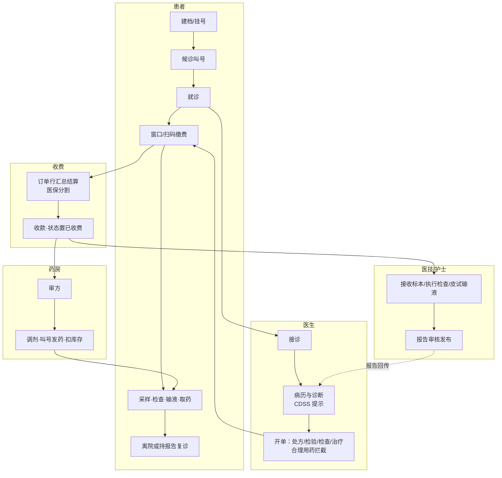
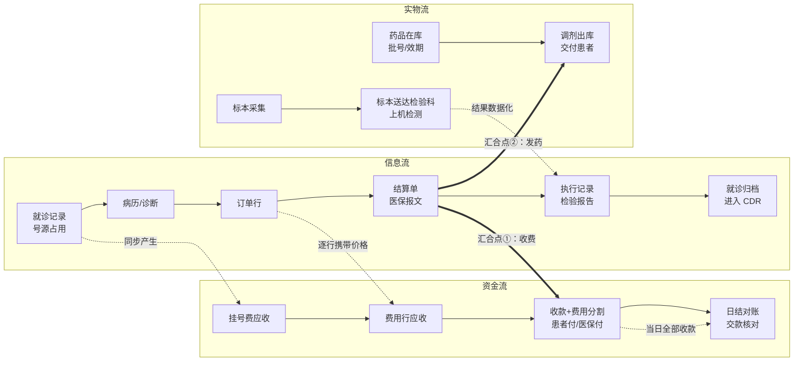
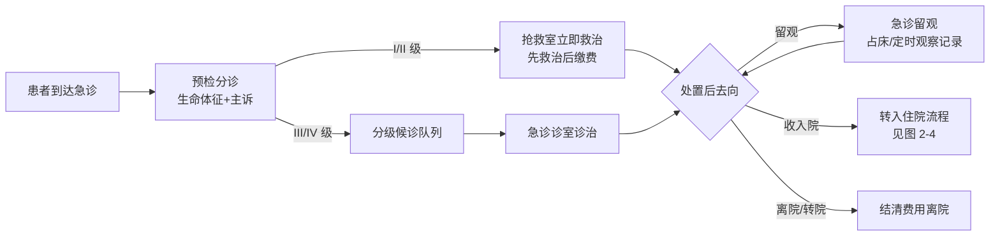
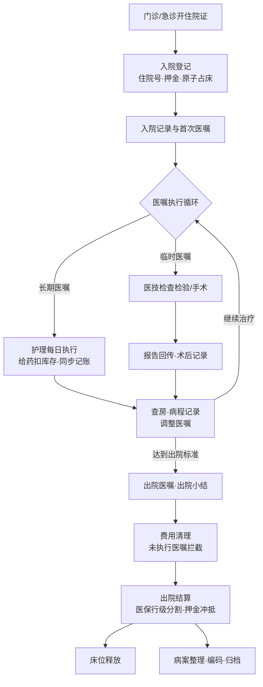

# 第 2 章 医院业务流程全景

> 本章属第一篇「基础篇」。在动手设计任何医院信息系统之前，必须先把医院当作一个业务有机体看懂：
> 科室与角色如何分工，患者与数据如何流动，钱与物如何流转。本章沿门诊、急诊、住院、医技、药事、
> 运营六条业务线做一次全景导览，并引入贯穿全书的**三流视角**——信息流、资金流、实物流的分与合。
> 本章只讲业务不讲实现；各业务线的系统设计分别在第 7–9 章展开。

## 学习目标

学完本章，你应当能够：

1. 描述医院的科室分类（临床/医技/职能/后勤）与信息系统八角色模型的对应关系，解释系统为什么按角色而不是按科室组织功能；
2. 画出门诊诊疗全流程（挂号→接诊→开单→收费→执行→发药）的泳道图，并标出「先收费、后执行」的控制点；
3. 说出急诊预检分诊 I–IV 级的分级含义，解释急诊流程与门诊流程在资金流上的根本差异；
4. 画出住院全流程图，解释医嘱为什么是住院信息流的主轴，以及「记账式医嘱」如何把信息流与资金流合并为一条链；
5. 从科室视角描述检验、检查、病理、手术、输血五类医技业务的流转骨架，指出各自的实物流主角；
6. 在同一张流程图上勾勒信息流、资金流、实物流三条轨迹，指出它们的分叉点、汇合点与闭合点；
7. 沿三流轨迹分析一个逆向流程（退号/退费/退药）的正确执行顺序及其拦截条件。

---

## 2.1 医院组织结构与信息系统角色模型

### 2.1.1 科室：医院的组织单元

无论规模大小，医院的科室都可分为四类：

- **临床科室**：直接为患者提供诊疗服务的科室，分门诊与住院（病区）两种形态。内科、外科、儿科、妇产科等按学科划分，急诊科则按服务时效划分。注意**科室与病区不是一回事**：科室是学科建制，病区（护理单元）是床位管理单元——一个大科可辖多个病区，床位紧张时一个病区也可能混合收治多个科的患者。系统建模时科室与病区必须是两个独立维度，医生按科室归属、床位按病区归属，混为一谈会在转科转床与护理管理上留下长期隐患（第 5 章主数据建模会回到这一点）；
- **医技科室**：不直接管患者、但为临床提供技术支撑的科室——检验科、医学影像科（放射/超声/心电/内镜）、病理科、手术麻醉科、输血科、药学部等。它们是「平台科室」：一个检验科同时服务全院所有门诊与病区；
- **职能科室**：医务、护理、质控、院感、病案、财务、医保办、信息科等管理部门，不产生诊疗行为，但制定与监督规则；
- **后勤保障**：设备、物资、总务、消毒供应中心（CSSD，Central Sterile Supply Department）等，维持医院这台机器的物理运转。

这个分类直接映射为医院信息系统的模块版图：临床科室对应门诊、住院系统（第 7、8 章），医技科室对应医技系统（第 9 章），职能科室对应质控统计与医保（第 10、12 章），后勤对应运营管理（HRP，Hospital Resource Planning）。

把科室按业务重新编组，可以得到贯穿本章的**五条业务线**，它们与本书案例平台 HIP 的十个业务域一一对应：

| 业务线 | 覆盖流程 | 本章节次 | HIP 对应业务域 | 系统详述 |
|---|---|---|---|---|
| 门急诊线 | 挂号→接诊→开单→收费→执行 | 2.2、2.3 | 患者服务、门诊业务 | 第 7 章 |
| 住院线 | 入院→医嘱→护理→出院 | 2.4 | 住院业务 | 第 8 章 |
| 医技线 | 申请→执行→报告 | 2.5 | 门诊业务（医技页）、专科流程 | 第 9 章 |
| 药事线 | 药库→药房→患者 | 2.6 | 基础数据、门诊业务（药房页） | 第 7 章 |
| 运营线 | 资产/物资/人事/财务日结 | 2.7 | 运营管理、系统管理 | 第 12、14 章 |

职能科室的质量管理与医保业务横切在五条线之上（对应 HIP 的数据中心、集成平台两域），在第 10、12 章展开；患者端（2.8）则是五条线朝向患者的统一出口。

### 2.1.2 角色：信息系统的用户模型

科室是行政单元，**角色**才是信息系统的功能单元——同一个检验科里有医生、技师、护士，用的功能完全不同；而门诊医生与病区医生虽分属不同科室，用的功能高度同构。因此成熟的医院信息系统按「角色 × 功能页」组织权限，而不是按科室。本书采用与案例平台 HIP 一致的**八角色模型**：

| 角色 | 典型岗位 | 主要业务动作 | 承载业务线 |
|---|---|---|---|
| 管理员 | 信息科 | 用户/科室/权限维护、系统参数、审计 | 平台底座 |
| 医生 | 门诊/病区/急诊医生 | 接诊、病历、诊断、开单、医嘱 | 门诊、住院 |
| 护士 | 门诊/病区/急诊护士 | 皮试输液、医嘱执行、体征、护理评估 | 门诊、住院 |
| 收费 | 挂号收费窗口 | 挂号退号、收费退费、日结 | 资金流入口 |
| 药师 | 药房、药库 | 审方、发药退药、进销存、药事分析 | 药事 |
| 医技 | 检验/检查/病理技师与医生 | 标本流转、结果录入、报告审核发布 | 医技 |
| 质控院感 | 质控科、院感科、病案室 | 时限质控、院感监测、报卡审核、病案统计 | 质量管理 |
| 运营后勤 | 设备科、总务、人事 | 资产设备、物资、人事、OA | 运营保障 |

八角色不是理论抽象，而是可以直接落到培训现场的划分：给每个角色 15–20 分钟，就能沿其日常动线把系统走一遍。在 HIP 中，这一模型体现为 8 个内置角色对 55 个功能页的绑定关系，用户登录后菜单只显示本角色权限内的功能页（权限机制见第 5 章）。

角色与人不是一一对应：一名夜班护士可能兼做收费（小医院常态），一名科主任同时是医生角色与质控角色——系统允许**一人多角色**，权限取并集。反过来，同一角色在不同科室的可见范围也应不同（呼吸科医生不该看到妇产科的候诊队列），这靠角色之外的**科室归属**维度限定。角色定功能、科室定范围、患者授权定隐私边界，三个维度叠加构成医院信息系统权限模型的业务需求——实现留到第 5 章，这里只需记住：**权限模型是业务分工的镜像，画不清业务分工就配不对权限**。

### 2.1.3 三流视角：本章的分析框架

把医院业务拆到最底层，流动的东西只有三种：

- **信息流**：单据与数据的流动——挂号记录、病历、医嘱、申请单、报告、报文。它跑在网络上，速度最快、成本最低；
- **资金流**：费用的发生、收缴与结算——挂号费、药费、检查费的应收与实收，医保与患者的分担，日终的对账与交款。它受财务与医保规则的强约束；
- **实物流**：物理对象的移动——药品从药库到药房到患者手中，标本从采集处到检验科，血液从血库到病区，消毒包从 CSSD 到手术室。它最慢、最贵，且一旦交付往往不可逆。

三条流的性格差异决定了流程设计的基本矛盾：信息流希望越快越好，资金流要求笔笔可核，实物流讲究安全可追溯——一个环节同时服务三个目标时，必然要排优先级（急诊把救治的信息流排在资金流前面，就是最典型的一次排序）。三流在流程的某些环节并行分离，在另一些环节强制汇合。**汇合点就是控制点**：门诊收费窗口是信息流与资金流的汇合点（不缴费则后续环节不启动），药房发药窗口是三流的汇合点（处方信息、已收费状态、药品实物三者对齐才能交付）。信息化的大量设计工作，本质上是把这些汇合点从「靠人核对」变成「靠系统对齐」——这正是后续章节反复出现的**闭环**概念的地基：一个业务闭环，就是三流各自走完且互相对平的一段流程。本章每节都会点出该流程中三流的分与合。

---

## 2.2 门诊诊疗全流程

门诊是医院业务量最大、节奏最快的流程，主链条六个环节：**挂号→接诊→开单→收费→执行→发药**。

### 2.2.1 挂号：就诊的起点与容量的闸门

挂号做两件事：为患者建立**本次就诊**的身份（一次挂号对应一次就诊，后续病历、处方、费用都挂在它下面），并占用一个**号源**。号源是医生出诊能力的量化——排班决定某医生某时段放多少号，号满即止。挂号因此是门诊的容量闸门：它决定了整个下游流程的流量。首次就诊的患者需先**建档**，进入患者主索引（EMPI，Enterprise Master Patient Index），保证「一人一档」——同一患者多次就诊、跨门诊住院的数据能纵向串联，靠的就是这份唯一档案；档案信息中的过敏史、参保类型会被后续的用药拦截与医保结算反复引用（第 5 章详述）。

挂号的渠道近年持续多元化：窗口、自助机、电话、患者端线上预约——渠道不同，但都在消耗**同一池号源**。这带来门诊流程的第一个并发难题：多个渠道同时抢同一个号，系统必须保证「一号一患」，宁可让后来者挂号失败，不能让两位患者拿到同一个号（业务上的超挂意味着医生超负荷与患者纠纷）。号别（普通号/专家号/专病门诊号）与午别（上午/下午）则是号源池的业务维度，定价与排班随之而异。

三流在这里第一次同时启动：信息流建立就诊记录并扣减号源，资金流产生第一笔应收（挂号费）。在 HIP 中，这一环节由「患者建档」「医生排班」「门诊挂号」三个功能页承载，挂号时原子占号防止超挂（并发实现见第 7 章）。

### 2.2.2 接诊：病历与诊断

患者候诊，医生按队列（或叫号）接诊。候诊秩序由**叫号体系**维护：按挂号顺序（或预约时段）排队，过号顺延、可重呼——叫号看似小功能，却是门诊现场秩序感的主要来源。接诊的核心产出是两样：**门诊病历**（主诉、现病史、查体）与**诊断**（以 ICD-10 编码记录，第一诊断为主诊断——它是后续医保结算、病案统计、DRG 入组共同引用的关键数据，第 3、10、12 章会反复回到它）。初诊与复诊在流程上同构，差别在信息流的起点：复诊医生首先要看的是历史——上次的病历、检验结果、用药记录，这正是患者纵向视图（患者 360，第 11 章）的业务价值所在。这一环节几乎是纯信息流：不收钱、不动实物，却生产整个就诊中最有价值的数据。在 HIP 中由「门诊医生站」「叫号大屏」承载，保存病历时 CDSS（Clinical Decision Support System，临床决策支持系统）按主诊断给出检查与用药路径提示。

### 2.2.3 开单：诊疗意图的单据化

医生的诊疗决定必须变成可流转的单据才能驱动下游：处方（药品）、检验申请单、检查申请单、治疗单。业务上它们性质相同——都是「医生开出的、待收费待执行的费用行」，因此现代系统把它们统一为**订单行**模型（第 7 章详述其设计）。开单是三流的**分叉点**：一张单据从此拆出三条轨迹——信息流（单据流转到执行科室）、资金流（每一行都携带价格，形成应收）、实物流（药品行将驱动库存扣减，检验行将驱动标本采集）。开单环节还有第一道质量闸门：合理用药审查在开立瞬间拦截过敏、重复用药、配伍禁忌等问题——在费用发生之前拦住错误，成本最低。此外，检查检验申请单不只是「点菜单」：申请单上的临床诊断与检查目的是医技医生解读结果的重要上下文，「申请单信息不全」是医技科室对临床最常见的抱怨——信息流的质量在源头就决定了。

### 2.2.4 收费：三流的第一汇合点

门诊的基本财务规则是**先收费、后执行**（急诊绿色通道除外，见 2.3）。收费窗口把患者本次未缴费的订单行汇总为结算单，选择支付方式收款；医保患者在此处同步完成费用分割与医保上传（第 10 章详述）。收清费用后，订单行状态翻转为「已收费」——这是发给全院执行科室的放行信号：药房据此调剂，医技据此接单。**收费是信息流与资金流的第一汇合点，也是门诊流程最重要的控制点**。

支付方式的构成决定了资金流的后续走向：现金进钱箱、移动支付（微信/支付宝等聚合支付）进通道账户、医保部分由统筹基金与患者按分割结果分担——每一类都要在日结时单独轧账（2.7），移动支付还要与支付服务商的通道流水对账。收费同时产生**票据**：财政医疗票据是患者报销与维权的凭证，票据号与结算单的对应关系必须严格留痕。在 HIP 中，本环节由「门诊收费」「扫码支付台」承载，退费与重收、退号联动拦截在同页处理。

### 2.2.5 执行与发药：三流的第二汇合点

已收费的订单行分流到各执行点：药品行到药房（审方→调剂→按叫号发药），检验行到采血/采样处，检查行到相应医技科室，治疗行（输液、注射）到门诊护士站。以静脉输液为例可以看清执行环节的质量控制密度：需皮试的药物（如青霉素类）必须先做皮试且结果为**阴性**方可开始；输液中护士按规范巡视并记录；换瓶、拔针各有核对动作——每一步都是「查对制度」在门诊场景的落点，也都是系统需要留痕的状态节点。药房发药窗口是三流的第二汇合点：处方信息（信息流）、已收费状态（资金流）、药品实物（实物流）三者对齐，药品交付患者，库存同步扣减。检验检查的执行则把实物流（标本、患者本人）送入医技科室，报告发布后信息流**逆向回流**到医生站——医生看到结果，可能复诊、调整诊断、再次开单，流程进入第二圈循环。

图 2-1 用泳道图汇总全流程：

**图 2-1 门诊诊疗全流程泳道图**（报告回传的虚线是流程中唯一的逆向信息流，它驱动复诊闭环）

### 2.2.6 三流合一：在同一张图上看门诊

现在把 2.2.1–2.2.5 的三流线索抽出来单独画一遍（图 2-2）。这张图是本章的核心：后续每条业务线的分析，都是它的变体。

**图 2-2 门诊流程的信息流—资金流—实物流三流合一图**

读这张图要抓住四个节点：

1. **分叉点（开单）**：一份医嘱意图拆出三条轨迹，此后各自独立推进；
2. **汇合点①（收费）**：资金流结清是信息流继续向执行环节推进的前提；
3. **汇合点②（发药/执行）**：实物交付必须同时核对信息（处方内容）与资金（已收费）——「凭票取药」的本质就是人工核对汇合点，信息化把它变成系统状态核对；
4. **闭合点（日结与归档）**：资金流以日结对账闭合（当日各支付方式实收与账面核对，见 2.7），信息流以就诊归档闭合（汇入临床数据中心 CDR，第 11 章）。三条流各自闭合且能互相印证，这次就诊才算「对得上账」。

**逆向流程是三流的镜像**。退费不是删除一笔收费，而是沿原路逆行且顺序相反：实物流未发生（未发药）可直接退费；实物流已发生（已发药）必须先退药（药品回库、库存回补），资金流才允许退费；资金流退清后，信息流才允许退号（释放号源）。每一步的拦截条件都来自「下游流未回退则上游流不得回退」这条通用规则——请在习题 2 中把这条逆向路径完整画出来。

> **业务场景框 2-1：一位上呼吸道感染患者的门诊两小时**
>
> 周一 8:05，李女士因发热咽痛到某县医院。她去年建过档，收费窗口按身份证号调出档案，挂了呼吸内科王医生的号——排班表显示上午还剩 12 个号。8:40 叫号屏叫到她，王医生接诊，录入主诉「发热咽痛 2 天」，拼音首字母检出诊断「急性上呼吸道感染」；保存病历时系统按主诊断提示了血常规检查路径。王医生开出血常规一项、口服药两种——其中一种与李女士档案中的青霉素过敏史无冲突，系统未拦截。
>
> 8:50 李女士在自助机扫码缴费（检验费与药费一单结清），采血窗口的队列里随即出现她的名字。9:00 采血，标本送检验科。9:40 检验报告审核发布，王医生工作站上她的申请单自动转为「已执行」并显示结果：白细胞轻度升高，与临床判断相符。李女士回诊室复诊确认后，到药房叫号窗口取药——药师核对处方与实物，发药完成，库存同步扣减。10:05 离院。
>
> 复盘这两小时：信息流走了「就诊→病历→订单→报告回传→复诊」一个整圈；资金流在 8:50 一次汇合结清；实物流两条——标本进了检验科，药品出了药房。在 HIP 中，这条动线依次经过患者建档、门诊挂号、门诊医生站（含 CDSS 提示与用药拦截）、扫码支付台、LIS 工作台、药房发药六个功能页；李女士本人只在三个物理位置停留过——诊室、采血窗、药房窗，其余流转全部发生在系统里。

---

## 2.3 急诊流程：预检分诊与留观

### 2.3.1 急诊与门诊的根本差异

急诊处理的是「不能等」的患者，流程设计的第一原则从门诊的「秩序优先」变为**时间优先**，由此产生两点根本差异：

1. **按病情定顺序，而不是按到达定顺序**——这就是预检分诊；
2. **资金流后置**——危急患者先救治后缴费（「绿色通道」），费用先记账、事后补收。这是三流关系的一次刻意倒置：门诊里资金流是信息流的闸门，急诊里信息流（救治指令）先行，资金流退居其后。倒置的代价是欠费风险，因此急诊记账需要更严格的事后追缴与核销流程——流程设计里没有免费的例外。

### 2.3.2 预检分诊：I–IV 级

患者到达急诊，分诊护士依据生命体征与主诉在数分钟内完成分级。我国急诊普遍采用四级分诊【成稿核对：急诊预检分诊分级的现行规范名称与文号（原卫生部 2011 年《急诊病人病情分级指导原则》及后续行业标准）】：

| 级别 | 定义 | 响应要求 | 去向 |
|---|---|---|---|
| I 级 | 濒危：随时危及生命 | 立即抢救 | 复苏室/抢救室 |
| II 级 | 危重：短时间内可能恶化 | 尽快安排，密切监护 | 抢救室 |
| III 级 | 急症：有潜在恶化风险 | 优先于 IV 级诊治 | 优先诊室 |
| IV 级 | 非急症 | 顺序候诊 | 普通诊室 |

分级形成四条优先级不同的候诊队列。分诊本身是高价值的信息流起点：分级结果、分诊时的生命体征都是后续医疗行为与质量追溯的依据——一旦发生纠纷，「到达时刻—分诊级别—首次处置时刻」这条时间链是核心证据。急诊分诊还承担**传染病预检**职责：发热、疑似传染病患者在分诊环节即被识别分流至发热门诊或隔离区域，这是公共卫生对流程的强制要求。

绿色通道的记账机制值得展开：I、II 级患者的检查、用药先执行、费用挂账，形成「负债运行」的就诊；抢救结束后由家属补缴，无人补缴的部分进入欠费管理（催缴、核销）。系统必须支持这种「信息流先行、资金流挂账」的模式并给出欠费的全程台账——**绿色通道不是不要钱，而是把资金流汇合点从执行前移到执行后**，风险由医院的坏账制度兜底。

### 2.3.3 留观与去向

急诊处置后患者有四种去向：离院、**留观**、收入院、转院。留观是急诊特有的中间形态——病情尚不明朗、不满足住院指征又不宜离院的患者占用观察床位，护士定时记录观察情况，通常数小时到 72 小时内明确去向。留观在业务上是「微型住院」：要占床、要连续观察记录、要记账，但不走入院登记。图 2-3 汇总急诊流程：

**图 2-3 急诊预检分诊与留观流程**

在 HIP 中，本节流程由「急诊预检分诊」功能页承载：I–IV 级分诊队列、留观占床与观察记录、去向流转（急诊系统设计见第 7 章）。

---

## 2.4 住院诊疗全流程

门诊以「次」为单位，一次就诊几小时；住院以「天」为单位，一次住院几天到几十天。时间维度的拉长改变了一切：诊疗指令要素化为可反复执行的**医嘱**，费用从「先收后执行」变为「边执行边记账、出院总结算」，并出现了门诊没有的角色重心——护理。

### 2.4.1 入院：登记、押金与占床

住院的入口有三个：门诊医生开住院证（择期）、急诊直接收入院（急症）、转院接收。床位紧张的医院还有一段「待床」缓冲——住院证开出但无床可占，患者进入预约队列，由病区按床位周转安排召入。患者凭住院证办理**入院登记**：分配住院号（本次住院的唯一标识）、预收**押金**、在目标病区占用一张床位。三流同时启动且各有特点：信息流建立住院就诊；资金流以押金形式**预收**——这是住院资金流的独特设计，用预收对冲「边执行边欠费」的风险；实物流占用床位——床位是住院流程中最稀缺的「准实物」资源，占床与退床需要与号源同级别的严格管理（第 8 章详述）。在 HIP 中由「住院登记」功能页承载，原子占床防止一床两派。

### 2.4.2 医嘱：住院信息流的主轴

住院期间医生的一切诊疗指令都以**医嘱**形式下达，医嘱分两类：

- **长期医嘱**：自开立起每日循环执行直至停止（如「头孢呋辛 1.5g 静滴 每日两次」、护理级别、饮食）；
- **临时医嘱**：执行一次即完成（如某项检查、术前用药、「今日出院」）。

医嘱有自己的生命周期：开立→（护士核对）→执行→停止/作废，每一步记录操作人与时刻。手工时代护士要把医嘱「转抄」到各种执行单上，转抄是差错的温床；信息化把转抄变成系统流转，医嘱从开立到执行的每一环可查可溯，这是住院信息化最早也最扎实的收益之一。医嘱是住院信息流的主轴：护理执行看医嘱，费用记账跟医嘱，医技检查源于医嘱，出院结算校验医嘱。**记账式医嘱**是理解住院资金流的关键：每条医嘱执行时，同步生成对应的费用记录（药品行、治疗行、床位费行），信息流与资金流在医嘱执行这一动作上**合并为一条链**——不存在「执行了但没记账」或「记账了但没执行」的缝隙。这个模型的价值到第 10 章会再次显现：DRG 时代医保要求行级费用明细，记账式医嘱天然满足（医嘱体系设计见第 8 章）。

### 2.4.3 护理执行与病房日常

病区的日常节律由护理驱动：按医嘱给药（药品执行同步扣减库存——实物流与信息流的又一合并点）、定时测量生命体征（体温、脉搏、呼吸、血压，汇成体温单）、按**分级护理**要求巡视（特级、一、二、三级护理对应不同的观察频次与照护强度【成稿核对：护理分级行业标准 WS/T 431 现行版本】）、进行护理风险评估（压疮、跌倒等量表评估与分级预警）。医生侧的节律则是查房与病程记录：**三级医师查房**（住院医师—主治医师—主任医师逐级查房）是医疗质量安全核心制度之一【成稿核对：《医疗质量安全核心制度要点》文号】，查房结论落为病程记录并驱动医嘱调整——「查房→调整医嘱→执行→再查房」构成住院信息流的每日循环。病区还有一个以「班」为单位的节律：**交接班**。护理白板（在院患者总览：床位、护理级别、风险预警、当日重点）是交接班的现场工具，接班者据此在几分钟内接管全病区的状态——白板信息不准，交接就有漏项，这类「状态总览」页面的数据实时性要求因此高于一般报表。在 HIP 中，护理侧由「护士执行」「护理白板」「移动工作台」承载，医生侧由「住院医生站」承载。

### 2.4.4 在院期间的流程变化：转科、会诊与临床路径

住院不总是「一个病区躺到底」。三类常见变化：

- **转科转床**：病情变化需换专科（如内科转外科手术），或病区内调床。转科是床位资源的一放一占，必须原子完成并全程留痕——患者「此刻在哪张床」是护理执行、费用记账（床位费按天按床计）、探视管理共同依赖的事实；
- **会诊**：主管医生请他科医生对本科患者提出诊疗意见，形成「申请—应邀—意见—采纳」的小闭环。会诊是跨科室的纯信息流协作，时限要求（如急会诊须在规定时间内到位）使其成为质控的监测对象；
- **临床路径**：对诊断明确、诊疗方案成熟的病种（如单纯性阑尾炎），预先定义标准化的按天诊疗计划，患者「入径」后医嘱按路径模板批量生成，实际执行偏离模板则记录**变异**及原因。临床路径把个体化的医嘱流变成可比对的标准流，既是质量工具（减少随意性）也是成本工具（DRG 时代控制资源消耗的抓手，第 10 章）。在 HIP 中由「患者管理」的路径入径/变异功能承载。

### 2.4.5 出院：三流的总清算

出院是住院三流的集中闭合点，顺序不能乱：医生下达出院医嘱并完成出院小结→护理停止全部长期医嘱→**费用清理**（校验有无已开立未执行的医嘱——若有，要么执行要么撤销，否则会出现「收了钱没干活」或「干了活没收钱」）→**出院结算**（全部住院费用汇总，医保患者做行级费用分割，押金冲抵，多退少补）→床位释放→病案整理、编码、归档（第 12 章）。图 2-4 汇总全流程：

**图 2-4 住院诊疗全流程图**（中部的医嘱执行循环以「天」为周期运转，是住院与门诊在流程形态上的本质区别）

> **业务场景框 2-2：一位阑尾炎患者的 72 小时**
>
> 周三 21:40，大学生小陈因转移性右下腹痛到急诊。分诊护士测得体温 38.2℃，评估为 III 级，进入优先候诊队列。22:00 急诊外科医生接诊，开立血常规与腹部超声——两小时后结果回传：白细胞 14×10⁹/L，超声提示阑尾增粗。诊断急性阑尾炎，建议手术，开具住院证。
>
> 23:30 家属办理入院登记：分配住院号、预交押金五千元、普外科病区占床。值班医生下达术前医嘱：禁食（长期）、术前抗菌药皮试（临时）、急诊手术申请（临时）。周四凌晨 2:10 手术——腹腔镜阑尾切除，麻醉记录逐时段留痕，术毕经麻醉复苏室评估达标后返回病房。术后医嘱切换：一级护理、抗菌药静滴每日两次、补液。此后两天病区进入日常节律：护士按医嘱执行给药（每次执行同步扣库存、记费用），每四小时录一次生命体征汇入体温单；医生每日查房写病程，周五查房评估恢复良好，将护理级别降为二级并停补液。
>
> 周六上午，医生下达出院医嘱、完成出院小结并签名。护士站停止全部长期医嘱；结算窗口清点费用时系统拦截了一条已开立未执行的换药医嘱——护士确认为出院当日已无需执行，予以撤销后放行。总费用九千余元，医保行级分割后统筹支付六千余，押金冲抵个人部分，退回差额。床位释放，病案在规定时限内归档编码。
>
> 这 72 小时里，小陈的信息流跨越了急诊、检验、超声、住院、手术、护理、病案七个环节；资金流从急诊缴费、住院押金到出院总清算；实物流有标本一份、术中耗材若干、药品数十次执行、床位一张占用 60 小时。在 HIP 中，这条动线依次落在急诊预检分诊、LIS 工作台、RIS 报告、住院登记、住院医生站、手术麻醉、护士执行、出院结算、病案统计等功能页上——没有任何一个单独的「系统」能覆盖它，这正是医院信息化必须平台化的业务根源（第 4 章）。

---

## 2.5 医技科室业务：科室视角

前两节从患者动线看流程，医技科室看到的是同一流程的另一个侧面：源源不断到达的**申请单**，以及各自科室内部的一套流转工艺。医技业务的共同骨架是「申请→执行→报告」，各科室的差异在于实物流的主角不同。

**检验（LIS，Laboratory Information System）**：实物流主角是**标本**。标本从采集（贴条码建立「标本—患者—申请单」的绑定，这一绑定是检验质量的生命线）、送达接收（核收，拒收不合格标本）、上机检测到结果审核发布，走一条严格的状态链。检验科室的核心效率指标是 **TAT**（Turnaround Time，标本周转时间）——从采集或接收到报告发布的时长，急诊生化的 TAT 承诺常以分钟计，它逼着流程把每个状态节点的时刻都记录下来（没有时间戳就没有 TAT 管理）。发布是信息流的关键一跳：结果回传医生站、申请单自动转已执行；超出危急界限的结果（危急值）触发**危急值管理**——立即通知临床、要求确认处理并留痕，这是信息流中的「紧急通道」，绕过常规节奏直达责任医生（第 6、9 章详述）。在 HIP 中由「LIS 工作台」承载，替检需登记替检人以保全标本绑定的可追溯。

**检查（RIS，Radiology Information System；PACS，Picture Archiving and Communication System）**：实物流主角是**患者本人**——患者要到设备前完成检查，因此时段预约、改约、叫号是检查科室的日常（预约让患者流与设备产能对齐）。产出是双份的：影像归 PACS 管理（以 DICOM 标准存储传输），诊断报告经书写、审核两级后发布——「书写与审核分离」是医技报告质量的通用制度，审核者对报告负责签发。心电、内镜、超声等在业务上同构，按项目归类管理；住院患者外出检查还涉及陪检安排与病情许可评估，是病区与医技之间的协作细节。检查报告同样有危急界限（如影像发现的急性大出血征象），危急值管理机制与检验共用一套通道。在 HIP 中由「预约与叫号」「RIS 报告」承载。

**病理**：实物流主角是**组织标本**，流转链为取材→核收→制片诊断→报告发布。与检验标本「检测后废弃」不同，病理标本的蜡块与切片须长期保存备查，实物流的终点不是消耗而是归档。病理报告常是肿瘤诊断的「金标准」，时效以天计（术中冰冻切片除外——外科医生在台上等结果决定术式，时效以分钟计），是医技中节奏最慢、责任最重的一支。

**手术麻醉**：手术室是全院实物流密度最高的场所——患者、器械包（来自 CSSD 的消毒灭菌循环）、耗材、血液在此汇聚。业务链为手术申请→排台（手术室与麻醉资源的排程，一间手术室一天的台次安排是典型的资源调度问题）→术前核对（麻醉实施前、手术开始前、离室前的三方安全核查，核对患者、部位、术式【成稿核对：手术安全核查制度的现行规范表述】）→术中（麻醉记录单按时间轴记录用药与生命体征，是麻醉质量与纠纷举证的关键文书）→复苏（PACU，麻醉后恢复室，评分达标方可出室）→术后记录。手术还是费用大户：术中耗材与用药的记录完整性直接决定收费与医保结算的准确性——「台上用了、账上没有」是手术室成本管理的经典漏洞。

**输血**：血液是受法规最严格管制的实物——用血申请须逐级审批，发血、输血双人核对，输血过程与反应全程记录，形成「申请→审批→发血→输血」的完整状态链，每一步可追溯【成稿核对：《医疗机构临床用血管理办法》现行版本】。

医技的三流特征可以一句话概括：**信息流双向（申请下行、报告上行），实物流单向且不可逆（标本消耗、血液输注），资金流则完全依附于门诊收费或住院记账**——医技科室自己不收钱，这也是把医技执行与收费状态联动校验（未收费不执行）的业务原因。各科室的系统设计在第 9 章展开。

---

## 2.6 药事流程

药品是医院最大宗的实物流，药事管理的链条纵贯「库—房—窗—人」四级。

**药库：进销存的源头**。采购入库（登记批号、效期、供应商——批号与效期是药品追溯与安全的关键属性）、库存养护、盘点调整、向药房下送。药库业务的铁律是**一切库存变动必留流水**：入库、出库、盘点、退药各记一笔，任意时点的账面库存都能由流水重演出来——这既是管理要求，也是「账实相符」的技术前提。特殊管理药品（麻醉药品、精神药品等）在此之上叠加更严的管制：专库专柜、专册登记、处方与空安瓿回收核对，流程要求逐支可追溯【成稿核对：麻醉药品和精神药品管理条例的现行要求表述】。在 HIP 中，常规进销存由「药库管理」承载，进销存统一流水、低库存预警。

**审方：发药前的专业闸门**。药师对处方进行适宜性审查（处方审核），发现问题的处方拒绝并说明理由，医生须重新开立。审方是合理用药的第二道防线——第一道是开单时的系统自动拦截（2.2.3），系统拦截规则化、审方专业判断化，两者互补。在 HIP 中由「审方工作台」承载，拒绝即处方作废。

**发药：三流汇合的窗口**。已收费处方进入调剂队列，药师调配、核对、按叫号发药，库存同步扣减（2.2.5 已述）。西药房、中药房（饮片按剂调配，常配套代煎服务）在流程上同构、在计量与调配工艺上迥异，系统需以不同的药房类型分别管理。逆向的**退药**同样严格：药品实物回库、库存回补并记退药流水，然后才允许退费——实物流回退先于资金流回退的又一实例；已拆封、冷链等不满足回库条件的药品不得退回，拦截条件源自药品安全而非财务规则。

**处方点评**：与逐张审方互补的事后抽样机制——按月抽取处方样本，由药师依据点评规范评价用药合理性并通报结果，问题处方追溯到医生个人。审方拦在事前、点评查在事后，两者共同构成处方质量的 PDCA 循环。

**合理用药监测与药事分析**：宏观层面，药学部门定期分析用药结构——用药金额排名、抗菌药物使用强度（AUD，以 DDD 即限定日剂量为单位折算）等指标，既是药事管理与药物治疗学委员会的决策依据，也是国家绩效考核的监测项【成稿核对：抗菌药物使用强度考核参考线的现行口径】。在 HIP 中由「药事分析」承载（相关统计分析见第 12 章）。

> **业务场景框 2-3：门诊药师的一个上午**
>
> 8:00，张药师到岗先看审方队列：夜班积压的处方里有一张同时开了头孢类注射剂与含酒精成分的口服液，提示配伍风险，她点了拒绝并注明理由——处方作废，医生站会收到重开提示。8:30 起进入发药高峰，叫号屏按处方聚合叫号，她与同事按「调配—核对—发药」双人流水作业，每发一张，库存自动扣减。10:10 来了一位退药患者：上午刚取的口服药，医生调整了方案。她核对药品未拆封、在退药时限内，办理退药——库存回补、记退药流水，并告知患者现在可以去收费窗口退费了。10:40 空隙里她处理了两条低库存预警，向药库提交请领。11:30 交班前，她顺手看了眼本月药事分析：抗菌药使用强度比上月降了两个点。
>
> 这个上午覆盖了药师角色的完整动线：审方、发药、退药、库存、分析。在 HIP 中分别由审方工作台、药房发药、药库管理、药事分析四个功能页承载；注意退药流程里「实物先回、资金后退」的顺序——她无权退费，只能在实物流回退完成后，把资金流的回退交还给收费角色。

---

## 2.7 运营后勤流程

运营后勤是医院的「第二战场」：不接触患者，却托着临床运转的底。其业务可分四块：

- **资产与设备**：固定资产台账与折旧、调拨报废；医疗设备的维修工单（报修→派工→完成）、保养计划、计量器具到期检定、供应商资质证照管理。设备管理的核心诉求是**可用性**——一台故障的 CT 影响的是整条检查业务线；
- **物资**：耗材与低值易耗品的进销存（与药库同构的流水化管理）、CSSD 消毒包的「回收—清洗—灭菌—发放」循环追溯——手术器械包是在院内闭环循环的特殊实物流，每个灭菌包带批次标识，一旦某灭菌批次质控不合格，须能反查该批次全部包的去向并召回；
- **人事与 OA**：员工档案、工资、培训与继续教育学分、考勤，以及请假、用章、采购等审批流——职能科室的信息流大多以「审批」形态存在；
- **财务日结与对账**：这是资金流的每日闭合仪式，分两级。第一级是**收款员个人日结**：每位收费员日终汇总自己经手的收费与退费，按支付方式分列（现金/移动支付/医保），账面应交与实际清点核对——对不上即产生长款或短款，当日查明原因（常见如退费票据漏登、找零差错）；第二级是**全院日结**：财务汇总全部收款员的交款，与收入账面轧平，移动支付部分还要与支付服务商的通道流水逐日核对。日结把一天内成千上万笔零散收费压缩为一组可核对的汇总数——**资金流不闭合到日，差错就会滚动累积到无法追查**。第 10 章的医保对账、第 12 章的运营分析都建立在日结口径之上。

在 HIP 中，本节业务由「固定资产」「设备管理」「物资与OA」「人事管理」「日结报表」等七个功能页承载。运营域的三流特征与临床相反：**实物流与资金流是主角，信息流为它们服务**——这也是运营系统（HRP）与临床系统在设计气质上迥异的原因。

---

## 2.8 患者视角的就医旅程

前七节都站在医院内部看流程；换到患者一侧，看到的不是流程而是**旅程**——一段由排队、移动、等待串起来的体验。完整的旅程分三段：**诊前**（感到不适、选择医院与科室、预约）、**诊中**（院内的挂号—就诊—检查—缴费—取药）、**诊后**（康复、复诊提醒、慢病随访）。传统信息化只覆盖诊中，诊前靠患者自己摸索、诊后基本失联；「以患者为中心」的建设方向，就是把信息流向诊前（导诊、预约）与诊后（报告推送、随访计划）两端延伸。

诊中一段的传统痛点被概括为「三长一短」：挂号排队长、缴费排队长、取药排队长，看病时间短。用三流视角诊断：患者排的三个长队，恰好都是三流的汇合点（挂号建立就诊、收费结清费用、发药交付实物）——**汇合点靠窗口人工核对，队伍就长在核对上**。

「互联网+医疗」的改造思路由此清晰：**把信息流与资金流从物理窗口上移到线上，实物流留在线下但精确预约到点**。患者端（手机 H5/小程序）承载的典型能力：

- **预约挂号**：号源上线，患者按时段预约，到院即诊——挂号队伍消失；
- **线上缴费**：诊间开单后手机出码支付——缴费队伍消失，且资金流汇合点提前到诊室门口；
- **报告查询**：检验检查报告发布后线上可查，无需专程返院取单。这里有一个值得注意的伦理设计：**危急值不在线上直接展示**，而是提示「请尽快回院复诊」——危急结果必须在有医生解释与处置能力的场景下告知，这是信息流设计里的医学伦理约束；
- **智能导诊**：按症状推荐科室，替代分诊台的部分咨询功能。导诊的边界必须清晰——它推荐「去哪个科」，不给出诊断与用药建议；任何面向患者的智能功能都要在「有用」与「越界」之间画好线（AI 应用的架构与边界见附录 A）。

诊后一端的延伸以**随访**为代表：出院或门诊后按计划回访（术后复查提醒、慢病定期随访、满意度回访），把一次性的就诊拉长为连续的健康管理关系。随访是纯信息流业务，成本低而黏性高，也是公立医院绩效考核与患者满意度指标的来源之一。在 HIP 中由「患者管理」的随访与满意度功能承载。

线上化不改变流程骨架——挂号、收费、执行的控制点原样保留，只是执行介质从窗口变为手机。因此患者端在架构上是院内系统的一个**新入口**而非新系统（第 7 章）。在 HIP 中由患者端（/portal）承载：预约挂号、待缴费出码支付、检验/检查/病理报告查询（危急值遮蔽为回院提示）、报告分享短链（匿名脱敏限时）、智能导诊；微信实名认证与电子健康卡属外部条件。

> **业务场景框 2-4：同一位患者的两次就医**
>
> 李女士上次门诊（业务场景框 2-1）在院内停留约两小时，其中就诊与采血合计不到二十分钟，其余是排队与等待。三个月后她复查血常规，这次用了医院的患者端：前一晚手机预约了 9:00–9:30 时段的号；到院直接候诊，诊间医生开单后她在椅子上完成扫码缴费，径直去采血；报告发布后手机收到通知，线上查看结果正常，无需再回诊室。在院总时长四十分钟。
>
> 对比两次旅程：流程环节一个没少——挂号、接诊、开单、收费、执行、报告全在；变化的只是信息流与资金流的**发生地点**从窗口移到了指尖。而假如这次报告出现危急值，她在手机上只会看到「请尽快回院复诊」——系统把最关键的一条信息流，刻意留在了线下。

---

## 本章小结

- 医院科室分临床/医技/职能/后勤四类，信息系统则按**八角色**（管理员/医生/护士/收费/药师/医技/质控院感/运营后勤）组织功能——角色而非科室才是系统的功能单元。
- **三流视角**是分析医院流程的通用框架：信息流（单据报文）、资金流（费用收缴）、实物流（药品/标本/血液/床位）在开单处分叉、在收费与发药处汇合、在日结与归档处闭合；汇合点即控制点，信息化的核心工作是把汇合点的核对从人工变为系统。业务**闭环** = 三流各自走完且互相对平。
- 门诊主链六环节（挂号→接诊→开单→收费→执行→发药），基本规则是**先收费后执行**；逆向流程（退药→退费→退号）遵循「下游流未回退则上游流不得回退」。
- 急诊以**时间优先**重排流程：预检分诊 I–IV 级按病情定顺序，绿色通道将资金流后置——三流关系的刻意倒置，代价由事后追缴机制承担；留观是「微型住院」的中间形态。
- 住院以**医嘱**为信息流主轴，长期/临时医嘱驱动「查房→调整→执行」的每日循环；**记账式医嘱**把信息流与资金流合并为一条链；押金预收对冲欠费风险；转科转床、会诊、临床路径是在院期间的三类流程变化；出院是三流总清算，未执行医嘱拦截保证「活」与「钱」对平。
- 医技业务共享「申请→执行→报告」骨架，差异在实物流主角（标本/患者/组织/器械/血液）；信息流双向，报告回传与危急值通道是逆向信息流的两种形态；医技不收钱，资金流依附于门诊收费与住院记账。
- 药事纵贯「库—房—窗—人」，铁律是库存变动全流水；审方与系统拦截构成合理用药双防线；运营后勤域实物流与资金流是主角，日结对账是资金流的每日闭合仪式。
- 患者旅程分诊前/诊中/诊后三段，信息化正从诊中向两端延伸（导诊预约、报告推送与随访）；诊中「三长一短」长在三流汇合点的人工核对上，互联网+的改造是把信息流资金流上移线上、实物流精确预约，流程控制点不变；危急值不外显是信息流设计中的医学伦理约束。

## 思考与练习

1. **概念**：门诊医生与病区医生分属不同科室，为什么在信息系统中常映射为同一大类角色？举出一个「同科室不同角色」和一个「同角色跨科室」的例子，说明按角色授权相对按科室授权的优势与局限。
2. **画图**：以图 2-1 为底，画出「已发药、已收费、已挂号」状态下患者要求全额退费的完整逆向路径，标出每一步的拦截条件（提示：实物流→资金流→信息流的回退顺序）。
3. **画图**：参照图 2-2 的画法，为急诊绿色通道画一张三流合一图，用醒目标记标出它与门诊三流图的差异点（资金流后置到何处闭合？）。
4. **流程分析**：出院结算前的「未执行医嘱拦截」若被取消，分别推演「已开立未执行的药品医嘱」与「已执行未停止的长期医嘱」两种遗留情形下，三流会出现什么样的对不平？由哪个岗位在何时发现？
5. **画图**：画出检验标本从医生开单到报告回传的泳道图（泳道：医生/护士或采血处/检验科/系统），并用旁路箭头标出危急值的紧急通道与常规报告路径的差异。
6. **分析**：部分地区试点「先诊疗后付费」（诊疗全程记账、离院前一次结清）。对照 2.2 节「先收费后执行」的门诊流程，分析这一模式移动了哪些三流汇合点、新增了什么风险、需要哪些配套机制（可参考 2.3 急诊记账与 2.4 住院押金的既有做法）。
7. **调研**：实地走访（或回忆）一次你所在城市医院的就医经历，按 2.8 节的旅程视角列出全部排队与等待环节，判断每个环节属于哪类汇合点，并提出至少三条信息化改进建议，说明各自改造的是哪条流。
8. **拓展**：住院押金在会计上是预收款而非收入。从资金流角度分析：押金在「入院—在院—出院」三个阶段各处于什么状态？若患者中途欠费（费用累计超过押金），流程上应在哪个环节、由哪个角色触发什么动作？
