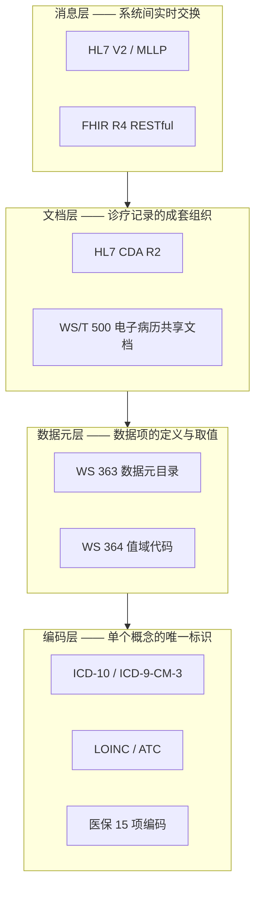
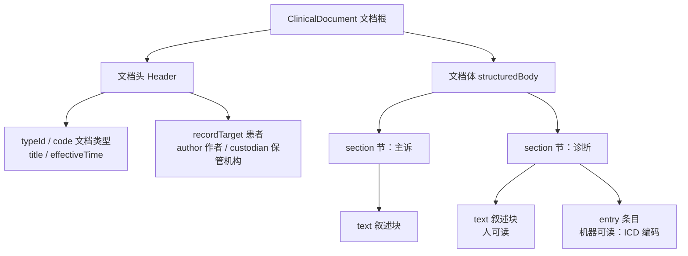
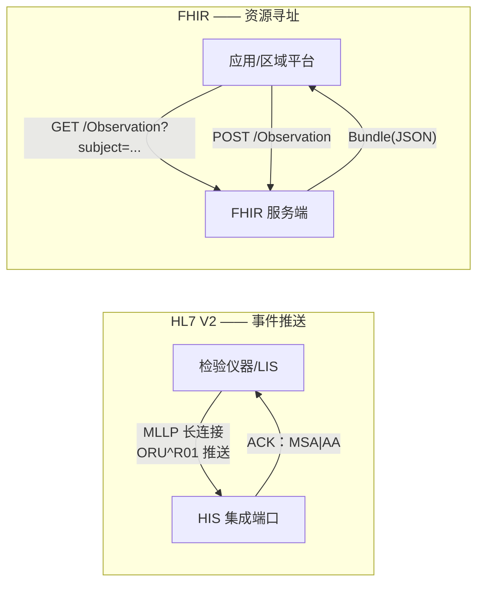

# 第 3 章 标准与规范

> 本章属第一篇「基础篇」。医院信息系统的每一次对接、每一次上报、每一次测评，背后都是标准在起作用。
> 本章自底向上讲解医院信息化的标准体系：分类编码、数据元与值域、临床文档、交换消息、医保编码，
> 最后讨论标准落地的工程策略。与后续章节的分工是：本章讲标准本身的结构与设计思想，
> 实现细节引向对应章——HL7 通信实战在第 6 章，医保贯标与接口在第 10 章，CDA 文档生成在第 11 章，
> 病案编码质量管理在第 12 章。

## 学习目标

学完本章，你应当能够：

1. 画出医院信息标准的四层全景图（分类编码 / 数据元与值域 / 文档 / 消息），说出每层代表性标准与它解决的问题；
2. 解释 ICD-10 的类目—亚目—扩展码结构与国家临床版的关系，给定一段诊断文本能说出编码的查找思路；
3. 说出卫生信息数据元的三要素（标识、定义、表示），读懂一条 WS 363 数据元并把它落成一行元数据记录；
4. 描述 CDA 文档的层次结构（头/体/节/条目）与三级结构化程度，解释「文档」与「消息」的本质区别；
5. 读懂一条 HL7 V2 报文的段结构，解释事件驱动模型与 ACK 应答机制；
6. 说出 FHIR 资源模型与 RESTful 交换的要点，能对给定场景论证选 V2 还是 FHIR；
7. 解释医保 15 项编码贯标的意义，理解「标准内建」相对「事后改造」的工程优势。

---

## 3.1 分类编码体系

### 3.1.1 标准的四层全景

初学者面对医疗信息标准，最大的困惑是「这么多标准到底谁管谁」。一个有效的心智模型是按**粒度**分四层（图 3-1）：最底层是**分类编码**——给单个概念（一个诊断、一个药品、一个检验项目）一个全局唯一的码；其上是**数据元与值域**——规定一个数据项叫什么、什么类型、取值从哪个代码表里选；再上是**文档**——规定一次诊疗产生的成套记录（出院小结、检验报告）如何组织；最上层是**消息**——规定系统之间实时传递数据的报文格式与交互行为。上层标准引用下层：一条 HL7 消息的字段里装着 LOINC 编码，一份 CDA 文档的条目里装着 ICD 编码。



*图 3-1 医院信息标准四层全景：上层标准的字段里装着下层标准的码*

本章 3.1—3.6 依次走完这四层（医保编码单列一节，因为它自成体系且直接关联收入），3.7 讨论怎么把它们落进一个真实系统。

### 3.1.2 ICD-10：疾病分类

**ICD**（International Classification of Diseases，国际疾病分类）由世界卫生组织维护，是全球通用的疾病和有关健康问题的统计分类。当前我国病案与医保场景使用的是第十次修订本 **ICD-10**（ICD-11 已由 WHO 发布，国内处于试点推进阶段，【成稿核对：ICD-11 国内应用的最新政策口径】）。

ICD-10 的编码是**字母开头的层级结构**：

- **章**：全书按疾病系统与特殊目的分为 22 章，每章占用若干字母段（如第十章呼吸系统疾病为 J00–J99）；
- **类目**：3 位码（字母 + 两位数字），如 `J06` 多部位急性上呼吸道感染；
- **亚目**：4 位码（类目 + 小数点后 1 位），如 `J06.9` 急性上呼吸道感染，未特指；
- **扩展码**：我国临床使用的版本在亚目之后再扩展 2 位，形成 6 位码，如 `J06.900`——这是**国家临床版**（国家卫生健康委组织编制的《疾病分类代码国家临床版》，【成稿核对：国临版现行版本号与发布年份】）的形态。此外国家医保局另有**医保版**疾病诊断分类代码（贯标编码之一，见 3.6），两版同源于 ICD-10 但扩展码不完全一致，病案与医保上报时须按各自口径。

ICD-10 还有两个编码机制值得知道：**剑号/星号双重分类**（†/*）——病因编码与临床表现编码成对出现，如结核性脑膜炎以剑号编病因、星号编表现；**肿瘤形态学码**（M 码）——肿瘤除部位编码外另编组织学形态与动态（良性/恶性/原位）。

给一段诊断文本编码的基本思路（详细的编码规则与主要诊断选择原则属病案专业，第 12 章展开）：先从诊断中找**主导词**（通常是疾病名称的核心，如「肺炎」而非部位词「左下肺」），查字母顺序索引得到候选类目，再回**类目表**核对包含与排除注释，编到可编的最细一级。切忌拿着诊断全文在字典里做字符串模糊匹配——「胃溃疡穿孔」与「胃溃疡」是不同亚目，编码的粒度直接决定 DRG 入组（第 10 章）与统计口径。

### 3.1.3 ICD-9-CM-3：手术与操作分类

诊断用 ICD-10，**手术与操作**用 **ICD-9-CM-3**（ICD-9 临床修订本第三卷）——这是历史形成的搭配：WHO 的 ICD-10 没有配套的操作分类，各国沿用或自建，我国选择在 ICD-9-CM 第三卷基础上扩展为国家临床版（【成稿核对：ICD-9-CM-3 国临版现行版本】）。其编码为纯数字 `xx.xx` 形态（如阑尾切除术 47.0x），按解剖系统分章。病案首页的手术操作编码质量与诊断编码同等重要——DRG 分组的外科/内科分流正是「是否有手术操作编码」驱动的（第 10 章 10.6）。

### 3.1.4 药品、检验与收费项目编码

诊断之外，医院日常数据里还有三类高频编码对象：

- **药品**。院内通常自编药品字典码；行业层面有多套编码并存：药品批准文号（监管身份）、国家药品编码本位码（流通条码体系）、WHO 的 **ATC 分类**（Anatomical Therapeutic Chemical，解剖学治疗学化学分类，7 位层级码如 `J01CA04` 阿莫西林——它标识的是「成分类别」而非具体药品，适合用药分析与 DDD 统计，第 12 章）、以及医保药品编码（一药一码，见 3.6）。多套编码各有用途，系统设计要点是**院内码为主键、标准码为映射属性**。
- **检验项目**。国际通用编码是 **LOINC**（Logical Observation Identifiers Names and Codes），如血红蛋白 `718-7`。LOINC 解决的是「不同医院的『血红蛋白』是不是同一个项目」——区域平台做检验结果互认时，本地项目码必须映射到 LOINC 或省级统一目录才能跨院比对。
- **收费项目**。依据《全国医疗服务价格项目规范》与各省价格文件形成收费目录，医保侧另有医疗服务项目贯标编码。收费编码是「政策敏感」编码——调价、新增、停用频繁，字典必须支持启停与生效日期。

> **案例框 3-1：编码在 HIP 里落在哪**
>
> HIP 的编码落点体现「院内码为主键、标准码贯穿业务」的结构：
>
> - ICD-10 字典表 `md_icd10`（code/name/pinyin，[V4__masterdata.sql](../../server/src/main/resources/db/migration/V4__masterdata.sql)）是一张**简表**——种子只有几十条常见诊断（`J06.900` 急性上呼吸道感染等），实施时由医院导入全量国临版字典（第 14 章的字典 CSV 模板家族）。表结构上 code 即主键，6 位国临版码原样承载；
> - 诊断落库时**码与名一起冗余**：`outp_diagnosis` 表存 `icd_code + icd_name + primary_diag`（主诊断标记）。冗余名称不是偷懒——字典年年更新，诊断记录必须保留开立当时的名称口径，这是病历的法律属性决定的；
> - 编码进而成为下游逻辑的**驱动键**：DRG 分组表 `drg_group_def` 按 `icd_prefixes`（ICD 前缀清单）命中病例，单病种上报 `sd_disease_def` 按 `icd_prefix` 自动入组——前缀匹配之所以可行，正是因为 ICD 是层级编码，前缀天然代表上位分类。**编码不只是上报字段，而是可计算的数据资产**——这是「标准内建」（3.7）最直接的红利。

---

## 3.2 卫生信息数据元与值域代码

### 3.2.1 元数据方法：数据元三要素

编码解决「概念怎么标识」，数据元解决「数据项怎么定义」。**数据元**（Data Element）是不可再分的最小数据单元，国家卫生行业标准用统一的元数据方法描述它，核心是三要素：

1. **标识**：全国唯一的数据元标识符，形如 `DE02.01.040.00`——DE 前缀 + 分类段（大类.小类）+ 顺序号 + 版本段，标识符本身携带分类信息；
2. **定义**：名称与语义定义（「性别代码」＝本人生理性别的代码标识）；
3. **表示**：数据类型 + 表示格式 + 允许值。数据类型分字符型（S）、数值型（N）、日期型（D）、布尔型（B）、编码型（C）等；表示格式用紧凑记法，如 `A..50`（可变长字符最长 50）、`AN..18`（字母数字混合最长 18）、`YYYYMMDD`（日期）、`N1`（1 位数字）；编码型数据元的允许值指向一张**值域代码表**。

这套方法的行业标准载体是：**WS/T 303**《卫生信息数据元标准化规则》定方法论，**WS 363**《卫生信息数据元目录》给出全国统一的数据元清单（分主题多个部分，【成稿核对：WS 363 的部分数与现行版本】），**WS 364**《卫生信息数据元值域代码》配套给出各编码型数据元的代码表。例如「性别代码」的值域引用国标 GB/T 2261.1（0 未知、1 男、2 女、9 未说明），而不是各家系统自造「M/F」。

数据元方法的价值在**上报与互认**场景兑现：互联互通测评、区域平台对接、各类国家级上报，本质都是把院内字段映射到国家数据元。院内建表时若字段命名、类型、值域与数据元对齐，映射就是一张薄薄的对照表；若各业务系统自造口径，每次上报都是一场字段考古。

### 3.2.2 值域代码：字典的字典

数据元向上组装成**数据集**（Dataset）：一个业务主题所需数据元的集合，如「住院病案首页数据集」「门诊摘要数据集」。行业标准为数据集的分类编码与元数据描述定了规则（WS/T 306 等），各类国家级数据集标准（电子病历基本数据集 WS 445、健康档案相关数据集）都遵循同一元数据框架。于是形成一条清晰的组装链：**数据元 → 数据集 → 共享文档**——3.3 的 WS/T 500 文档正是把 WS 445 数据集套进 CDA 结构的产物。理解这条链，读任何一份上报接口文档都会快很多：接口文档的字段清单本质就是一个数据集，每个字段背后是一条数据元。

值域代码表回答「这个编码型字段可以取哪些值」。它与业务字典的关系值得辨析：院内字典（科室表、药品表）是**实例数据**，各院不同；值域代码（性别、婚姻状况、证件类型、民族）是**标准枚举**，全国统一。系统设计的常见错误是把两者混在一张「通用字典表」里，导致标准枚举被实施人员随手改值。正确姿态是：值域代码表随产品发布、锁定修改；业务字典开放维护（第 5 章的字典管理、第 14 章的种子数据分层讲的正是这个边界）。

> **案例框 3-2：一条 WS 363 数据元怎么落进 HIP**
>
> HIP 的数据治理模块（datagov）用 `dg_data_element` 表承载数据元登记（[V23__phase26_datastd.sql](../../server/src/main/resources/db/migration/V23__phase26_datastd.sql)），列结构就是三要素的直译：`code`（数据元标识，唯一约束）、`name`、`datatype`（S/N/D/B/C 五型）、`format`（表示格式）、`value_set`（允许值说明）、`std_ref`（引用标准出处）。种子数据示范了标准的读法：
>
> | code | name | datatype | format | value_set | std_ref |
> |---|---|---|---|---|---|
> | DE02.01.039.00 | 本人姓名 | S | A..50 | — | WS 363.2 |
> | DE02.01.040.00 | 性别代码 | C | N1 | GB/T 2261.1（0-9） | WS 363.2 |
> | DE02.01.005.01 | 出生日期 | D | YYYYMMDD | — | WS 363.2 |
> | DE08.10.052.00 | 危急值标识 | B | T/F | 是/否 | WS/T 303 |
>
> 配套的 `dg_term` 表做**术语映射**：本地术语 → 标准编码，键为「类别 + 本地名称 + 标准体系」，`std_system` 支持 ICD10 / LOINC / ATC / ICD9CM3 多体系并存——同一个本地药品可以既映射 ATC 又映射医保码。种子里的三行（急性上呼吸道感染→`J06.900`@ICD10、血红蛋白→`718-7`@LOINC、阿莫西林胶囊→`J01CA04`@ATC）恰好对应 3.1.4 的三类编码对象。管理入口在 [DataStdController.java](../../modules/datagov/src/main/java/cn/hip/datagov/web/DataStdController.java)（重复登记返回专用错误码 4630/4631）。
>
> 要诚实指出当前的局限：这两张表是**登记册形态**——数据元没有反向驱动业务表的建表与校验，术语映射也尚未接入上报/同步链路，它们此刻的价值是把标准对照**留在系统里而不是实施人员的 Excel 里**。演进方向（第 12 章数据治理）是让质量规则引用数据元做校验、让 CDA 生成与数据订阅查询 `dg_term` 完成编码转换——登记册先行，消费链路渐进接入，这本身就是标准落地的务实节奏。

---

## 3.3 电子病历文档标准：CDA 与 WS/T 500

### 3.3.1 文档与消息的本质区别

检验结果既可以装在 HL7 消息里（3.4），也可以装在 CDA 文档里，初学者常问何必两套。区别在语义：**消息**是「事件通知」——瞬时、面向系统、传完即完成使命；**文档**是「诊疗记录」——持久、面向人的阅读、具有完整性与法律属性。CDA 规范对文档的定义强调六个特征：持久性、可管辖性（由机构负责保管）、可认证性（可签名）、完整性（整体为单位）、人可读性、上下文性。一份出院小结签名归档后是不可再拆的整体；而一条「结果已发布」的消息不需要签名，也没人会十年后调阅它。

### 3.3.2 CDA 的层次结构

**CDA**（Clinical Document Architecture，临床文档架构）是 HL7 组织的文档标准，现行为 R2 版本，基于 HL7 V3 的 RIM 模型，用 XML 表达。一份 CDA 文档的骨架自上而下四层（图 3-2）：



*图 3-2 CDA 文档层次：头/体/节/条目，text 给人读、entry 给机器读*

- **文档头**（Header）：文档类型、标识、时间，以及三类参与者——患者（recordTarget）、作者（author）、保管机构（custodian）。头部是全结构化的，保证「不打开正文也能管理文档」；
- **文档体**（Body）：由若干**节**（section）组成，每节对应临床叙述的一个自然段落（主诉、现病史、诊断、用药）；
- 每节内部双轨并行：**text 叙述块**是人可读的富文本，**entry 条目**是机器可读的编码语句（一条诊断 entry 里装着 ICD 码）。

由此定义了三级结构化程度：**Level 1** 只有头结构化、体为整段叙述；**Level 2** 体分节、节有编码标题；**Level 3** 节内含 entry 条目级编码。三级不是优劣而是成本阶梯——Level 1 一天能做出来，Level 3 要求上游业务数据本身是结构化的。

CDA 的标识体系用 **OID**（Object Identifier，对象标识符）——层级化的数字串，HL7 的根为 `2.16.840.1.113883`。文档类型、编码体系、机构都以 OID 全局定位，这是跨机构交换不撞车的前提。

### 3.3.3 WS/T 500 系列：中国的共享文档规范

我国在 CDA R2 基础上制定了本土化的文档规范族：**WS 445**《电子病历基本数据集》定义各类病历记录该有哪些数据元（承接 3.2 的数据元方法），**WS/T 500**《电子病历共享文档规范》定义如何把数据集组装成 CDA 形态的共享文档（分数十个部分，覆盖病历概要、门急诊病历、检查检验报告、住院病案首页、出院小结、手术记录等，【成稿核对：WS 445 / WS/T 500 的部分数与发布年份】；另有面向公卫的 WS/T 483 健康档案共享文档规范）。互联互通标准化成熟度测评（第 1 章）的核心技术要求，正是医院能按 WS/T 500 生成规定种类的共享文档并提供检索服务——这是「文档标准」从教科书概念变成医院刚需的现实驱动。

> **案例框 3-3：HIP 的 CDA 骨架生成**
>
> HIP 的临床数据中心（CDR，第 11 章）为每份患者文档提供 CDA 样式输出：`GET /api/cdr/documents/{id}/cda` 返回 XML，生成逻辑在 [CdrSyncService.java](../../datacenter/cdr/src/main/java/cn/hip/cdr/service/CdrSyncService.java) 的 `toCda()`。对照 3.3.2 的层次读这段模板：根元素 `ClinicalDocument`（命名空间 `urn:hl7-org:v3`），`typeId` 的 OID 根 `2.16.840.1.113883.1.3`，头部有 `code/title/effectiveTime` 与 `recordTarget/patientRole`（患者标识、姓名、性别、出生日期取自 EMPI），体部是 `structuredBody → component → section`，节内容以 `<text><![CDATA[...]]></text>` 装载文档 JSON——严格说这是 **Level 1**：头结构化、体为叙述块，没有 entry 条目。
>
> 这个「骨架先行」的取舍值得体会：CDR 的文档内容本身是结构化 JSON（诊断带 ICD 码、检验带结果行），升到 Level 3 缺的不是数据而是映射工作量——把 JSON 字段逐一translate成 entry 的 XML 语句、编码走 `dg_term` 转换。骨架把「文档类型、患者、层次结构」这些**接口形态**先钉住，测评或区域平台要求到来时，升级发生在 `toCda()` 一个方法内部，调用方无感。这与第 10 章「结构完整、目录简化」的 DRG 分组器是同一个方法论。

---

## 3.4 消息交换标准：HL7 V2 与 MLLP

### 3.4.1 报文文法

**HL7 V2** 是 1980 年代末诞生、至今仍统治设备与科室系统接口的消息标准。它的报文是管道分隔的分段文本：报文由**段**（Segment）组成，段名 3 个大写字母；段内**字段**以 `|` 分隔，字段内**组件**以 `^` 分隔，再加重复符 `~`、转义符 `\`、子组件符 `&`，五个分隔符在报文头 `MSH|^~\&|...` 中自我声明。常用段：**MSH** 消息头（收发方、时间、消息类型、控制号、版本）、**PID** 患者标识、**OBR** 申请/医嘱信息、**OBX** 观察结果（一行一个结果项）。一条检验结果报文的具体样例、字段释义与著名的「MSH-1 是分隔符本身」索引陷阱，第 6 章 6.3 已随 HIP 实现详解，此处不重复。

### 3.4.2 事件驱动模型与应答

V2 的交互哲学是**事件驱动**：真实世界发生一件事（患者入院、医嘱开立、结果发布），触发一条对应类型的消息。消息类型 = 消息类别 + 触发事件，写在 MSH-9，如 `ADT^A01`（入院）、`ADT^A08`(患者信息更新)、`ORM^O01`（医嘱）、`ORU^R01`（检验结果）。接收方处理后回 **ACK 应答**：`MSA|AA`（接受）或 `MSA|AE`（应用错误，带原因），控制号原样回带以便发送方匹配。「事件—消息—应答」这个三元组是理解一切 V2 接口文档的钥匙。

传输承载的事实标准是 **MLLP**（Minimal Lower Layer Protocol）：TCP 长连接上以控制字符定帧（`0x0B` + 报文 + `0x1C 0x0D`）。HIP 的 [MllpServer.java](../../platform/integration/src/main/java/cn/hip/platform/integration/mllp/MllpServer.java) 与解析器 [Hl7V2Message.java](../../platform/integration/src/main/java/cn/hip/platform/integration/hl7/Hl7V2Message.java) 是一份不到 200 行的完整参考实现（第 6 章案例框 6-2）。

### 3.4.3 版本演进与「方言」问题

V2 从 2.1 一路演进到 2.9，惯例上**小版本向后兼容**：新版本增段增字段，不改既有字段语义，所以 2.3 的解析器大体能读 2.5 的报文。国内设备与 LIS 中间件最常见的是 2.3.1 与 2.5.x。V2 的最大特点也是最大问题是**宽松**：大量字段可选、允许自定义 Z 段，每家厂商都说自己「支持 HL7」，但字段用法各不相同——业内自嘲「见过一个 HL7 接口，就只见过这一个 HL7 接口」。这决定了 V2 对接的工程重心不在解析器而在**逐家联调与字段映射表**，也解释了为什么 HIP 选择宽容取值的轻量解析器而非强类型类库（第 6 章）。V2 报文本质是「电报」——紧凑、高效、但要拿着码本才能读；这为 3.5 的 FHIR 出场做了铺垫。

---

## 3.5 HL7 FHIR R4：新一代互操作

### 3.5.1 资源模型

**FHIR**（Fast Healthcare Interoperability Resources，快速医疗互操作资源）是 HL7 组织的新一代标准，现行主流版本 **R4**（4.0.1，2019 年发布）。它的核心创新是把医疗信息拆成约一百五十个**资源**（Resource）：`Patient`（患者）、`Encounter`（就诊）、`Observation`（观察/检验结果）、`Condition`（诊断）、`MedicationRequest`（用药申请）……每个资源是一个有标准字段定义的 JSON/XML 对象，资源之间以引用（reference）连接——一条 `Observation` 通过 `subject` 引用它的 `Patient`。本地化扩展不再靠 Z 段，而是规范化的 **extension** 机制与 **profile**（对资源的约束裁剪）。

对比 V2 的「电报」，FHIR 资源是自描述的：

```json
{
  "resourceType": "Observation",
  "status": "final",
  "code": { "coding": [{ "system": "http://loinc.org", "code": "718-7", "display": "Hemoglobin" }] },
  "subject": { "reference": "Patient/P00000002" },
  "valueQuantity": { "value": 45, "unit": "g/L" },
  "interpretation": [{ "coding": [{ "code": "LL" }] }]
}
```

注意 `code.system` 指向 LOINC——四层全景（图 3-1）中「消息层引用编码层」在 FHIR 里是显式的 URI，而 V2 的 OBX-3 只是裸编码，靠接口文档约定体系。

### 3.5.2 RESTful 交换形态

FHIR 的第二个创新是交换方式：不再定义专用传输协议，直接采用 Web 的 **RESTful** 风格——每个资源有 URL（`GET /Patient/123` 读取、`POST /Observation` 创建、`PUT` 更新），支持标准化检索（`GET /Observation?subject=Patient/123&code=718-7`），批量操作用 `Bundle` 资源打包，服务端以 `CapabilityStatement` 声明自己支持什么。这让医疗接口与互联网技术栈汇合：HTTPS、OAuth2 授权（SMART on FHIR 应用生态）、JSON、前端可直连。两代标准的交换形态对比见图 3-3：



*图 3-3 V2 与 FHIR 的交换形态：点对点事件推送 vs 资源化按需读写*

### 3.5.3 与 V2/CDA 的关系与迁移趋势

FHIR 不会短期取代 V2——设备与 LIS 中间件的存量生态太深，V2 在「科室系统/设备接口」这一层还会长期存在；CDA 所代表的「文档」概念在 FHIR 中由 `DocumentReference` 与文档型 Bundle 承接。务实的图景是**分层共存**：设备层 V2、文档交换层 CDA/WS 500、新建的应用层与区域互联层渐进采用 FHIR，中间靠集成平台做转换。国内现状：互联互通测评的技术底座仍是 WS 系列文档与服务规范，FHIR 多见于互联网医疗、科研数据平台与新建区域项目（【成稿核对：FHIR 在国内测评/行业规范中的最新采纳情况】）。

给工程师的选型直觉：**对方是设备或传统 LIS/PACS，用 V2；对外提供数据服务、对接互联网应用或新建平台，用 FHIR；要交换有签名归档语义的成套病历，用文档标准**。HIP 当前未内置 FHIR 服务端——它面向的县市级单院场景暂无此需求，但 CDR 的患者文档模型（第 11 章）与 FHIR 的资源思想同构，未来在 CDR 之上加一层 FHIR Facade 是清晰的演进路径。

---

## 3.6 医保编码与接口规范

### 3.6.1 15 项贯标编码

国家医保局自 2019 年起推行全国统一的医保信息业务编码（业内称**贯标**），共 15 项，可分三组理解（【成稿核对：15 项编码的完整枚举与现行文号】）：

| 组 | 编码项（举要） | 对医院的意义 |
|---|---|---|
| 目录类 | 医保疾病诊断分类与代码、手术操作分类与代码、医保药品、医疗服务项目、医用耗材 | 与院内字典逐条对照，决定每行费用的报销口径 |
| 机构人员类 | 定点医疗机构、医保医师、医保护士、定点零售药店等 | 结算与处方上传的身份标识，人员变动须同步维护 |
| 业务类 | 医保结算清单、门诊慢特病病种、按病种结算病种等 | 上报文书与支付方式的载体编码 |

贯标之前，各统筹区自编目录码，医院对接三个统筹区就要维护三套对照；贯标把「N 地 × N 码」收敛为「院内码 × 全国码」一套映射。对医院信息系统，贯标落点就是 3.1.4 讲的映射结构：HIP 的 `yb_catalog_map` 表（[V24__phase27_insurance.sql](../../server/src/main/resources/db/migration/V24__phase27_insurance.sql)）以 `item_type + item_code`（院内）对 `yb_code`（医保贯标码），附带 `charge_class`（甲乙丙）与 `self_ratio`（先行自付比例），后续迁移又补了 `effective_date` 生效日期——编码对照是有时间维度的（目录年度调整）。对照工程与对照率管理在第 10 章 10.1 详述。

### 3.6.2 接口规范的形态

医保接口在标准形态上与前几节都不同：它不是公开的行业标准文本，而是**国家统一接口规范 + 省级实施包**的双层结构。国家医保局发布统一的接口规范文档——报文为 JSON，接口按业务编号组织（人员信息查询、费用明细上传、结算、冲正、对账文件下载等各有编号，【成稿核对：引用接口编号时对照现行版本接口文档】）；落到各省则是不同的接入形态：动态库 SDK、独立前置服务或报文网关，部署于院内前置机并经医保专线接入。这种「规范统一、实施各异」的形态，决定了医院端系统必须用适配器把省差异挡在平台之外——HIP 的 `InsuranceAdapter` SPI 及其书面契约 [ADR-0002](../adr/ADR-0002-医保SDK实现约定.md) 是完整的工程答案，第 10 章 10.7 详述。

医保域还有一份值得单列的「文档级」规范：**医保结算清单**——全国统一格式的出院结算文书，整合病案首页核心项、行级费用明细与医保结算信息，是 DRG/DIP 付费的官方数据载体。把它放进本章的框架看：清单的字段清单是一个数据集（每个字段对应贯标编码或数据元口径），清单本身是一份结构化文档，上传走接口规范——医保域把四层标准完整走了一遍。清单对院内系统的连锁要求（行级费用、编码质量、结算号）在第 10 章 10.6.4 展开。本章只需记住定位：**贯标编码是数据标准，接口规范是交换标准，两者合起来构成医保域自成一体的「小四层」**。

---

## 3.7 标准落地策略：内建 vs 事后改造

### 3.7.1 两条路线的真实代价

标准进系统有两条路线。**事后改造**：系统按自己的舒服方式建模，等测评、上报、对接来了，再开发导出与映射。**内建**：建模阶段就让关键字段对齐标准——诊断表带 ICD 码列、费用表行级可归类、患者表字段对齐数据元、留痕表按交换规范设计。

事后改造的代价常被低估，因为最贵的不是写导出程序，而是**当初没存的数据**：住院费用只记总额，DRG 要行级明细（第 10 章的真实返工）；诊断只存文本，上报要编码——补录历史数据的人力是数量级于开发的成本。而内建的代价其实很小：标准早已把字段、类型、值域设计好了，照着建模几乎不增加工作量，难的只是**建模的人得知道标准**。这正是本章存在的理由——标准知识的价值兑现在建模的那一刻，而不是测评前的冲刺里。

当然，内建不等于全量吞下标准。务实的内建是分级的：**编码字段与行级粒度必须内建**（数据没存就永远没了）；**文档与接口形态可以骨架先行**（结构对、内容简化，如 Level 1 CDA）；**映射内容可以渐进补齐**（对照率作为运营指标管理）。

### 3.7.2 HIP 的「标准内建」地图

把本章讲过的标准与 HIP 的模块落点对齐成一张地图，作为四层全景（图 3-1）的落地版：

| 标准层 | 标准 | HIP 落点 | 载体 |
|---|---|---|---|
| 编码 | ICD-10 / ICD-9-CM-3 | 主数据 + 各业务模块 | `md_icd10` 字典、`outp_diagnosis` 等码名冗余、DRG/单病种前缀驱动 |
| 编码 | 医保贯标码 | modules/insurance | `yb_catalog_map` 对照表 + CSV 导入 + 对照率 |
| 数据元 | WS 363 / WS 364 | modules/datagov | `dg_data_element` 登记、`dg_term` 术语映射（ICD10/LOINC/ATC 多体系） |
| 文档 | CDA / WS/T 500 | datacenter/cdr | `toCda()` Level 1 骨架、`/documents/{id}/cda` |
| 消息 | HL7 V2 / MLLP | platform/integration | `Hl7V2Message` 解析、`MllpServer` 监听、`int_message_log` 留痕 |
| 接口 | 医保接口规范 | platform/integration + insurance | `InsuranceAdapter` SPI、ADR-0002 契约 |

> **案例框 3-4：一份血常规报告的三种标准形态**
>
> 收束本章，追踪同一份检验报告在 HIP 里穿过的三层标准，体会各层标准回答的问题不同：
>
> 1. **消息形态（进院门）**：检验仪器经 LIS 中间件把结果推成 `ORU^R01` 报文，MLLP 帧进 `MllpServer`，`OruProcessingService` 从 OBR-2 取申请单号、逐条 OBX 取结果（项目码^名称、值、单位、参考范围、异常标志），发布事件驱动医嘱执行与危急值告警（第 6 章）。此刻标准回答的是「**两个系统怎么实时对话**」；
> 2. **数据形态（进数据中心）**：CDR 同步任务把已执行的检验医嘱聚合成 `LAB_REPORT` 类型的患者文档——结构化 JSON 存 `results` 行（item_name/result_value/unit/ref_range/abnormal_flag），患者维度可检索（第 11 章）。标准（数据元与值域的口径）回答的是「**数据项怎么统一定义以便聚合**」；
> 3. **文档形态（出院门）**：区域平台来取时，`toCda()` 把这份文档包成 CDA XML——头部是标准化的患者与文档标识，体部装载报告内容。标准回答的是「**一份完整记录怎么跨机构交换与存证**」。
>
> 同一份数据，三层标准各司其职、在系统里各有载体——这就是「标准体系」四个字的工程含义：不是一摞要应付的文件，而是系统架构里一组各就各位的构件。

---

## 本章小结

- 医疗信息标准按粒度分四层：**分类编码**（概念的唯一标识）→ **数据元与值域**（数据项的定义与取值）→ **文档**（成套记录的组织）→ **消息**（系统间交换），上层引用下层。
- ICD-10 是字母开头的层级编码（类目 3 位→亚目 4 位→国临版扩展至 6 位），手术操作配 ICD-9-CM-3；层级性使前缀匹配可用于 DRG 入组与单病种筛选——**编码是可计算的数据资产**。药品、检验、收费各有编码体系（ATC/LOINC/价格规范），系统以院内码为主键、标准码为映射。
- 数据元三要素：**标识**（DE 编号）、**定义**、**表示**（类型 + 格式 + 值域）；WS/T 303 定方法、WS 363 给目录、WS 364 配值域。值域代码是全国统一枚举，须与院内业务字典分治。
- CDA 文档四层结构（头/体/节/条目），text 给人读、entry 给机器读，结构化程度分三级；WS/T 500 是中国化的共享文档规范，互联互通测评是其现实驱动。**文档与消息的区别在持久性、完整性与法律属性**。
- HL7 V2 是管道分隔的事件驱动报文（事件—消息—ACK 三元组），MLLP 承载；宽松性导致「方言」丛生，对接重心在逐家联调。FHIR R4 以资源模型 + RESTful 重塑互操作，编码体系引用显式化；两代标准将长期分层共存，选型看对端形态。
- 医保 15 项贯标编码统一了全国目录口径，接口规范呈「国家统一规范 + 省级实施包」双层结构，医院端以适配器收敛省差异。
- 标准落地**内建优于事后改造**：编码字段与行级粒度必须建模期内建，文档/接口可骨架先行，映射内容渐进补齐。最贵的返工永远是「当初没存的数据」。

## 思考与练习

1. **概念**：用四层全景图定位以下标准各属哪一层，并说明相邻层如何引用：LOINC、WS 364、ORU^R01、WS/T 500 出院小结、医保药品编码。
2. **编码**：患者诊断文本为「左下肺大叶性肺炎」。写出你查 ICD-10 的思路（主导词选什么、索引与类目表如何配合），并说明若病案员简化编为「肺炎，未特指」（J18.9），会对 DRG 入组与疾病谱统计造成什么影响。
3. **设计**：参照案例框 3-2，把 WS 363 中「就诊日期时间」类数据元登记为 `dg_data_element` 的一行（自拟合理的 code/datatype/format/std_ref），并说明：若要让门诊挂号表的 `visit_date` 字段受这条数据元约束，系统需要增加什么机制？
4. **辨析**：某三甲医院要向区域平台提供检验报告。平台提供两种接入方式：按 WS/T 500 上传共享文档，或开放 FHIR `Observation` 查询接口。从数据粒度、实时性、签名存证、改造成本四个维度比较两种方式，给出你的选择与理由。
5. **选型**：以下三个对接场景，各选 V2 还是 FHIR？说明理由。（a）新购的血球分析仪回传结果；（b）互联网医院小程序拉取患者历史报告；（c）与邻院互认检验结果、需保留报告原始签发形态。
6. **排障**：实施工程师反馈：某设备中间件发来的 ORU 报文全部被 HIP 应答 `MSA|AE|缺少申请单号（OBR-2）`，但中间件厂商坚称「单号明明放了」。结合 3.4 的报文文法与第 6 章的 MSH 索引陷阱，列出至少三种可能原因与验证方法。
7. **论述**：3.7.1 说「内建的难点是建模的人得知道标准」。假设你是一家 HIS 公司的架构师，设计一套机制（评审清单、字典基线、培训、工具皆可）保证新模块建模时标准不被遗漏，并讨论该机制在「快速交付压力」下如何存活。
8. **实践**（配套实训环境）：把 HIP 的 `toCda()` 从 Level 1 升级一步：为诊断节生成 entry 条目（`<entry><observation>` 内含 ICD 编码，编码体系 OID 自查 ICD-10 的注册值），编码转换查 `dg_term` 表。写出改动的方法、新增的 SQL 与一个验证用例（对比升级前后同一文档的 XML）。
