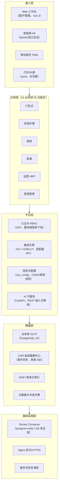
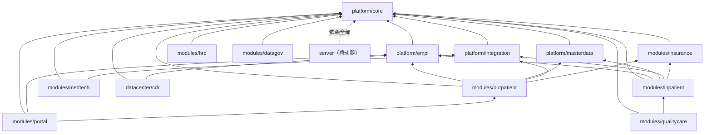
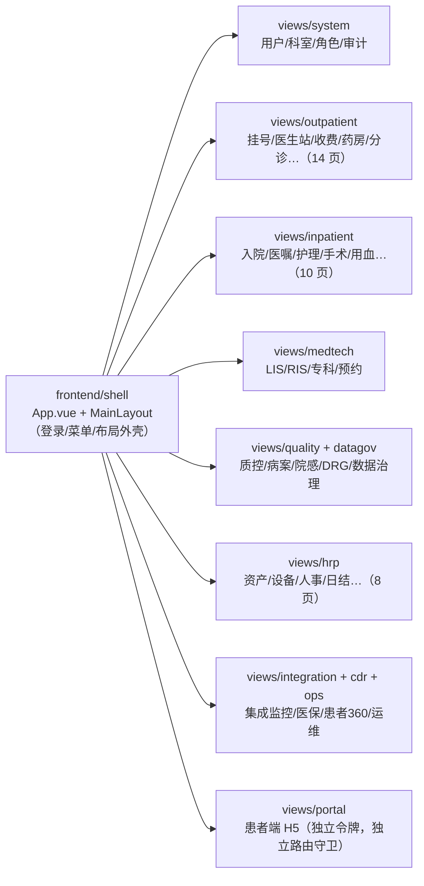

# 第 4 章 总体架构与技术选型

> 本章属第二篇「架构篇」。医院信息系统的架构选择，决定了此后数年里每一次上线、每一次升级、每一次半夜排障的成本。
> 本章从行业三十年的架构演进讲起，聚焦一个贯穿性的命题——**中小医院没有专职 DevOps 团队，这一约束应当如何塑造全部架构决策**；
> 然后依次展开五层总体架构、技术栈选型、数据库架构、工程结构与前端架构，最后介绍架构决策记录（ADR）的写作方法。
> 全章以 HIP 平台的真实仓库为案例，包括两处「规划与落地不一致」的诚实剖析。

## 学习目标

学完本章，你应当能够：

1. 描述医院信息系统从 C/S 单体、SOA/ESB 到微服务与中台的演进脉络，解释每个时代的驱动力与遗留问题，理解「钟摆回摆」现象；
2. 列出微服务架构的隐性成本清单，并针对「县级医院 2–4 台服务器、无专职运维」的场景完成一次模块化单体 vs 微服务的论证；
3. 画出医院信息平台的五层总体架构图，说明每层的职责与典型构件；
4. 掌握技术栈选型的评估维度（生态、人才、生命周期、离线部署、信创路径），解释 HIP 选择 Java + Spring Boot / Vue 3 / PostgreSQL 的理由与备选否决过程；
5. 说出数据库命名空间隔离的谱系（分库—多 schema—表前缀），解释「单一主库、事务一致性优先」的取舍及其保留的拆分口；
6. 理解 Monorepo 工程结构下模块边界的划分依据（业务域内聚、表前缀归属、依赖方向单向），能对一个跨域控制器做出「下沉还是留聚合层」的裁决；
7. 按「背景—决策—备选与否决—影响」结构写出一篇合格的 ADR，判断何时值得写。

---

## 4.1 医院信息系统架构演进

### 4.1.1 三个时代与一次回摆

医院信息系统的架构史，大体经历了三个时代。

**C/S 单体时代（约 1990 年代—2000 年代中期）**。以收费电算化为起点的第一代 HIS（Hospital Information System，医院信息系统），普遍采用两层 C/S 架构：PowerBuilder、Delphi 等工具开发的胖客户端，直连 Oracle 或 SQL Server 数据库，业务逻辑大量写在存储过程里。它的历史功绩是把医院从手工账带进了电算化；它的遗留问题至今仍在许多医院运行着——客户端逐台安装升级、业务逻辑与数据库强绑定难以重构，以及最深远的一条：LIS、PACS、EMR 各自采购自不同厂商，形成一座座**信息烟囱**，系统间靠视图开放、中间表对拷勉强互通。

**SOA/ESB 时代（约 2000 年代中期—2010 年代中期）**。烟囱之痛催生了「集成平台」：以 SOA（Service-Oriented Architecture，面向服务架构）思想为指导、ESB（Enterprise Service Bus，企业服务总线）为载体，把各系统的能力包装成服务挂到总线上，统一注册、路由、编排。互联互通标准化成熟度测评（第 1 章）的技术要求正是这一时代的制度化成果——文档注册、服务注册、统一患者主索引，都以「有一个平台居中」为前提。这个时代解决了「连起来」的问题，但商用 ESB 价格高昂，且总线本身成为新的单点与新的供应商锁定：换 ESB 厂商的代价不亚于换 HIS。

**微服务与中台时代（约 2010 年代中期至今）**。互联网医疗的兴起把互联网行业的技术栈带进了医院：容器、微服务（Microservices）、注册中心、消息队列，以及随后的「中台」叙事。大型三甲医院与区域平台确有匹配的场景——高并发的互联网入口、数百人的开发团队、独立机房与专职运维。但这套架构被不加裁剪地推向中小医院时，问题出现了：一套「微服务版 HIS」动辄几十个服务、十几个中间件，县级医院的机房与人力根本养不起。

三个时代的得失可以并置对比：

| 时代 | 驱动力 | 解决了什么 | 遗留了什么 |
|---|---|---|---|
| C/S 单体 | 收费电算化 | 从手工账到电算化 | 胖客户端运维、存储过程绑定、信息烟囱 |
| SOA/ESB | 互联互通、消除烟囱 | 系统间标准化集成、统一主索引 | 总线单点、商用 ESB 成本与锁定 |
| 微服务/中台 | 互联网医疗、大型组织并行开发 | 独立部署、弹性伸缩、故障隔离 | 分布式复杂度下沉到不具备承接能力的医院 |

于是出现了值得注意的**钟摆回摆**：近年软件行业重新为「模块化单体」（Modular Monolith）正名——在单一部署单元内部保持严格的模块边界，模块间只通过接口与事件通信，需要时再把成熟模块拆出为服务。回摆不是否定微服务，而是承认一个朴素结论：**微服务解决的是组织规模问题（几百人如何并行开发部署），不是代码质量问题；组织没有那个规模，就不该支付那份成本。**

### 4.1.2 康威定律：架构是组织的镜像

康威定律（Conway's Law）指出：系统的结构必然映射设计它的组织的沟通结构。它在医院信息化里有两层读法：

- **供方视角**：几个人的开发团队维护几十个独立部署的服务，意味着每个人同时对抗十几套配置、日志与发布流程——架构粒度超过了组织粒度，代价是持续的摩擦。反之，几百人共享一个单体仓库又会在合并与发布上互相踩踏。粒度要和团队对齐。
- **需方视角**：医院信息科通常只有数名工程师，且以运维与协调为主业。**交付给医院的系统，其运维复杂度必须匹配信息科的组织能力**——这一条比任何技术偏好都更硬，是下一节的出发点。

---

## 4.2 关键抉择：模块化单体 vs 微服务

### 4.2.1 微服务的隐性成本清单

论证之前，先把微服务的成本摊开。教科书常讲它的收益（独立部署、故障隔离、技术异构），成本却往往用一句「复杂度上升」带过。展开来至少有六项：

1. **分布式事务**：收费扣库存这类跨模块强一致操作，从一条本地事务变成 Saga/TCC 补偿编排，正确性论证难度上一个数量级；
2. **网络不可靠**：模块间调用从进程内方法变成 RPC，超时、重试、幂等、熔断成为每个调用点的必答题；
3. **可观测性**：排障需要分布式链路追踪、集中日志、指标聚合——一套 Prometheus + 日志栈本身就是几台服务器和一个专职岗位；
4. **部署编排**：几十个服务需要 Kubernetes 级别的编排，而 K8s 集群的搭建与故障处理是一门独立的手艺；
5. **版本矩阵**：服务间接口兼容性随服务数量组合爆炸，需要契约测试与灰度机制护航；
6. **人**：以上每一项都要有人值守。这是最贵的一项，也是中小医院最缺的一项。

### 4.2.2 约束驱动设计：把「没有 DevOps」写进每个决策

HIP 的目标客户是县级、地市二级医院：机房 2–4 台服务器，内网部署常年离线，信息科没有专职 DevOps 工程师，未来可能有信创要求。**架构设计的正确起点不是「业界最佳实践」，而是这份约束清单**。把约束逐条向下传导，会发现它几乎决定了所有关键选择：

| 约束 | 传导出的架构决策 | 反面（被否决的方案） |
|---|---|---|
| 无专职 DevOps，故障靠电话远程指导 | **模块化单体**：一个 jar 进程，重启=一条命令 | 几十个服务的启动顺序与健康排查 |
| 2–4 台服务器，无独立中间件资源 | **单一 PostgreSQL 主库**，缓存仅 Redis | 注册中心/配置中心/消息集群各占机器 |
| 跨模块通信要可靠但量不大 | **进程内 Spring 事件 + 数据库留痕**，不上消息中间件 | RabbitMQ/Kafka 集群的运维与监控 |
| 升级由实施工程师远程完成 | **Flyway 自动前滚**：换 jar 重启即完成 DDL 升级 | 手工执行 SQL 脚本的漏执行风险 |
| 部署环境异构（物理机/虚拟机） | **Docker Compose** 单文件编排，或直接 systemd 跑 jar | K8s 集群 |
| 会话不能依赖额外组件 | **无状态 JWT** 认证，任一实例可服务任一请求 | 依赖 Redis/粘性会话的服务端 session |
| 未来信创可能 | PostgreSQL 及其兼容生态（4.4 节） | 深度绑定单一商业数据库特性 |

这张表是本章的灵魂：**每一行都是同一个约束的不同侧影**。运维面收敛到「一个 jar + 一个 PostgreSQL + 一个 Redis + 一个 Nginx」，意味着实施工程师可以在电话里指导医院网管完成 90% 的操作——这不是技术保守，而是把「谁来运维」当作第一设计输入。第 13 章的备份任务化、第 14 章的升级演练，都是这条主线的延续。

> **案例框 4-1：ADR-0001 的否决记录**
>
> HIP 的第一篇架构决策记录（[ADR-0001 技术栈与架构风格](../adr/ADR-0001-技术栈与架构风格.md)）用不到一页纸固定了上述选择。最有教学价值的是它的「备选与否决理由」一节，原文只有三行：
>
> - .NET 8：工程质量同级，但国内 HIS 生态、医保/设备 SDK、招聘池均弱于 Java 一档，仅在团队 C# 明显更强时才值得；
> - Python/Node 做主业务：强事务大规模代码库的长期维护成本高，医院内网离线部署不友好，否决；
> - **微服务起步：县级医院 2–4 台服务器、无 DevOps 团队，分布式复杂度不可接受，否决。**
>
> 注意否决微服务的理由里没有出现任何技术词汇——只有服务器台数和人。同时决策为拆分**留了口**：「模块间仅通过接口与事件通信，保留微服务拆分口」，并在影响一节要求第 1–2 迭代内定义模块间通信规范、防止模块间直接引用对方 Repository。留口不是空话，它落成了 4.6 节可以验证的依赖规则。

### 4.2.3 单体不是借口：边界纪律

模块化单体最大的风险是退化为「泥球单体」——反正在一个进程里，谁都能 import 谁。防退化靠的不是意愿而是纪律与机制：模块以独立 Maven module 存在、依赖在 pom 中显式声明且单向（4.6 节）、跨模块协作走接口（SPI）与事件（如检验结果回传事件 `LabResultReceivedEvent`，见第 6 章）、数据表按前缀归属模块（4.5 节）。一个可检验的判据是：**当某个模块需要整体迁出时，成本是否可控**——HIP 曾将医保局案件查办系统（bureau）连同底座依赖从仓库整体迁出为独立产品（[ADR-0003 医保局案件查办系统](../adr/ADR-0003-医保局案件查办系统.md)后记），迁出只涉及删目录与还原根 pom，这就是边界纪律的兑现。

---

## 4.3 五层总体架构

### 4.3.1 分层的意义

分层架构回答的是「变化隔离」问题：接入形态（Web/H5/自助机）变化最快，基础设施最慢，业务居中。把它们放进不同的层，每层只依赖下层的抽象，一层的替换不波及全局。医院场景里分层还有一个特殊价值：**采购与评审的沟通语言**——互联互通测评、等保测评、采购需求书都按类似的层次组织条款，架构图与制度文本同构，逐条对应就不费翻译。

HIP 的总体架构分五层（图 4-1，依据[总体规划](../../总体规划.md)并按落地现状标注）：

图 4-1 HIP 五层总体架构

### 4.3.2 各层要点

- **接入层**：所有入口共享同一后端 API，但会话隔离——患者端使用独立的 PORTAL 令牌，与院内接口完全隔离，防止患者态凭证触达院内业务面（第 13 章脱敏与权限将再次讨论）。
- **应用层**：按业务域组织的功能页（门急诊 18 页、住院 8 页、数据中心 11 页等，全景见第 1 章），域的划分同时是后端模块边界（4.6 节）与功能开关粒度（第 14 章 ModuleGate）。
- **平台层**：业务模块共用的横切能力。注意 AI 子服务的位置——它以独立 Python FastAPI 进程经 REST 接入，主平台对其**优雅降级**：AI 不可用时业务照常。把最不成熟、依赖最重的能力放到进程边界之外，是单体架构里控制风险的常用手法。
- **数据层**：业务库与 CDR 分离（第 11 章），EMPI 与主数据先行建设且保持稳定（第 5 章「底座先行」原则）。
- **基础设施层**：开发与小型部署用 `deploy/docker-compose.yml`（postgres + redis 两个容器），完整部署用 `docker-compose.full.yml` 增加应用与前端；规划中「Docker Compose → K8s」的演进箭头指向区域化场景，单院不启用。

规划文档中的五层图还列有表单引擎、工作流、ODR 运营数据中心等构件，属于规划期的完整蓝图；落地版本以「够用」为度收敛（如报表以 SQL 白名单自定义报表引擎实现，见第 12 章）。**架构图应当区分「已建」与「规划」，评审时逐项对账**——这也是把规划文档与仓库现状对照阅读的意义。

---

## 4.4 技术栈选型方法

### 4.4.1 选型的评估维度

技术选型容易滑向个人偏好之争。把它变成工程问题的办法是先定维度、后比方案。对医院信息系统，实践中最有区分度的五个维度是：

1. **行业生态**：医保 SDK、检验设备接口包、CA 厂商 SDK 提供什么语言的绑定？国内医疗行业事实上以 Java 生态为中心，很多省医保 SDK 只有 Java/C 版本；
2. **人才池**：县市级项目的驻场与维护人员从本地招聘，主流技术栈的招聘半径完全不同；
3. **生命周期**：医院系统一用十年起步，框架要有长期支持（LTS）版本与清晰的升级路径；
4. **离线部署友好度**：院内网常年无外网，依赖管理必须支持完全离线（私服镜像、锁定版本）；
5. **信创路径**：未来被要求替换为国产化组件时，迁移成本是否可控。

用一票否决的思路过一遍这五个维度，候选集会迅速收敛——这比「哪个框架性能高 5%」的争论有效得多。选型还有一条元原则：**优先选无聊的、被大规模验证过的技术**，把创新预算留给业务本身。

### 4.4.2 HIP 的选型与理由

HIP 的实际技术栈（以仓库 [pom.xml](../../pom.xml) 与 [README](../../README.md) 为准）：

| 层 | 选型 | 核心理由 | 备选与信创路径 |
|---|---|---|---|
| 后端 | Java 21 + Spring Boot 3.5，Maven 多模块 | 国内 HIS 生态主流、医保/设备 SDK 齐全、人才好招；LTS 版本 | .NET 8 被否决（生态弱一档）；Python/Node 不做主业务（强事务大代码库维护成本） |
| 前端 | Vue 3 + TypeScript + Element Plus + Vite | 国内企业级中后台事实标准，组件覆盖医疗表单/表格密集场景 | — |
| 数据库 | PostgreSQL 16 | 开源无授权费、事务与 SQL 能力完整、JSON 与全文检索内建 | 信创场景平移达梦/人大金仓（均提供 PostgreSQL 兼容模式，迁移成本相对可控）【成稿核对：两库对 PG 兼容口径与目标版本】 |
| 缓存 | Redis 7 | 缓存与轻量队列，单实例即可 | — |
| AI 子服务 | Python FastAPI 独立进程 | 算法生态在 Python；进程隔离保证故障不影响主业务 | — |
| 部署 | Docker Compose；前端 Nginx | 单院一键起；区域化再考虑 K8s | — |
| 认证 | 无状态 JWT（jjwt）+ RBAC | 不依赖会话中间件 | — |
| 迁移 | Flyway，JPA `ddl-auto=validate` | DDL 全部版本化，禁止 Hibernate 自动建表 | — |

几点展开：

- **版本策略**：Java 21 与 Spring Boot 3.5 都取 LTS/主流稳定线。规划初稿写的是 Java 17，立项时 Java 21 LTS 已稳定即直接采用——选型文档与代码以代码为准，文档随之更新，这正是 ADR 要「保鲜」的原因（4.8 节）。
- **PostgreSQL 与信创**：选择 PostgreSQL 的一个隐含收益是国产数据库多数提供 PG 兼容模式，SQL 方言、驱动层面的迁移工作量远小于从商业数据库迁出。但「兼容」不等于「免测试」——存储过程、锁行为、执行计划都可能有差异，信创迁移应当按一次完整回归对待（HIP 的 19 套 E2E 在此就是迁移验收工具，见第 13 章）。
- **离线部署的工程含义**：选型确定后，还要为「院内网无外网」补一层工艺——后端依赖由 Maven 在构建机解析、交付物是自包含的可执行 jar；前端依赖锁定在 `package-lock.json`、交付物是静态 dist 由 Nginx 托管；数据库与缓存以镜像形式随 Compose 打包。**交付物在有网环境构建、在无网环境运行**，院内永远不做依赖解析——这也是为什么解释型语言做主业务在此维度失分：运行环境即依赖环境，离线补包苦不堪言。
- **禁止 Hibernate 自动建表**：`ddl-auto=validate` 意味着实体与表结构不一致时启动即失败，把「代码与库漂移」压制在开发期。生产库的每一条 DDL 都必须走 Flyway 版本文件，这是 4.5 节迁移纪律的技术抓手。

---

## 4.5 数据库架构：单一主库与命名空间的谱系

### 4.5.1 隔离谱系：从分库到表前缀

「模块的数据如何隔离」存在一条谱系，隔离度递减、一致性与运维成本也递减：

| 方案 | 隔离度 | 跨模块事务 | 运维成本 | 适用 |
|---|---|---|---|---|
| 每模块独立数据库实例 | 最高 | 分布式事务 | 每库都要备份/监控/调优 | 微服务体系 |
| 单实例、每模块一个 schema | 中 | 同库事务可用 | 单库运维；权限/迁移按 schema 管理 | 单体但预留拆库 |
| 单实例单 schema、表名前缀 | 逻辑约定 | 完全无障碍 | 最低 | 中小规模模块化单体 |

医院业务的特殊之处在于**跨模块强一致场景密集**：门诊收费同时要写结算单（门诊模块）、扣药房库存（主数据/药房）、写医保分割留痕（医保模块）、落集成留痕（集成模块）——这在单库里是一条本地事务，在分库体系里是一场 Saga 编排。「事务一致性优先」因此成为 HIP 数据层的第一取舍：**单一 PostgreSQL 主库**，分析型负载则分流到 CDR（第 11 章），不让报表拖垮 OLTP。

> **案例框 4-2：从「schema 隔离」规划到「表前缀」落地**
>
> HIP 的规划与 ADR-0001 均写明「单一主库 + 按模块 schema 隔离，保留拆库能力」；但查看仓库会发现，44 个 Flyway 迁移里没有一条 `CREATE SCHEMA`——实际落地是**单 schema + 表前缀**：`sys_`（平台核心）、`empi_`、`outp_`（门诊）、`inp_`（住院）、`yb_`（医保）、`int_`（集成）、`drg_` 等，前缀即模块归属；实施定制层另有 `impl_` 前缀与独立版本段（[ADR-0003 实施定制层规约](../adr/ADR-0003-实施定制层规约.md)）。
>
> 偏差的原因是务实的：Flyway 单一版本序列跨 schema 管理繁琐；跨模块查询（驾驶舱统计、患者 360 抽取）在单 schema 下最直接；而 schema 承诺的「拆库能力」，表前缀同样保留了——前缀本身就是清晰的归属边界，真要拆时按前缀搬表即可。教学上的两点提醒：其一，**隔离谱系上的位置可以移动，模块归属的约定不能没有**——最怕的不是选了轻量方案，而是表名无规则、归属靠口传；其二，规划与落地出现偏差时，应回头修订 ADR 或补记偏差，让文档保持可信（4.8 节）。

### 4.5.2 迁移纪律

单库单序列的 Flyway 是这套数据架构的秩序来源，HIP 沉淀了四条纪律：

1. **历史迁移不改**：已发布的 V1–V44 版本文件永不修改，纠错一律新增版本（校验和机制也不允许改）；
2. **版本段分配**：平台占 V1–V999；实施定制层从 V10000 起，两段在同一库中互不冲突地前滚——升级标准产品时平台段自动前滚，实施段随实施仓库演进（第 14 章）；
3. **索引也是版本**：38 个迁移后的一次系统性索引审计以新增迁移（V39）落库、只加不删，审计过程用 `EXPLAIN ANALYZE` 实测 E2E 高频查询（[技术债交接单](../技术债交接单.md)债二，方法细节见第 13 章性能工程）；
4. **种子数据分层**：迁移中只保留平台必需数据，行业基线与演示数据剥离到初始化工具（第 14 章种子数据三分层）。

---

## 4.6 工程结构：Monorepo 与模块边界

### 4.6.1 Monorepo 的选择

HIP 采用单仓库（Monorepo）：后端全部模块、前端、部署脚本、E2E 工具、文档（含 ADR）同仓。对小团队，其收益是压倒性的——一次提交可以原子化地同时改后端接口、前端调用与 E2E 断言；依赖用 Maven module 内联而非发布私服构件；全库检索与统一 CI。多仓的收益（独立权限、独立发布节奏）在单产品小团队场景下用不上。当真正出现第二个部署主体时再拆仓——bureau 案件查办系统的迁出（4.2.3）就是在「部署主体、数据边界、发布节奏完全独立」三个条件同时成立后进行的。

根 [pom.xml](../../pom.xml) 聚合的模块清单（每行注释来自各模块 pom 的 `<name>`）：

| 分组 | Maven 模块 | 职责 |
|---|---|---|
| 平台底座 | platform/core | 用户/组织/RBAC/JWT 认证/sys_config/审计 |
| | platform/empi | 患者主索引 |
| | platform/masterdata | 药品/收费/ICD 主数据与库存 |
| | platform/integration | 集成引擎：HL7 V2/MLLP、三类适配器 SPI、留痕 |
| 业务模块 | modules/outpatient | 门诊：挂号/医生站/收费/药房 |
| | modules/inpatient | 住院：入出转/医嘱/护理/结算 |
| | modules/insurance | 医保：目录对照/分割/审核/对账 |
| | modules/medtech | 医技：LIS/RIS/预约叫号 |
| | modules/qualitycare | 质控：病案/DRG/院感/不良事件 |
| | modules/datagov | 数据治理：数据元/填报/质量核查 |
| | modules/hrp | 运营：资产/物资/人事/OA |
| | modules/portal | 互联网患者端（独立会话） |
| 数据中心 | datacenter/cdr | CDR 文档抽取与患者 360 |
| 启动器 | server | 聚合装配、Flyway、跨模块驾驶舱聚合 |

（对外口径「12 后端模块」与 pom 的 13 个非启动器模块存在计数口径差【成稿核对：portal 或 cdr 是否计入宣传口径，统一全书数字】。）

### 4.6.2 依赖关系：方向即架构

模块间依赖关系直接读自各模块 pom（图 4-2）：

图 4-2 HIP 模块依赖关系（箭头指向被依赖方；server 依赖省略展开）

这张图隐含三条规则，也是模块边界的三条划分依据：

1. **业务域内聚**：模块按业务域切分，与前端页面分域、功能开关粒度、表前缀四者对齐——一个域的代码、页面、表、开关在同一边界内；
2. **依赖单向、底座居下**：业务模块可依赖平台底座，底座绝不依赖业务模块；业务模块之间原则上互不依赖；
3. **横向依赖必须有裁决理由**：图中三条业务模块间的边都有明确的业务因果——门诊/住院依赖 insurance 是因为结算必须在事务内调用费用分割引擎（第 10 章）；qualitycare 依赖 inpatient 是因为 DRG 入组读取住院病例；portal 依赖 outpatient 是因为患者端预约复用号源逻辑。**没有说得出口的理由，就不允许连线。**

### 4.6.3 边界从哪里来：一次真实的裁决

边界不是一次画对的。HIP 早期把跨模块的统计与聚合接口都放在 server 启动器里，随着功能增长，server 里积累了一批「究竟属于谁」悬而未决的控制器。清理时逐一裁决的记录保留在[技术债交接单](../技术债交接单.md)中，是模块边界方法论最生动的教材：

> **案例框 4-3：聚合控制器的下沉裁决**
>
> 裁决的判据只有一条：**看它读写哪些表（表前缀即域归属），真跨模块的留 server，单一域的下沉**。摘录裁决表：
>
> | 控制器 | 裁决 | 理由 |
> |---|---|---|
> | StatsController | 留 server | 真跨模块驾驶舱聚合 |
> | DrgController | 下沉 qualitycare | 仅依赖 `inp_*` + `drg_*`，与病案/质控同域 |
> | InsuranceController | 下沉**新建** modules/insurance | 医保域独立——对账虽跨门诊/住院，但表都是 `yb_*` |
> | QueueCenterController | 下沉 outpatient | 三队列数据源均在门诊侧 |
> | PriceFinanceController | **拆**：价格→masterdata，交款核对留 server | 价格属主数据域 |
>
> 两点方法论：其一，InsuranceController 的裁决说明「业务上跨域」不等于「架构上跨域」——对账业务横跨门诊与住院，但它读写的全是 `yb_*` 表，数据归属才是裁决依据，medtech/insurance 等模块正是在这类裁决中被识别并独立出来的；其二，执行工艺是 `git mv` + 包名批量替换 + pom 依赖核对，**每迁一个控制器跑一次全量测试**，五项裁决全部落地时 48 个单元测试与 18 套 E2E 保持全绿、行为零变化。边界重构的安全感来自测试覆盖，不来自小心。

---

## 4.7 前端架构

### 4.7.1 工作台外壳与页面组织

医院前端的特殊性在于**角色多、页面密、共享上下文**：医生站、护士站、收费台、药房共享同一套登录、菜单与患者语境。业界两条路线：微前端（qiankun 等，各业务前端独立开发部署、外壳聚合）与单应用 + 路由懒加载。微前端解决的同样是组织规模问题——多个团队各管一摊时才值得支付其复杂度。HIP 规划期预留了微前端方向，落地为**单一 Vue 应用**：一个外壳（登录、布局、菜单），全部页面按业务域组织在 `views/` 下（图 4-3）：

图 4-3 前端页面组织：单外壳 + 按域分目录（约 60 个视图）

三个关键机制：

- **菜单由服务端下发**：菜单树存于数据库（`sys_menu`），按角色授权过滤后下发，前端 `<component :is>` 动态解析图标。菜单即权限的可见性层，与后端权限点二道防线配合（第 5 章）；也因此模块开关只需在服务端摘掉菜单并让对应 API 返回 404，前端无需改造（第 14 章 ModuleGate）。
- **路由级按需加载**：[router/index.ts](../../frontend/shell/src/router/index.ts) 中每个路由都是 `() => import(...)` 动态导入，构建时每页一个 chunk，首屏只加载外壳与当班角色用到的页面——对「55 功能页但单个用户只用其中几页」的形态，这是免费的性能红利。
- **患者端隔离**：`/portal` 路由使用独立令牌与独立守卫，与院内会话完全隔离。

### 4.7.2 包体积治理：一次真实的摇树排障

> **案例框 4-4：element-plus 按需引入与 manualChunks 陷阱**
>
> HIP 前端早期全量引入 Element Plus，该依赖独立 chunk 达 1.07MB（gzip 339KB）。治理记录在[技术债交接单](../技术债交接单.md)债三，改造分三步：
>
> 1. 引入 `unplugin-vue-components` + ElementPlusResolver，模板中的组件自动按需解析并带样式；
> 2. 编程式调用的 `ElMessage`/`ElMessageBox` 不出现在模板里，解析器摸不到，**样式须手动引入**（`main.ts` 中两行 style/css import）——这是按需方案最常见的踩坑点；
> 3. 最曲折的一步：构建配置原本用 `manualChunks` 把 element-plus 归并为单独 chunk，结果按需引入后体积纹丝不动。根因写在 [vite.config.ts](../../frontend/shell/vite.config.ts) 的注释里：element-plus 的 `es/index.mjs` 是 `export *` 重导出枢纽，被强制归并单 chunk 时跨 chunk 重导出会令 rollup 放弃摇树、保留全部组件导出（实测 91 vs 49 个组件）——**必须把它交还给自动分 chunk**。改后实际打包 49/91 组件、CSS 251KB。
>
> 另有一条反直觉的裁决：`@element-plus/icons-vue` 的全量注册**必须保留**——菜单图标以字符串存于数据库、运行时动态解析，构建器无法静态分析哪些图标被用到；裁剪的前提是先对库内图标做白名单。教训的一般形式：**按需加载的边界由「构建期可静态分析」决定，凡是运行时动态决定的引用（编程式 API、数据库驱动的组件名），都要显式处理**。遗留项（echarts 改 `echarts/core` 按需注册，约省 600KB）记录在交接单待议区——治理是有台账的持续工作，不是一次冲锋。

---

## 4.8 架构决策记录（ADR）方法论

### 4.8.1 为什么写、写什么

架构知识最大的敌人是蒸发：半年后没人记得「当初为什么不用消息队列」，新成员只能考古聊天记录。ADR（Architecture Decision Record，架构决策记录）用一页纸对抗蒸发，经典结构四段：

- **背景**（Context）：决策时面对的约束与事实——这是最有长期价值的一段，因为约束变了决策才需要重议；
- **决策**（Decision）：做了什么选择，陈述句，编号列点；
- **备选与否决理由**：认真考虑过什么、为什么不选——防止后人「重新发明被否决的方案」；
- **影响**（Consequences）：决策带来的义务与代价，包括负面影响。

写的时机有三个信号：决策**难以逆转**（技术栈、数据库、仓库结构）；决策**约束他人**（接口契约、版本段分配）；同一个问题**被问了第二遍**。反过来，能用一次重构撤销的选择不必写 ADR，写进代码注释即可。

### 4.8.2 三种类型：以 HIP 的真实 ADR 为例

HIP 仓库的三篇 ADR 恰好覆盖了三种典型形态：

**选型型**——[ADR-0001 技术栈与架构风格](../adr/ADR-0001-技术栈与架构风格.md)。全文不足一页：背景四行（团队、客户、部署形态、信创可能），决策六条编号，否决三行，影响两条。示范了 ADR 的正确密度：**只记结论与理由，不复述教程**。它的「影响」一节值得注意——不是泛泛的展望，而是两条可执行的义务（模块以 Maven module 加入并由 server 聚合；1–2 迭代内定义模块通信规范），本章 4.6 节验证了它们确实被履行。

**行为契约型**——[ADR-0002 医保适配器实现约定](../adr/ADR-0002-医保SDK实现约定.md)。SPI 的接口签名只有两个方法，但平台的对账、回滚、留痕正确性建立在实现方的行为之上：结算号必须回传、留痕必须带 api 关键字、失败必须返回 `ok=false` 而非抛异常、重试必须幂等。这些无法用 Java 类型系统表达的约定，正是最需要落成文字的部分（第 10 章从业务侧完整剖析了这份契约）。当一个模块的正确性建立在另一个模块的实现细节上，**该细节就必须升格为书面契约**——这类 ADR 的读者是未来的第三方实现团队，文末还附了可操作的替换步骤清单。

**规约型**——[ADR-0003 实施定制层规约](../adr/ADR-0003-实施定制层规约.md)。为一整类未来行为立规矩：实施定制代码放哪个 Maven 模块、用哪个 Flyway 版本段（V10000+）、哪些事情被禁止（改平台表结构）。它约束的不是一次决策而是一条长期边界，是「配置优先、禁止分叉」产品化原则（第 14 章）的法律文本。

仓库里还保留着一篇编号冲突的 ADR——医保局案件查办系统与实施定制层规约同为 0003。这是同日高强度开发留下的真实瑕疵，也是一条朴素提醒：ADR 编号要唯一且只增不复用，新增前先看目录。而案件查办 ADR 的「后记」（系统迁出为独立仓库后补记迁出决定、保留原文）则示范了 ADR 的生命周期管理：**决策被推翻或超越时，不删除、不篡改，追加状态与后记**——历史决策的失效过程本身就是架构知识。

---

## 本章小结

- 医院信息系统架构经历 C/S 单体 → SOA/ESB → 微服务/中台三个时代，当前行业出现向**模块化单体**的钟摆回摆：微服务解决的是组织规模问题，组织没有那个规模就不该支付那份成本。康威定律的需方读法：系统运维复杂度必须匹配医院信息科的组织能力。
- 「中小医院无专职 DevOps」是 HIP 全部架构决策的第一约束，逐条传导为：模块化单体（一个 jar）、单一 PostgreSQL 主库、进程内事件不上消息中间件、Flyway 自动前滚、Docker Compose、无状态 JWT。运维面收敛到「一 jar 一库一缓存一反代」。
- 单体防退化靠纪律与机制：模块独立 Maven module、依赖显式且单向、跨模块走接口与事件、表前缀归属域；可检验判据是模块整体迁出的成本（bureau 迁出实证）。
- 五层架构（接入/应用/平台/数据/基础设施）是与测评、采购条款同构的沟通语言；AI 子服务放在进程边界外并可降级，是单体中控制不成熟依赖的手法。
- 技术选型五维度：行业生态、人才池、生命周期、离线部署、信创路径；优先无聊技术。PostgreSQL 的信创收益在于国产库的 PG 兼容模式，但兼容不等于免回归。
- 数据隔离谱系（分库—多 schema—表前缀）上的位置可以移动，模块归属约定不能没有。HIP 规划写 schema 隔离、落地为表前缀，偏差本身应回写文档。迁移四纪律：历史版本不改、版本段分配（平台 V1–V999/实施 V10000+）、索引走版本、种子数据分层。
- 模块边界三依据：业务域内聚（代码/页面/表/开关四者对齐）、依赖单向底座居下、横向依赖须有裁决理由。裁决判据是数据归属（表前缀）而非业务话题；边界重构的安全感来自每步全量测试。
- 前端单外壳 + 服务端菜单下发 + 路由级懒加载；包体积治理的边界由「构建期可静态分析」决定，运行时动态引用（编程式 API、数据库驱动图标）须显式处理。
- ADR 四段结构（背景/决策/备选否决/影响），三个写作信号（难逆转、约束他人、被问第二遍），三种形态（选型型/行为契约型/规约型）；决策失效时追加后记而非删改。

## 思考与练习

1. **概念**：解释「钟摆回摆」现象。微服务的六项隐性成本中，哪几项在医院内网离线环境下会被进一步放大？为什么？
2. **论证**：某市三甲医院（日门诊 8000 人次，信息科 15 人含 3 名开发）计划重建 HIS，供应商 A 报模块化单体方案、供应商 B 报微服务方案。请分别为两家医院——该三甲医院与一家县级二乙医院（信息科 2 人）——写出你的选型建议与论证，说明哪些约束条件的差异改变了结论。
3. **设计**：4.5 节给出数据隔离谱系三方案。设某平台已按「单库 + 表前缀」运行三年，现要把医保模块（`yb_*` 表，约 20 张）拆为独立服务与独立库。列出拆分要处理的问题清单（提示：门诊收费事务中同步调用分割引擎、对账依赖 `int_message_log`），并说明哪些当年的设计让拆分变容易或变困难。
4. **分析**：图 4-2 中 qualitycare 依赖 inpatient。有同事提议反转依赖——由 inpatient 在出院时调用 qualitycare 的入组接口。对比两种依赖方向对模块边界、可关闭性（医院未购 DRG 模块时）与事件化改造的影响，给出你的裁决。
5. **排障**：某前端项目按案例框 4-4 的方法改造按需引入后，构建产物体积不降反增，且线上偶发某弹窗组件无样式。列出最可能的两个原因与验证步骤。
6. **论述**：「规划文档写 schema 隔离、代码落地表前缀」这类偏差在长周期项目中几乎必然发生。论述团队应当建立怎样的机制（文档、评审、工具）让偏差被发现、被裁决（接受并回写 or 纠正代码）、被记录，而不是被遗忘。
7. **实践**（配套实训环境）：为「是否引入 Redis 作为叫号队列的发布订阅通道（替代当前轮询）」写一篇完整 ADR：调研 HIP 叫号体系现状（第 7 章），给出背景、决策、至少两个被否决备选（含 PostgreSQL LISTEN/NOTIFY）及否决理由、影响清单；按 4.8 节的密度要求控制在一页以内。
