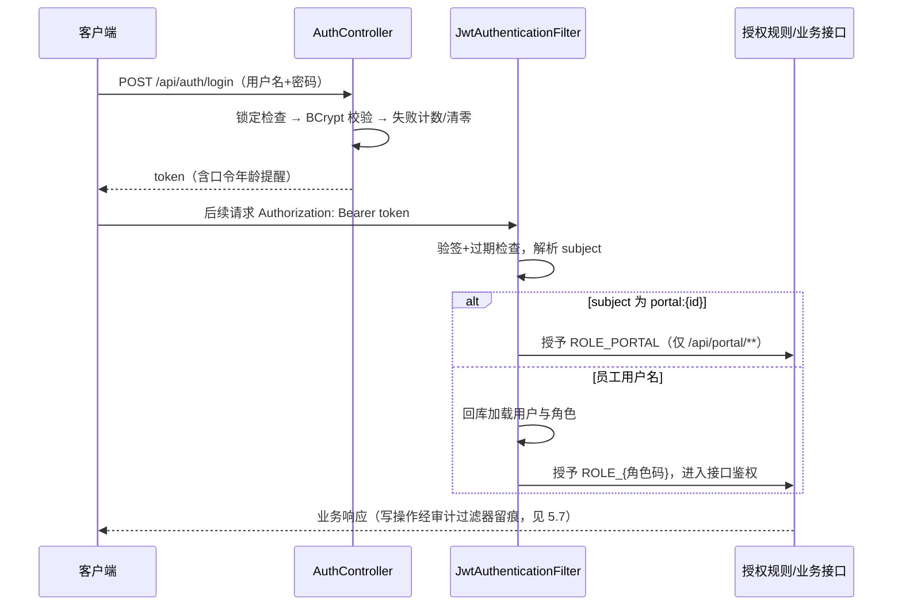
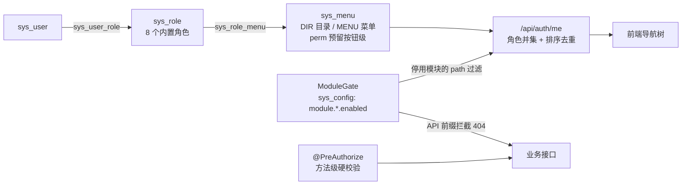
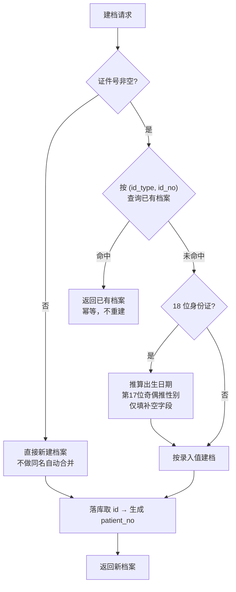

# 第 5 章 平台底座

> 本章属第二篇「架构篇」。任何业务模块——挂号、医嘱、检验、医保——都站在一组公共能力之上：
> 用户是谁、能做什么、科室长什么样、患者是哪一个、参数从哪读、操作留没留痕、数据库怎么演进。
> 这组公共能力合称**平台底座**。本章先论证"底座先行"，再依次展开认证授权、组织主数据、字典术语、
> 患者主索引、系统参数、审计日志与迁移纪律，以 HIP 的 `platform/core` 与 `platform/empi` 为贯穿案例。

## 学习目标

学完本章，你应当能够：

1. 用"依赖方向"和"变更成本"论证为什么主数据与权限体系必须最先建设且保持稳定；
2. 比较 Session 与 JWT 两种会话形态的取舍，说出无状态令牌"不可吊销"的代价与缓解手段；
3. 画出 RBAC 的用户—角色—菜单授权模型，解释"菜单即授权粒度"的适用边界与防自锁设计；
4. 设计一个防爆破的登录流程（失败计数、锁定、口令策略），并说明各环节对应的安全要求；
5. 说出 EMPI 判重的算法谱系，解释"证件号确定性匹配 + 不自动合并"为什么是保守而正确的起点；
6. 列举数据脱敏的四个实现层次，并按威胁模型为给定场景选择合适的层次；
7. 独立设计一张系统参数表：键的命名分类、值的类型约定、生效机制与新增键的纪律；
8. 复述 Flyway 版本段规约（V1–V999 平台段 / V10000+ 实施段）与"历史迁移不改"原则，说明违反它在多医院部署下的后果。

---

## 5.1 底座先行原则

### 5.1.1 什么是平台底座

把一个医院信息平台的表倒出来看，会发现两类截然不同的表：一类是业务表——挂号记录、医嘱、检验标本、结算单，它们随业务功能一批批出现；另一类表在第一天就存在，并且被后来的几乎每张业务表外键引用——用户、角色、菜单、科室、患者。后者加上读它们的服务（认证、授权、参数读取、审计），就是平台底座。

HIP 的住院登记表是现成的观察样本（[V8__inpatient.sql](../../server/src/main/resources/db/migration/V8__inpatient.sql)）：`inp_admission` 一张表四个外键——`patient_id` 指向 `empi_patient`、`dept_id` 与 `ward_id` 指向 `sys_dept`、`doctor_id` 指向 `sys_user`。**业务表的外键箭头几乎全部指向底座表，而底座表不反向依赖任何业务表**——这个单向依赖方向，就是"底座"一词的严格定义。

### 5.1.2 工程论证：为什么先建、为什么求稳

"底座先行"不是习惯，而是由两条工程规律推出的结论：

**第一，依赖方向决定建设顺序。**被依赖者必须先于依赖者存在：挂号要写 `patient_id`，患者主索引就得先有。反过来做——先写业务、用临时字符串存"科室名""医生名"，等底座建好再回头改外键——意味着对每张业务表做一次数据迁移和代码返工，成本随业务表数量线性增长。

**第二，变更成本与依赖数成正比，所以底座必须求稳。**改一张叶子业务表只影响自己；改患者标识模型（比如把患者主键从自增 id 换成全局 GUID）要动几十张引用表和全部关联代码。依赖越多的东西越改不起，因此**越是被广泛依赖的模型，越要在早期把"接口"想清楚，并在此后保持克制**。

HIP 的迁移历史是这条原则的实测数据：44 个 Flyway 迁移中，V1 建认证授权与组织机构（[V1__init_core.sql](../../server/src/main/resources/db/migration/V1__init_core.sql)），V2 建患者主索引（[V2__empi_patient.sql](../../server/src/main/resources/db/migration/V2__empi_patient.sql)）——底座占据最前两个版本号。此后 42 个迁移里，`sys_user` 只动过三次、全是**加列**（防爆破计数、锁定时间、密码修改时间），`empi_patient` 列结构未改一列。底座表被引用数百次，结构却近乎冻结——先行且稳定，后面的一切才盖得起来。

需要澄清的是：**"先建且稳定"指模型接口稳定，不指内容一次建全**。HIP 的菜单树从 V1 的 4 条菜单长到 55 个功能页，每个迁移都在 `insert` 新菜单；角色从 4 个长到 8 个（V36）。内容随版本自然生长，但"用户—角色—菜单三表 + 两张关联表"的模型骨架从 V1 至今一字未动。求稳的是骨架，不是血肉。

---

## 5.2 认证与授权

### 5.2.1 会话形态：Session 还是 JWT

用户登录后，服务端如何在后续请求中认出他？两条技术路线：

| 维度 | Session（服务端会话） | JWT（JSON Web Token，无状态令牌） |
|---|---|---|
| 状态存放 | 服务端（内存/Redis），客户端只持会话 id | 全部编码在令牌里，服务端不存 |
| 水平扩展 | 需会话共享或粘性路由 | 天然无状态，任意实例可验 |
| 主动吊销 | 删会话即失效，即时 | **做不到**——签出的令牌在过期前始终有效 |
| 客户端形态 | 依赖 Cookie，浏览器友好 | Header 携带，Web/移动 H5/自助机/患者端通吃 |
| 失效控制 | 服务端说了算 | 只能靠过期时间兜底 |

医院场景客户端形态多（工作台、移动 H5、患者端、自助机）而部署规模小（单院单体）：多端统一是 JWT 的强项，其短板"不可吊销"用**短有效期**缓解。HIP 选择 JWT：`JwtService`（[JwtService.java](../../platform/core/src/main/java/cn/hip/platform/core/security/JwtService.java)）用 HMAC 对称密钥签发，令牌主体（subject）只放用户名，有效期默认 12 小时（覆盖一个白班加交接，配置键 `hip.security.jwt-expiry-hours`）。密钥从环境变量 `HIP_JWT_SECRET` 注入，生产必设 32 位以上随机串——**密钥外置**是把密钥从代码与配置文件里赶出去，属等保整改中最常见的一条（第 13 章）。

令牌验证在 `JwtAuthenticationFilter`（[JwtAuthenticationFilter.java](../../platform/core/src/main/java/cn/hip/platform/core/security/JwtAuthenticationFilter.java)）完成，其中有一个值得注意的设计：**一套过滤器承载两类主体**。员工令牌的 subject 是用户名，每次请求回库加载角色；患者端令牌的 subject 是 `portal:{patientId}` 前缀形态，不关联任何员工账号，只授予 `ROLE_PORTAL`。配套的授权规则（[SecurityConfig.java](../../platform/core/src/main/java/cn/hip/platform/core/security/SecurityConfig.java)）做了**双向隔离**：`/api/portal/**` 仅 PORTAL 角色可入，而其余全部院内接口要求 `isAuthenticated() and !hasRole('PORTAL')`——患者令牌打死进不了院内接口，员工令牌也不冒充患者。互联网端与院内端共用一个进程时，这条双向隔离是必须画出的硬边界。

完整的认证链路如图 5-1：



**图 5-1 HIP 认证授权链路**

### 5.2.2 RBAC 与菜单树授权

授权模型的谱系从简到繁：**ACL**（直接给用户挂权限清单，人多即失控）→ **RBAC**（Role-Based Access Control，基于角色的访问控制，NIST 模型中的 RBAC0）→ 带角色继承的 RBAC1 → **ABAC**（基于属性动态判定，如"仅主管医师可签出院"）。医院信息系统的主流形态是 RBAC0：岗位划分天然就是角色——医、护、药、技、收费、质控、运营、管理员，HIP 恰好是这 8 个（[V36__phase38_role_matrix.sql](../../server/src/main/resources/db/migration/V36__phase38_role_matrix.sql)）；ABAC 式细粒度判定通常落为业务代码里的显式校验（医嘱只能由开单医生撤销），不必进权限框架。

HIP 的 RBAC 落在 V1 的五张表上：`sys_user`、`sys_role`、`sys_menu` 加两张多对多关联 `sys_user_role`、`sys_role_menu`。授权的粒度是**菜单**：角色绑定一组菜单，登录后 `/api/auth/me` 按角色并集下发菜单树，前端据此渲染导航。菜单表的 `perm` 字段（如 `sys:user:list`）为按钮级权限预留了扩展位，但 HIP 当前止步于菜单级——**粒度每细一档，授权管理成本翻一番**，按菜单管权限是中小医院运维能力与安全需要的平衡点；要害操作（改配置、管用户、授权）另用方法级注解 `@PreAuthorize("hasRole('ADMIN')")` 二次把门，形成"菜单可见性 + 接口硬校验"双层。



**图 5-2 RBAC 菜单树授权模型（含模块开关的双路生效）**

图 5-2 中的 `ModuleGate` 是授权链路上的一个旁路输入：医院未采购的模块经配置整体关闭时，菜单树先过滤掉对应路径，API 侧再由前缀拦截兜底返回 404——菜单过滤管"看不见"，API 拦截管"绕不过"，这套模块开关机制在第 14 章展开，其配置载体正是 5.6 节的 `sys_config`。

授权管理接口（[SysRoleController.java](../../platform/core/src/main/java/cn/hip/platform/core/web/SysRoleController.java)）有两处防御性设计。其一，保存授权采用**整表替换**而非增量比对——语义简单、天然幂等，低频操作不值得做增量。其二，**内置 ADMIN 角色的授权不可修改**（错误码 1302），注释写得直白："防止把自己锁在门外"——管理员误操作摘掉自己的系统管理菜单，就再也进不去授权页了；这类"自锁"是权限系统上线初期的高发事故，必须在机制上焊死，同类设计还有"不能停用内置管理员"（1104）。

菜单树还有一个易踩的细节：角色只绑叶子菜单时，父级目录（DIR）不一起绑定，前端树就渲染不出来。HIP 在两处处理——授权矩阵迁移末尾一条 SQL 为绑了子菜单的角色**自动补父目录**，`/me` 下发前再**清理因模块过滤而空掉的父目录**。一补一清对应"绑定时"与"下发时"两个时点，缺一处树就缺枝或长空枝。

### 5.2.3 密码策略与防爆破

口令是等保测评的重点检查项。HIP 的口令防线分四环，全部落在真实代码中：

1. **存储**：BCrypt 单向散列（自适应成本、内置盐，彩虹表免疫），库中只有密文（`SysUser.password` 注释即"BCrypt 密文"）；
2. **强度**：创建与改密时校验"至少 8 位且同时含字母与数字"（[SysUserController.java](../../platform/core/src/main/java/cn/hip/platform/core/web/SysUserController.java) 的 `passwordPolicyError`）。【成稿核对：等保三级对口令复杂度的具体要求（长度、字符种类数、更换周期）以现行测评口径为准，行文避免给出绝对数值】
3. **防爆破**：连续失败 5 次锁定 15 分钟，计数持久化在 `sys_user.failed_attempts / locked_until` 两列（V17 加列），成功登录清零；
4. **时效**：`password_updated_at` 记录最近改密时间，登录响应携带口令年龄，超过 90 天返回 `passwordExpireWarning` 提醒。注意这是**提醒而非强制**——强制到期改密会在早高峰的挂号窗口制造集中改密拥堵，HIP 把"是否强制"留给管理制度，系统提供数据与提示。

> **案例框 5-1：HIP 的登录防爆破实现**
>
> 登录接口（[AuthController.java](../../platform/core/src/main/java/cn/hip/platform/core/web/AuthController.java)）把锁定检查放在密码校验**之前**，失败计数写在 `BadCredentialsException` 分支里：
>
> ```java
> if (u.getLockedUntil() != null && u.getLockedUntil().isAfter(Instant.now())) {
>     return R.fail(1002, "账号已锁定，请 15 分钟后重试");
> }
> try {
>     authenticationManager.authenticate(new UsernamePasswordAuthenticationToken(...));
> } catch (BadCredentialsException e) {
>     // 防爆破：连续失败 5 次锁定 15 分钟
>     u.setFailedAttempts(u.getFailedAttempts() + 1);
>     if (u.getFailedAttempts() >= MAX_FAILED) {
>         u.setLockedUntil(Instant.now().plus(LOCK_DURATION));
>         u.setFailedAttempts(0);
>     }
>     return R.fail(1001, "用户名或密码错误");
> }
> ```
>
> 三个可琢磨的点：其一，密码错误统一提示"用户名或密码错误"，不区分"用户不存在"与"密码不对"——**防用户名枚举**的标准做法；但锁定提示（1002）只对存在的账号出现，仍留一丝可探测性——不可枚举与友好提示存在张力，HIP 取了后者。其二，计数持久化在数据库而非内存，重启不清零、多实例一致。其三，锁定期满后攻击者又有 5 次机会——等效于把爆破速率压到每 15 分钟 5 次：防爆破的目标不是绝对挡住，而是把暴力尝试的成本抬到不可行。

最后诚实交代 JWT 路线遗留的口子：**停用账号不能即时踢出在线令牌**——已签发令牌在有效期内不因停用而失效。对"离职即刻禁用"的诉求，纯无状态方案只能靠缩短有效期或引入服务端黑名单（那就不再纯无状态）逼近。系统设计没有免费午餐，重要的是知道自己选了什么、放弃了什么（习题 3 展开）。

---

## 5.3 组织机构与主数据

### 5.3.1 组织建模的通用难题

"科室"在医院里至少有四重身份：行政编制科室（人事口径）、门诊出诊科室（挂号口径）、病区/护理单元（床位口径）、成本中心（财务口径）。四个口径的树形结构并不重合——一个行政科室可能对应两个病区，一个病区可能混住两个科的患者。业界建模从重到轻：多套组织树各自维护并建映射（大型 HRP 的做法）、单树加维度标注、乃至一张平表。

HIP 的选择是**单树 + 类型标注**：一张 `sys_dept` 表，`parent_id` 挂树，`type` 列标注 `CLINICAL` 临床 / `MEDTECH` 医技 / `ADMIN` 行政 / `NURSING` 护理单元 四类（[SysDept.java](../../platform/core/src/main/java/cn/hip/platform/core/entity/SysDept.java)）。病区不是独立实体，而是 `type='NURSING'` 的科室——床位表 `inp_bed.ward_id` 直接外键 `sys_dept`，入院记录同时记 `dept_id`（收治科室）与 `ward_id`（所在病区），两列都指向同一张表。这个"一表多角色"的设计对县市级医院是够用的：跨科混住可用 `dept_id ≠ ward_id` 表达；不够用的场景（多院区、复杂核算树）出现时，扩展方向是加维度列或映射表，而非推翻单表。

`code` 列（院内唯一）是一个专门留给集成与实施的锚点：对外接口按科室编码对照、初始化工具按编码幂等 upsert，都锚在 `code` 而不是数据库 id 上——**自增 id 是库内私有的，编码才是跨系统的公共标识**，这条规则同样适用于药品、收费项目与患者（5.5 的 `patient_no`）。

### 5.3.2 人员与床位

人员即 `sys_user`：`dept_id` 挂科室、`title` 记岗位。HIP 没有把"账号"与"员工"拆成两张表——中小医院账号即员工档案的最小子集，拆表是过度设计；接了人事模块后人事档案另有其表，`sys_user` 保持"能登录的账号"语义。

床位 `inp_bed` 以 `(ward_id, bed_no)` 唯一，状态 `FREE/OCCUPIED` 加 `admission_id` 反指占用者。原子占床的并发控制是第 8 章的主题，底座层面只需记住：床位属于病区、病区是科室的一种、科室是一棵树——三层落在 V1+V8 两个迁移里，此后未再动过。

---

## 5.4 字典与术语管理

### 5.4.1 两层字典：院内运行与对外互操作

"字典"一词在医院信息化里混用了两个层次的东西，必须分开：

- **基础字典**（院内运行用）：药品目录、收费项目、ICD 简表、科室、班次……业务流程直接引用它们的编码与属性，改一条价格立刻影响收费。
- **标准术语**（对外互操作用）：WS 363 数据元、值域代码、医保贯标编码……院内编码与国家/行业标准编码之间的**映射**，供上报、互联互通测评、区域平台交换使用（第 3 章）。

前者是业务的一部分，后者是治理的一部分。HIP 的基础字典三张主表建在 V4（[V4__masterdata.sql](../../server/src/main/resources/db/migration/V4__masterdata.sql)）：`md_drug`（药品，含 `antibiotic` 抗菌药标记供分级管理用）、`md_charge_item`（收费项目，`category` 区分 LAB/EXAM/TREAT，`exec_dept_id` 挂执行科室）、`md_icd10`（诊断简表，带拼音码首字母检索）。一个值得讨论的取舍：`md_drug` 把 `price` 和 `stock` 直接长在字典上——严格的主数据管理（MDM）会说库存是事务数据不该进主数据表；但对单库存点的门诊药房，一列 `stock` 配上原子扣减（第 7 章）就是全部所需，独立的多库存点模型（V7 的 `inventory` 体系）是业务长出来之后的事。**字典表长什么样，取决于消费它的业务，而不是教科书上的 MDM 分层。**

术语映射落在 `dg_term` 表：`category` 分类 + `local_name` 院内名称 → `std_code / std_name / std_system` 标准编码三元组，配套 `dg_data_element` 承载 WS 363 数据元定义，维护接口在数据治理模块（[DataStdController.java](../../modules/datagov/src/main/java/cn/hip/datagov/web/DataStdController.java)，唯一键防重，重复映射返回 4631）。注意本章只讲**机制**——表怎么设计、映射怎么存；映射率怎么管、质量规则怎么跑、上报怎么用，属数据治理的**应用**，归第 12 章。

### 5.4.2 实施可替换性：字典是"可整表换血"的

字典与其他底座表的最大区别是：**结构属平台，内容属医院**。示范库里的 10 条药品、13 条收费项目只是"最小可运行样例"，实施时必须换成院方的真实目录。HIP 的种子数据三类分层（[种子数据分层清单.md](../../docs/种子数据分层清单.md)，第 14 章展开）把这件事制度化：

- **A 平台必需**（菜单树、角色、配置键、数据元框架）随 Flyway 装机即有，实施不动；
- **B 行业基线**（药品/收费/ICD/医保对照等字典）迁移带默认值，实施用 `init-hospital` 工具的 CSV 模板**按编码 upsert 整表覆盖**——同码更新、新码插入、样例可停用；
- **C 演示数据**（测试患者、演示账号）只走脚本、永不进迁移，生产库禁止出现。

"按编码 upsert"呼应 5.3 的锚点原则：业务键是 `code` 而非 id，字典可反复导入而幂等，实施工程师拿院方 Excel 转 CSV 一遍遍试到对为止——**可替换性不是一个功能，而是"业务键 + 幂等导入 + 分层清单"共同保障的性质**。

---

## 5.5 EMPI 患者主索引

### 5.5.1 患者身份问题与判重算法谱系

EMPI（Enterprise Master Patient Index，患者主索引）回答一个看似简单的问题：**眼前这个患者，是不是档案里的那个人？**答错的两个方向代价悬殊：漏配（一人两档）造成病史割裂、重复检查；误合并（两人一档）会把别人的过敏史、血型安到患者头上——直接的医疗安全事故。行业共识因此是**宁可重复建档，不可错误合并**。

判重算法的谱系，按确定性递减排列：

1. **确定性匹配**：证件号（身份证/医保卡号）完全相等即同一人。精度最高，覆盖不了无证件场景；
2. **加权概率匹配**（Fellegi–Sunter 一族）：姓名、性别、出生日期、电话、地址各字段按区分度加权打分，超上阈值判同、低于下阈值判异、中间地带进人工复核队列。区域平台与大型 EMPI 产品的标配；
3. **人工合并**：任何自动算法之外的最终裁决，合并操作本身要留痕可逆。

区域平台面对多机构、无统一证件的历史数据，必须上概率匹配；**单家医院的新建平台，确定性匹配加保守兜底就是正确起点**——概率匹配的价值要有足够体量的脏数据才能兑现，误合并的风险却从第一天就存在。

### 5.5.2 HIP 的建档幂等与身份证推算

HIP 的 EMPI 是独立平台模块（`platform/empi`），核心是建档接口的**幂等语义**：同证件号重复建档不报错、不重建，直接返回已有档案。

> **案例框 5-2：建档即判重——register() 的幂等设计**
>
> [PatientService.java](../../platform/empi/src/main/java/cn/hip/platform/empi/service/PatientService.java) 的建档方法不到 25 行，浓缩了三个决策：
>
> ```java
> @Transactional
> public Patient register(Patient p) {
>     if (p.getIdNo() != null && !p.getIdNo().isBlank()) {
>         var existing = patientRepository.findByIdTypeAndIdNo(
>                 p.getIdType() == null ? "ID_CARD" : p.getIdType(), p.getIdNo());
>         if (existing.isPresent()) return existing.get();   // 幂等：返回已有档案
>         if ("ID_CARD".equals(p.getIdType()) && p.getIdNo().length() == 18) {
>             if (p.getBirthDate() == null)
>                 p.setBirthDate(LocalDate.parse(p.getIdNo().substring(6, 14), BASIC_ISO_DATE));
>             if (p.getSex() == null || "U".equals(p.getSex())) {
>                 int seq = p.getIdNo().charAt(16) - '0';
>                 p.setSex(seq % 2 == 1 ? "M" : "F");        // 顺序码奇男偶女
>             }
>         }
>     }
>     Patient saved = patientRepository.save(p);
>     saved.setPatientNo("P%08d".formatted(saved.getId()));   // 先落库取 id，再生成对外患者号
>     return patientRepository.save(saved);
> }
> ```
>
> **决策一：判重键是 `(id_type, id_no)` 复合键**，不是裸证件号——身份证与医保卡号可能数字上撞车，证件类型必须进判重键。**决策二：把"重复建档"做成幂等而不是报错**。挂号窗口、自助机、患者端都会调建档，报错会把"已有档案"这个正常情况变成异常分支扔给每个调用方；返回已有档案则天然免疫重复提交。**决策三：身份证号是自带结构的数据**——18 位号码的 7–14 位是出生日期、第 17 位顺序码奇数为男、偶数为女，建档时自动推算回填，把录入员少填两个框、也把"出生日期与证件号打架"这类脏数据挡在门口。推算只在字段为空时进行，录入值优先。
>
> 两个诚实的边界：代码未校验身份证第 18 位校验码（录错号仍会建档，可作改进项）；无证件患者（急诊无名氏、未带证件的儿童）直接新建档案，同名同生日**不做**自动合并——这正是 5.5.1 的保守共识：漏配可事后合并，误合并难以挽回。

患者号 `patient_no`（P + 8 位序号）的生成用了"两段式保存"：先落库拿到自增 id，再格式化回填。它是对外的公共标识（打印在就诊卡、报告单上），与库内 id 分离——重申 5.3 的锚点原则。完整判重流程见图 5-3：



**图 5-3 EMPI 建档判重流程**

### 5.5.3 按角色脱敏的实现层次

患者的证件号、手机号属个人敏感信息，"谁能看到明文"是隐私合规的具体化。脱敏可做在四个层次，威胁模型各不相同：

| 层次 | 做法 | 防住谁 | 代价 |
|---|---|---|---|
| ① 存储层 | 落库即加密/静态脱敏 | 拖库者、DBA | 检索困难，业务大改 |
| ② 数据访问层 | 数据库视图/行列权限 | 绕过应用直连库的人 | 与应用权限体系两套账 |
| ③ 服务出口层 | 接口出参按角色遮蔽 | **越权浏览的内部用户** | 每个出口都要覆盖 |
| ④ 展示层 | 前端渲染时打星号 | 只防肉眼——报文里仍是明文 | 约等于没脱敏 |

第④层是常见的假脱敏：接口返回明文、前端打星，按 F12 即原形毕露，测评不认可。HIP 选第③层——**服务出口 DTO 层按角色脱敏**，对准院内最现实的威胁：有登录权限的人员批量浏览患者联系方式。实现在 [PatientController.java](../../platform/empi/src/main/java/cn/hip/platform/empi/web/PatientController.java)：列表出参时判断登录者权限，仅 ADMIN 返回明文，其余角色手机号保留前 3 后 4、证件号保留前 4 后 3，中段以 `*` 填充。两个口径细节：**列表场景脱敏、经办场景按需**——需核对证件的收费界面另行处理；遮蔽保头保尾是"可辨认不可复用"的平衡（能对患者确认"尾号 1234 对吗"，抄不走完整号码）。

按角色脱敏在 HIP 里不止这一处：报告分享短链走"匿名 + 脱敏 + 限时"、危急值大屏遮蔽患者全名，延伸场景与等保测评的对应在第 13 章集中讨论。底座层面立住方法论即可：**先写清威胁模型，再选实现层次；层次选低了防不住人，选高了业务做不动。**

---

## 5.6 系统参数中心：sys_config

医院之间的差异，绝大多数不是功能差异而是**参数差异**：院名、医保比例、审核阈值、买没买 DRG 模块。把这些差异从代码里抽出来集中管理的地方，就是系统参数中心。本节是全书引用最密的定义处——第 10 章的医保待遇键、第 14 章的模块开关与品牌配置，读写的都是这张表。

### 5.6.1 行业形态与两层配置

配置管理的演进路径：硬编码 → 配置文件 → 数据库参数表 → 独立配置中心（Nacos/Apollo 一类，多实例推送、灰度、回滚）。配置中心解决的是"成百上千实例的配置分发"；**单院单体引入配置中心，是给自己添一个要高可用的新组件**——数据库参数表才是这个规模下的正确答案（第 4 章"简单优先"）。

HIP 把配置切成两层（[配置手册.md](../../docs/配置手册.md)）：

- **部署配置**：`application.yml` 与环境变量——JWT 密钥、数据库连接、MLLP 端口、外部服务地址。特征是**起服务前定、改动要重启**，且包含敏感值；
- **运行配置**：`sys_config` 表——院名票据抬头、医保比例、审核阈值、模块开关。特征是**管理页/接口随时改、即时生效**。

切分判据一句话：**密钥与资源位置属部署，业务参数属运行**。

### 5.6.2 键设计：命名、类型与分类

`sys_config` 的表结构极简（[V18__sys_config.sql](../../server/src/main/resources/db/migration/V18__sys_config.sql)）：`cfg_key` 主键、`cfg_value` 字符串、`remark` 注释、`updated_at`。简单表能管住 50+ 个键，靠的是三条约定：

1. **命名分域**。键名用前缀表达归属：`hospital_*` 机构品牌、`yb_*` 医保待遇与审核（第 10 章）、`module.<key>.enabled` 模块开关（第 14 章）、`drg_rate`/`lis_allow_substitute` 业务参数、`cdr_sync_watermark` 系统内部键（任务维护，勿手改）。前缀即目录，`like 'module.%'` 一条 SQL 就能取走一族键；
2. **值一律字符串，类型约定由读取方承担**。`getInt` 解析失败回落默认值；布尔约定 `'1'` 为真。更重要的是**语义约定进注释与手册**：`0 = 不启用`——第 10 章分割引擎靠"起付线封顶线全 0 走老算法"实现新旧口径兼容，靠的正是这条约定；
3. **`remark` 必填**。键的含义写在数据里而不是只在文档里，管理页展示注释，实施工程师不必对着裸键名猜。

配置手册与种子清单对键数的口径（24 键 / 40+ 键）随版本演进会有出入，成稿以数据库实际键集为准清点。【成稿核对：sys_config 全键数量与手册口径统一】

### 5.6.3 生效机制：直查不缓存

参数改了什么时候生效？这个问题在配置中心语境下要讨论推送、监听、失效——HIP 的答案只有一行：**每次读取直查数据库，不缓存**。

> **案例框 5-3：ConfigReader——最简单的生效机制**
>
> [ConfigReader.java](../../platform/core/src/main/java/cn/hip/platform/core/service/ConfigReader.java) 全文不足 30 行：
>
> ```java
> /** sys_config 轻量读取（键不存在回落默认值）；单据前缀等低频配置直查不缓存 */
> public String get(String key, String defaultValue) {
>     var rows = jdbc.queryForList("select cfg_value from sys_config where cfg_key = ?", String.class, key);
>     return rows.isEmpty() || rows.get(0) == null || rows.get(0).isBlank() ? defaultValue : rows.get(0);
> }
> ```
>
> 直查的收益是把"生效机制"消灭掉了：`PUT /api/config/{key}` 落库的下一次读取就是新值，没有缓存失效、没有通知风暴、没有"改了不生效重启试试"。代价是每次读一条主键点查 SQL——对结算时读一次比例、开单时读一次阈值这种频度，毫秒级点查完全无感。**读取频度低是"直查"成立的前提**；若未来出现每请求必读的热键，演进方向是加带 TTL 的进程内缓存，而那一刻必须回答"改键后最多多久生效"——秒级 TTL 通常就是可接受的答案，不必一步跳到推送。
>
> 典型消费方之一是 5.2 的 `ModuleGate`（[ModuleGate.java](../../platform/core/src/main/java/cn/hip/platform/core/config/ModuleGate.java)）：`like 'module.%.enabled'` 取回开关族，非 `'1'` 即停用，配置缺省视为启用——**缺省即启用**让新增模块无须回填旧库配置。菜单过滤与 API 404 双路读的是同一批键，改一个键、两路同时生效，正是"直查"带来的一致性红利。

### 5.6.4 修改途径与新增键纪律

运行配置的修改有三条正路：管理页、`PUT /api/config/{key}`（[SysConfigController.java](../../platform/core/src/main/java/cn/hip/platform/core/web/SysConfigController.java)，ADMIN 专属、仅限已存在的键、写操作自动进审计）、`init-hospital` 批量初始化。接口层有一个必须知道的设计：`GET /api/config/public` **未登录可读且返回全部键值**——登录页要展示院名，公开是必须的；"整表公开"反过来立下铁律：**敏感值绝不允许进 sys_config**（密钥走部署配置）。一张表的读权限模型，决定了它能装什么。

新增配置键的纪律（配置手册结尾原文）："随迁移插入默认值 + remark 必填 + 本册同步补一行"。展开说：键随 Flyway 迁移插入（保证每个库都有默认值，代码可放心读）、注释落库、手册补行（实施逐键核对的依据）。第 10 章医保待遇模型升级时新增的 6 个键（V41）走的就是这条流程——**定义处立规矩，引用处才敢依赖**。

---

## 5.7 审计日志

### 5.7.1 审计的三问：记什么、怎么记、怎么用

网络安全等级保护对三级系统提出安全审计要求：审计覆盖到每个用户、对重要的用户行为和重要安全事件进行审计、审计记录应受保护并定期备份。【成稿核对：等保 2.0 三级安全审计条款原文及审计记录保留期限要求】落到工程上是三个问题：

- **记什么**：全量记读写不现实（读请求量大且多数无审计价值），行业通行的底线是**写操作全量 + 登录行为 + 敏感读按需**。写操作（POST/PUT/DELETE）天然对应"改变了系统状态"，是责任追溯的主体；
- **怎么记**：旁路记录，**审计失败不得阻断业务**——但失败要可观测（见下）；
- **怎么用**：追溯（出事后查"谁在何时干了什么"）与稽核（定期抽查敏感操作）。查不动、没人看的审计等于没记。

### 5.7.2 HIP 的写操作全量审计

HIP 的审计写入是一个 Servlet 过滤器（[AuditLogFilter.java](../../server/src/main/java/cn/hip/server/web/AuditLogFilter.java)）：`finally` 块里判断方法属 `POST/PUT/DELETE` 且路径以 `/api/` 开头，即向 `sys_audit_log` 落一行——用户名、方法、路径、HTTP 状态码、客户端 IP、时间（表建于 [V17__phase13_16.sql](../../server/src/main/resources/db/migration/V17__phase13_16.sql)）。几个设计点：

- **放在 `finally` 且捕获自身异常**（"审计失败不影响业务"）：收费不能因审计表故障而中断，这是可用性对完整性的压制。但严格等保口径下有补课项：审计写失败应触发告警（第 13 章运维告警），静默吞掉会让"审计覆盖率 100%"成为无人知晓的假象；
- **登录天然在册**：登录是 `POST /api/auth/login`，成功失败都留痕，锁定事件可由连续失败记录还原；
- **记状态码而非只记成功**：4xx/5xx 同样入库——"谁在反复尝试越权接口"藏在失败记录里；
- **不记请求体**：体积与隐私的双重考虑（请求体含患者敏感信息，审计表反成泄露面）。代价是"改了什么字段"不可考；需要字段级追溯的表应在业务层另建修改历史，而不是把审计表撑成数据湖。

查询侧支持**敏感操作过滤**（[AuditQueryController.java](../../platform/core/src/main/java/cn/hip/platform/core/web/AuditQueryController.java)，ADMIN 专属）：`sensitive=true` 时按路径 LIKE 清单筛出退费、角色授权、菜单变更、用户管理、抗菌药权限、医保目录维护、作废类操作——这份清单就是"重要用户行为"的工程定义。实现上选**查询期过滤**而非写入期打敏感标：清单变化无须回刷历史数据，代价是 LIKE 匹配慢——配合 `limit 200` 与 V39 的 `(username, id desc)` 索引，按人排查的主路径仍可走索引。

审计表遵守第 10 章已出现过的留痕铁律：**只增不删**。清理走归档与备份（每日备份任务，第 13 章），不走 delete。

---

## 5.8 数据库迁移纪律：Flyway 版本管理

### 5.8.1 为什么需要迁移工具

没有迁移工具的团队，数据库结构靠"上线前手工跑 SQL"维护，三个月后必然漂移：测试库与生产库不一致、新装库与老升级库不一致、没人说得清某列是谁加的。迁移工具（Flyway/Liquibase 一族）把结构变更收敛为**带版本号的 SQL 文件序列**：库里有一张版本记录表记录已执行到哪个版本，启动时把没跑过的迁移按序前滚，且对每个已执行文件校验**校验和（checksum）**——文件被改过则拒绝启动。数据库结构从此与代码一样有版本、可追溯、可重建。

由此推出迁移的第一纪律：**只前滚，不修改历史**。想改错，用一个新版本去改（改列宽出 `V33__widen_appt_status`、补列出 `V40__yb_settle_no`——第 10 章那个"结算号没地方放"的教训，最终就是以一个新迁移落地的），而不是回头编辑旧文件。

### 5.8.2 HIP 的版本组织与段规约

HIP 的迁移目录现有 V1–V44，命名 `V<n>__<主题>.sql`（如 `V24__phase27_insurance`），版本号即开发史——V1 底座、V2 患者、V8 住院、V18 参数表、V40 医保结算号，一目了然。每个迁移是"建表 + 种子 + 菜单注册"的完整单元：新功能的表结构、默认参数、菜单与角色绑定在同一文件落库，装机即得完整功能。

多医院产品化带来新的一维：实施定制（某医院独有的表）也要进迁移，但绝不能与平台迁移抢版本号。HIP 的段规约（ADR-0003，第 14 章）：

> **案例框 5-4：V1–V999 平台段与 V10000+ 实施段**
>
> - **V1–V999 平台段**：产品团队维护，随产品版本发布，所有医院一致；
> - **V10000+ 实施段**：实施项目组维护，放在该院的 `impl/<hospital>` 模块内，**只建 `impl_` 前缀的自有表**，不改平台表。模板示例（[V10000__impl_template_init.sql](../../impl/template-hospital/src/main/resources/db/migration/V10000__impl_template_init.sql)）：
>
> ```sql
> -- 实施定制段示例迁移（ADR-0003：V10000+ 专属段，只建 impl_ 前缀自有表）
> create table impl_template_note (
>     id         bigserial primary key,
>     content    varchar(500) not null,
>     created_at timestamptz  not null default now()
> );
> ```
>
> 中间近万个版本号的留白是刻意的隔离带：平台段还能再发布几百个版本而永不追上实施段，Flyway 按数值序执行时两段互不穿插。配上"只建 `impl_` 前缀表"的命名约束，平台升级（新平台迁移前滚）与实施定制（该院自有表）在同一个库里各行其道——**版本号段 + 表名前缀，两条命名约定就实现了产品与定制的数据库级隔离**，不需要任何额外机制。

### 5.8.3 历史迁移不改：多医院部署下的论证

"历史迁移不改"在单库开发时像洁癖，在多医院部署时是生死线。产品装到 N 家医院，各院升级节奏不同——甲院在 1.0（跑到 V40）、乙院刚装 1.1（一口气跑到 V44）。若 1.1 里**修改**了 V4：甲院升级时 Flyway 校验和不匹配、启动失败；即使强行对齐校验和，甲院的 V4 是旧版执行的、乙院是新版执行的——**两家医院的"同版本数据库"从此不再相同**，此后每一个假设"库结构一致"的迁移、每一次远程排障，都踩在流沙上。

所以纪律是绝对的：**已发布的迁移一个字节都不改**；种子数据分层（5.4.2）也因此不靠改迁移实现，而是"迁移照跑 + init 工具覆盖 B 类"的叠加路径。发布工艺侧的配套——升级即"停服→备份→换包→Flyway 自动前滚"、N-1→N 升级演练进 E2E——在第 14 章闭环。

回望本章，同一个词反复出现：**约定**——判重键、`0=不启用`、键名前缀、版本段。底座代码量不大，真正沉淀的是这些让各模块得以互相信任的约定；而约定只有落成迁移、注释、手册与 ADR 里的文字，才约束得住三年后的另一批人。

---

## 本章小结

- **底座先行**由依赖方向推出：业务表外键单向指向底座表，被依赖者必须先建；变更成本与依赖数成正比，故底座求稳——稳的是模型骨架（HIP 五张权限表 V1 至今未改结构），内容（菜单、角色）随版本生长。
- 认证选 **JWT** 换多端统一与无状态扩展，短有效期缓解不可吊销；患者端令牌以 `portal:` 前缀承载，与院内接口**双向隔离**。授权是 RBAC0 + **菜单粒度**，要害接口方法级注解二次把门；ADMIN 授权不可改、内置管理员不可停用——防自锁焊死在机制里。
- 口令四环：BCrypt 存储、强度校验、失败 5 次锁 15 分钟（计数持久化）、90 天更换提醒；防爆破的目标是抬高成本而非绝对阻断。
- 组织机构用**单树 + 类型标注**：病区是 `NURSING` 型科室，床位挂病区；`code` 编码而非自增 id 才是跨系统锚点。
- 字典分两层：**基础字典**（业务直接消费）与**术语映射**（对外互操作，机制在本章、治理在第 12 章）；实施可替换性 = 业务键 + 幂等 upsert 导入 + A/B/C 种子分层。
- EMPI 以 `(id_type, id_no)` **确定性匹配**做建档幂等，身份证推算生日性别，同名不自动合并——宁可重复建档，不可错误合并。脱敏有存储/数据访问/服务出口/展示四层，HIP 选**服务出口 DTO 层按角色遮蔽**，对准"内部越权浏览"的威胁模型；前端打星不是脱敏。
- `sys_config` 靠三条约定管住 50+ 键：**前缀分域命名、字符串值 + 读取方定型（0=不启用）、remark 必填**；生效机制是**直查不缓存**——改即生效，低频读是前提。公开接口整表可读，故敏感值绝不入表；新键纪律：迁移插默认值 + 注释 + 手册同步。
- 审计**写操作全量**（方法 + 路径 + 状态码 + IP），旁路记录不阻断业务但失败应告警；不记请求体是隐私与体积的取舍；敏感操作用查询期路径清单过滤；留痕只增不删。
- Flyway 纪律：只前滚、改错用新迁移；**V1–V999 平台段 / V10000+ 实施段**加 `impl_` 表名前缀实现产品与定制的库级隔离；**历史迁移不改**在多医院部署下是生死线——改一次，全部医院的库一致性从此存疑。

## 思考与练习

1. **概念**：用"依赖方向"解释为什么患者主索引在 V2 而住院模块在 V8；若开发顺序倒置（先做住院、患者信息暂存字符串列），补建 EMPI 时需要做哪些返工？逐项列出。
2. **设计**：HIP 的 JWT 有效期为 12 小时。分别站在安全（令牌被窃、员工离职）与可用（夜班中途重登、自助机长连）立场论证这个值，并给出你认为更优的期限与理由。
3. **代码审阅**：阅读 `JwtAuthenticationFilter` 与 `DbUserDetailsService`，分析"管理员停用某账号"后，该账号已签发令牌在有效期内的实际行为；设计一个改动最小的方案让停用即时生效，并说明它对"无状态"的破坏程度。
4. **设计**：新需求——"质控角色（QUALITY）在病案检查场景需要查看完整证件号"。基于 5.5.3 的四层模型，给出至少两种实现位置，比较其安全性与改动面，并说明你会如何防止这个口子被逐步扩大成"人人可见明文"。
5. **排障**：某医院从 1.0 升级 1.1 时后端启动失败，日志报 Flyway 校验和不匹配（V4）。列出可能原因、定位步骤与两种处置方案（含各自风险）；说明为什么"直接更新 flyway_schema_history 里的校验和"是危险动作。
6. **论述**：5.6.3 的"直查不缓存"策略假设配置读取低频。若医保结算量增长使 `yb_ratio_*` 键成为每秒数十次的热键，给出演进方案（缓存位置、TTL 取值、失效策略），并论述为什么"引入独立配置中心"对单院部署仍是过度设计。
7. **实践**（配套实训环境）：为 HIP 新增运行配置键 `emr_lock_hours`（病历归档后锁定编辑的小时数，默认 72）。按 5.6.4 的新增键纪律完成全流程：编写新 Flyway 迁移插入键与注释、在业务代码用 `ConfigReader.getInt` 读取、补配置手册行，并验证 `PUT /api/config/emr_lock_hours` 修改后立即生效且操作进入审计日志。
8. **综合**：审计表不记请求体，"退费金额是多少"无法从审计还原。设计一个敏感接口请求体摘要方案：哪些路径记、记什么（原文还是脱敏摘要）、如何防止审计表本身成为泄露面。
