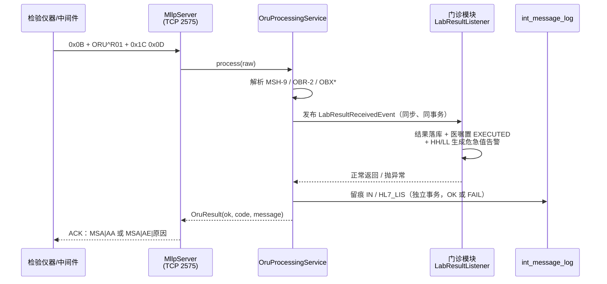
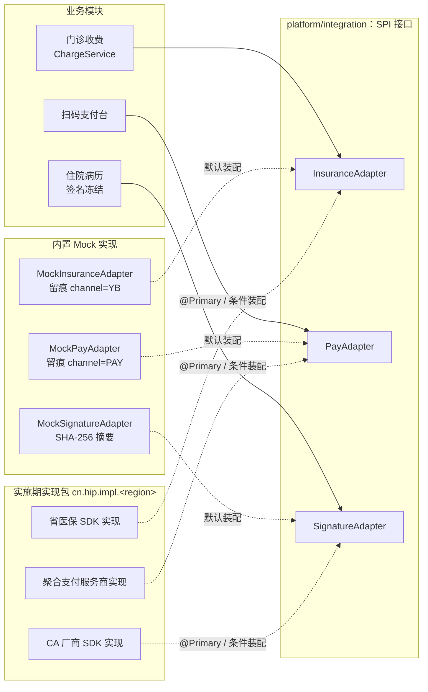
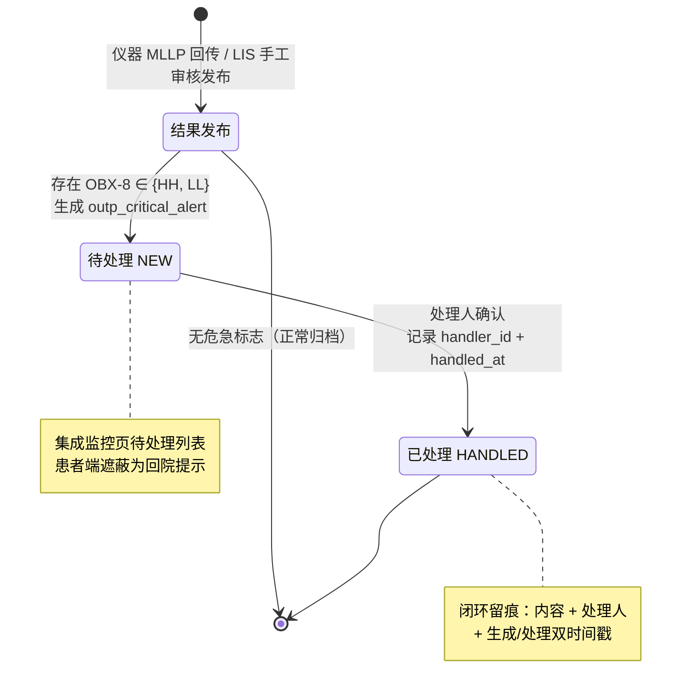

# 第 6 章 集成平台

> 本章属第二篇「架构篇」。医院可能是异构系统密度最高的信息环境：检验仪器说 HL7，医保说省级 SDK，
> 支付商说 HTTPS 回调，CA 厂商说自己的动态库——而它们都要和同一个 HIS 对话。集成平台的职责，
> 就是把这些方言收敛到可管理、可留痕、可替换的边界上。本章从医院集成的问题域讲起，依次展开
> 集成引擎选型、HL7 V2/MLLP 实战、适配器 SPI 设计、内容路由、事件驱动的跨模块通信、危急值闭环，
> 最后讨论"外部条件"这一医院项目特有约束的工程化管理方法。

## 学习目标

学完本章，你应当能够：

1. 画出一家县级综合医院的对接图谱，按对接对象类型说出主流接入方式（HL7/MLLP、SDK、HTTP API、文件、数据库）及各自的失败影响面；
2. 比较商用 ESB、开源集成引擎与轻量自研三条技术路线的成本结构与适用场景，说明中小医院场景下的选型逻辑；
3. 读懂一条 HL7 V2 的 ORU^R01 报文，说出 MSH/PID/OBR/OBX 各段的职责、MLLP 帧格式与 ACK 应答语义；
4. 解释"出入站全量留痕"的三重价值（排障、对账、审计），以及留痕为什么必须落在独立事务里；
5. 掌握适配器 SPI 的抽象方法：最小接口面、统一结果对象、Mock 先行、行为契约书面化；
6. 说明事件驱动在模块化单体中的落地形态，比较同事务事件、事务发件箱、消息中间件三级方案的取舍；
7. 描述危急值管理闭环的状态流转与留痕要素，并能用"接入点先行"方法管理一个依赖外部条件的对接任务。

---

## 6.1 医院集成的问题域

### 6.1.1 对接图谱：四类对象

讨论集成方案之前，先把"要和谁打交道"数清楚。一家县级综合医院的对接对象大体分四类：

| 对象类型 | 典型代表 | 常见协议/形态 | 数据方向 | 失败影响 |
|---|---|---|---|---|
| 院内设备 | 检验仪器、心电/超声工作站、影像设备 | HL7 V2/MLLP、ASTM、私有串口协议、DICOM | 以进站为主（结果回传） | 结果回不来，人工补录 |
| 行政机构 | 医保经办、区域全民健康信息平台、传染病网络直报 | 省级 SDK、WebService、前置库/文件 | 以出站为主（上传上报） | 结算不了、上报逾期 |
| 商业服务 | 聚合支付、CA 电子签名、短信、商用审核规则库 | HTTPS API、厂商 SDK | 双向（调用+回调） | 支付/签名功能降级 |
| 兄弟系统 | 遗留 HIS 组件、第三方专科系统 | 数据库直读、文件交换、接口 | 双向 | 数据孤岛、口径不一 |

这张图谱揭示了医院集成的三个特点。**第一，协议高度异构且不由医院选择**——设备厂商、医保局、支付商各说各话，医院方只能适配。**第二，进出站的失败语义完全不同**：进站失败（检验结果没收到）可以靠重发补救，出站失败（医保上传失败）往往必须阻断业务（第 10 章的同事务回滚）。**第三，相当一部分对接依赖医院无法控制的外部行政条件**：医保 SDK 要资质与专线，CA 要采购厂商产品，微信服务要主体认证——这是 6.8 节"外部条件工程化"要解决的问题。

### 6.1.2 集成平台的三项职责

无论用什么产品形态实现，医院集成平台的核心职责可以归纳为三条：

1. **协议归一**：把外部方言在边界上转换为系统内部的统一模型，业务模块不感知 HL7 段结构或 SDK 报文格式；
2. **留痕审计**：每一条进出站消息完整落库——它同时是排障依据、对账数据源和监管检查的原始凭证；
3. **故障隔离**：外部系统的不可用不能拖垮院内业务；反过来，院内业务的回滚也不能丢失"报文到过"这一事实。

在医院信息互联互通标准化成熟度测评（第 1 章）的语境下，集成平台还是"标准化"的物理载体——测评要求的消息交换、文档共享能力，最终都落在这一层实现【成稿核对：互联互通测评方案对集成平台的具体技术要求条目】。

---

## 6.2 商用 ESB、开源引擎与轻量自研

### 6.2.1 三条路线

**商用 ESB / 集成平台产品**。国内主流 HIS 厂商与专业集成厂商都提供医院集成平台产品，通常打包了 ESB 引擎、术语注册、主索引、文档注册库等互联互通测评所需组件。优点是功能全、有测评案例背书；代价是许可费用高（数十万到数百万元）、引入独立的运行时与运维对象，且集成逻辑沉淀在产品私有的配置模型里。

**开源集成引擎**。以 Mirth Connect（现名 NextGen Connect）为代表，医疗行业使用最广：以"通道（Channel）"为单元，源连接器收报文（MLLP/HTTP/文件/DB），经 JavaScript 转换器映射后由目的连接器发出，自带留痕与重发界面。它把 HL7 工程的通用件做得很好，适合对接点多、报文转换复杂的场景；代价是引入一个需要专人掌握的独立系统，转换脚本本身也会长成一片需要治理的代码。

**轻量自研**。在应用内实现"够用"的集成能力：留痕表、HL7 解析、若干适配器接口。优点是与业务同一个运行时、同一套事务、同一套运维；代价是通用能力（图形化配置、协议库覆盖）远不如专业引擎，对接点数量增长到几十个之后会遇到天花板。

三者不是互斥关系。一个务实的判断标准是**对接点数量与转换复杂度**：对接点十余个、转换以字段映射为主，轻量自研的总成本最低；对接点几十上百、报文方言繁杂，专业引擎的图形化管理开始值回票价。

### 6.2.2 HIP 的选择：平台模块 + 重型 ESB 归配套产品

HIP 面向县市级医院（对接点十余个、信息科运维人力有限），选择轻量自研，落地为模块化单体（第 4 章）中的平台层模块 `platform/integration`；同时在功能清单中明确"重型 ESB 属配套产品"——当医院确需完整 ESB 时外采专业产品，与 HIP 通过标准协议共存，而不是把 HIP 的集成模块养成一个 ESB。

> **案例框 6-1：一个刻意做小的集成模块**
>
> HIP 的 `platform/integration` 模块不足 20 个类，骨架是"一张表 + 一个服务 + 三个 SPI + 两个入站通道"：
>
> - **一张表**：`int_message_log` 统一留痕所有进出站消息（[IntMessageLog.java](../../platform/integration/src/main/java/cn/hip/platform/integration/entity/IntMessageLog.java)，建表见 [V10__integration.sql](../../server/src/main/resources/db/migration/V10__integration.sql)）。关键列：`direction`（IN/OUT）、`channel`（HL7_LIS/YB/PAY/WX…）、`ref_no`（业务关联号：申请单号/结算单号）、`payload`（完整报文，超长截断到 7900 字符）、`status`（OK/FAIL）、`error`。
> - **一个服务**：`IntegrationLogService.log(...)`（[IntegrationLogService.java](../../platform/integration/src/main/java/cn/hip/platform/integration/service/IntegrationLogService.java)），方法上仅有的一个事务注解值得整段抄下：
>
> ```java
> /** 独立事务：业务回滚也保留通信痕迹 */
> @Transactional(propagation = Propagation.REQUIRES_NEW)
> public void log(String direction, String channel, String refNo,
>                 String payload, boolean ok, String error) { ... }
> ```
>
> `REQUIRES_NEW` 是留痕正确性的全部秘密：留痕挂起当前业务事务、在独立事务中提交。于是"报文到过/发过"与"业务处理成功"成为两个独立记录的事实——医保上传被拒、业务事务回滚，留痕仍然在，这正是第 10 章对账体系拿它当"通道账"的前提。如果留痕与业务同事务，失败场景（恰恰是最需要痕迹的场景）的痕迹会随回滚一起消失。
> - **三个 SPI + 两个通道**：后文 6.3、6.4 展开。管理页只有一个只读接口（[IntegrationMonitorController.java](../../platform/integration/src/main/java/cn/hip/platform/integration/web/IntegrationMonitorController.java)：按渠道查最近 100 条留痕），刻意不做重发按钮——进站重发的发起方是设备端（见 6.3.4），出站重发的语义由各业务模块自己定义。

---

## 6.3 HL7 V2/MLLP 实战

### 6.3.1 HL7 V2 报文通识

HL7（Health Level Seven）V2 是医疗设备与系统间事实上的消息标准，1980 年代末诞生，至今仍是设备接口的主流（新一代的 FHIR 见第 3 章）。V2 报文是**管道分隔的分段文本**：报文由段（Segment）组成，每段一行，段名 3 个大写字母；段内字段用 `|` 分隔，字段内组件用 `^` 分隔，转义与重复分隔符共同构成报文头声明的 `|^~\&`。

一条检验结果报文（ORU^R01）的通用示意：

```
MSH|^~\&|LIS|EMSH|HIP|EMSH|20260804120000||ORU^R01|MSG0001|P|2.5
PID|1||P00000002||张三
OBR|1|SQ20260804-123||C0001^血常规
OBX|1|NM|WBC^白细胞计数|1|15.2|10^9/L|3.5-9.5|H
OBX|2|NM|HGB^血红蛋白|2|45|g/L|130-175|LL
```

各段职责：**MSH**（消息头）声明收发双方、时间、消息类型（MSH-9：`ORU^R01`）、消息控制号（MSH-10，应答时原样回带）与版本（此处 2.5）；**PID** 患者标识；**OBR** 申请信息，其中 OBR-2（申请方单号）是回传结果与院内医嘱对上的钥匙；**OBX** 每行一个结果项——OBX-3 项目标识（`代码^名称`）、OBX-5 结果值、OBX-6 单位、OBX-7 参考范围、OBX-8 异常标志（N 正常 / H 偏高 / L 偏低 / **HH、LL 危急**，是 6.7 节危急值闭环的触发源）。

字段索引有一个著名的陷阱：MSH 段中 **MSH-1 是字段分隔符 `|` 本身**，MSH-2 是其余分隔符 `^~\&`，因此 MSH 的第 N 个 `|` 后的内容是 MSH-(N+1)；而其他段的 SEG-1 就是首个 `|` 后的字段。手写解析器不处理这一偏移，MSH-9/MSH-10 就会错位取值。

### 6.3.2 MLLP 传输

HL7 V2 只定义报文，不定义传输。设备接口的标准承载是 **MLLP**（Minimal Lower Layer Protocol）：在 TCP 长连接上用控制字符定帧——`0x0B` + 报文 + `0x1C 0x0D`。接收方处理后回 **ACK 应答报文**：`MSA|AA|<控制号>` 表示接受（Application Accept），`MSA|AE`（Application Error）表示出错，发送方据此决定重发。

### 6.3.3 HIP 的实现：解析器、监听器与统一处理路径

HIP 的 HL7 进站链路由三个类组成，报文从设备到业务落库的完整流转见图 6-1。



*图 6-1 HL7/MLLP 检验结果报文流转时序*

> **案例框 6-2：60 行的 HL7 解析器**
>
> HIP 没有引入 HAPI 等完整 HL7 类库，而是自写了轻量解析器 [Hl7V2Message.java](../../platform/integration/src/main/java/cn/hip/platform/integration/hl7/Hl7V2Message.java)。这个决定的依据是消费方式：HIP 只需从 ORU 报文取三样东西（消息类型、OBR-2、OBX 列表），完整类库的强类型段模型用不上，而设备报文的"方言"（缺段、字段挪用）反而需要**宽容取值**——解析器把段建模为 `record Segment(String name, List<String> fields)`，`field(int idx)` 按 HL7 的 1 基索引取值、**越界返回空串而非抛异常**。MSH 偏移陷阱的处理原文如下：
>
> ```java
> if ("MSH".equals(name)) {
>     // MSH|^~\&|... : MSH-1 是 |，MSH-2 是 ^~\&
>     fields.add("MSH");
>     fields.add("|");
>     fields.addAll(Arrays.asList(line.substring(4).split("\\|", -1)));
> }
> ```
>
> 预填两个元素后，`field(9)` 恰好落在 MSH-9。配套单测（[Hl7V2MessageTest.java](../../platform/integration/src/test/java/cn/hip/platform/integration/hl7/Hl7V2MessageTest.java)）逐条固定这些约定：MSH 索引对齐、OBX 顺序保持、越界不抛错、`\n`/`\r\n` 行尾兼容——解析器的行为契约全部用测试钉死，这比注释可靠。
>
> 需要说明：这是"消费三个字段"场景下的合理裁剪；若要做全消息类型的双向转换（ADT、ORM、计费报文），完整类库或集成引擎（6.2）是更对的工具。**轻量的前提是想清楚自己只需要什么。**

[MllpServer.java](../../platform/integration/src/main/java/cn/hip/platform/integration/mllp/MllpServer.java) 实现 MLLP 监听：默认端口 2575（`hip.integration.mllp-port`），可整体关闭（`hip.integration.mllp-enabled`）；每连接一个处理线程，30 秒读超时；按 `0x0B ... 0x1C 0x0D` 逐帧读取，处理后回 ACK——控制号从来报 MSH-10 提取原样回带，成功 `MSA|AA`，失败 `MSA|AE|<原因>`；**报文连 MSH 都解析不出时仍要应答 AE**，让设备端知道"收到了但不认识"。

真正的处理逻辑在 [OruProcessingService.java](../../platform/integration/src/main/java/cn/hip/platform/integration/service/OruProcessingService.java)，它同时被 MLLP 监听与 HTTP 端点（[Hl7InboundController.java](../../platform/integration/src/main/java/cn/hip/platform/integration/web/Hl7InboundController.java)，`POST /api/integration/hl7/oru`）调用——**双通道、单处理路径**。有些设备中间件只会发 TCP，有些第三方系统更方便发 HTTP，承载协议是外部现实，业务语义不该有两份实现。处理步骤与错误码：非 ORU 类型 7001、缺 OBR-2 申请单号 7002、无 OBX 结果行 7003、其余异常 7000；每个分支都先留痕（成功 OK、失败 FAIL 带原因）再返回。

### 6.3.4 异常与重发

进站链路的重发模型是**设备端驱动**的：HIP 对每帧报文明确应答 AA/AE，AE 即业务性否定应答，设备/中间件按自身策略重发。这要求进站处理**幂等**——同一份结果重复回传不能落两份。HIP 的处理是让状态机天然免疫：`LabResultListener`（6.6）只接受状态为 CHARGED/EXECUTED 的检验医嘱，结果落库后医嘱置 EXECUTED，重复报文会再次落结果行但不会重复触发执行动作；找不到可回传医嘱时抛异常→事务回滚→ACK AE，报文不会被"静默吞掉"。留痕表中的 FAIL 记录则是人工介入的线索：集成监控页按渠道倒序展示最近报文，实施期排设备接口问题基本靠它。

---

## 6.4 适配器与 SPI 设计模式

### 6.4.1 模式通识：把"变"关进接口

SPI（Service Provider Interface，服务提供方接口）是"调用方定义接口、提供方交付实现"的模式：与普通接口的方向相反，接口的所有权在平台/调用方，实现方（往往是第三方或实施团队）按契约填空。它在 Java 世界的血统可追溯到 `ServiceLoader`，在 Spring 应用中的落地形态就是"接口 + 多个实现 Bean + 装配规则"；在架构语汇里，它对应六边形架构（Ports & Adapters）中的**出站端口**——业务核心依赖端口，外部世界的差异被挡在适配器里。

对医院平台产品，SPI 解决的具体问题是：**同一个业务动作，在不同医院对接不同的外部服务商**。医保各省 SDK 不同、支付服务商不同、CA 厂商不同，但门诊收费、扫码支付、病历签名的业务逻辑全国一样。没有 SPI，产品就会按省、按服务商裂变出代码分支——这是产品化的头号天敌（第 14 章"禁止分叉"原则）。

### 6.4.2 HIP 的三个适配器：抽象过程

HIP 的集成模块定义了三个 SPI，覆盖三类最典型的外部条件：

| SPI 接口 | 业务动作 | 方法 | 结果对象 | Mock 实现 | 真实形态 |
|---|---|---|---|---|---|
| [InsuranceAdapter](../../platform/integration/src/main/java/cn/hip/platform/integration/insurance/InsuranceAdapter.java) | 医保结算上传/退费冲正 | 2 个 | `InsuranceResult(ok, settleNo, message)` | 直接成功+留痕 | 省医保 SDK |
| [PayAdapter](../../platform/integration/src/main/java/cn/hip/platform/integration/pay/PayAdapter.java) | 扫码支付下单/退款 | 2 个 | `PayResult(ok, qrContent, message)` | 本地生成二维码内容 | 聚合支付服务商 |
| [SignatureAdapter](../../platform/integration/src/main/java/cn/hip/platform/integration/signature/SignatureAdapter.java) | 病历内容签名/验签 | 2 个 | `SignResult(ok, signature, message)` | SHA-256 摘要模拟 | CA 厂商 SDK |

三个接口是从三段真实业务里"抽"出来的，抽象过程遵循同一套方法：

1. **找最小动作集**。不是照抄外部服务商的能力清单，而是问业务真正依赖哪几个动作。门诊收费只依赖"上传结算、冲正退费"两个动作，于是 `InsuranceAdapter` 只有两个方法——SDK 的签到签退、目录下载、文件对账都是实现包内部的事，不进平台接口（详见第 10 章）。支付同理：出码与退款进接口，回调验签是服务商协议细节，由实现方在自己的回调端点内消化。
2. **统一结果对象**。三个接口的返回值都是 `record(ok, 业务载荷, message)` 三元组：布尔结果 + 一个业务真正要的载荷（医保结算号/二维码内容/签名值）+ 人类可读的原因。不抛受检异常、不返回裸字符串——`ok=false` 时 message 必须可直接展示给窗口操作员（第 10 章错误码设计的上游约定）。
3. **Mock 先行**。每个接口发布时同步交付 Mock 实现，且 Mock 不是空壳：`MockInsuranceAdapter` 生成结算号并按渠道 `YB` 留痕，`MockPayAdapter` 生成 `hippay://` 协议的二维码内容并按渠道 `PAY` 留痕——**Mock 也履行留痕契约**，因此对账、集成监控、E2E 在没有任何真实外部服务的环境里同样成立。这是整个"外部条件工程化"（6.8）的技术基础。
4. **行为契约书面化**。接口签名管不住的约定（留痕格式、失败语义、幂等、超时）写成 ADR——[ADR-0002](../adr/ADR-0002-医保SDK实现约定.md) 是范本（详见第 10 章）。

装配结构见图 6-2：业务模块只依赖接口；开发/演示环境装配 Mock，实施期以 `@Primary` 或条件属性（如 `hip.insurance.adapter=<region>-sdk`）替换为地区实现包，业务代码零改动。



*图 6-2 适配器 SPI 装配结构：业务依赖接口，实现按环境替换*

> **案例框 6-3：诚实的 Mock——SignatureAdapter 的边界注释**
>
> Mock 最大的风险不是假，而是**假得让人忘了它是假的**（第 10 章案例框 10-3 的教训正源于此）。[MockSignatureAdapter.java](../../platform/integration/src/main/java/cn/hip/platform/integration/signature/MockSignatureAdapter.java) 的类注释值得作为范式：
>
> ```java
> /** 签名 Mock：SHA-256 摘要模拟签名值
>     （内容防篡改可验，无法证明签名人身份——生产须换 CA SDK） */
> ```
>
> 它精确声明了 Mock 与真实实现的**能力边界**：摘要能验证病历冻结后未被篡改（演示与测试足够），但不具备数字证书对签名人身份的法律证明力。一句边界注释，防住的是"Mock 用着用着就上了生产"的实施风险——每个 Mock 都应当写清楚自己"像"到什么程度、从哪里开始"不像"。

InsuranceAdapter 的完整契约（结算号回传、留痕关键字、失败回滚语义、同步超时边界）与假适配器验证法，第 10 章已详细展开，本章不再重复；这里只强调一点分工：**SPI 模式本身属于集成平台层的设计资产，各接口的领域契约属于各业务章**——这也是模块边界在教材目录上的投影。

---

## 6.5 文件/DB 适配器注册与内容路由

设备与系统之外，医院还有一类"低频但杂"的对接需求：把某类报文落到共享目录给第三方取、把某类数据写到中间库。对这类需求，HIP 提供了**适配器注册 + 内容路由**的雏形能力，思想来自企业集成模式（EIP）中的 Content-Based Router：按报文内容决定投递目的地。

实现由两张表与一个管理接口构成（建表见 [V32__phase34_outp_pharmacy.sql](../../server/src/main/resources/db/migration/V32__phase34_outp_pharmacy.sql)，接口见 [AdapterController.java](../../platform/integration/src/main/java/cn/hip/platform/integration/web/AdapterController.java)）：

- `int_adapter`：适配器注册表——`name` 唯一，`type` 仅允许 FILE/DB 两类，`config` 存目的地（文件目录 / 数据源标识），`enabled` 支持一键停用。注册接口用 `INSERT ... ON CONFLICT (name) DO UPDATE` 实现幂等的"注册即更新"；
- `int_route_rule`：路由规则表——`keyword` + `adapter_id`，报文内容含关键字即路由到对应适配器，按规则 id 顺序**首条命中**。

种子数据给出了用法示范：注册"本地文件落地"（FILE，目录 `outbox/`）与"备用库直写"（DB，目标 `int_message_log`）两个适配器，并配一条规则"报文含 `ORU` → 走文件落地"。管理页（适配器路由，菜单挂在集成平台目录下）提供 `route-test` 接口：贴一段报文内容，返回命中的适配器与目的地，并按渠道 `ADAPTER` 留痕模拟投递；命中已停用的适配器则明确报错（4712），而不是静默跳过——**把"配置对不对"做成使用者可自助验证的功能**，是所有规则类配置（路由、审核规则、CDSS 规则）共同的可用性要点。

要诚实标注这套能力的定位：它是**雏形**（源码注释原话："重型 ESB 属配套产品"）——单关键字匹配、首条命中、两类适配器，覆盖的是轻量落地需求；正则匹配、优先级、转换链、可视化编排属于专业集成引擎的领地（6.2）。产品文档把边界写明，比功能本身更重要。

---

## 6.6 事务发件箱与事件驱动：不引入消息中间件的跨模块通信

### 6.6.1 三级方案与双写问题

集成层收到检验结果后，需要通知业务模块落库；医嘱执行后，需要通知数据中心同步——**跨模块通信**是所有多模块系统的必答题。教科书答案是消息中间件，但引入 Kafka/RabbitMQ 意味着新的运行时、新的运维对象、新的失败模式（消息丢失/重复/乱序），对县市级医院的运维现实（第 4 章）是沉重负担。按可靠性与复杂度排列，实际存在三级方案：

1. **同进程同事务事件**：发布方与订阅方在同一进程，事件同步派发，订阅方的处理加入发布方事务——要么一起提交，要么一起回滚。零中间件，强一致，代价是同步耦合（订阅方慢会拖住发布方）且只能进程内；
2. **事务发件箱**（Transactional Outbox）：业务事务内把"待发事件"写入本地发件箱表（与业务数据同库同事务），独立的投递器轮询（或借助 PostgreSQL `LISTEN/NOTIFY` 唤醒）读表外发、成功后标记。它解决的是**双写问题**——"改业务库"与"发消息"是两个资源，直接双写必有一致性窗口；发件箱把两次写合并为一次本地事务，投递侧用"至少一次 + 消费幂等"补齐；
3. **消息中间件**：跨进程、削峰、多订阅者、重放，代价如前述。

### 6.6.2 HIP 的现状与演进路径

HIP 处在第一级，且是有意为之。模块化单体让所有模块共享一个进程与一个数据库，Spring 的 `ApplicationEvent` 就是现成的进程内总线：集成层解析完 ORU 报文后发布 `LabResultReceivedEvent`（[LabResultReceivedEvent.java](../../platform/integration/src/main/java/cn/hip/platform/integration/event/LabResultReceivedEvent.java)），门诊模块的 [LabResultListener.java](../../modules/outpatient/src/main/java/cn/hip/outpatient/service/LabResultListener.java) 以 `@EventListener + @Transactional` 同步消费——解析、落库、医嘱执行、危急值告警在**同一个事务**里完成，任何一步失败整体回滚，MLLP 层随即应答 AE 让设备重发。**消息可靠性问题被整体转化为数据库事务问题**，而后者是关系库四十年的成熟领地。

这里有一个精心安排的例外：留痕不参与这个事务（6.2 案例框 6-1 的 `REQUIRES_NEW`）。业务回滚时，"收到过这条报文且处理失败"的事实必须保留——事务边界的划定，本质是在回答"哪些事实同生共死、哪些事实独立成立"。

事件模型的另一收益是**解耦了事件的生产入口**：检验结果既可能来自仪器直连（MLLP），也可能来自检验技师手工录入后审核发布——LIS 工作台的发布接口（[MedTechController.java](../../modules/medtech/src/main/java/cn/hip/medtech/web/MedTechController.java) 中 `publish`，注释原话"复用 LIS 事件链路"）把手工结果组装成同一个 `LabResultReceivedEvent` 发布，下游的落库、医嘱执行、危急值逻辑一行不改。**事件是入口的汇聚点**——这是它相对于"服务直调"的架构价值，即使在同步同事务的最简形态下也成立。

演进路径在总体规划中预留：数据量增长或出现真正的异步场景（向区域平台推送、短信通知）时，按"PostgreSQL LISTEN/NOTIFY + 事务发件箱，量大后上 RabbitMQ"的顺序升级。需要向读者诚实说明：**发件箱表在 HIP 当前版本尚未实体化**，它是规划中的下一级台阶——升级的触发条件是"出现跨进程消费者"，而不是架构美学。第 10 章医保上传选择同事务同步调用、把异步方案留给被数据证明的瓶颈，与本节是同一个决策模式的两次应用。

---

## 6.7 危急值管理闭环

### 6.7.1 制度要求

危急值（Critical Value）指提示患者可能处于生命危险边缘、须立即干预的检验检查结果（如血钾 >6.5 mmol/L、血小板 <30×10⁹/L）。危急值报告制度是国家卫生健康行政部门发布的医疗质量安全核心制度之一【成稿核对：《医疗质量安全核心制度要点》发文年份与文号】，要求明确：危急值发现后须**及时报告**至临床、临床**确认接收并处置**、全过程**记录可追溯**（谁报告、谁接收、何时处置）。电子病历分级评价与等级医院评审都会核查危急值闭环的信息化留痕。

对信息系统，"闭环"意味着一条不许断的链：**发现（仪器/审核）→ 生成告警 → 送达临床 → 确认处理 → 留痕（人 + 时间）**。任何一环靠口头电话而无系统记录，检查时都视为断链。

### 6.7.2 HIP 的实现：从 OBX-8 到处理留痕

HIP 的危急值链路直接生长在 6.3–6.6 的集成链路上，状态流转见图 6-3。



*图 6-3 危急值管理闭环状态图*

> **案例框 6-4：危急值告警的生成与闭环留痕**
>
> 触发点在 `LabResultListener` 的落库循环里（[LabResultListener.java](../../modules/outpatient/src/main/java/cn/hip/outpatient/service/LabResultListener.java)）：结果逐行入库时比对异常标志集合 `Set.of("HH", "LL")`，命中即拼装告警内容并落 `outp_critical_alert`：
>
> ```java
> if (item.abnormalFlag() != null && CRITICAL_FLAGS.contains(item.abnormalFlag())) {
>     critical.append("%s=%s%s(%s) ".formatted(
>             item.name(), item.value(), item.unit() == null ? "" : item.unit(),
>             item.abnormalFlag()));
> }
> ...
> alert.setContent("【危急值】%s：%s".formatted(order.getItemName(), critical.toString().trim()));
> ```
>
> 告警表（[OutpCriticalAlert.java](../../modules/outpatient/src/main/java/cn/hip/outpatient/entity/OutpCriticalAlert.java)）的列就是闭环的证据结构：`order_id`/`registration_id` 双外键锚定"哪份申请、哪次就诊"，`content` 快照告警内容，`status`（NEW/HANDLED）承载状态机，`handler_id` + `handled_at` + `created_at` 回答"谁处理、何时报、何时处置"。处理入口（[LabResultController.java](../../modules/outpatient/src/main/java/cn/hip/outpatient/web/LabResultController.java)）从登录态取处理人 id 写入——处理人来自会话而非前端参数，留痕才可信。
>
> 两个设计点值得剖析。**其一，告警生成与结果落库同事务**：不存在"结果入了库、告警没生成"的缝隙——这是 6.6 同事务事件模型送的礼物。**其二，判定标准挂在 OBX-8 上**意味着危急值的裁量权在结果的发布方（仪器规则或审核技师），系统信任上游标志。这与部分医院"院内统一危急值界值表、系统按值判定"的做法不同，各有适用场景：前者尊重设备与专业判断、实现简单；后者全院口径统一、但要维护一张随检验方法学变化的界值表。产品可以两者兼容——按标志判定兜底，界值表判定作为可配置增强。

送达侧，当前是"拉"模式：集成监控页顶部常驻危急值待处理列表（[MonitorView.vue](../../frontend/shell/src/views/integration/MonitorView.vue)），工作台首页有提醒入口；患者端刻意**遮蔽**危急值——报告页不向患者展示 HH/LL 结果本身，只提示尽快回院（功能清单：「危急值遮蔽为回院提示」），因为危急值的第一告知人应当是医生而不是 H5 页面。对照 6.7.1 的制度要求，"拉"模式是闭环的最低成立形态；短信/电话双通道通知、超时未处理自动升级（通知科主任）是明确的增强方向，也是等级评审现场最常被问到的两个点。

---

## 6.8 外部条件工程化

### 6.8.1 问题：进度不由你控制的对接

回看 6.1 的对接图谱会发现一个残酷事实：图谱里最重要的几条线——医保、CA、支付、设备直连——**没有一条的开通时间由开发方控制**。医保 SDK 要等资质审批与专线开通，CA 要等医院完成厂商采购，微信服务要等主体认证，设备直连要等厂商工程师到场。传统项目管理把这些做成甘特图上的"外部依赖"，然后眼睁睁看着它们把上线日期推成橡皮筋。

HIP 把这个问题工程化为一套方法，称为**外部条件管理**，核心是三句话：**接入点先行，Mock 实现兜底，条件到位即接**。

### 6.8.2 方法的三根支柱

**支柱一：接入点先行。**每个外部条件对应的技术侧工作——SPI 接口、表结构、页面、配置键——在等待期内全部完成并通过测试。"等医保 SDK"等的只是一个实现类，不是一个模块；"等 CA"等的只是换一个 Bean。HIP 功能清单的附录明确列出全部 8 项外部条件，并声明"接入点全部就绪"（[功能清单.md](../功能清单.md)）：省医保 SDK、CHS-DRG 官方目录、商用 CDSS/审核规则库、CA 签名产品、微信资质/电子健康卡、检验设备直连（MLLP 已通，按设备协议配置）、PACS/影像 AI、聚合支付服务商。注意每一项的表述都精确到"还差什么"——这份清单同时是给院方的承诺书与给实施团队的任务书。

**支柱二：Mock 不是占位符，是可验收的替身。**6.4 已经看到，HIP 的 Mock 履行真实实现的全部平台侧契约（留痕、结果对象、失败语义可注入），因此整条业务链路——含对账、监控、E2E——在零外部条件的环境里可完整演示与回归。这带来一个容易被低估的商务价值：**系统验收可以与外部条件解耦**。医院可以先验收业务功能，外部条件到位后做增量验收，而不是让整个项目吊死在医保局的审批流程上。

**支柱三：替换工艺被彩排过。**"条件到位即接"不能只是口号——替换是否真的只要换一个实现类？HIP 用两件事证明：一是 ADR 化的替换步骤（ADR-0002 的四步：新建实现类 → Bean 装配替换 → 跑 E2E 全套 → 真实环境首日人工对账），二是虚拟医院全量彩排中的**假适配器验证**——写一个模拟真实形态的实现包走完整个替换流程（详见第 10 章、第 14 章）。彩排过的工艺才是工艺，否则只是愿望。

### 6.8.3 管理形态

落到项目管理上，外部条件的正确形态是一张**双线对齐表**：技术线（接入点完成情况，开发方负责）与行政线（资质/采购/专线的申请状态，院方负责），逐项列出当前卡点与责任方，例会过一遍。它把"等待"变成"排队"——每个条件都知道自己排在哪、差什么、谁去催。第 10 章 10.7.4 的医保接口调研清单，就是这张表在医保条件下的展开页；LIS 设备、CA、支付各有对应页。

外部条件工程化还有一个隐含的产品设计约束：**凡外部条件必有开关或降级**。医保未接：现金/自费流程完整可用，医保模块可整体关闭（模块开关，第 14 章）；CA 未接：Mock 签名保证病历冻结流程可走，出具的是"防篡改"而非"法律效力"；支付未接：窗口现金收费不受影响。系统的可用性下限不被任何单一外部条件绑架——这既是工程韧性，也是面对医院客户时最有说服力的一句话："哪个条件都不拦着你上线。"

---

## 本章小结

- 医院集成的问题域可归纳为四类对接对象（设备/行政机构/商业服务/兄弟系统），集成平台的三项职责：协议归一、留痕审计、故障隔离。进站失败靠重发，出站失败常须阻断业务，两者的失败语义设计完全不同。
- 集成引擎选型看**对接点数量与转换复杂度**：十余个对接点、字段级映射，轻量自研总成本最低；HIP 以不足 20 个类的平台模块承载集成能力，重型 ESB 明确归配套产品。
- 留痕表 `int_message_log` 以 `REQUIRES_NEW` 独立事务落库，把"报文到过"与"业务成功"分离为两个事实——它同时是排障依据、对账通道账与监管凭证。
- HL7 V2 是管道分隔的分段文本，MSH-1 是分隔符本身这一索引偏移是手写解析器的经典陷阱；MLLP 以 `0x0B/0x1C 0x0D` 定帧，ACK 的 AA/AE 驱动设备端重发，进站处理须幂等。HIP 的 HTTP 与 MLLP 双通道共用同一处理路径。
- 适配器 SPI 的抽象四步：找业务依赖的**最小动作集**、统一 `record(ok, 载荷, message)` 结果对象、**Mock 先行且履行留痕契约**、行为约定书面化为 ADR。Mock 必须写明能力边界（"像"到哪里为止）。
- 跨模块通信三级方案：同事务事件 → 事务发件箱 → 消息中间件。模块化单体下，同步同事务事件把消息可靠性转化为数据库事务问题；事件同时是多入口（仪器直连/手工录入）的汇聚点。升级的触发条件是出现跨进程消费者，不是架构美学。
- 危急值闭环 = 发现（OBX-8 的 HH/LL）→ 告警生成（与结果落库同事务）→ 送达 → 确认处理 → 双时间戳留痕；处理人取自登录态而非前端参数。通知升级（短信/电话、超时上报）是普遍的增强方向。
- 外部条件工程化三支柱：**接入点先行、Mock 兜底、替换工艺彩排**；管理形态是技术线与行政线的双线对齐表；产品约束是"凡外部条件必有开关或降级"。

## 思考与练习

1. **概念**：为什么检验设备直连要经过集成层（解析 + 留痕 + 事件），而不是让 LIS 模块自己监听一个 TCP 端口？从协议归一、留痕审计、故障隔离三项职责分别给出理由。
2. **报文**：为患者"李四"（病历号 P00000015）手写一条 ORU^R01 报文：申请单号 SQ20260810-001，项目"血清钾"，结果 6.8 mmol/L，参考范围 3.5-5.3，危急偏高。标注 OBR-2 与 OBX-5/6/7/8 的位置，并写出 HIP 应答的 ACK 报文（说明 MSA-2 控制号的来源）。
3. **设计**：为 `PayAdapter` 增加"支付状态查询"能力：给出方法签名与结果对象、Mock 实现的行为与留痕关键字。再论述：这个方法该不该进 SPI？（提示：回调丢失时的对账兜底 vs 接口面最小化，参考 6.4.2 的抽象方法。）
4. **排障**：某医院设备中间件报告"MLLP 发送成功、收到 AA"，但医生站看不到结果。按图 6-1 的链路写出排查步骤与每步查询的表/接口。再考虑另一情形：中间件持续收到 AE 且留痕 error 为"未找到可回传的检验申请"，列出三种可能的业务原因。
5. **推演**：若把 `LabResultReceivedEvent` 的消费从同事务改为事务发件箱异步投递，图 6-1 的时序如何变化？ACK 的语义从"业务处理成功"退化为什么？危急值告警的生成延迟、失败重试、死信处理分别需要补哪些机制？
6. **论述**：一家 500 床医院有 30 个对接点、其中 12 个需要报文转换，信息科有 2 名开发人员。重新评估 6.2 的三条路线，给出你的选型与混合方案（哪些对接留在应用内 SPI、哪些交给集成引擎），并说明留痕与监控如何统一。
7. **实践**（配套实训环境）：为内容路由增加"正则匹配 + 优先级"能力：给出 `int_route_rule` 的表结构改动（DDL）、匹配算法（优先级排序、正则与关键字共存时的语义）、`route-test` 接口的返回扩展（展示全部命中而非首条），并补一条 E2E 断言。
8. **观察**（临床对照）：访谈一位检验科技师与一位临床医生，记录本院危急值从仪器报警到医生处置的真实链条（含电话环节），对照 6.7 的闭环模型标出未留痕的环节，提出信息化补齐方案并估计各环节的时限指标。
