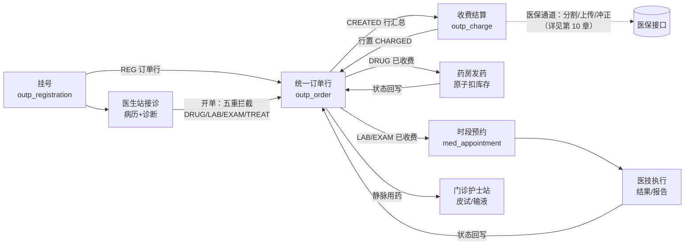
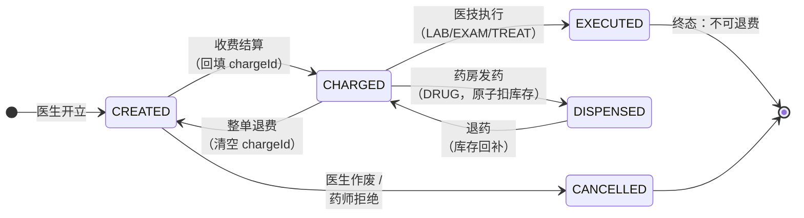
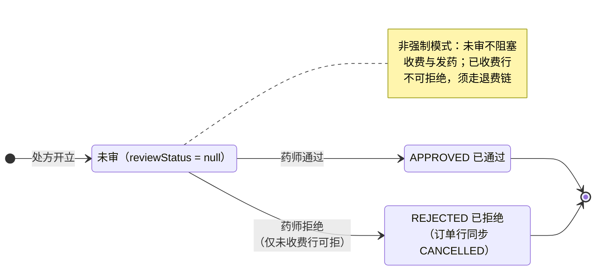

# 第 7 章 门急诊系统

> 本章属第三篇「业务篇」。门急诊是医院业务量最大、并发最高、链条最长的领域：一个患者半天之内要经过挂号、候诊、接诊、开单、缴费、检查、取药六七个环节，每个环节背后是不同科室、不同角色在同一套数据上协同。本章从号源模型讲起，沿患者动线依次展开医生站、统一订单行、合理用药、收费、聚合支付、发药审方、预约叫号，最后到急诊预检分诊与留观。全章以 HIP 平台的门诊模块为贯穿案例，重点剖析三个高价值工程主题：**原子占号与原子扣库存的并发控制**、**退号/退费/退药的联动拦截链**、**审方状态机的非强制模式取舍**。

## 学习目标

学完本章，你应当能够：

1. 说出「排班—号源—挂号」三层模型的职责划分，解释号源容量为什么是并发控制问题而不是业务校验问题；
2. 掌握防超挂的三种数据库解法（悲观行锁、条件更新、乐观锁），并说明它与医保年度额度控制（第 10 章）是同一模式的变体；
3. 解释统一订单行模型相对「处方表 + 申请单表」分立方案的优势，画出订单行的完整状态机；
4. 说出合理用药五重拦截（过敏交叉/重复用药/药物相互作用/年龄禁忌/抗菌药分级）各自的药学依据与数据来源，理解 FORBID/CAUTION 分级的临床可用性含义；
5. 设计退号、退费、退药之间的联动拦截规则，解释为什么逆向操作必须按正向链条的**反序**逐级解除；
6. 描述聚合支付的一般架构（出码—回调—对账）与 PayAdapter SPI 的契约要素；
7. 论述药师审方「强制模式」与「非强制模式」的合规与人力权衡，说出从非强制升级到强制需要改动的卡点。

---

## 7.1 号源与排班模型

### 7.1.1 号源的业务本质：容量管理

挂号是门诊一切业务的起点。它表面上是「登记一个患者」，本质上是**分配一份稀缺的诊疗容量**：某医生某日上午只能看 30 个病人，第 31 个必须被拒绝。因此挂号模型天然分三层：

- **排班**（schedule）：管理侧决定「谁、哪天、哪个时段、出什么号、多少个」——科室/医生、日期、时段（上午/下午/全天）、号别（普通/专家）、单价、容量；
- **号源**：排班的容量视角——总量与已占用量的差即余号。号源可以进一步细分为时点号（8:30–8:40 一个号）或时段号（上午段内排序），县市级医院多用时段号；
- **挂号记录**（registration）：患者与一个号源的绑定，携带就诊序号（叫号用）、费用与状态。它是后续病历、处方、收费、报告的**根**——门诊域几乎所有表都直接或间接挂在挂号记录之下。

预约挂号（互联网端、自助机）与窗口挂号只是渠道差异，最终都收敛到同一个动作：**在某条排班上占掉一个号**。渠道越多，这个动作的并发越高。容量之外，排班还要处理两类运营变化：**停诊**（医生临时有事，排班置停用，已挂号患者退号或改约）与**加号**（容量临时上调）。停诊用启用标志而非删除排班实现——已有挂号记录外键挂在排班上，删除会破坏历史；这也解释了 HIP 占号语句里 `enabled = true` 条件的存在：停诊瞬间之后的占号请求自然失败，不需要额外通知在途渠道。

HIP 的排班表 `outp_schedule` 与挂号表 `outp_registration` 的建表语句见 [V3__outpatient_registration.sql](../../server/src/main/resources/db/migration/V3__outpatient_registration.sql)。注意排班表的两个整型列：`capacity`（容量）与 `booked`（已占用），以及一条数据库检查约束 `chk_booked`（`booked >= 0 and booked <= capacity`）——它是防超挂的最后一道防线，下文会回到它。

### 7.1.2 超挂问题：并发控制的三种解法

「余号还有 1 个，两个渠道同时来挂」是号源模型的经典竞态。如果代码写成「先查余号，再判断，再加一」（read–check–write），两个事务都会读到「还剩 1 个」，都通过判断，最终 booked = capacity + 1，超挂发生。**校验写在应用层的 if 里，防不住并发**——这是初学者最常见的错误认知。数据库层面有三种正统解法：

| 方案 | 做法 | 特点 |
|---|---|---|
| 悲观行锁 | 事务内 `SELECT ... FOR UPDATE` 锁定排班行，再读再判再写 | 通用性最强，可承载复杂判断逻辑；持锁时间长 |
| 条件更新 | 单条 `UPDATE ... SET booked = booked + 1 WHERE booked < capacity`，按受影响行数判断成败 | 判断与更新在一条原子语句内完成，无竞态窗口，代码最短 |
| 乐观锁 | 行上加版本号，更新时带 `WHERE version = ?`，失败则重试 | 无锁等待，但要写重试循环，高冲突时反而低效 |

选型的关键是**判断逻辑的复杂度**：占号的判断只有一个条件（还有余号），能塞进 UPDATE 的 WHERE 子句，条件更新是最优解；医保年度额度（第 10 章 10.2.3）要「读累计值—算扣减额—回写」，判断与计算无法压进一条 UPDATE，才需要 `SELECT ... FOR UPDATE`。**两者是同一模式的变体：把「检查—修改」的原子性交给数据库，而不是应用代码**。第 8 章的住院占床、本章 7.7 的扣库存，都在这个谱系上。

> **案例框 7-1：HIP 的原子占号**
>
> HIP 的占号实现在 [OutpScheduleRepository.java](../../modules/outpatient/src/main/java/cn/hip/outpatient/repository/OutpScheduleRepository.java)，一条 JPQL 条件更新：
>
> ```java
> /** 并发安全占号：只有还有余号时才自增，返回受影响行数 */
> @Modifying(clearAutomatically = true, flushAutomatically = true)
> @Query("update OutpSchedule s set s.booked = s.booked + 1 " +
>        "where s.id = :id and s.booked < s.capacity and s.enabled = true")
> int occupySlot(@Param("id") Long id);
> ```
>
> 调用方（[RegistrationService.java](../../modules/outpatient/src/main/java/cn/hip/outpatient/service/RegistrationService.java)）按返回值分流：`occupySlot(scheduleId) == 0` 即「号源已满」（错误码 3003）。两个并发事务执行这条 UPDATE 时，数据库对同一行的写互斥保证了只有一个能满足 `booked < capacity`。三个配套细节值得体会：
>
> - **就诊序号复用占号结果**：占号成功后重读排班，`reg.setRegNo(after.getBooked())`——第 N 个占到号的患者就是第 N 号，序号的唯一性由占号的原子性免费获得，不需要另一套发号器。注解里的 `clearAutomatically` 正是为了让这次重读穿透 JPA 一级缓存拿到最新值；
> - **重复挂号前置检查**：同一患者对同一号源已有 `REGISTERED` 记录则拒绝（错误码 3002），防手滑双击；
> - **数据库约束兜底**：即使未来有人绕过 `occupySlot` 直接改 `booked`，检查约束 `chk_booked` 仍会拒绝越界值。**应用层原子操作管正常路径，数据库约束管所有路径**——纵深防御在数据层的体现。

### 7.1.3 退号与号源释放

退号是占号的逆操作：挂号记录置 `CANCELLED`、`releaseSlot` 把 `booked` 减一（同样是条件更新，`booked > 0` 防负数）。但退号不是无条件的——患者可能已经缴过挂号费甚至已就诊。HIP 的规则：仅 `REGISTERED` 状态可退；退号时扫描名下订单行，未收费的挂号费订单自动作废，**存在已收费订单则拒绝退号、提示先退费**（错误码 3006）。这是本章「联动拦截链」的第一环，完整链条在 7.5.3 展开。

---

## 7.2 门诊医生站

### 7.2.1 接诊：把「排队的号」变成「进行中的就诊」

医生站的第一个动作是接诊：挂号状态从 `REGISTERED`（或已叫号 `CALLED`）置为 `VISITED`。这个看似平凡的状态跳转承担两个职责：一是**开单前置条件**——HIP 规定未接诊不得开单（错误码 4003），防止医生点错患者开错单；二是**归属确认**——按科室挂的普通号没有预定医生，首位接诊医生回填 `doctorId`。已退号（`CANCELLED`）的记录拒绝接诊。实现见 [DoctorStationService.java](../../modules/outpatient/src/main/java/cn/hip/outpatient/service/DoctorStationService.java) 的 `startVisit`。

### 7.2.2 门诊电子病历

门诊病历远比住院病历轻量，但骨架同源：主诉、现病史、既往史、体格检查、处理意见五段，对应 `outp_emr` 表的五个文本列。两个工程要点：

- **一次就诊一份病历**：`outp_emr` 与挂号记录一对一，保存即「有则更新、无则创建」的幂等语义；
- **签名冻结**：病历经电子签名后不可再改。HIP 的 `signEmr` 把五段内容拼接为摘要串交给 `SignatureAdapter`（签名适配器 SPI，第 6 章）签名，签名值与时间落库；此后 `saveEmr` 遇到已有签名直接拒绝（错误码 4008「病历已签名冻结」），重复签名同样拒绝（4010）。CA（Certificate Authority，数字证书认证机构）产品是外部条件，Mock 阶段用摘要模拟，接口形态与住院病历共用一套（第 8 章）。

「签名冻结」的顺序值得强调：**先校验内容存在，再签名，签名成功才落签名值**——签名失败（CA 服务不可用）抛错，病历停留在可编辑状态，而不是留下一个「签了一半」的记录。冻结之后如需修正，正规路径是新增修正记录而非解冻改写；门诊病历虽轻量，「签名即定稿」的证据链纪律与住院病历完全一致，这也是电子病历应用水平分级评价（第 1 章）对病历系统的基本要求。

### 7.2.3 诊断管理

诊断表 `outp_diagnosis` 按 ICD-10 编码记录，**列表第一条即主诊断**（`primaryDiag = true`），保存采用整表替换（删旧建新）——门诊诊断条数少、修改频繁，替换语义比逐条 diff 简单可靠。主诊断的下游消费者远比门诊本身多：医保结算与智能审核的适应症判断（第 10 章）、单病种自动入组（第 12 章）、CDSS 的诊断建议（7.4）都以它为输入。**门诊诊断的编码质量是一笔「上游存款」**，这与第 10 章「DRG 的数据质量问题几乎全部要回溯上游」是同一件事的门诊版。

---

## 7.3 统一订单行

### 7.3.1 从分立表到统一订单行：业界模型的演进

传统 HIS（Hospital Information System，医院信息系统）的门诊开单常常是「多套表」：处方及处方明细一套、检查申请单一套、检验申请单一套、治疗单一套，收费时再从各套表里抽取费用汇总。这个设计的病根在**费用口径**：同一笔钱的「业务形态」（处方明细）与「费用形态」（收费明细）落在两处，金额、状态要靠程序同步，退费、对账、统计每一处都要跨表拼接，口径漂移是迟早的事。

演进方向是**统一订单行**（order line）模型：处方药品、检验、检查、治疗，每一条都是一行结构同构的「订单」，用类型字段区分，价格、数量、金额、状态内聚在行上。收费按行结算、发药按行扣减、执行按行销账、统计按行汇总——**一行数据同时是业务明细和费用明细，费用不落两处账**。药品行多出的用法用量字段（用法/频次/单次剂量/天数）作为可空列共存，处方的「张」概念退化为一个分组号：同次开立的药品共享处方号，检查检验各自成申请单号。

### 7.3.2 HIP 的 outp_order 模型

HIP 的订单行实体 [OutpOrder.java](../../modules/outpatient/src/main/java/cn/hip/outpatient/entity/OutpOrder.java) 完整体现了这个模型：`orderType`（DRUG 药品 / LAB 检验 / EXAM 检查 / TREAT 治疗）、`groupNo`（处方号或申请单号）、项目快照（编码/名称/规格/单位/单价——**开单时刻的快照**，此后调价不影响已开订单）、金额、药品用法组、状态、审方组。开单入口 `createOrders` 一次接收一组行：药品行共享一个 `CF` 前缀处方号，非药品行各分配 `SQ` 前缀申请单号；药品从药品字典取价、其余从收费项目字典取价（第 5 章主数据）。

> **案例框 7-2：挂号费也是一条订单行**
>
> 挂号费是最容易被特殊对待的费用——很多系统把它直接记在挂号表上单独收取。HIP 的做法是挂号成功即生成一条 `orderType = "REG"` 的订单行（`itemCode = "REG"`，分组号 `GH-{挂号id}`），进入与处方、检查完全相同的收费队列（[RegistrationService.java](../../modules/outpatient/src/main/java/cn/hip/outpatient/service/RegistrationService.java) 的 `register` 尾部）。收益立刻显现：收费员一次结清「挂号费 + 处方 + 检查」不需要两套收银逻辑；退号拦截只需检查订单行状态（7.1.3），不需要为挂号费单写一条规则；日结报表天然覆盖挂号收入。**模型统一的价值，正在于让每一个「特例」消失。**

订单行是门诊全流程的中枢。图 7-1 给出以它为核心的数据流全景：



**图 7-1 门诊全流程数据流：统一订单行是收费、发药、执行的共同数据源**

### 7.3.3 订单行状态机与执行闭环

订单行的状态机是全章多个业务的交汇点（图 7-2）：



**图 7-2 订单行状态机：正向沿开立→收费→发药/执行推进，逆向必须逐级回退**

下游执行按类型分流：药品行进入药房发药队列（7.7）；检验/检查行收费后先预约时段（7.8.2）再由医技执行站销账——执行站校验「仅已收费项目可执行」并拒绝药品与挂号费行（[ExecStationController.java](../../modules/outpatient/src/main/java/cn/hip/outpatient/web/ExecStationController.java)），执行同时录入结果文本形成简版报告，医生站可回查；静脉用药行还会流入门诊护士站生成输液执行单，青霉素类、头孢类药物输液前须有**阴性皮试结果**放行（[OutpNurseStationController.java](../../modules/outpatient/src/main/java/cn/hip/outpatient/web/OutpNurseStationController.java)）。检验结果的正式通道（LIS 标本流转、危急值回传）在第 9 章展开。

---

## 7.4 合理用药与 CDSS

### 7.4.1 拦截还是提醒：CDSS 的临床可用性问题

CDSS（Clinical Decision Support System，临床决策支持系统）在处方环节的价值排序是明确的：**在开单一刻拦住错误处方，优于药师事后审出，更优于患者用药后出事**。但「拦截」是把双刃剑——规则误报一次拦住正常处方，门诊高峰期的医生会立刻要求关闭整个系统。国际上对此有专门的名词叫**警报疲劳**（alert fatigue）：提示越多越滥，医生越倾向于不看内容直接点掉，真正致命的警告反而被淹没。文献中临床系统的用药警告忽略率长期居高不下【成稿核对：如引用具体比例数字需核对文献出处】，其教训可以概括为一条设计准则：**每弹出一次不该弹的提示，都在透支下一次该拦截时的注意力**。

因此成熟的 CDSS 都做**分级干预**：确定性高、后果严重的规则做硬拦截（FORBID，禁止提交），其余做提醒留痕（CAUTION，弹出警示但放行，记录用于事后质控）；上线新规则先以留痕级试运行，观察命中与误报，再决定是否升级为拦截。这与第 10 章医保审核的 WARN→BLOCK 演进路径同构：**分级不是技术设计，是与临床的信任契约**。

### 7.4.2 五重拦截的药学依据与数据来源

HIP 在开单链路上串联了五重拦截，每一重的知识来源与实现难度不同：

| 拦截 | 药学/管理依据 | 数据来源 | 级别 |
|---|---|---|---|
| 过敏交叉 | 同类结构药物交叉过敏（青霉素类共享 β-内酰胺环侧链、阿司匹林与水杨酸类交叉） | 患者过敏史（EMPI，第 5 章）× 交叉映射 | 拦截 |
| 重复用药 | 同次就诊重复开具同一药品，重复给药风险 | 本次就诊订单行 | 拦截 |
| 药物相互作用（DDI，Drug–Drug Interaction） | 如头孢类与含乙醇制剂联用致双硫仑样反应 | 规则表 `cdss_ddi_rule` | 分级 |
| 年龄禁忌 | 如 18 岁以下禁用喹诺酮类（影响软骨发育） | 患者出生日期 × 规则表 `cdss_age_rule` | 拦截 |
| 抗菌药分级 | 抗菌药物按非限制/限制/特殊三级管理，处方权与医师层级挂钩【成稿核对：《抗菌药物临床应用管理办法》文号与分级条款】 | 药品分级属性 × 医师授权表 `med_abx_privilege` | 拦截 |

疗程超限（如解热镇痛药连用不超过 5 天）作为第六类以 CAUTION 提醒存在——疗程判断个体差异大，不适合硬拦。

> **案例框 7-3：HIP 五重拦截的实现剖析**
>
> 拦截分两段实现。前两重内聚在开单服务（[DoctorStationService.java](../../modules/outpatient/src/main/java/cn/hip/outpatient/service/DoctorStationService.java)）：过敏交叉用一张常量映射把过敏史关键词展开为药名特征——
>
> ```java
> private static final Map<String, List<String>> ALLERGY_CROSS = Map.of(
>         "青霉素", List.of("西林", "青霉素"),
>         "头孢",   List.of("头孢"),
>         "磺胺",   List.of("磺胺"),
>         "阿司匹林", List.of("阿司匹林", "水杨酸"));
> ```
>
> 患者过敏史含「青霉素」，开「阿莫西林」（命中「西林」）即抛错误码 4012。后三重在 [CdssService.java](../../modules/outpatient/src/main/java/cn/hip/outpatient/service/CdssService.java)，全部**表驱动**（[V25__phase28_drg_cdss.sql](../../server/src/main/resources/db/migration/V25__phase28_drg_cdss.sql)）：DDI 规则表带 `severity` 列，`FORBID` 抛 4015 拦截、`CAUTION` 落 `cdss_alert` 表留痕放行；DDI 核对的范围是「本次新开药 × 同诊全部在用药」的两两组合——只查新开药之间是不够的，上一张处方里的头孢与这一张里的藿香正气水同样构成双硫仑风险。年龄规则按出生日期算实足年龄比对上下限，命中抛 4017。抗菌分级则读药品字典的 `abxLevel` 与医师授权表比较，**缺省处方权为 1 级（仅非限制级）**——宁可让未配置授权的医师开不出限制级抗菌药，不可默认放行（错误码 4014）。
>
> 注意抛错的位置：五重拦截全部发生在**订单行落库之前**，拦截即整组开单失败。这利用了事务原子性——不存在「一组医嘱开了一半被拦」的中间态。

### 7.4.3 规则库的可维护性

五重拦截中，交叉过敏映射是硬编码常量，DDI/疗程/年龄是数据库规则表——这个差异是有意的分层：交叉过敏是稳定的药学常识，变更频率以年计；DDI 与疗程规则则需要药剂科持续维护（新药引进、依据更新），必须表化并配管理页面。表驱动还带来实施可替换性：换一家医院，规则内容可整表替换而代码不动（第 14 章「配置优先」）。再往前一步是接入商用合理用药知识库（数十万条规则，外部条件）——与第 10 章医保审核「管道自建、内容外采」是同一个结论：**中小医院自研规则内容不现实，但规则引擎、留痕表、分级机制这套管道必须自建，商用库到位即灌入**。

CDSS 的另一翼是正向建议：`cdss_suggestion` 表按诊断 ICD 前缀给出检查与处置推荐（如 I21 急性心肌梗死提示启动胸痛绿色通道、D2B ≤ 90 分钟），在医生站随诊断展示。拦截防错、建议提质，两者共用「规则表 + 触点嵌入」的实现骨架。

---

## 7.5 门诊收费

### 7.5.1 结算模型：一次结清与结算单

门诊收费的通用模型是**结算单**（settlement）：收费员选定患者，系统汇总名下全部待收费订单行，一次结清生成一张结算单，订单行回填结算单号并置为已收费。HIP 的实现（[ChargeService.java](../../modules/outpatient/src/main/java/cn/hip/outpatient/service/ChargeService.java)）：取该挂号下全部 `CREATED` 行求和，生成 `outp_charge` 结算单（单号 `SJ日期-序号`，先落库取自增 id 再拼单号，保证唯一且可读），逐行置 `CHARGED` 并回填 `chargeId`。支付方式四选一：现金/微信/支付宝/医保。

医保单（`payMethod = "YB"`）在同一事务内追加三步：费用分割（订单行装配为 `YbLine` 列表调用分割引擎）、医保上传（失败抛 5006 整体回滚）、**医保结算号回填** `ybSettleNo`。这条链路的设计论证——为什么同步同事务、结算号为什么必须持久化、失败语义与错误码——**医保通道详见第 10 章**（10.3），此处只需看见：门诊收费为医保留好了挂载点，本地结算逻辑本身不感知医保细节。

结算单还有一个容易被低估的下游：**收费员日结**。每个收费员班末按「现金/扫码/医保」分渠道汇总当班结算与退费，与实收现金、通道流水核对后交款——结算单上的 `cashierId`、`payMethod`、状态三列就是日结报表的全部分组键。日结与运营报表在第 12 章展开，这里的教学点是：**收费表的每一列在设计时就要想清楚它的报表消费者**，事后补列往往意味着历史数据无法回溯。

### 7.5.2 退费与重收

HIP 的退费是**整单退费**：结算单置 `REFUNDED`，名下订单行全部退回 `CREATED` 并清空 `chargeId`——行回到「已开立」状态即可被再次结算，**重收不需要任何专门代码**，这是状态机闭环的红利。医保单退费伴随冲正与分割回退，冲正失败整体回滚（错误码 5007，与第 10 章教训案例呼应）。

「整单退」与「部分退」是收费模块的经典取舍：部分退费（只退结算单中某几行）对患者更友好，但会派生「一张结算单部分有效」的中间态，医保冲正、发票冲红、日结统计全部要适配行级口径，复杂度陡增。HIP 选整单退——要退某一行，先整单退再重收其余行，用两次简单操作替代一种复杂状态。对窗口收费场景，这个折中是务实的。

### 7.5.3 联动拦截链：逆向操作的反序原则

正向链条是 挂号 → 开单 → 收费 → 发药/执行，逆向操作必须按**反序**逐级解除，每一级只负责检查自己的直接下游：

> **案例框 7-4：三层联动拦截的代码分布**
>
> - **退号拦截**（[RegistrationService.java](../../modules/outpatient/src/main/java/cn/hip/outpatient/service/RegistrationService.java) `cancel`）：名下存在 `CHARGED` 订单行 → 3006「存在已收费项目，请先退费再退号」；未收费行自动作废，号源释放；
> - **退费拦截**（[ChargeService.java](../../modules/outpatient/src/main/java/cn/hip/outpatient/service/ChargeService.java) `refund`）：单内存在 `DISPENSED` 行 → 5004「已发药项目需先退药」；存在 `EXECUTED` 行 → 5005「已执行项目不可退费」——检查已经做了、药已经输了，服务无法逆转，费用自然不可退；
> - **退药回退**（[DispenseService.java](../../modules/outpatient/src/main/java/cn/hip/outpatient/service/DispenseService.java) `returnDrug`）：仅 `DISPENSED` 的药品行可退药，库存回补、流水留痕，状态退回 `CHARGED`——此后整单退费的路才被打通。
>
> 于是「已发药的处方要退钱」的完整路径是：退药（DISPENSED→CHARGED）→ 退费（CHARGED→CREATED）→（如需）退号。每一步的拦截条件都只看**相邻状态**，没有任何一处代码需要通晓全链条——状态机建对了，复杂的业务规则退化为一组局部检查。反例是常见的「退号时联查处方表、发药表、执行表」写法：每接入一个新下游都要回头改退号代码，漏改一处就是资损。

对账视角的补充：结算单状态只有 `PAID/REFUNDED` 两个，退费不删结算单、不删订单行的收费痕迹（`chargeId` 清空但结算单保留），日结报表按状态过滤——与第 10 章「留痕只增不减、汇总显式声明状态口径」同一原则。

---

## 7.6 聚合支付

### 7.6.1 聚合支付的一般架构

窗口现金之外，扫码支付已是门诊主流。医院直连微信、支付宝各自的商户接口意味着两套证书、两套回调、两套对账文件，多院区多商户号时组合爆炸，因此行业普遍引入**聚合支付**层（自建或第三方服务商），对医院侧收敛为一套接口。其通用交互是三段式：

1. **出码**：按待收金额向通道下单，取回二维码内容（Native 模式），收银台展示，患者扫码；
2. **回调**：支付成功后通道**异步**通知医院侧，医院验签后完成入账——注意方向反转，医院从调用方变为被调方，必须处理回调乱序、重复通知、伪造报文三类问题，幂等与验签是回调处理的铁律；
3. **对账**：次日下载通道对账单与本地支付流水核对——支付是资金业务，与医保一样适用「对账是最后防线」（第 10 章 10.5）。

### 7.6.2 PayAdapter SPI 与出码流程

与医保适配器同理，支付通道差异收敛到 SPI（Service Provider Interface，服务提供者接口）之后。HIP 的 [PayAdapter.java](../../platform/integration/src/main/java/cn/hip/platform/integration/pay/PayAdapter.java) 只有两个方法：

```java
public interface PayAdapter {
    record PayResult(boolean ok, String qrContent, String message) {}
    PayResult createPayment(String payNo, BigDecimal amount, String channel); // 出码
    PayResult refund(String payNo);                                            // 退款冲正
}
```

真实聚合支付商实现（下单/回调验签/退款）属外部条件，Mock 实现生成模拟二维码并按第 6 章约定落集成留痕（`channel='PAY'`，payload 含 `pay.create` 关键字——对账匹配约定与医保同构）。

> **案例框 7-5：防重出码与「确认即结算」**
>
> 扫码支付台的服务层（[PayService.java](../../modules/outpatient/src/main/java/cn/hip/outpatient/service/PayService.java)）有两个值得剖析的决策：
>
> **防重出码**。同一患者已有 `PENDING` 支付单时拒绝再次出码（错误码 5102「已有待支付二维码，请先支付或作废」）。否则收银台刷新页面就生成一张新码，患者扫了旧码、系统等着新码，资金与单据立刻对不上。作废接口（`PENDING → CANCELLED` 条件更新）是这条规则的配套出口。
>
> **确认即结算，收银逻辑单一入口**。支付确认（回调或 Mock 确认）不自己写入账逻辑，而是**调用 7.5 的 `ChargeService.settle`** 完成结算，再把支付单置 `SUCCESS` 并关联结算单号。扫码支付与窗口收费从此共享同一套结算代码——订单汇总、行状态推进、结算单生成、未来的医保联动，只有一份实现。反面教材是支付模块自己再写一遍「汇总订单、改状态、生成单据」：两套收银逻辑的口径漂移只是时间问题。
>
> 支付单表 `pay_order`（[V27__phase29_patient_pay.sql](../../server/src/main/resources/db/migration/V27__phase29_patient_pay.sql)）的 `charge_id` 列在支付成功后回填，形成「支付单 ↔ 结算单」的双向可追溯——这是支付对账（按支付单核通道账）与业务对账（按结算单核日结）能各自独立进行的结构基础。

### 7.6.3 支付对账

支付对账的口径：本地 `pay_order` 中 `SUCCESS` 的支付单 ↔ 通道对账单逐笔核对（单号、金额、时间）。三类典型差异及其含义：

| 差异形态 | 常见原因 | 风险与处置 |
|---|---|---|
| 本地成功、通道无账 | 回调被伪造、确认接口被绕过验签调用 | 最危险：医院发了药收了「假钱」。立即冻结相关单据，排查验签实现 |
| 通道成功、本地无账 | 回调丢失或处理异常（掉单） | 患者付了钱、单据未结，窗口投诉高发。按通道单补发确认（幂等），掉单率是通道健康度指标 |
| 金额不符 | 部分退款、通道手续费口径混入 | 核对退款流水，统一「应收金额」口径 |

处置流程与第 10 章医保对账完全同构：每日自动核对、差异开工单、留痕即依据。真实通道接入后，对账文件的自动下载解析与差异工单化是实施验收项；在此之前，Mock 通道下的对账代码路径同样应当彩排——这是第 10 章「假适配器验证法」在支付域的应用。

---

## 7.7 药房发药与审方

### 7.7.1 发药：原子扣库存

发药的并发问题与占号同构：库存只剩 10 支，两个窗口同时发 8 支，read–check–write 写法会把库存扣成负数。解法同样是条件更新，HIP 的 [DrugItemRepository.java](../../platform/masterdata/src/main/java/cn/hip/platform/masterdata/repository/DrugItemRepository.java)：

```java
/** 并发安全扣库存：库存足够才扣，返回受影响行数 */
@Query("update DrugItem d set d.stock = d.stock - :qty where d.id = :id and d.stock >= :qty")
int deductStock(@Param("id") Long id, @Param("qty") int qty);
```

> **案例框 7-6：整方发药的事务语义**
>
> 发药服务（[DispenseService.java](../../modules/outpatient/src/main/java/cn/hip/outpatient/service/DispenseService.java)）按挂号取全部「已收费药品行」，**在一个事务内逐行扣库存**：任何一行扣减失败（返回 0）即抛 6002「库存不足」，整个事务回滚——已扣掉的前几行自动恢复。这个语义值得强调：处方是临床整体（三联用药缺一不可），「发了两种、第三种没药」的部分发药状态对患者是危险的，对账务是混乱的。事务原子性 + 行级条件更新的组合，让「整方要么全发、要么全不发」不需要任何补偿代码。
>
> 每行扣减成功后落库存流水（`logOut`，带处方号），发药与库存的可追溯由流水而非余额提供——余额只是快照，流水才是账。退药（`returnDrug`）反向回补库存并落 `logReturn` 流水。细心的读者会注意到退药的库存回补写的是「读余额—加数量—保存」而非条件更新：回补方向不会把库存变负，超卖风险不存在，但并发退药理论上有丢失更新的窗口——这是一个刻意接受的简化，也是本章习题 3 的素材。

### 7.7.2 审方：状态机与非强制模式的取舍

按《医疗机构处方审核规范》，处方应当经药师审核通过后方可进入收费和调配环节【成稿核对：国卫办医发〔2018〕14 号及「所有处方均应经审核」的表述】。这在系统上对应**强制审方**：处方开立后进入待审状态，审核通过才允许收费。但强制模式有现实前提——门诊高峰每分钟数张处方，必须有足够的审方药师坐席（或前置机审软件兜底），否则审方队列会把收费窗口堵死。县市级医院药师人力普遍紧张，一步到位的强制模式常常在上线一周后被行政命令「先关掉」。

HIP 因此实现为**非强制模式**：审方工作台（[ReviewController.java](../../modules/outpatient/src/main/java/cn/hip/outpatient/web/ReviewController.java)）从订单行推导待审队列（`DRUG` 且 `CREATED` 且 `reviewStatus is null`），药师通过/拒绝与收费**并行**推进，互不阻塞（图 7-3）：



**图 7-3 审方状态机（非强制模式）：审方与收费并行，冲突用联动拦截链化解**

非强制模式的两个关键闭合点：**拒绝即作废**——拒绝的处方行直接置 `CANCELLED`（带拒绝理由与药师 id），不会再被收费；**已收费不可拒**——行已 `CHARGED` 时药师拒绝被系统拒绝（4103「已收费处方不能拒绝，请走退费」），冲突交给 7.5.3 的联动拦截链按反序解除，而不是让审方直接改写收费结果。审方状态永远随行保留，事后质控可统计审方率、拒绝率。

从非强制升级到强制，改动点被状态机收敛得很小：收费入口的取行条件从 `status = 'CREATED'` 收紧为「`CREATED` 且 `reviewStatus = 'APPROVED'`（或该行非药品）」，再配一个开关键走系统参数（第 5 章 `sys_config`）。**把合规模式做成配置而不是分叉**，医院药师坐席补齐之日，一个参数完成升级——这是「配置优先」（第 14 章）在合规演进上的应用。前置的五重拦截（7.4）在两种模式下都在运行，它是审方人力不足时的自动化底线。

---

## 7.8 预约与叫号体系

### 7.8.1 诊间叫号：过号顺延与语音播报

叫号系统的架构选择有两条路：**独立叫号系统**（专用队列服务器 + 硬件屏 + 语音盒，与 HIS 接口对接）与 **HIS 内建叫号**（队列从业务数据推导，大屏就是一个网页）。前者是三甲医院多院区大流量下的常态，后者对县市级医院性价比压倒性——没有第二套系统要同步，没有接口要维护。HIP 走内建路线：候诊队列直接从挂号记录推导，今日该科室 `REGISTERED` 的记录按就诊序号（`regNo`，即 7.1 占号时的序号）升序即候诊队列。叫号（[QueueController.java](../../modules/outpatient/src/main/java/cn/hip/outpatient/web/QueueController.java)）取最小号序置 `CALLED` 并落叫号流水 `outp_call_log`；患者未到则**过号**（`CALLED → PASSED`）移入过号队列——大屏单列显示、可随时**重呼**（`PASSED → CALLED`）。过号语义的要点是「顺延不插队」：过号患者不占候诊队首，重呼由诊台主动发起，避免「叫了三次没人应，后面的病人干等」。大屏轮询队列接口展示候诊/已叫/就诊中/过号四栏；语音播报用浏览器原生 Web Speech API 合成「请 X 号 XXX 到 X 诊室就诊」，零外部依赖（[QueueBoardView.vue](../../frontend/shell/src/views/outpatient/QueueBoardView.vue)）——对县市级医院，「不引入语音盒子等专用硬件」本身就是选型理由。

### 7.8.2 检查检验时段预约

大型设备（CT、超声、胃镜）是与号源同构的稀缺容量，检查检验申请单收费后应当**预约时段**而非现场排大队。HIP 的 `med_appointment`（[AppointmentController.java](../../modules/medtech/src/main/java/cn/hip/medtech/web/AppointmentController.java)）按「日期 + 上/下午」分池，池内顺序号自动取当前最大值加一；可预约的前提是「已收费且未预约」（申请单与预约一对一）。**改约**仅限未叫号（`BOOKED`）的预约，改入新时段排队尾（重取顺序号）；设备故障等场景用**批量取消**释放整池。时段池没有容量上限校验，是当前实现的一个简化——号源式的 capacity 控制是它的自然演进方向。

### 7.8.3 三队列泛化：队列即视图

> **案例框 7-7：一个队列引擎服务三个场景**
>
> 药房取药、检查、检验三个叫号场景由同一个队列中心承载（[QueueCenterController.java](../../modules/outpatient/src/main/java/cn/hip/outpatient/web/QueueCenterController.java)），其核心设计是**队列即视图**：系统里不存在「队列表」，等待队列是从业务数据实时推导的查询——
>
> - **药房队列**：`outp_order` 中已收费未发药的药品行**按处方号聚合**（一张处方叫一次号，明细拼接展示），排除今日已叫过号的处方；
> - **检查/检验队列**：`med_appointment` 中今日 `BOOKED` 的预约按「时段 + 顺序号」排序。
>
> 三个场景共用一张叫号流水 `queue_call_log`（`biz_type` 区分、`biz_key` 承载处方号或预约 id），叫号动作 = 插一条流水（+ 预约类置 `CALLED`）。队列即视图的收益是**零同步成本**：收费一笔药费，药房队列「自动」多一个人；退费了，队列「自动」少一个人——因为队列本来就是订单行状态的查询结果，不存在队列表与业务表不一致的可能。代价是每次刷新都是多表联查，队列长度以百计的门诊场景完全可承受；真到了要物化队列表的量级，那是用一致性风险换性能的另一个决策。

### 7.8.4 皮试与输液：护士站的执行队列

门诊护士站沿同一思路从订单行推导输液执行队列（已收费/已发药且用法含「静」的药品行），输液单状态 `PENDING → RUNNING → DONE`，巡视记录逐条留痕；青霉素类、头孢类输液前校验存在**阴性皮试**记录方可执行。皮试结果一经录入（NEG/POS）不可改（条件更新 `result = 'PENDING'` 才允许写入）——医疗记录的「只写一次」纪律在最小的表上同样成立。

---

## 7.9 急诊预检分诊与留观

### 7.9.1 预检分诊：先分级，后挂号

急诊的第一原则是**病情优先于流程**：患者到达先由分诊护士评估分级，危重者直接进抢救，挂号收费都可以事后补办。国内急诊预检普遍采用四级分级（Ⅰ级濒危、Ⅱ级危重、Ⅲ级急症、Ⅳ级非急症），依据主诉、生命体征与高危指征判定【成稿核对：急诊预检分诊分级的现行行业标准/专家共识名称】。信息系统对应两个特殊设计：

- **弱依赖建档**：分诊记录的 `patient_id` 可空、姓名必填但接受「无名氏编号」——昏迷无名患者先分诊救治，身份后补（[TriageController.java](../../modules/outpatient/src/main/java/cn/hip/outpatient/web/TriageController.java) 只强制姓名、1–4 级、主诉三项，数据库另有 `chk_triage_level` 约束兜底）；
- **分级队列**：分诊列表按**级别升序、时间降序**排列（`findTop100ByOrderByLevelAscIdDesc`）——Ⅰ级永远置顶，同级内新到优先展示。这与门诊按号序的公平队列形成有意的对比：门诊排队讲先来后到，急诊排队讲病情轻重，**队列的排序键就是业务价值观**。

分诊记录带全套生命体征列（体温/脉搏/呼吸/血压/血氧），状态沿 `TRIAGED → IN_TREATMENT → ADMITTED/DISCHARGED` 推进，去向可以是收入院（衔接第 8 章）或离院。分级不仅决定排序，还对应**响应时限**要求（如Ⅰ级即刻处置、Ⅱ级数分钟内、Ⅲ/Ⅳ级按序候诊【成稿核对：各级具体时限的标准表述】）——分诊时间在系统中自动留痕，「分诊到接诊」的时间差因此可统计，是急诊质控（第 12 章）的核心指标之一；胸痛、卒中等绿色通道的 D2B/DNT 时间轴同样以分诊时间为起点。

### 7.9.2 急诊留观

介于「看完就走」与「收入院」之间的是**留观**：患者占用留观床持续观察数小时至数十小时。HIP 的留观（[ErObservationController.java](../../modules/outpatient/src/main/java/cn/hip/outpatient/web/ErObservationController.java)）以分诊记录为根：入观校验三件事——分诊记录存在、该患者未在观、**留观床未被占用**；在观期间护士逐条追加观察记录（仅 `IN` 状态可写）；离观必须登记去向（离院/入院/转院三选一），置 `OUT` 并记时间。

留观占床的实现是一个很好的并发控制反面对照：它用的是「count 查询检查床位空闲，再 insert」两步——与 7.1 批判过的 read–check–write 同构，两个患者并发抢同一张留观床理论上都能通过检查。为什么这里可以接受？急诊留观床十余张、入观由护士站单点操作，冲突概率与后果都远小于全渠道并发的挂号。**并发控制的强度应当与竞争烈度匹配**，不加区分地处处上锁与处处不设防同样是错误。当然，更稳的做法成本也不高：给 `er_observation` 建一个 `where status = 'IN'` 的部分唯一索引（PostgreSQL partial unique index on `bed_no`），把约束沉到数据库——这是习题 7 的起点。住院正式床位的占用则是高价值强竞争资源，第 8 章会看到它按占号模式做了原子占床。

---

## 本章小结

- 挂号的本质是容量分配。「排班—号源—挂号记录」三层模型下，防超挂是并发控制问题：判断简单的用**条件更新**（`UPDATE ... WHERE booked < capacity`，占号、扣库存），判断复杂的用 **SELECT FOR UPDATE 行锁**（医保年度额度，第 10 章）——同一模式的两个变体，数据库检查约束作最后防线。
- **统一订单行**把处方/检查/检验/治疗（乃至挂号费）收敛为同构的行，一行同时是业务明细与费用明细；收费、发药、执行、叫号全部是订单行状态机上的推进，队列全部是订单行的视图。
- 合理用药五重拦截（过敏交叉/重复/DDI/年龄/抗菌分级）在开单落库前完成，FORBID/CAUTION 分级是与临床的信任契约；规则表化保证药剂科可维护、实施可替换，商用知识库到位即灌入——管道自建、内容外采。
- 收费的结算/退费构成状态闭环：退费把行退回 `CREATED`，重收零成本。逆向操作按正向链条**反序**逐级解除（退药→退费→退号），每级只检查相邻状态，联动拦截自然涌现。
- 聚合支付三段式（出码/回调/对账）收敛到 PayAdapter SPI 之后；防重出码、**确认即结算**（复用统一收银入口）是扫码台正确性的两个支点。
- 发药在一个事务内逐行原子扣库存，整方要么全发要么全不发；审方取**非强制模式**——审方与收费并行、拒绝即作废、已收费不可拒，升级强制模式只需收紧收费取行条件加一个配置开关。
- 急诊分诊「先分级后挂号」：弱依赖建档容纳无名氏，队列按级别优先排序；留观占床采用与竞争烈度匹配的轻量检查。并发控制的强度是设计决策，不是教条。

## 思考与练习

1. **概念**：解释「排班」「号源」「挂号记录」三者的关系。号源余量校验写在应用层 `if (booked < capacity)` 里为什么防不住超挂？条件更新方案中，数据库靠什么机制保证两个并发事务只有一个成功？
2. **对比**：7.1 的占号用条件更新，第 10 章的年度额度用 `SELECT ... FOR UPDATE`。分析两个场景的判断逻辑差异，说明为什么占号不需要行锁、额度累计却需要；再给出一个必须用行锁而条件更新无法胜任的门诊场景。
3. **并发**：案例框 7-6 指出退药的库存回补是「读余额—加数量—保存」，存在丢失更新窗口。构造一个两笔并发退药导致库存少补的时序图；分别用条件更新和 JPA 乐观锁给出修复方案，并比较改动量。
4. **设计**：HIP 采用整单退费。若医院要求支持部分退费（退结算单中指定行），列出需要改动的模块与新增的中间状态，重点分析医保冲正（第 10 章）与日结报表的口径如何适配。
5. **推演**：某医师（抗菌药处方权 1 级）为一名 16 岁、过敏史含「青霉素」的患者开具：阿莫西林胶囊、左氧氟沙星片、布洛芬缓释胶囊 7 天。按 7.4 的五重拦截与疗程规则，写出系统逐项的拦截/提醒结果（含错误码级别），并说明拦截发生时该组医嘱的落库结果。
6. **论述**：药师审方的强制模式与非强制模式各自的合规风险与运营风险是什么？某院药师坐席已补齐，计划切换强制模式，请给出切换方案：改动点、灰度策略（按科室？按药品类别？）、回退预案，以及切换后审方队列积压的监控指标。
7. **实践**（配套实训环境）：为急诊留观床加上数据库级防重占：编写 Flyway 迁移为 `er_observation` 创建 `bed_no` 上 `where status = 'IN'` 的部分唯一索引，改造入观接口将唯一约束冲突翻译为业务错误码 4562，并写一个两线程并发入观同一床位的测试证明修复有效。
8. **综合**：参照图 7-1，画出你所在（或熟悉）医院门诊流程的数据流图，标出哪些环节存在「同一笔费用落两处账」或「队列表与业务表需要同步」的设计，并按本章的模型给出收敛方案。
