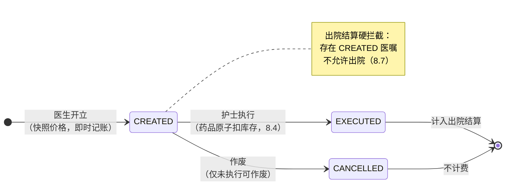
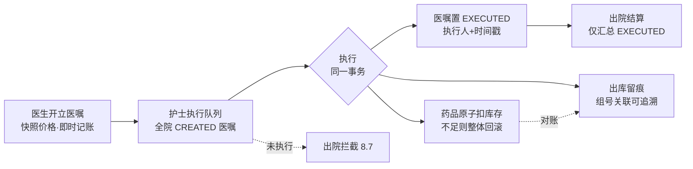
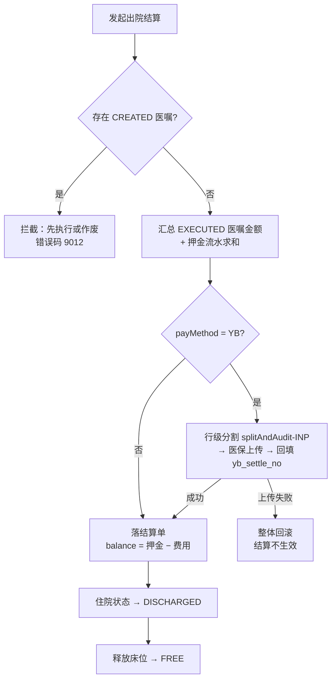

# 第 8 章 住院与护理

> 本章属第三篇「业务篇」。住院是医院资源密度最高、执行链条最长的业务域：一张床位从占用到释放，
> 中间穿过医嘱、护理执行、病历文书、风险评估与出院结算，任何一环脱扣都会变成费用差错或医疗安全事件。
> 本章从床位这个"第一资源"讲起，依次展开记账式医嘱、电子病历与 CA 签名、护理执行闭环、
> 风险评估量表、出院结算的完整性校验，最后讨论移动形态与 ICU/临床路径两个专科场景。
> 全章以 HIP 平台的住院模块为贯穿案例。

## 学习目标

学完本章，你应当能够：

1. 解释床位为什么必须建模为独占资源，用条件 UPDATE 写出原子占床语句，并说明它与号源占用、库存扣减同属一个并发控制家族；
2. 区分长期医嘱与临时医嘱，说出医嘱计费时点的三种行业方案（开立计费/执行计费/发药计费）及各自的差错形态；
3. 论证"记账式医嘱行 = 费用行"这一模型选择如何成为医保行级分割（第 10 章）的上游前提；
4. 描述住院病历的文书体系与时限要求，解释 CA 电子签名的"冻结"语义，说出签名适配器 SPI 的接口契约；
5. 画出"开立→执行→出院拦截→结算"的医嘱生命周期状态机，解释未执行医嘱为什么必须拦截出院；
6. 说出 Braden、Morse 两个护理风险评估量表的评估对象、分值区间与分级阈值，设计评估趋势与高危预警的数据结构；
7. 比较原生 App、PDA 专用程序与 H5 三种移动护理形态的取舍，说明"复用同一套 API"对移动端建设成本的意义。

---

## 8.1 住院登记与床位管理

### 8.1.1 床位：住院业务的第一资源

门诊的核心资源是号源，住院的核心资源是**床位**。两者的共性是**独占性**：一个号只能挂给一个人，一张床同一时刻只能住一个患者。差别在生命周期——号源以"天 × 医生"为单位批量生成、当天作废；床位是长期存在的实体资产，状态随入院、转科、出院反复翻转，还要挂靠病区（护理单元）的组织结构。

床位建模的通用要点：

1. **床位挂病区，不挂科室**。住院患者有两个组织归属：**科室**（医疗归属，决定主管医生和费用归口）与**病区**（护理归属，决定哪个护理单元管这张床）。小医院常常一科一区，二者合一；但模型上必须分开——外科病区加床收内科患者（跨科收治）是真实存在的场景，合并建模的系统遇到它只能造假数据。
2. **床位状态机要小**。空闲/占用是必须的，扩展态（预约、消毒、维修）按需加，不要预设一个庞大状态机——每多一个状态，所有读写床位的代码都多一个分支。
3. **占床必须防并发**。两个住院处窗口同时把患者办进同一张空床，是真实会发生的竞态。

第三点是本节的重心。第 7 章的号源占用用"条件 UPDATE + 受影响行数判定"解决了防超挂，床位是同一问题的变体：把"还有余号才自增"换成"是空床才占用"。

> **案例框 8-1：HIP 的原子占床**
>
> HIP 的床位表 `inp_bed` 只有五个字段：病区、床号、状态、当前住院 id，加一条 `unique (ward_id, bed_no)` 约束（[V8__inpatient.sql](../../server/src/main/resources/db/migration/V8__inpatient.sql)）。占床是仓储层的一条条件 UPDATE（[BedRepo.java](../../modules/inpatient/src/main/java/cn/hip/inpatient/repository/BedRepo.java)）：
>
> ```java
> /** 原子占床：只有空床才占 */
> @Modifying(clearAutomatically = true, flushAutomatically = true)
> @Query("update InpBed b set b.status = 'OCCUPIED', b.admissionId = :admissionId " +
>        "where b.id = :bedId and b.status = 'FREE'")
> int occupy(@Param("bedId") Long bedId, @Param("admissionId") Long admissionId);
> ```
>
> 并发安全完全由数据库保证：两个事务同时执行这条 UPDATE，行锁使它们串行化，后到者的 WHERE 条件（`status = 'FREE'`）不再成立，返回受影响行数 0。调用方（`InpatientService.admit`）据此抛业务异常"床位已被占用"，整个入院事务回滚——先落库的住院档案记录也一起消失。**不需要悲观锁、不需要分布式锁、不需要重试**，一条 SQL 的语义就是完整的并发控制。
>
> 这与第 7 章号源占用（`booked < capacity` 才自增）、第 7 章药房发药和本章 8.4 的库存扣减（`stock >= qty` 才减）是同一个模式的三次实例化。值得把它总结成一条设计定式：**独占或限量资源的获取，一律写成"条件更新 + 判定受影响行数"，把竞态裁决权交给数据库行锁**。反例是"先 SELECT 检查再 UPDATE"的两步写法——检查与更新之间的窗口期就是超卖事故的温床。
>
> 入院登记（`admit`）的编排顺序也有讲究：先保存住院档案拿到自增 id，用 id 生成住院号（`ZY + 日期 + 序号`），**再**占床——占床失败时档案随事务回滚，不留孤儿记录；反过来先占床再建档，建档失败就需要补偿性放床，多出一条失败路径。

### 8.1.2 押金：后付制下的信用垫

门诊是"先缴费后执行"，住院是**后付制**——费用在住院期间持续发生，出院时一次结清。后付制的信用风险由**预交金（押金）**缓冲：入院时收首笔，住院中费用逼近押金余额时催缴续交。押金在会计上是负债（预收款），不是收入，出院结算时冲抵费用、多退少补。

HIP 的 `inp_deposit` 表按笔记录押金（金额、支付方式、操作员），**只增不改**——每笔押金是一条独立流水，退补发生在结算环节而不是修改历史记录。这是财务类数据的通用纪律：流水永远只追加，余额永远由汇总计算（与第 10 章"留痕只增不减"同源）。

### 8.1.3 转科换床：先占后放

转科是住院期间的组织归属变更，涉及床位交换。HIP 的 `transfer` 实现顺序值得注意：**先原子占新床，成功后才释放旧床**，二者在同一事务内。反过来先放旧床再占新床，一旦新床被抢，患者就"悬空"了——没有任何床位归属。"先取得新资源、再释放旧资源"是资源交换的通用顺序（对比：数据库迁移先建新列再删旧列，发布工艺先起新实例再下线旧实例）。

转科全程落 `inp_transfer_log`（从科室/到科室/从床/到床/操作员），这张留痕表既是床日统计的数据源，也是费用归属争议时的仲裁依据。

---

## 8.2 记账式医嘱体系

### 8.2.1 长期医嘱与临时医嘱

医嘱（Physician Order）是住院诊疗的驱动核心。临床上分两类：

- **长期医嘱**：有效期跨天，按频次反复执行（"头孢呋辛 1.5g 静滴 bid"），直到停止医嘱下达；
- **临时医嘱**：一次性执行（"急查血常规""明晨禁食"），执行完即结束。

两类医嘱的信息化含义完全不同：临时医嘱是"一条医嘱一次执行"，模型简单；长期医嘱是"一条医嘱 N 次执行"，需要**医嘱拆分**机制——按频次把长期医嘱展开为每日执行条目（业内称"转抄"或"摆药单生成"），执行记录与医嘱是一对多。长期医嘱还有配套的停嘱流程：停止时间之后的未执行条目要作废。

医嘱的另一个结构概念是**成组**：几种药品混在一组液体里静滴，临床是一个动作，医嘱是多行记录，用组号绑定——执行、停嘱、退费都以组为单位。

### 8.2.2 医嘱计费时点：行业的三种选择

医嘱行何时变成费用行，行业有三种方案，差错形态各不相同：

| 方案 | 计费时点 | 优点 | 风险 |
|---|---|---|---|
| 开立计费（记账式） | 医生开立医嘱即产生费用 | 费用最完整，不漏记 | 开而未执行会多收——须有拦截或冲销机制 |
| 执行计费 | 护士执行时产生费用 | 费用与实际执行一致 | 执行漏记账即漏费，追补困难 |
| 发药计费 | 药房摆药/发药时计费 | 与药品实物流一致 | 只覆盖药品，非药品项目仍需前两者之一 |

没有无代价的选项，选择的实质是**把差错押在哪一侧**：开立计费押"多收"（可通过拦截未执行医嘱消除），执行计费押"漏收"（漏掉就很难发现）。多收有患者和医保盯着，漏收只有年底财务对不上账时才浮现——**可被外部发现的差错优于静默差错**，这是多数 HIS 采用记账式的深层理由。

### 8.2.3 记账式医嘱行：费用的最小粒度

记账式的关键设计是让**医嘱行本身携带完整的计费信息**——项目编码、名称、单价、数量、金额，医嘱行就是费用行，不再另设计费表。这个选择的价值要到下游才充分显现：医保行级分割（第 10 章 10.2.4）要求住院费用逐行归类，记账式医嘱天然满足——出院结算时把已执行医嘱行直接装配成分割入参即可。**上游模型多存几个冗余字段，下游整条业务线不用返工**；反之，医嘱只存 item_id、费用另算总额的系统，接 DRG 时要伤筋动骨地补行级数据。

> **案例框 8-2：HIP 的医嘱行快照**
>
> HIP 的 `inp_order` 表（[V8__inpatient.sql](../../server/src/main/resources/db/migration/V8__inpatient.sql)）每行冗余存储 `item_code / item_name / spec / unit / unit_price / amount`，开立时从药品或收费项目字典**快照**进来（[InpatientService.java](../../modules/inpatient/src/main/java/cn/hip/inpatient/service/InpatientService.java) 的 `createOrders`）：
>
> ```java
> if ("DRUG".equals(line.orderType())) {
>     DrugItem drug = drugRepository.findById(line.itemId()).orElseThrow(...);
>     o.setItemCode(drug.getCode());
>     o.setItemName(drug.getName());
>     o.setUnitPrice(drug.getPrice());
>     o.setUsageRoute(line.usageRoute());   // 药品医嘱特有：途径/频次/单次剂量
>     o.setFrequency(line.frequency());
>     o.setDosePerTime(line.dosePerTime());
> } else { ... /* 收费项目同理 */ }
> o.setAmount(o.getUnitPrice().multiply(BigDecimal.valueOf(o.getQty())));
> ```
>
> 快照而非外键引用当前价，理由是**历史不随字典漂移**：药品明天调价，昨天开的医嘱金额不能变——费用、发票、医保上传都已按旧价发生。字典表存"现在的真相"，业务行存"当时的真相"，这是所有交易类系统的通用纪律。
>
> 每条医嘱带 `group_no`（`YZ + 日期 + 序号`）承载成组语义；库存出库留痕（8.4）也以组号为关联键。需要说明边界：HIP 当前的医嘱模型是**临时医嘱形态**（一条医嘱一次执行），长期医嘱的按频次拆分尚未实现——对以静滴为主的县级医院演示场景够用，但实施于真实病房前，长期医嘱拆分是必须补齐的能力，这也是本书刻意保留的"模型如何生长"的观察点。

医嘱的生命周期状态机如图 8-1。注意它比门诊订单（第 7 章：开立→收费→执行）少一个收费态——记账式下开立即记账，不存在"待收费"中间态；执行的把关移到了出院结算的拦截（8.7）。



**图 8-1 住院医嘱生命周期状态机**

---

## 8.3 住院电子病历与 CA 签名冻结

### 8.3.1 病历文书体系与时限

住院病历不是一份文档，而是一个**文书家族**：入院记录、首次病程记录、日常病程、上级医师查房记录、出院小结（死亡记录）等，各有法定书写时限——按《病历书写基本规范》，入院记录须于入院后 24 小时内完成，首次病程记录须于入院后 8 小时内完成【成稿核对：卫医政发〔2010〕11 号具体时限条款】。时限不是建议而是质控红线，电子病历系统应把它做成**可自动核查的规则**而非依赖人工抽查。

HIP 的 `inp_medical_record` 用 `record_type`（ADMISSION/PROGRESS/DISCHARGE）区分文书类型（[InpEmrController.java](../../modules/inpatient/src/main/java/cn/hip/inpatient/web/InpEmrController.java)）；时限质控接口据此自动清点"入院超 24 小时无入院记录""已出院无出院小结"的缺陷清单（第 12 章将展开质控体系）。文书类型字段的价值正在于此：**病历若只是一堆无类型的文本，时限质控就无从下手**——结构化的第一步不是把内容拆成字段，而是把文书本身分类。

### 8.3.2 电子签名：从"能改"到"冻结"

纸质病历靠手写签名固定责任，电子病历的对应物是**电子签名**。《中华人民共和国电子签名法》确立了基本框架：可靠的电子签名与手写签名或盖章具有同等的法律效力，"可靠"的要件包括签名制作数据由签名人专有控制、签署后对签名及数据电文的任何改动能够被发现【成稿核对：电子签名法第十三、十四条表述】。落到医院场景，行业通行做法是接入 **CA**（Certificate Authority，数字证书认证机构）：医生持数字证书（USB Key 或手机协同证书），对病历内容摘要做非对称加密签名，第三方可用公钥验签。

对系统设计者，电子签名的核心不是密码学，而是**冻结语义**：

1. **签名对象是内容快照**——对参与签名的字段拼接摘要，签的是"此刻的这份内容"；
2. **签名后禁止修改**——已签名病历的任何编辑请求都必须拒绝，修改须走"废弃重签"或版本化的修订流程（保留原版本与修订痕迹）；
3. **验签可追溯**——存签名值与签名时间，事后可证明"内容未被篡改"。

没有冻结的签名是自欺：签完还能改内容，签名值与内容脱钩，法律效力无从谈起。

> **案例框 8-3：SignatureAdapter SPI 与 Mock 的诚实边界**
>
> CA 产品是外部条件（须采购厂商服务，如 CFCA/BJCA），HIP 按第 6 章的适配器模式将其收敛为两个方法的 SPI（[SignatureAdapter.java](../../platform/integration/src/main/java/cn/hip/platform/integration/signature/SignatureAdapter.java)）：
>
> ```java
> public interface SignatureAdapter {
>     record SignResult(boolean ok, String signature, String message) {}
>     SignResult sign(String content, Long signerId);   // 对内容摘要签名，返回 Base64 签名值
>     boolean verify(String content, String signature); // 验签
> }
> ```
>
> 签名动作的业务侧编排（`DoctorStationService.signEmr`，[DoctorStationService.java](../../modules/outpatient/src/main/java/cn/hip/outpatient/service/DoctorStationService.java)）完整体现冻结语义：已签名者拒绝重签（"病历已签名"）；把主诉、现病史、既往史、查体、处置意见按固定顺序拼接为签名内容；签名成功才写入 `signature` 与 `signed_at`；此后一切编辑入口检查签名列非空即拒绝。
>
> Mock 实现（[MockSignatureAdapter.java](../../platform/integration/src/main/java/cn/hip/platform/integration/signature/MockSignatureAdapter.java)）用 SHA-256 摘要模拟签名值，其类注释值得抄录："**内容防篡改可验，无法证明签名人身份——生产须换 CA SDK**"。这句话是 Mock 工程的样板：摘要能提供完整性（内容改动可被发现），但人人都能算摘要，不具备"签名人专有控制"要件，因此不构成法律意义的电子签名。把 Mock 能做到什么、做不到什么写进代码注释，实施时才不会把演示能力当成合规能力交付。
>
> 一个对读者有教学价值的诚实披露：HIP 当前的签名冻结闭环落在**门诊病历**（`outp_emr` 的 signature/signed_at 列，V12 迁移）；住院病历表 `inp_medical_record` 尚未挂签名列，属同一 SPI 下的待接扩展点——住院文书是多类型、多份记录，逐份签名的交互与"归档时批量补签"的流程设计比门诊单份病历复杂，这正是它排在后面的原因。功能规划与代码现状的这类差距，在真实项目中普遍存在，管理它的方法（功能清单标注外部条件、验收时逐条核对）见第 14 章。

---

## 8.4 护理执行闭环

### 8.4.1 从医嘱到床旁：闭环管理

"医嘱闭环管理"是电子病历评级（第 1 章）的高频考点，含义是医嘱从开立到执行的每个环节都有记录、可追溯：开立→审核→（转抄/摆药）→执行→复核。给药场景还叠加"三查七对"与给药安全的 5R 原则（正确的患者、药品、剂量、途径、时间）。信息系统对闭环的贡献在两点：**每个环节留下执行人与时间戳**；**用系统校验替代部分人工核对**（如扫码核对腕带与药袋）。

### 8.4.2 执行动作的三重联动

护士点击"执行"的瞬间，系统要同时完成三件事：医嘱状态翻转、库存扣减、出库留痕——三者必须在同一事务内，任何一个失败全部回滚。

> **案例框 8-4：执行即扣库存**
>
> HIP 的执行实现（[InpatientService.java](../../modules/inpatient/src/main/java/cn/hip/inpatient/service/InpatientService.java) 的 `execute`）：
>
> ```java
> @Transactional
> public InpOrder execute(Long orderId, Long executorId) {
>     InpOrder o = orderRepo.findById(orderId).orElseThrow(...);
>     if (!"CREATED".equals(o.getStatus())) {
>         throw new InpException(9009, "仅未执行医嘱可执行");
>     }
>     if ("DRUG".equals(o.getOrderType())) {
>         if (drugRepository.deductStock(o.getItemId(), o.getQty()) == 0) {
>             throw new InpException(9010, "库存不足: " + o.getItemName());
>         }
>         inventoryService.logOut(o.getItemId(), o.getQty(), o.getGroupNo(), executorId);
>     }
>     o.setStatus("EXECUTED");
>     o.setExecutorId(executorId);
>     o.setExecutedAt(Instant.now());
>     return orderRepo.save(o);
> }
> ```
>
> `deductStock` 是又一条"条件更新 + 判定行数"（`stock >= qty` 才减，见 [DrugItemRepository.java](../../platform/masterdata/src/main/java/cn/hip/platform/masterdata/repository/DrugItemRepository.java)），与 8.1 的占床共用同一并发定式——两个护士同时执行最后一支药，只有一人成功。出库留痕以医嘱组号为业务关联键，进销存对账（第 2 章药事流程）由此可回溯到"哪条医嘱消耗了这支药"。
>
> 两处状态防线也值得注意：入口的 `CREATED` 校验防**重复执行**（重复扣库存、重复计费）；`executorId` 与 `executedAt` 使每次执行可追责——闭环管理的"环"就是由这些执行人+时间戳串起来的。

执行闭环全景如图 8-2：



**图 8-2 护理执行闭环：一次执行动作的三重联动**

### 8.4.3 生命体征与体温单

生命体征（体温、脉搏、呼吸、血压、血氧）是护理数据中最规整的时间序列。纸质时代的载体是**三测单（体温单）**——以折线呈现体温脉搏走势的经典图表，任何护士看一眼就能读出趋势。电子化的正确做法不是发明新展现，而是**复刻这张临床人人会读的图**：HIP 的 `inp_vital_sign` 表按次存储六项体征（[V9__inp_emr_vitals.sql](../../server/src/main/resources/db/migration/V9__inp_emr_vitals.sql)），前端按测量时间正序取数画体温单折线。模型上的要点只有一个：**测量时间（measured_at）与录入时间分离**——补录昨晚的体温，曲线上的点必须落在昨晚。

---

## 8.5 护理风险评估

### 8.5.1 量表：把临床判断变成可比的数字

护理风险评估用标准化量表把"这个患者危不危险"变成分数，两个最常用的：

- **Braden 量表**评估**压力性损伤**（压疮）风险：从感知能力、潮湿、活动能力、移动能力、营养、摩擦与剪切力六个维度打分，总分 6–23，**分数越低风险越高**；
- **Morse 量表**评估**跌倒**风险：跌倒史、多重诊断、行走辅助、静脉输液、步态、认知六项，总分 0–125，**分数越高风险越高**。

两个量表方向相反（一个低分危险、一个高分危险），是系统实现时最容易写反的地方。评估不是一次性动作：入院、转科、手术后、病情变化都应重评，因此数据结构必须支持**同一患者多次评估构成趋势**；高危患者要触发护理干预（防压疮气垫、防跌倒标识），系统侧的对应物是**高危预警清单**。

### 8.5.2 阈值分级与预警清单

> **案例框 8-5：HIP 的风险评估实现**
>
> HIP 的实现（[RiskAssessController.java](../../modules/qualitycare/src/main/java/cn/hip/qualitycare/web/RiskAssessController.java)）把分级阈值写在服务端：Braden ≤12 高危、13–14 中危、≥15 低危；Morse ≥45 高危、25–44 中危、<25 低危【成稿核对：阈值与文献通行分档的一致性】。三个工程细节：
>
> - **范围校验在服务端**（Braden 6–23、Morse 0–125 之外直接拒绝）——前端校验挡不住接口直调与集成调用，凡是有临床含义的取值范围，服务端必须复核；
> - **只收总分不收分项**是一个明确的取舍：分项得分对护理质控有价值（哪个维度拉低了分数），但录入负担翻倍。HIP 选择先落总分把闭环跑通，分项留给量表结构化的后续迭代——量表种类繁多（还有 GCS、疼痛评分、VTE 评估等），逐一结构化应由实施需求驱动而非预先大而全；
> - **高危预警清单**用 PostgreSQL 的 `distinct on` 取每个在院患者每类量表的**最近一次**评估，过滤出高危者，联出床位与科室——"最近一次"是语义要点：患者三天前高危、昨天复评已降级，就不该再出现在预警清单上。评估历史全量保留（趋势接口按时间正序输出，供前端画风险变化曲线），清单只看最新，这又是"留痕全量、口径过滤"原则的一次出场。

---

## 8.6 护理白板与交接班

护理白板的原型是病区走廊里那块真实的白板：床号、姓名、护理级别、过敏、注意事项。它的信息化价值不在存储而在**聚合**——把散在各表的在院信息拼成护士站一眼可扫的总览。HIP 的白板接口（[NursingQualityController.java](../../modules/qualitycare/src/main/java/cn/hip/qualitycare/web/NursingQualityController.java)）用一条 SQL 联五张表：住院档案、床位、病区、科室、患者，每行附带一个关键的子查询——**该患者未执行医嘱数**。这个数字让白板从"静态名单"变成"工作驱动器"：哪张床还有活没干，一眼可见。

**护理级别**（特级、一级、二级、三级）由医嘱确定，决定巡视频次与护理投入【成稿核对：《综合医院分级护理指导原则》及 WS/T 431 现行版本】。HIP 把它存为 `inp_admission.care_level`，修改接口做白名单校验（只接受四个合法值）——枚举类临床属性宁可硬校验，也不要留自由文本，否则统计时会收获"Ⅰ级/一级/1级"三种写法。

**交接班**是护理连续性的制度保障，行业推荐 SBAR 结构（现状 Situation、背景 Background、评估 Assessment、建议 Recommendation）。HIP 的 `shift_handover` 表做了最小建模：科室、班次类型、交班摘要、待办事项、记录人——把"待办"从摘要中单列出来，是让接班者第一眼看到"我要做什么"，这一列的存在比任何格式规范都更接近 SBAR 的本意。

---

## 8.7 出院结算

### 8.7.1 结算的完整性问题

出院结算是住院费用的总闸门：汇总全程费用、冲抵押金、多退少补。它比门诊收费多一个独有的难题——**完整性**。门诊是先缴费后执行，收费那一刻费用天然完整；住院费用持续发生，结算时刻系统里可能还躺着开立未执行的医嘱。这时结算面临两难：把未执行医嘱计入费用，是收了没提供的服务（违规）；不计入，若护士随后补执行，费用就漏掉了（漏收），且医保分割已按旧口径上传，无法追补。

**正确答案是两者都不选：拦截。**存在未执行医嘱就不允许结算，强制临床先把医嘱处理干净——该执行的执行、不做了的作废。拦截把"结算时刻费用集合已封闭"变成一个系统保证的**不变式**，后续一切计算（费用汇总、押金冲抵、医保分割）都站在这个不变式上。

> **案例框 8-6：HIP 的出院结算编排**
>
> `discharge` 方法（[InpatientService.java](../../modules/inpatient/src/main/java/cn/hip/inpatient/service/InpatientService.java)）的关键序列：
>
> ```java
> List<InpOrder> orders = orderRepo.findByAdmissionIdOrderByIdAsc(admissionId);
> boolean hasPending = orders.stream().anyMatch(o -> "CREATED".equals(o.getStatus()));
> if (hasPending) {
>     throw new InpException(9012, "存在未执行医嘱，请先执行或作废");
> }
> BigDecimal total = orders.stream()
>         .filter(o -> "EXECUTED".equals(o.getStatus()))
>         .map(InpOrder::getAmount)
>         .reduce(BigDecimal.ZERO, BigDecimal::add);
> ```
>
> 拦截之后，汇总仍显式只取 `EXECUTED`（作废医嘱不计费），押金按 `inp_deposit` 流水求和，`balance = 押金 − 总费用`（正数退、负数补）。医保患者（payMethod=YB）在同一事务内追加两步：把已执行医嘱行装配为 `YbLine` 调用统一分割引擎（`splitAndAudit("INP", ...)`——8.2.3 铺垫的行级前提在此兑现），再经 `InsuranceAdapter` 上传结算，失败即抛错、整个出院回滚；成功则回填 `yb_settle_no`（第 10 章那个"教训案例"的修复成果，此处是它的住院侧落点）。最后才翻转住院状态为 DISCHARGED 并释放床位。
>
> 两道容易被忽略的防线：`inp_settlement` 表对 `admission_id` 建了 **unique 约束**——重复结算在数据库层面被封死，即使代码防线失守（并发双击、重放请求），第二条结算单也插不进去；结算单号 `CY + 日期 + 住院 id` 具备幂等友好性。**校验在代码、约束在数据库，双层防线缺一不可**：代码防线给出友好报错，数据库约束保证最坏情况下数据不烂。

结算流程全景如图 8-3：



**图 8-3 出院结算流程：拦截、汇总、医保联动与资源释放**

### 8.7.2 与医保的接缝

出院结算是第 8 章与第 10 章的交汇点，三条依赖在此闭合：**行级医嘱**（8.2）供给行级分割（10.2.4）；**执行拦截**（8.7.1）保证分割输入的费用集合封闭；**同事务上传 + 结算号回填**沿用门诊结算的强一致语义（10.3）。读者可以体会"模块边界"与"业务链条"的关系：模块按领域切分（住院/医保），但正确性是沿链条整体成立的——上游少一个字段，下游多一次返工。

---

## 8.8 移动护理与移动查房

移动护理的经典形态是 **PDA + 扫码**：护士持专用手持机，扫患者腕带与药袋条码完成身份核对、床旁执行、体征录入。它是给药安全闭环的完全体，但成本不菲：专用硬件采购与维护、原生应用的开发与升级分发、病房无线网络的全覆盖改造。

县级医院起步阶段的务实替代是 **H5 移动页**：手机浏览器直接访问，零安装、零分发、随系统同步升级。代价是拿不到扫码硬件能力（浏览器调用摄像头识码的体验与可靠性远逊于专业扫码头），身份核对退回人工。

HIP 选择了 H5 形态（[MobileWorkView.vue](../../frontend/shell/src/views/inpatient/MobileWorkView.vue)），其实现方式比形态本身更值得记录：**移动工作台没有一个专属后端接口**。移动护理的体征录入调用的是 8.4 的 `/vitals` 接口，移动查房写病程调用的是 8.3 的 `/records` 接口（recordType=PROGRESS），在院列表复用住院列表接口——移动端只是同一套 API 的另一个视图（单列卡片、抽屉式详情、480px 宽度约束）。这带来两个直接收益：移动端永远不会与桌面端数据不一致（同一接口无所谓一致性问题）；后端零增量，移动端的全部成本就是一个 Vue 页面。**"移动优先"对中小医院的正确解读不是另建一套移动系统，而是让既有 API 天然可被移动端消费。**当然也要诚实标注边界：无扫码核对的 H5 移动护理，承载的是"录入便利"而非"给药安全闭环"，二者不可混称——向院方汇报能力清单时，这类措辞的分寸就是信任的分寸。

---

## 8.9 专科场景：ICU 与临床路径

### 8.9.1 ICU：同一类数据的另一种密度

ICU 的护理记录与普通病房在**数据模型上同构、在密度与维度上不同**：体征从每日两三测变成每小时甚至每 15 分钟一记；在常规六项之上增加 **GCS**（Glasgow Coma Scale，格拉斯哥昏迷评分，睁眼+语言+运动三项合计 3–15 分，越低越危重）、**24 小时出入量**（入量：输液/饮水；出量：尿量/引流，出入平衡是循环与肾功能管理的核心指标）与呼吸机标记。

HIP 为此单建 `inp_icu_record` 表（[V21__phase24_specialty.sql](../../server/src/main/resources/db/migration/V21__phase24_specialty.sql)、[IcuRecordController.java](../../modules/inpatient/src/main/java/cn/hip/inpatient/web/IcuRecordController.java)）而不是往 `inp_vital_sign` 上加列——普通病房的体征录入界面不该被 GCS、出入量这些用不到的字段拖累，**按使用场景分表比按数据相似性合表更利于两边各自演进**。表上有两个可抄的细节：GCS 的取值范围同时做了服务端校验与数据库 CHECK 约束（`chk_icu_gcs`，3–15），又一次双层防线；24 小时出入量汇总用 `recorded_at > now() - interval '24 hours'` 的**滚动窗口**而非自然日——凌晨 3 点查房问的是"过去 24 小时"，不是"今天零点以来"。

### 8.9.2 临床路径：把诊疗过程模板化

临床路径（Clinical Pathway）是对特定病种制定的标准化诊疗流程：第几天做什么检查、用什么药、达到什么标准出院。它的管理价值在**变异分析**——实际诊疗偏离路径（超期、退出）的记录与统计，既是医疗质量指标，也是 DRG 时代成本管控的抓手（路径内的病例费用可预期）。

> **案例框 8-7：入径即开单，变异即留痕**
>
> HIP 的路径实现（[PatientCareController.java](../../modules/qualitycare/src/main/java/cn/hip/qualitycare/web/PatientCareController.java)）由三张表支撑：模板 `cp_pathway_template`（病种名、ICD 前缀、**医嘱项列表存为 JSON**——复用 8.2 的 `OrderLine` 结构）、入径 `cp_enrollment`、变异 `cp_variance`（[V28__phase30_medrecord_clinical.sql](../../server/src/main/resources/db/migration/V28__phase30_medrecord_clinical.sql)）。
>
> 入径动作（`applyPathway`）的实质是**按模板批量调用 `createOrders`**——路径不是独立于医嘱的另一套体系，而是医嘱的"预制菜"：模板里存的就是医嘱行参数，入径展开成真实医嘱后，执行、计费、拦截全部走既有闭环，路径模块自身不需要任何执行逻辑。`cp_enrollment` 的 `unique (admission_id, template_id)` 防重复入径。
>
> 变异登记分三型（DELAY 超期 / EXIT 退出 / OTHER），其中 **EXIT 型变异同步把入径状态翻转为 EXITED**——退出路径必有原因，所以"退出"不做成独立操作，而是变异登记的副作用，保证退出必留因。统计接口输出各路径的完成率、退出率、变异率（有变异记录的入径占比），这三个比率就是路径管理向医务科汇报的核心口径。
>
> 模板 JSON 化是又一处"简化结构而不简化语义"：正式的路径定义有按天分阶段、可选项、评估节点，HIP 的平铺医嘱列表是它的最小可用子集——模板结构可以后续升级，而入径留痕、变异分析这些管理闭环从第一天就是完整的。

住院域还有两个专科流程——手术麻醉（申请/麻醉记录单/PACU 苏醒评分）与用血管理（申请→审批→发血→输血的全状态机，`blood_apply` 表）——从科室视角归入医技篇，见第 9 章。

---

## 本章小结

- 床位是独占资源，**原子占床**用"条件 UPDATE + 判定受影响行数"实现，与号源占用、库存扣减同属一个并发定式：把竞态裁决权交给数据库行锁。入院编排先建档后占床，转科先占新床再放旧床，押金流水只增不改。
- 医嘱计费时点三方案（开立/执行/发药计费）押的是不同差错：记账式押"多收"但可被拦截消除，执行计费押"漏收"且静默。**记账式医嘱行自带编码与金额快照，医嘱行即费用行**——这是医保行级分割（第 10 章）的上游前提；快照而非引用，让历史不随字典调价漂移。
- 电子签名的核心是**冻结语义**：签内容快照、签后拒改、验签可追溯。CA 能力收敛为两方法的 SignatureAdapter SPI；Mock 用摘要模拟须诚实标注"可验完整性、不能证明身份"。文书按类型建模是时限质控自动化的前提。
- 护理执行是**一个事务三重联动**：状态翻转、原子扣库存、出库留痕；入口状态校验防重复执行，执行人+时间戳构成闭环追溯。生命体征按测量时间建模，电子体温单复刻临床熟悉的三测单。
- Braden（6–23，低分危险）与 Morse（0–125，高分危险）方向相反；范围校验放服务端，评估留全量趋势，预警清单只看**最近一次**高危。护理白板的价值在聚合，"未执行医嘱数"让它成为工作驱动器。
- 出院结算的独有难题是**完整性**：未执行医嘱既不能计费也不能放过，唯一正解是拦截，使"结算时费用集合封闭"成为系统不变式。医保分割与上传在同一事务，结算号回填；unique 约束封死重复结算——校验在代码、约束在数据库。
- H5 移动工作台复用同一套 API，零后端增量、天然数据一致；但无扫码核对的 H5 承载的是录入便利而非给药安全闭环，能力表述要有分寸。
- ICU 按场景单建密集记录表（GCS 双层校验、24 小时滚动窗口出入量）；临床路径是医嘱的模板化——入径即批量开单，复用全部执行闭环，EXIT 变异同步退出保证"退出必留因"。

## 思考与练习

1. **概念**：解释"记账式医嘱"与"执行计费"两种方案各自把差错押在哪一侧，并论述"可被外部发现的差错优于静默差错"这一判断在两个方案对比中的含义。
2. **设计**：HIP 当前的医嘱模型是临时医嘱形态。为其增加长期医嘱支持：给出 `inp_order` 需要的字段改动（或新增拆分表）、按频次（bid/tid/qd）生成每日执行条目的规则、停嘱时对未来条目的处理，并说明拆分后 8.7 的出院拦截条件要如何改写。
3. **并发**：8.1 的原子占床与第 10 章 10.2.3 的年度累计行锁（SELECT FOR UPDATE）都是并发控制，但用了不同手段。分析两个场景的差别（一次性判定 vs 读改写累计），说明为什么占床不需要 FOR UPDATE，而累计更新需要。
4. **排障**：某病房反馈"患者明明已办出院，床位仍显示占用"。结合 `discharge` 的事务编排（图 8-3），列出可能的原因与排查顺序（提示：医保上传失败回滚时前端如何提示、release 是否与状态翻转同事务、是否有人绕过接口改库）。
5. **计算与判断**：患者 Braden 评分 13 分、Morse 评分 50 分，三天后复评 Braden 16 分、Morse 40 分。给出两次评估的风险分级；说明此时该患者是否应出现在高危预警清单，为什么"清单看最新、趋势看全量"必须并存。
6. **论述**：8.3 披露了"功能清单标注 CA 签名，住院病历实际未挂签名列"的差距。从产品管理与验收的角度，论述这类差距应如何呈现给院方（隐瞒、模糊、还是标注外部条件与计划），并结合电子签名法的"可靠电子签名"要件，说明用 Mock 摘要冒充 CA 签名上线的法律与合规风险。
7. **实践**（配套实训环境）：为移动工作台补一个"待执行医嘱"页签：复用 `/api/inpatient/orders/pending` 接口按当前病区过滤，执行按钮调用既有 execute 接口。写出前端改动要点，并设计一个 E2E 用例验证"移动端执行后，桌面端护士执行队列同步减少"。
