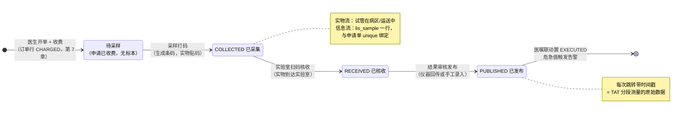
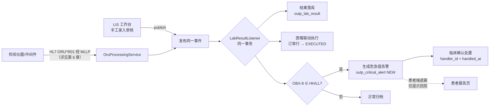
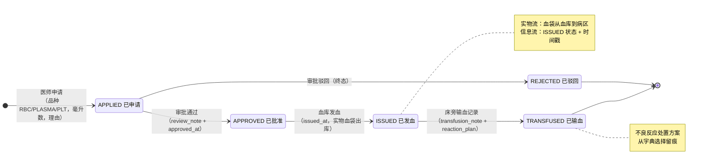

# 第 9 章 医技系统

> 本章属第三篇「业务篇」。医技科室——检验、影像、病理、手术麻醉、输血——是医院的「服务生产车间」：临床开出申请，医技交付结果。这些系统看似彼此无关（LIS 管试管、PACS 管影像、血库管血袋），本质上却在解同一道题：**一件实物（标本/胶片/血袋）与一条信息（申请/报告/记录）如何始终对齐**。本章的贯穿视角是：医技各系统都是「状态机 + 闭环」——实物每移动一步，信息状态推进一格，任何一侧单独前进都是事故的开端。全章依次展开 LIS 标本流转、设备直连与危急值、RIS 报告、PACS 与 DICOM、病理、手术麻醉、用血管理与时段预约，以 HIP 平台的医技模块为贯穿案例。

## 学习目标

学完本章，你应当能够：

1. 说出检验前、中、后三个阶段各自的质量风险，解释 TAT 指标的定义与分段测量方法；
2. 画出 LIS 标本从采集到发布的完整状态机，解释「条码 + 唯一约束」如何保证标本与申请一一对应；
3. 描述检验结果从仪器回传到临床告警的完整链路，说明设备直连与手工录入为什么应当汇聚到同一处理路径；
4. 解释 RIS 报告「书写—审核」双签流程的质量含义，说出 DICOM 的 Study/Series/Instance 三层模型与 PACS 的基本部署形态；
5. 说明病理标本流转与检验标本流转的异同，理解「复用状态机模式」的工程价值；
6. 描述 PACU Steward 苏醒评分的构成与出室判定逻辑，画出用血申请到输血记录的全状态机，说出临床用血分级审批的法规背景；
7. 用「实物流与信息流对齐」的统一视角，分析一个新医技场景（如消毒供应追溯）应当如何建模。

---

## 9.1 LIS 检验流程：标本流转状态机

### 9.1.1 检验前、中、后：质量问题大多不在实验室里

LIS（Laboratory Information System，实验室信息系统）管理的对象是**检验全过程**，业界按 ISO 15189 医学实验室质量管理体系的习惯把它分为三段：

| 阶段 | 环节 | 典型质量风险 |
|---|---|---|
| 检验前（pre-analytical） | 开单→采样→运送→核收 | 贴错条码（张冠李戴）、采错管、溶血、送检超时 |
| 检验中（analytical） | 上机→检测→室内质控 | 仪器漂移、试剂批号、质控失控 |
| 检验后（post-analytical） | 审核→发布→临床解读 | 漏审、危急值未通知、报告发错人 |

多项研究表明，检验差错的大头发生在**检验前阶段**——也就是实验室墙外、信息系统最能发力的那一段。标本流转信息化的核心价值不是「让技师少敲键盘」，而是把检验前的每一次实物交接都变成可校验、可追溯的状态跳转：护士扫申请条码采样，标本上就多了一个与申请一一对应的身份；实验室扫码核收，「标本确实到了」才成为系统事实。

衡量这条链路效率的通用指标是 **TAT**（Turnaround Time，周转时间）。TAT 的口径必须分段定义——「开单到发布」「采样到发布」「核收到发布」是三个不同的数字，分别考核不同环节的责任人。分段测量的前提是每个状态跳转都带时间戳——这就是状态机表设计里那一串 `collected_at / received_at / published_at` 列的用途：**状态机的时间戳列，天然就是 TAT 的原始数据**。

TAT 的管理用法有两层。日常层面看**分位数而非平均数**：平均 TAT 被大量常规标本稀释，管理者真正要盯的是 P90——最慢的那一成标本卡在哪一段；急诊检验通常单列口径并设定时限承诺（如急诊生化 1 小时）。评审层面，检验报告时限是医疗质量控制指标与等级评审的常规核查项（第 12 章时限质控的一个数据源就是本章的时间戳列）。一个设计推论值得记住：**如果某个环节没有对应的状态跳转，它的耗时就永远测不出来**——比如标本运送时长，在「采集→核收」两态模型里与病区滞留时长混在一起，要单独考核运送，就得加一个「已送出」状态。状态机的粒度，本质上是管理粒度的选择。

### 9.1.2 状态机建模：实物流与信息流对齐

把标本流转画成状态机（图 9-1）：



*图 9-1 LIS 标本流转状态机：每个状态跳转对应一次实物交接*

注意「待采样」不是标本表里的状态——标本尚不存在，它是**申请单已收费而标本表无记录**这个查询条件推导出的虚拟状态。这与第 7 章「队列即视图」是同一个思想：能从业务数据推导的状态不要冗余存储。

> **案例框 9-1：HIP 的标本表与幂等采样**
>
> HIP 的标本表 `lis_sample`（[V17__phase13_16.sql](../../server/src/main/resources/db/migration/V17__phase13_16.sql)）核心列：`order_id`（**unique 外键**指向订单行）、`barcode`（unique，条码号）、`status`（COLLECTED/RECEIVED/PUBLISHED）、三个时间戳与审核人 `verifier_id`。两个 unique 约束是对齐关系的数据库表达：一份申请至多一管标本，一个条码至多贴一管。
>
> 采样接口（[MedTechController.java](../../modules/medtech/src/main/java/cn/hip/medtech/web/MedTechController.java) `collect`）用一条**条件插入**同时完成校验与写入：
>
> ```sql
> insert into lis_sample(order_id, barcode, substitute, substitute_name)
> select ?, ?, ?, ?
> where exists (select 1 from outp_order o where o.id = ?
>               and o.order_type = 'LAB' and o.status = 'CHARGED')
>   and not exists (select 1 from lis_sample s where s.order_id = ?)
> ```
>
> 影响行数为 0 即返回「申请不存在/未收费/已采样」（错误码 9940）。这个写法把「先查再插」两步并成原子一步，配合 unique 约束兜底，并发重复扫码也只会产生一管标本——与第 7 章原子占号是同一模式。
>
> 后续每一步推进都是**带状态前置条件的 UPDATE**：核收 `where barcode = ? and status = 'COLLECTED'`，影响 0 行即报「标本不存在或状态不符」（9941）。整个状态机没有一行显式的「if 状态判断」Java 代码——**前置条件长在 SQL 的 WHERE 里，数据库的原子性就是状态机的原子性**。这是 HIP 医技四个状态机（标本/报告/病理/血袋）共用的实现风格。
>
> 表上还有一对「政策列」：`substitute / substitute_name`（替检标识与替检人）。替检——他人代替患者留取标本——在体检等场景屡禁不止，各院管理口径不同，HIP 把它做成参数：`sys_config` 键 `lis_allow_substitute` 为 false 时替检采样直接拦截（4770），为 true 时放行但留替检人标识，分检界面醒目提示（[V37__phase39_assess_substitute.sql](../../server/src/main/resources/db/migration/V37__phase39_assess_substitute.sql)）。管理争议不做死在代码里，交给参数——「配置优先」（第 14 章）的又一实例。

### 9.1.3 发布：状态机的出口连着三件事

「发布」是标本状态机的终态，也是三条下游链路的起点：**结果落库**（患者报告可查）、**医嘱联动执行**（订单行 CHARGED→EXECUTED，闭环回第 7 章的统一订单行）、**危急值判定**（9.2）。HIP 的发布接口把这三件事收敛为发布一个领域事件——无论结果来自仪器还是手工录入，下游处理完全一致，下一节展开。

---

## 9.2 检验设备直连与危急值触发

### 9.2.1 双通道，单语义

检验结果进入系统有两条通道：**设备直连**（生化、血球等仪器经中间件以 HL7/MLLP 协议回传，通信机制、报文解析与 ACK 应答详见第 6 章）与**手工录入**（无接口的项目由技师在 LIS 工作台录入并审核发布）。两条通道的传输形态天差地别，但业务语义完全相同：「某申请单的一组结果项，已经审核成立」。

语义相同就应当只有一份处理代码。HIP 的做法是让两条通道汇聚到同一个领域事件 `LabResultReceivedEvent`（[LabResultReceivedEvent.java](../../platform/integration/src/main/java/cn/hip/platform/integration/event/LabResultReceivedEvent.java)）：MLLP 进站报文经 `OruProcessingService` 解析后发布该事件；LIS 工作台的手工发布接口（`/api/lis/samples/{barcode}/publish`）把录入的结果行装配成同一事件发布。消费方 [LabResultListener.java](../../modules/outpatient/src/main/java/cn/hip/outpatient/service/LabResultListener.java) 对来源无感知：按申请单号定位医嘱→结果逐行落库→医嘱置 EXECUTED→比对危急标志生成告警，全程同一事务。

这个设计的价值在演进时兑现：接入第二台仪器、第三种中间件，甚至未来的区域检验中心回传，都只是「多一个事件发布方」，落库、执行联动、危急值三件事的正确性不需要重新验证。**通道是外部现实，语义才是系统资产。**

### 9.2.2 危急值：从仪器标志到临床处置

危急值管理制度的要求与 HIP 告警闭环（生成→送达→确认处理→留痕）的实现已在第 6 章完整展开，本节从医技业务视角补两点。

其一，**判定权在发布方**。HIP 按结果行的异常标志（HL7 OBX-8 的 HH/LL）触发告警，意味着「是否危急」由仪器规则或审核技师裁量，系统信任上游。对照的另一派做法是院内统一危急值界值表、系统按数值判定——全院口径统一，但要维护一张随检验方法学变化的表。第 6 章已讨论两者取舍，从医技科室的立场看还有一层：**危急值目录本身是检验科与临床科室协商的管理产物**（哪些项目、什么界值、通知到谁），信息系统只是执行者，上线前的目录评审会比代码更决定这个闭环的质量。

其二，**发布即触发，无人值守也不漏**。危急值告警生成与结果落库同事务（图 9-2），仪器深夜回传的危急结果同样立即生成待处理告警——这正是设备直连相对「技师看到异常打电话」的本质改进：闭环的第一环不再依赖人的在场。



*图 9-2 检验结果双通道汇聚与危急值闭环：通道不同，语义与下游处理只有一份*

---

## 9.3 RIS 检查报告

### 9.3.1 报告双签：书写与审核分离

RIS（Radiology Information System，放射信息系统）在通用语境下已泛化为「检查报告系统」，覆盖放射之外的心电、超声、内镜等模态。检查报告与检验报告的关键差异在于**结果是文本判断而非数值**：检验结果可由仪器直出、按参考范围自动标记异常，检查报告则是医生对影像/图像的专业描述（所见，findings）与结论（意见，impression），主观成分高，因此质量控制依赖**双签流程**——报告医生书写、上级医生审核，审核发布前临床不可见。电子病历分级评价对检查报告的审核环节有明确留痕要求（报告人、审核人、双时间戳）。

### 9.3.2 HIP 的实现：惰性登记与三态流转

HIP 的检查报告表 `ris_exam` 状态机为 REGISTERED（已登记）→ REPORTED（已书写）→ VERIFIED（已审核发布），配 `reporter_id / verifier_id` 与双时间戳。两个实现细节值得剖析：

**惰性自动登记**。传统 RIS 需要登记环节（患者到检、技师登记建档）。HIP 简化为：工作列表接口每次查询时，把「已收费、尚无报告记录」的检查申请批量 INSERT 进 `ris_exam`（`insert ... select ... where not exists`），登记环节消失，申请单收费即出现在待报告队列。同一条 SQL 顺手完成**模态归类**：按项目名称关键字把申请分入 ECG（心电）/ENDO（内镜）/US（超声）/GENERAL（普放）四类，报告工作台按模态过滤——心电室医生只看心电队列。按名称关键字归类是实施上的务实起点（不依赖字典改造），其规范形态是收费项目字典维护模态属性，两者可以共存：字典有值用字典，无值落关键字兜底。

**审核联动执行**。审核发布（`verify`）在置 VERIFIED 的同时把订单行置 EXECUTED——与 LIS 发布、病理诊断的联动完全同构。前置条件同样长在 WHERE 里：`where id = ? and status = 'REPORTED'`，未书写报告直接审核会得到 9945「须先书写报告」；书写接口允许 `REGISTERED / REPORTED` 两个状态进入（报告可反复修改），一旦 VERIFIED 即不可再写——**审核后修改必须走废止重发流程**，这是报告法律效力的要求（HIP 当前未实现废止流程，属明确的演进项）。

### 9.3.3 报告的最后一公里：对外分享

报告发布后还有一段常被忽视的旅程：患者要拿着它去外院会诊、给家属看、上传保险理赔。传统答案是打印胶片与纸质报告；互联网+时代的答案是**云胶片/电子报告分享**——但「把报告变成一个可转发的链接」立刻触碰隐私红线：链接会被转发到不可控的范围，而报告是敏感医疗数据。

> **案例框 9-2：分享短链的三道防线**
>
> HIP 的报告分享（[ReportShareController.java](../../modules/medtech/src/main/java/cn/hip/medtech/web/ReportShareController.java)）为「可转发」与「可控」的矛盾给出一个最小设计，三道防线依次是：
>
> - **只分享已审核发布的报告**：生成短链前校验 `status = 'VERIFIED'`（4660）——未定稿的报告连患者本人都不该看到，遑论外传；
> - **限时失效**：短链 token（UUID 去连字符）默认 72 小时过期，落 `report_share` 表的 `expire_at`，访问时 `expire_at < now()` 即拒绝（4662）。链接的生命周期与分享场景（一次会诊、一次理赔）匹配，而不是永久有效；
> - **匿名访问 + 脱敏**：短链是 permitAll 的匿名端点（拿到链接即可看，这是「可转发」的本意），因此返回内容按最小必要裁剪——患者姓名脱敏为「首字 + \*\*」，不返回患者号、身份证等任何标识字段，报告内容（所见/意见/审核时间）完整呈现。
>
> ```java
> return R.ok(Map.of(
>         "patientName", name.charAt(0) + "**",   // 姓名脱敏
>         "itemName", row.get("item_name"),
>         "findings", row.get("findings"),
>         "impression", row.get("impression"), ...));
> ```
>
> 每次访问还会累加 `access_cnt`——访问计数不是功能，是**审计线索**：一条 72 小时被访问几百次的分享链接，值得安全管理员看一眼。这个「匿名脱敏限时」三件套与第 13 章按角色脱敏、危急值遮蔽同属一个隐私设计谱系：**数据出院墙的每一条通道，都要回答「给谁看、看多少、看多久」三个问题。**

---

## 9.4 PACS 与影像

### 9.4.1 DICOM 通识：三层模型与一套协议

PACS（Picture Archiving and Communication System，影像归档与通信系统）负责医学影像的采集、存储与调阅，其地基是 **DICOM**（Digital Imaging and Communications in Medicine）标准。理解 DICOM 只需抓住两点：

**数据模型是三层树**：一次检查（Study）包含若干序列（Series，如 CT 的平扫序列、增强序列），序列包含若干实例（Instance，通常一帧图像一个文件）。三层各有全局唯一的 UID，患者信息（姓名、患者号）、检查信息（模态、部位、时间）以标签（Tag，如 `(0010,0010)` 患者姓名）形式内嵌在每个 DICOM 文件头里——**影像文件是自描述的**，这是 PACS 能按患者号检索影像的基础，也是对接时最常见的坑源：设备 worklist 未对接时技师手工输入患者号，输错一位，影像就「丢」了——文件还在，只是挂在了不存在的患者名下。

**通信协议自成体系**：经典 DICOM 网络服务包括 C-STORE（影像推送入库）、C-FIND（查询）、C-MOVE（取回），新一代 DICOMweb（WADO-RS/QIDO-RS/STOW-RS）把同样的语义搬到 HTTP/REST 上，Web 端调阅因此不再需要专用客户端。

### 9.4.2 HIP 的形态：开源 PACS + 调阅入口 + AI 接入点

县市级医院自研 PACS 存储引擎没有意义——这是成熟开源件的领地。HIP 的选择是 **Orthanc**（轻量开源 DICOM 服务器，自带 Web 查看器与 REST/DICOMweb 接口）：`docker-compose` 全量部署清单中作为独立服务编排（[docker-compose.full.yml](../../deploy/docker-compose.full.yml)），影像数据独立卷存储；平台侧只做两件事——配置键 `hip.integration.pacs-url` 指向 Orthanc 地址，RIS 报告页据 `/api/ris/pacs-info` 返回的地址拼装查看器链接，实现「报告旁一键调影像」。仓库根目录的 `demo.dcm` 是一份样例 DICOM 文件，用于部署验证：上传 Orthanc、按患者号调阅走通，即证明存储与调阅链路成立。

平台与 PACS 之间刻意保持**松耦合**：不同步影像数据、不解析 DICOM 文件，只持有一个 URL。这意味着实施时替换为医院已有的商用 PACS 只需改一个配置键——代价是无法做深度联动（如报告界面内嵌关键帧），这层增强留给确有需求的医院按第 14 章的 SPI 扩展层实现。

影像 AI（辅助读片、病灶标注）是采购热点，HIP 按「外部条件」形态预留接入点：独立 AI 子服务（`ai-service`，FastAPI）与主平台以 HTTP 通信，主平台设置短超时并**优雅降级**——子服务不可达时返回「AI 子服务不可用，请人工判读」而非报错（`MedTechController.labAdvice`，当前以检验智能解读先行验证该形态）。这个模式的要点是：**AI 输出永远是建议，不阻断业务，不可用不致灾**——AI 服务的可用性等级远低于 HIS 主链路，架构上必须隔离其故障域。

---

## 9.5 病理系统

### 9.5.1 病理流程的特殊性

病理被称为诊断的「金标准」，其流程与检验同为标本驱动，但有三点显著不同：**周期长**（取材、固定、脱水、包埋、切片、染色、阅片，常规报告以天计，与检验的小时级 TAT 完全不同）；**标本不可再生**（血可以重抽，切下来的组织只有一份，标本差错的后果重于检验）；**报告是诊断文书**（大体所见、镜下所见、病理诊断三段式，直接决定手术方案与后续治疗）。因此病理信息化的重心更偏向**标本安全**（每一次交接留痕）与**报告严肃性**（诊断必填、发布留痕）。

### 9.5.2 HIP 的实现：复用标本流转模式

HIP 的病理模块（[PathologyController.java](../../modules/medtech/src/main/java/cn/hip/medtech/web/PathologyController.java)）是 LIS 标本模式的第二次实例化：`path_specimen` 表同样以 `order_id` unique 绑定申请、`barcode` unique 标识实物（前缀 PB 与检验条码 BC 区分），状态机为 COLLECTED（取材）→ RECEIVED（核收）→ DIAGNOSED（诊断发布）；取材登记同样用条件插入保证幂等（4550），诊断发布同样联动医嘱执行。差异只在领域字段：`specimen_desc`（标本描述）、`gross_finding / micro_finding / diagnosis`（三段式报告）、`pathologist_id`（诊断医师），且诊断必填（4552「诊断不能为空」）——报告严肃性的最低系统表达。

值得体会的是**「复用模式」而非「复用代码」**：病理没有去调用 LIS 的接口或继承它的类，而是用同一套设计范式（unique 对齐 + 条件插入 + WHERE 状态守卫 + 发布联动）独立实现。两个业务的状态语义、字段、节奏都不同,强行抽象一个「通用标本基类」收益甚微,而模式层面的一致让维护者看懂一个就看懂全部。判断抽象与否的标尺是变化方向:LIS 与病理各自随本科室的业务演进,同构只是此刻的巧合——**为巧合建抽象,是过度设计的常见形态**。

当前实现的简化也应指出：病理待处理队列按项目名含「病理/活检」筛选（与 RIS 模态归类同一务实手法）；制片环节（包埋、切片、染色的工序管理）未建模，状态机从核收直跳诊断——对病理科规模较大的医院，工序级追溯是首先要补的扩展。

写到这里，本章已出现三个标本/单据状态机，连同下一节的血袋，把它们并排放在一张表里，「同一范式、不同领域」便一目了然：

| | LIS 标本 | RIS 报告 | 病理标本 | 用血申请 |
|---|---|---|---|---|
| 表 | `lis_sample` | `ris_exam` | `path_specimen` | `blood_apply` |
| 对齐约束 | order_id unique + 条码 BC | order_id unique | order_id unique + 条码 PB | admission_id 外键 |
| 状态链 | 采集→核收→发布 | 登记→书写→审核 | 取材→核收→诊断 | 申请→审批→发血→输血 |
| 建档方式 | 扫码条件插入 | 查询时惰性登记 | 扫码条件插入 | 医师显式申请 |
| 终态联动 | 医嘱执行+危急值 | 医嘱执行 | 医嘱执行 | —（记账走医嘱） |
| 领域特有 | 替检参数、审核人 | 双签、模态归类 | 三段式报告、诊断必填 | 法定审批、反应处置字典 |

四列的差异恰好都落在「领域知识」行——状态机骨架是工程范式，骨架上的血肉才是各科室的业务本身。读懂这张表，遇到第五个同构场景（习题 8 的消毒供应）时，你应当能在一小时内画出它的表结构。

---

## 9.6 手术麻醉

### 9.6.1 手术流程与麻醉记录

手术麻醉系统（手麻系统）覆盖「申请—排程—术中—复苏」四段。HIP 的手术主表 `inp_surgery` 挂在住院记录之下（`admission_id`，第 8 章），状态机为 REQUESTED（已申请）→ SCHEDULED（已排程）→ DONE（完成），申请时给定手术时间即直接进入 SCHEDULED；完成时填写手术记录 `op_note` 与麻醉小结 `anes_note`。排程在 HIP 中是一个时间字段而非独立的手术室资源模型——手术间/台次/接台的容量管理与第 7 章号源同构，是该模块的自然演进方向。

**麻醉记录单**是术中文书的核心：麻醉医生按固定间隔（常规 5 分钟）记录生命体征，形成时间轴曲线。HIP 的 `anes_record` 表（[V28__phase30_medrecord_clinical.sql](../../server/src/main/resources/db/migration/V28__phase30_medrecord_clinical.sql)）每行一个时点：`phase`（INTRA 术中 / PACU 复苏）、心率/收缩压/舒张压/血氧四项体征、`steward_score` 与备注，前端按 `recorded_at` 排序绘制时间轴（[AnesController.java](../../modules/medtech/src/main/java/cn/hip/medtech/web/AnesController.java)）。真实手麻系统的记录来自监护仪自动采集（每 5 秒一组，走设备网关），HIP 当前为手工录入形态——但表结构对采集来源中立，接入监护仪网关时只是写入频率变化。

### 9.6.2 PACU 与 Steward 出室评分

患者术后先进 **PACU**（Post-Anesthesia Care Unit，麻醉后恢复室）观察，达标方可返回病房——「达标」必须客观化，否则出室时机取决于谁在值班。通行工具是量表评分，**Steward 苏醒评分**是其中经典之一：清醒程度、呼吸道通畅程度、肢体活动度三项各 0–2 分，总分 6 分，**≥4 分方可离开恢复室**（另一常用量表为 Aldrete 评分，五项十分制，判定思想相同）。

> **案例框 9-3：把出室判定做成接口而不是习惯**
>
> HIP 的 PACU 逻辑不足 20 行，但完成了一次典型的「临床规则系统化」：
>
> ```java
> /** 出复苏室判定：最近一次 PACU 记录 Steward ≥ 4 可出室 */
> @GetMapping("/records/pacu-status")
> public R<Map<String, Object>> pacuStatus(@RequestParam Long surgeryId) {
>     var rows = jdbc.queryForList("""
>             select steward_score from anes_record
>             where surgery_id = ? and phase = 'PACU' and steward_score is not null
>             order by recorded_at desc limit 1
>             """, surgeryId);
>     Integer score = rows.isEmpty() ? null : ((Number) rows.get(0).get("steward_score")).intValue();
>     return R.ok(Map.of("latestScore", score == null ? -1 : score,
>             "canLeave", score != null && score >= 4));
> }
> ```
>
> 三处设计意图：**取最近一次**而非最高分——评分会波动，出室依据只能是当前状态；**无 PACU 评分即不可出室**（`canLeave=false`）——没记录等于没评估，宁可拦住；录入侧配数据库 CHECK 约束（`steward_score between 0 and 6`）与接口校验（4672）双保险——量表的值域是医学定义，脏数据进来，评分曲线与出室判定都失真。写入侧还有一个外键存在性校验（4671「手术记录不存在」）：麻醉记录必须挂在真实手术之下，孤儿记录在文书检查时无从解释。
>
> 这段代码回答了一个常被问到的问题：临床评分口算就行，为什么要系统做？答案在留痕——「出室时 Steward 为 5 分」从口头判断变成带时间戳的记录，等级评审与医疗纠纷回溯时，这行数据就是证据。**评分量表系统化的价值一半在计算，一半在举证。**

手麻在 HIP 的模块开关（ModuleGate 六域之一，第 14 章）中标记为「可整体关闭」：无手术室的乡镇卫生院、专科门诊部关掉即隐藏菜单并封禁 API——功能边界按医院形态伸缩，而不是所有医院背同一套全功能。

---

## 9.7 用血管理

### 9.7.1 法规背景：被审批的稀缺资源

临床用血在所有医技资源中受最严格的法定管制。《医疗机构临床用血管理办法》【成稿核对：卫生部令第 85 号，2012 年施行，确认现行有效版本】与《临床输血技术规范》【成稿核对：卫医发〔2000〕184 号，确认是否有新版替代】确立的核心制度包括：用血申请由医师提出并**逐级审批**（大量用血须更高级别审批与科主任签字，各院阈值按规范执行）；输血前完成血型鉴定与交叉配血；输血过程记录入病历；发生输血不良反应须记录处置并上报。对信息系统，这意味着用血天然是一个**审批流 + 状态机 + 全程留痕**的业务——比其他医技流程多出一个不可跳过的审批环节。

### 9.7.2 全状态机：申请→审批→发血→输血

HIP 的用血模块（[BloodController.java](../../modules/inpatient/src/main/java/cn/hip/inpatient/web/BloodController.java)，表 `blood_apply`）状态机如图 9-3：



*图 9-3 用血全状态机：审批环节是法定的，跳过审批的发血在系统中不可表达*

每一步推进都是 WHERE 状态守卫的 UPDATE：发血要求 `status = 'APPROVED'`（4532「须审批通过后方可发血」），输血记录要求 `status = 'ISSUED'`（4533「须发血后方可记录输血」）。**「未批先发」在这个系统里不是被禁止，而是不可表达**——没有任何一条代码路径能让 APPLIED 直接变成 ISSUED。这是状态机建模相对「表单 + 标志位」的根本优势：合规不靠自觉，靠可达性。

申请入口的校验同样体现法规意识：血制品限定枚举（RBC 红细胞/PLASMA 血浆/PLT 血小板）、用血量必须为正、患者必须在院（4530）。输血记录环节在 1.0.1 版本补充了**不良反应处置方案字典**（`blood_reaction_plan`，[V44__quickwins_101.sql](../../server/src/main/resources/db/migration/V44__quickwins_101.sql)）：「立即停止输血保持静脉通路」「保留血袋与输血器送血库」等处置项从字典选择留痕，而非自由文本——检查者要的是「按规范处置的证据」，字典化让证据可统计、可核查。

当前实现与全功能血库系统的差距应当明示：血型鉴定与交叉配血结果未建模（真实流程中是发血的前置条件）、血袋号与冷链未追溯、与血站信息系统未对接。HIP 的用血模块定位是**临床侧用血流程的合规闭环**，血库侧的库存与检测管理属于外延——这也是它与手麻并列为可关闭模块的原因：不设血库的医疗机构直接关闭。

---

## 9.8 检查检验时段预约

预约的入口形态（患者/护士站选时段）与叫号大屏已在第 7 章预约叫号体系中介绍，本节从医技科室的运营视角补齐这个闭环。

**时段池模型**。大型设备是稀缺容量，`med_appointment` 按「日期 + 上午/下午」分池，池内顺序号取当前最大值加一；申请单与预约一对一（`order_id` unique），前提是已收费——先付费后占用稀缺资源，与挂号同理。顺序号的 max+1 写法在并发下存在重号窗口，医技预约的并发远低于挂号，HIP 接受了这个简化；若要收紧，第 7 章原子占号的 UPDATE 自增模式可以平移过来。

**改约与批量取消**。改约仅限未叫号（BOOKED）的预约——已叫号说明患者已在现场，改约语义不再成立（4513）；改约进入新时段的队尾（重取顺序号），不插队。设备故障停机的运营场景由**批量取消**承接：整池预约一键置 CANCELLED，配合通知患者改期。一个真实的教训藏在迁移脚本里：状态列最初定义为 `varchar(8)`，放不下 CANCELLED 九个字符，上线后追加迁移拓宽（[V33__widen_appt_status.sql](../../server/src/main/resources/db/migration/V33__widen_appt_status.sql)）——枚举列的宽度要按「未来最长的状态词」而不是「现在最长的」预留，小坑，但每个团队都摔过。

**与叫号联动**。医技端到检叫号复用第 7 章的统一队列中心：叫号即把预约置 CALLED 并落 `queue_call_log`（biz_type 为 EXAM/LAB），大屏与语音播报与药房共用一套机制；执行完成置 DONE，从队列消失。至此患者动线闭环：开单→收费→预约→叫号→执行→报告——每一步都是本篇某一章的状态机，彼此以状态跳转衔接。

---

## 本章小结

- 医技各系统共享同一个本质：**实物流与信息流对齐**。标本、报告、血袋的每一次实物交接对应一次状态跳转，跳转带时间戳（TAT 的原始数据）、带操作人（留痕举证）。
- 状态机的实现范式贯穿全章：**unique 约束表达一一对应**（申请↔标本/报告/预约）、**条件插入保证建档幂等**、**WHERE 状态前置守卫推进**——合规规则「不可表达」优于「被禁止」，用血的「未批先发」即为例证。
- 检验质量的大头在检验前阶段，标本流转信息化的价值是把实验室墙外的交接变成可校验的状态跳转；替检等管理争议做成参数而非硬编码。
- 检验结果**双通道（设备直连/手工录入）汇聚单事件**，落库、医嘱联动、危急值判定只有一份实现；危急值发布即触发、与落库同事务，闭环第一环不依赖人的在场（通信机制详见第 6 章）。
- RIS 报告走**书写—审核双签**，审核联动医嘱执行；惰性登记消灭登记环节，模态按项目名归类是实施务实起点。报告对外分享用「匿名脱敏限时」三件套（仅限已审核、短链 72 小时失效、姓名脱敏 + 访问计数）回答「给谁看、看多少、看多久」。
- PACS 走「开源件（Orthanc）+ 松耦合调阅入口」路线，DICOM 三层模型（Study/Series/Instance）与自描述文件头是理解影像系统的钥匙；影像 AI 按外部条件形态预留接入点，优雅降级、不阻断业务。
- 病理**复用标本流转模式而非复用代码**——同构是此刻的巧合，为巧合建抽象是过度设计。
- 手麻的核心文书是术中时间轴与 PACU 评分，Steward ≥4 出室判定系统化的价值一半在计算、一半在举证；手麻与用血按模块开关可整体关闭，功能边界随医院形态伸缩。
- 用血是法定审批流：申请→审批→发血→输血全状态机，不良反应处置字典化留痕；时段预约以「日期+时段」分池，改约不插队、批量取消应对设备停机，与统一叫号中心联动收口患者动线。

## 思考与练习

1. **概念**：解释检验前、中、后三阶段的划分，各举一个信息系统能够拦截的差错场景；说明「采样到发布」与「核收到发布」两个 TAT 口径分别考核谁的责任。
2. **建模**：图 9-1 的「待采样」是查询推导的虚拟状态而非表中状态。讨论把它实体化（标本表增加 PENDING 状态、开单即建行）的利弊，并说明哪种场景下实体化是必要的（提示：采样前的标本容器准备与打印批量）。
3. **设计**：HIP 的标本、报告、病理、血袋四个状态机都用「WHERE 状态守卫 + 影响行数判断」实现。写出这种写法相对「先 SELECT 判断状态再 UPDATE」的两点优势与一点局限（提示：并发、代码量、失败原因的区分度——影响 0 行时如何告诉用户是「不存在」还是「状态不符」？）。
4. **排障**：某医院上线设备直连后，偶发「仪器已传结果但临床查不到报告」。已知回传报文的 OBR-2 由中间件从仪器工单号转换而来。按 9.2 与第 6 章知识列出至少三个可能断点与对应排查手段（提示：留痕表的 FAIL 记录、申请单号映射、医嘱状态前置条件）。
5. **推演**：患者 PACU 记录依次为 Steward 3 分（14:00）、5 分（14:20）、4 分（14:35）。按 HIP 的判定逻辑，14:30 与 14:40 两个时刻查询出室状态各返回什么？若把实现从「最近一次」改为「历史最高分」，会产生什么临床风险？
6. **论述**：9.7 指出「未批先发在系统中不可表达」。结合第 7 章退费联动拦截与第 10 章医保状态机,论述「用状态可达性表达业务规则」相对「用 if 校验表达业务规则」的工程优势,并讨论其边界——什么样的规则不适合编入状态机（提示：紧急抢救用血的「先用后补」例外流程）。
7. **设计**：为 HIP 补齐交叉配血环节：在 APPROVED 与 ISSUED 之间插入 CROSSMATCHED 状态，写出 `blood_apply` 的表结构改动、新接口的前置条件 SQL，并说明历史数据迁移策略（存量 ISSUED/TRANSFUSED 单据如何处理）。
8. **实践**（配套实训环境）：消毒供应中心的器械包追溯（回收→清洗→打包→灭菌→发放→使用）与本章的标本流转同构。按 9.1 的范式设计 `cssd_package` 表与状态机，指出哪一步交接应当双人复核，并说明灭菌批次（一锅多包）与本章「一申请一标本」模型的结构差异如何处理。
