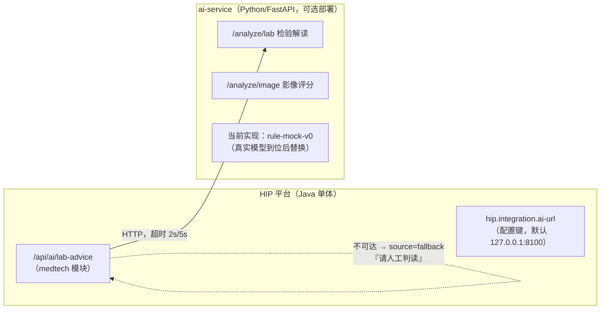

# 附录 A AI 在医院信息化中的应用

> 本书正文多处提到"AI 属外部条件"（第 6、9、14 章）。本附录把这句话展开：以 HIP 平台两个真实存在的"智能"功能为标本，先看清它们的实现形态与边界设计，再推及影像 AI、CDSS 知识库与大模型应用的接入谱系。附录的立场与全书一致——**如实写**：HIP 在本书成稿时没有接入任何真实模型，它交付的是接入的工程结构，这恰恰是最值得讲的部分。

## A.1 两个"智能"的真实形态：读码确认

**智能导诊**是患者端（/portal）的功能：输入症状，系统推荐就诊科室。读其实现（[PortalController.java](../../modules/portal/src/main/java/cn/hip/portal/web/PortalController.java) 的 `/api/portal/guide`）会发现它既不是模型也不是外部服务，而是一条 SQL——按症状关键词 LIKE 匹配 `triage_guide` 规则表（[V27 迁移](../../server/src/main/resources/db/migration/V27__phase29_patient_pay.sql)内置 12 条种子，如"胸痛→急诊科，勿自行驾车""发热→发热门诊，请佩戴口罩"），返回科室与就医建议。它属于种子数据分层中的 C 类演示数据：业务页可维护、按院增删。一张几十条的规则表撑起的"智能"，恰是行业里大量"智能导诊"产品的真实底色——关键词规则起步，知识图谱与对话模型是后话。

导诊的**患者端集成方式**也值得一看：入口在患者端 H5 首页，与预约挂号、报告查询并列；接口挂在 `/api/portal` 下，走独立的 PORTAL 令牌与 ROLE_PORTAL 角色（与院内接口完全隔离，第 5 章）。推荐结果直接衔接"预约挂号"动作——导诊的产品价值不在推荐算法多聪明，而在把"不知道挂哪科"的患者引导进正确的号源，因此它天然属于患者端而非医生端。

**ai-service** 则是平台外的独立 HTTP 服务：一个 FastAPI 骨架（[main.py](../../ai-service/main.py)，全部实现 60 行 Python），定义了两个接口——`/analyze/lab` 检验结果智能解读、`/analyze/image` 影像风险评分。当前实现是**规则版 mock**：检验解读按异常标志（HH/H/L/LL）查一张四项指标的规则字典给出建议文本，影像评分返回固定值；两个接口的响应都带 `model: rule-mock-v0` 字段，`/health` 自报 `mode: rule-mock`——服务在协议层就诚实声明自己是假的（第 6 章"诚实的 Mock"范式）。其文件头注释写明了设计意图：真实模型到位后替换实现即可，主平台通过 `hip.integration.ai-url` 指向本服务，**接口契约不变**。

## A.2 边界设计：为什么 AI 能力放平台外

ai-service 是全平台唯一的 Python 组件（Java 主体之外），且是部署表中唯一标注"可选（缺席自动降级）"的服务（[多医院部署操作指南](../多医院部署操作指南.md)）。这两个"唯一"背后是四条理由：

1. **技术栈异质**。AI 生态（PyTorch、模型运行时、GPU 驱动）整个生长在 Python 侧，塞进 Java 单体只会两头别扭；
2. **生命周期异步**。模型按周迭代、平台按版本发布，独立进程各自升级互不牵连；
3. **资源形态不同**。推理需要 GPU 的那天，独立服务可以单独换机器，平台不动；
4. **供应商现实**。医院的 AI 能力多为外采成品（影像 AI 一体机、商用 CDSS），本来就是外部系统——平台内建 AI 反而是少数派。

整体结构如图 A-1：

平台侧的调用代码（[MedTechController.java](../../modules/medtech/src/main/java/cn/hip/medtech/web/MedTechController.java) 的 `/api/ai/lab-advice`）体现了对"可缺席"的完整处理：连接超时 2 秒、请求超时 5 秒，任何异常不报错，而是返回 `source: fallback` 与一条建议——"AI 子服务不可用，请人工判读"。**优雅降级**的要点在语义：AI 建议是增强项，缺席时业务照常，医生看到的是"此路暂不可用"而非系统故障；返回体里的 `source` 字段让前端能标注建议来源，也让排障者一眼分清"AI 说的"与"兜底说的"。

## A.3 医院 AI 应用的接入形态谱系

**影像 AI**。商用形态多为厂商一体机/云服务：从 PACS 侧订阅 DICOM 影像流，推理后把结构化结果（病灶标注、风险分级）回写 PACS 或以报告形式推给 RIS。对 HIS 平台，接入点通常只有两个：报告界面的调阅链接、结果的结构化回传。HIP 的形态（第 9 章 9.4）与此对齐：平台与 PACS 只以一个 URL 松耦合，`/analyze/image` 接口预先定义了"送描述、回评分"的契约——真实影像 AI 到位时，替换的是 ai-service 的实现，平台调用代码不动。

**CDSS 知识库**。第 7 章的合理用药五重拦截走自建规则表（`cdss_rule`，FORBID/CAUTION 分级），第 10 章的医保审核同构。自建规则库的天花板是内容规模：数万条药品相互作用、适应症限定规则依赖专业知识库团队持续维护，这是商用知识库（外部条件）的价值。工程答案与第 10.4 节一致：**管道自建、内容外采**——规则表结构、触点嵌入、分级干预、命中留痕自己建好，商用知识库接入时灌内容即可。

**大模型（LLM）应用**。病历文书辅助生成、报告解读、导诊问答是当前热点，但合规边界必须先于功能画清：《互联网诊疗监管细则（试行）》明确处方应由接诊医师本人开具，**严禁使用人工智能等自动生成处方**【成稿核对：文号与条款】；生成式 AI 服务另受《生成式人工智能服务管理暂行办法》约束【成稿核对：适用口径】；若产品宣称辅助诊断功能，还可能落入医疗器械软件注册管理范围【成稿核对：SaMD 分类界定】。工程上的保守姿态是：LLM 输出定位为**供医师采信的草稿与提示**，最终签名责任始终在人；面向患者的输出尤须克制——HIP 患者端连危急值都遮蔽为"请尽快回院复诊"（避免患者误读延误，见第 7 章），让模型直接向患者解释病情，审慎程度只应更高。

## A.4 「AI 属外部条件」的工程化

把 A.1–A.3 收拢，会发现 AI 接入完全落在第 6 章"外部条件工程化"的框架里：**接入点先行**（HTTP 契约与配置键先定义）、**规则版兜底**（rule-mock 让页面、调用链、E2E 在无模型环境下成立）、**条件到位即接**（换实现不换契约）。ai-service 的 HTTP 契约，本质上是医保 `InsuranceAdapter` SPI（第 10 章）的跨语言等价物——SPI 用 Java 接口收敛差异，AI 用 HTTP 接口收敛差异，思想同源。

两者有一处关键差异值得作为本附录的结束语：医保适配器失败必须**同事务回滚**（记账类依赖，宁停勿错），AI 服务失败只需**降级提示**（增强类依赖，宁缺勿扰）。为外部依赖选择正确的失败语义，比接入本身更能体现架构判断——这也是"AI 属外部条件"这句朴素结论背后，真正的工程内容。
